# 实现前后对比

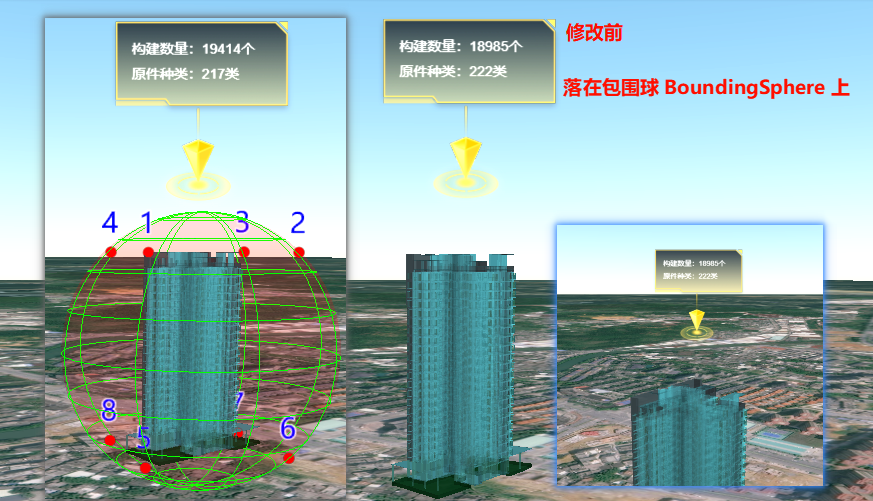

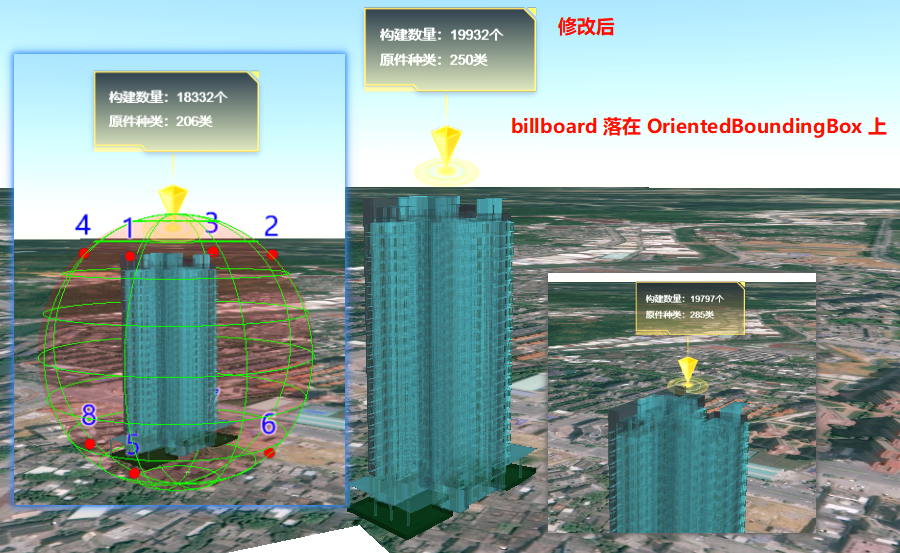

# 背景
```
Cesium.VERSION
'1.95'
```

## 需求
有一栋建筑的 BIM 模型，需要在楼顶放置广告牌(Billboard)显示信息。


## 问题
通过点击事件可以获取 BIM 模型的 Cesium3DTileset 数据，以计算位置放置 Billboard。
```js
viewer.screenSpaceEventHandler.setInputAction((event) => {
	const pickedFeature = viewer.scene.pick(event.position) // 拾取 Cesium3DTileFeature 对象
	const tileset = pickedFeature.tileset // 获取包含要素的 tileset
	const centerCartographic = Cesium.Cartographic.fromCartesian(tileset.boundingSphere.center)
	// 计算 Billboard 的位置
	const positionCartographic = new Cesium.Cartographic(
		centerCartographic.longitude,
		centerCartographic.latitude,
		centerCartographic.height + tileset.boundingSphere.radius // 【1】
	)
	const positionCartesian3 = Cesium.Cartographic.toCartesian(positionCartographic)
	// 绘制添加广告牌实体
	viewer.entities.add({
		id: 'BillboardPopup',
		name: '模型信息',
		position: positionCartesian3,
		billboard: {
			image: 'xxxx.png',
			verticalOrigin: Cesium.VerticalOrigin.BOTTOM,
			heightReference: Cesium.HeightReference.NONE,
		}
	})
	// 绘制添加 tileset.boundingSphere 实体
	viewer.entities.add({
		position: tileset.boundingSphere.center,
		ellipsoid: {
			radii: new Cesium.Cartesian3(tileset.boundingSphere.radius, tileset.boundingSphere.radius, tileset.boundingSphere.radius),
			material: Cesium.Color.RED.withAlpha(0.1),
			fill: true, // 是否填充
			outline: true, // 是否轮廓线
			outlineColor: Cesium.Color.fromCssColorString(`rgba(0,255,0,1)`) // 轮廓线的颜色
		}
	})
})
```
发现广告牌置于建筑模型的上空，并未贴合。
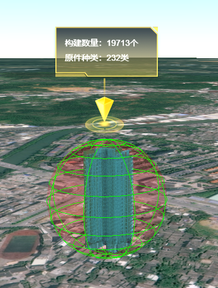
这是由于上方代码块【1】处计算的 boundingSphere 并不贴合建筑模型。为建筑模型的外接球体。

PS: BillBoard 设置 img，未设置垂直方向偏移量，原图如下，
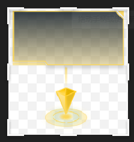


# 解决

## 参考
- [community.cesium - Accurate Bounding Box for 3D tiles] 下的两个回复
	- https://community.cesium.com/t/accurate-bounding-box-for-3d-tiles/5890/6
	- https://community.cesium.com/t/accurate-bounding-box-for-3d-tiles/5890/7

在该回复（[<u>get the eight corners of OrientedBoundingBox obb</u>](https://community.cesium.com/t/accurate-bounding-box-for-3d-tiles/5890/6)）中描述了如下内容：
> 假设我有一个 OrientedBoundingBox obb。为了获得 obb 的八个角，您需要执行以下操作：
> 1. 确定 obb.halfAxes 中的三个轴。
> 	第一列为 The local x-axis，即 `Matrix3.getColumn(obb.halfAxes, 0, new Cartesian3())`。
> 	第二列为 The local y-axis，以此类推。我们将分别称其为 `xaxis`、`yaxis`和 `zaxis`。
> 2. 要计算 "backmost, bottom-left" 的顶点（即本地空间中 (-X, -Y, -Z) 的角），需要执行 `obb.center - xaxis - yaxis - zaxis`。
> 3. 要计算 "frontmost, bottom-right" 的顶点（即 (X、-Y、Z)），需要执行 `obb.center + xaxis - yaxis + zaxis`。
> 4. 以此类推。


## 实现

### 步骤一 找出 OrientedBoundingBox 顶面
根据上述参考，我们绘制 `OrientedBoundingBox` 的八个顶点

```js
/**
 * 显示 OBB 的 8 个角点
 * @param {Object} viewer 地图视图
 * @param {Object} tileset 3dtiles模型
 */
showOBBCorner(viewer, tileset) {
	var a = tileset.root.boundingVolume.boundingVolume.halfAxes
	var center = tileset.root.boundingVolume.boundingVolume.center
	var x = new window.Cesium.Cartesian3()
	var y = new window.Cesium.Cartesian3()
	var z = new window.Cesium.Cartesian3()

	window.Cesium.Matrix3.getColumn(a, 0, x)
	window.Cesium.Matrix3.getColumn(a, 1, y)
	window.Cesium.Matrix3.getColumn(a, 2, z)

	this.addOBBCorner(viewer, '1', center, '-', x, '-', y, '+', z)
	this.addOBBCorner(viewer, '2', center, '+', x, '-', y, '+', z)
	this.addOBBCorner(viewer, '3', center, '+', x, '+', y, '+', z)
	this.addOBBCorner(viewer, '4', center, '-', x, '+', y, '+', z)
	this.addOBBCorner(viewer, '5', center, '-', x, '-', y, '-', z)
	this.addOBBCorner(viewer, '6', center, '+', x, '-', y, '-', z)
	this.addOBBCorner(viewer, '7', center, '+', x, '+', y, '-', z)
	this.addOBBCorner(viewer, '8', center, '-', x, '+', y, '-', z)


	// 若要快速添加，上述 8 个顶点的添加也可参考二进制方式，但不利于理解位置关系
	/* for (let i = 1; i <= 8; i++) {
		let symbol = Number.parseInt(i - 1).toString(2)
		// 补全 3 位
		while (symbol.length < 3) {
		  symbol = '0' + symbol
		}
		console.log('symbol:', symbol)
		const xShift = symbol[0] === '0' ? '-' : '+'
		const yShift = symbol[1] === '0' ? '-' : '+'
		const zShift = symbol[2] === '0' ? '-' : '+'
		this.addOBBCorner(viewer, i.toString(), center, xShift, x, yShift, y, zShift, z)
	} */
},
/**
 * 地图添加 OBB 的顶点实体
 * @param {Object} viewer 地图视图
 * @param {String} labelText 标签文本
 * @param {Object} center OBB 中心点
 * @param {String} xShift x轴偏移方向
 * @param {Object} x x轴向量
 * @param {String} yShift y轴偏移方向
 * @param {Object} y y轴向量
 * @param {String} zShift z轴偏移方向
 * @param {Object} z z轴向量
 */
addOBBCorner(viewer, labelText, center, xShift, x, yShift, y, zShift, z) {
	let temp1 = new window.Cesium.Cartesian3()
	let temp2 = new window.Cesium.Cartesian3()
	let temp3 = new window.Cesium.Cartesian3()

	xShift === '+' && window.Cesium.Cartesian3.add(center, x, temp1)
	xShift === '-' && window.Cesium.Cartesian3.subtract(center, x, temp1)

	yShift === '+' && window.Cesium.Cartesian3.add(temp1, y, temp2)
	yShift === '-' && window.Cesium.Cartesian3.subtract(temp1, y, temp2)

	zShift === '+' && window.Cesium.Cartesian3.add(temp2, z, temp3)
	zShift === '-' && window.Cesium.Cartesian3.subtract(temp2, z, temp3)

	const cornerPoint = new window.Cesium.Entity({
		position: temp3,
		point: {
			color: window.Cesium.Color.RED,
			pixelSize: 10
		},
		label: {
			text: labelText,
			font: '28px sans-serif',
			style: window.Cesium.LabelStyle.FILL_AND_OUTLINE,
			fillColor: window.Cesium.Color.BLUE,
			outlineColor: window.Cesium.Color.WHITE,
			outlineWidth: 2,
			horizontalOrigin: window.Cesium.HorizontalOrigin.CENTER,
			verticalOrigin: window.Cesium.VerticalOrigin.BASELINE,
			pixelOffset: new window.Cesium.Cartesian2(0, -20)
		}
	})
	viewer.entities.add(cornerPoint)
},
```


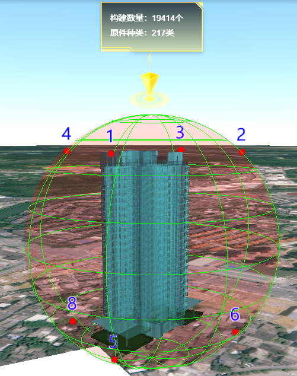

参考上述位置的观看角度，如下图
```
Pt, x, y, z
'1', -, -, +
'2', +, -, +
'3', +, +, +
'4', -, +, +
'5', -, -, -
'6', +, -, -
'7', +, +, -
'8', -, +, -
```
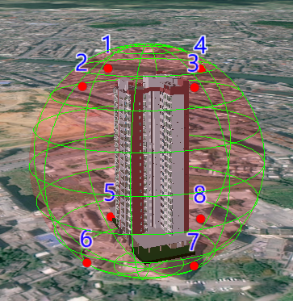

### 步骤二 计算 billboard 落在 OrientedBoundingBox 上的位置

即为
```js
let roofCenterCartesian3 = new window.Cesium.Cartesian3()
window.Cesium.Cartesian3.add(center, z, roofCenterCartesian3)
```
此时，点击事件即为：
```js
viewer.screenSpaceEventHandler.setInputAction((event) => {
	const pickedFeature = viewer.scene.pick(event.position) // 拾取 Cesium3DTileFeature 对象
	const tileset = pickedFeature.tileset // 获取包含要素的 tileset

	// 计算 Billboard 的位置
	const a = tileset.root.boundingVolume.boundingVolume.halfAxes
	const center = tileset.root.boundingVolume.boundingVolume.center
	// let x = new window.Cesium.Cartesian3()
	// let y = new window.Cesium.Cartesian3()
	let z = new window.Cesium.Cartesian3()
	// window.Cesium.Matrix3.getColumn(a, 0, x)
	// window.Cesium.Matrix3.getColumn(a, 1, y)
	window.Cesium.Matrix3.getColumn(a, 2, z)

	let roofCenterCartesian3 = new window.Cesium.Cartesian3()
	window.Cesium.Cartesian3.add(center, z, roofCenterCartesian3)

	// 绘制添加广告牌实体
	viewer.entities.add({
		id: 'BillboardPopup',
		name: '模型信息',
		position: roofCenterCartesian3,
		billboard: {
			image: 'xxxx.png',
			verticalOrigin: Cesium.VerticalOrigin.BOTTOM,
			heightReference: Cesium.HeightReference.NONE,
		}
	})
})
```
上述代码块计算出的位置即为最终结果。


## 另外查看 3DTiles 模型本地坐标轴 和 OrientedBoundingBox

### 显示 3DTiles 模型本地坐标轴

```js
/**
 * 显示 3DTiles 本地坐标轴
 * @param {Object} viewer 地图视图
 * @param {Object} center OBB 中心点
 * @param {Object} x x轴向量
 * @param {Object} y y轴向量
 * @param {Object} z z轴向量
 */
displayLocalAxis(viewer, center, x, y, z) {
	const xAxis = new window.Cesium.Entity({
		position: center,
		polyline: {
			positions: [center, window.Cesium.Cartesian3.add(center, x, new window.Cesium.Cartesian3())],
			width: 4,
			material: window.Cesium.Color.RED
		}
	})
	const yAxis = new window.Cesium.Entity({
		position: center,
		polyline: {
			positions: [center, window.Cesium.Cartesian3.add(center, y, new window.Cesium.Cartesian3())],
			width: 4,
			material: window.Cesium.Color.GREEN
		}
	})
	const zAxis = new window.Cesium.Entity({
		position: center,
		polyline: {
			positions: [center, window.Cesium.Cartesian3.add(center, z, new window.Cesium.Cartesian3())],
			width: 4,
			material: window.Cesium.Color.BLUE
		}
	})
	viewer.entities.add(xAxis)
	viewer.entities.add(yAxis)
	viewer.entities.add(zAxis)
},
```
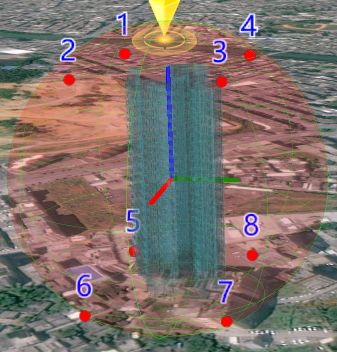


### 显示 OrientedBoundingBox

```js
/**
 * 显示 OrientedBoundingBox
 * @param {Object} viewer 地图视图
 * @param {Object} tileset Cesium3DTileset
 */
displayOrientedBoundingBox(viewer, tileset) {
	const OrientedBoundingBox = tileset.root.boundingVolume.boundingVolume
	const a = OrientedBoundingBox.halfAxes
	const center = OrientedBoundingBox.center
	let x = new window.Cesium.Cartesian3()
	let y = new window.Cesium.Cartesian3()
	let z = new window.Cesium.Cartesian3()
	window.Cesium.Matrix3.getColumn(a, 0, x)
	window.Cesium.Matrix3.getColumn(a, 1, y)
	window.Cesium.Matrix3.getColumn(a, 2, z)

	let temp1 = new window.Cesium.Cartesian3()
	window.Cesium.Cartesian3.add(center, x, temp1)
	const length = window.Cesium.Cartesian3.distance(temp1, center) * 2
	// console.log('length:', length) // 【1】

	let temp2 = new window.Cesium.Cartesian3()
	window.Cesium.Cartesian3.add(center, y, temp2)
	const width = window.Cesium.Cartesian3.distance(temp2, center) * 2
	// console.log('width:', width) // 【2】

	let temp3 = new window.Cesium.Cartesian3()
	window.Cesium.Cartesian3.add(center, z, temp3)
	const height = window.Cesium.Cartesian3.distance(temp3, center) * 2
	// console.log('height:', height) // 【3】

	const obb = new window.Cesium.Entity({
		position: center,
		box: {
			dimensions: new window.Cesium.Cartesian3(length, width, height),
			material: window.Cesium.Color.BLUEVIOLET.withAlpha(0.2),
			outline: true,
			outlineColor: window.Cesium.Color.CYAN
		}
	})
	viewer.entities.add(obb)
},
```

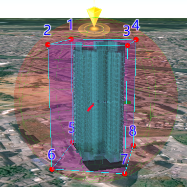

上面代码块，可以满足显示 OrientedBoundingBox。

---

# 其他

不解的地方是：
例如：`height` 的值也可以通过计算 `(z 轴的向量值) * 2` 来获得。

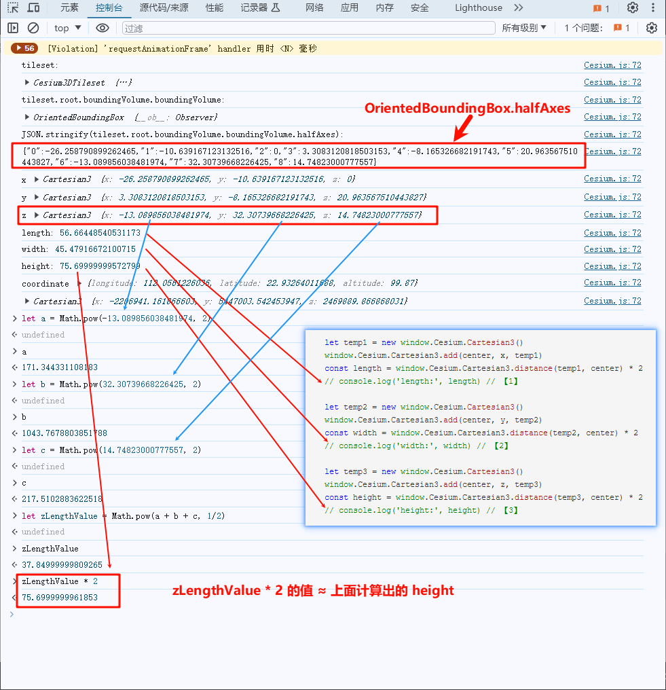

但是为何 `Cesium.Matrix3.getColumn(a, 2, z)` 获得的 Cartesian3 为 `OrientedBoundingBox.halfAxes` 这个 Cesium.Matrix3 第三行的值，而不是第三列的值。
> 因为文档里有如下：
> [<u><strong>static</strong> Cesium.Matrix3.getColumn(matrix, index, result) → Cartesian3</u>](https://cesium.com/learn/cesiumjs/ref-doc/Matrix3.html?classFilter=Matrix3#.getColumn)
> Retrieves a copy of the matrix column at the provided index as a Cartesian3 instance.
> 读取的是索引处矩阵列
> 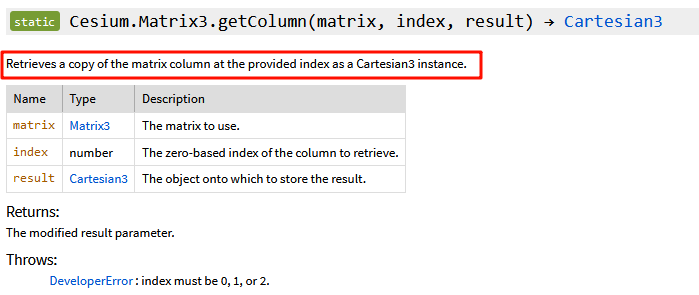
>
> ---
>
> 且关于 [<u>Cesium.Matrix3</u>](https://cesium.com/learn/cesiumjs/ref-doc/Matrix3.html#Matrix3)
> 定义如下
> A 3x3 matrix, indexable as a column-major order array. Constructor parameters are in row-major order for code readability.
> 一个 3x3 矩阵，可作为列主序数组索引。为便于代码阅读，构造函数参数按行主序排列。
> 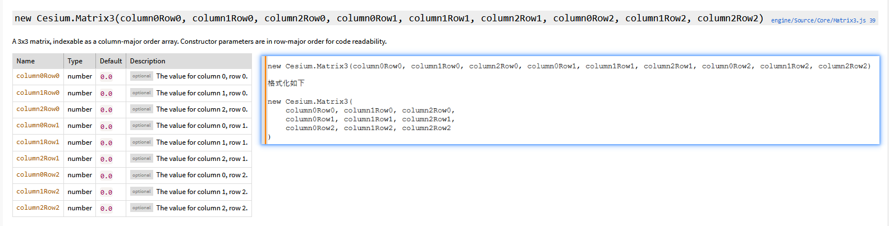

搞不懂...以后再看

EOF
