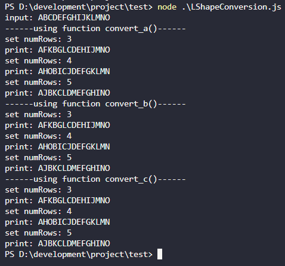

# L 字形变换
## 题目描述
将一个给定字符串 s 根据给定的行数 numRows ，以从上往下、从左到右进行 L 字形排列。
之后，你的输出需要从左往右逐行读取，产生出一个新的字符串.
请你实现这个将字符串进行指定行数变换的函数：
convert(s:string, numRows:number ) => string
比如输入字符串为 "ABCDEFGHIJKLMNO" 行数为 3 时，排列如下：
(-表示占位符)
A--F--K
B--G--L
CDEHIJMNO
输出：AFKBGLCDEHIJMNO

行数为 4 时，排列如下：
A---H---O
B---I---
C---J---
DEFGKLMN
输出：AHOBICJDEFGKLMN

行数为 5 时，排列如下：
A----J
B----K
C----L
D----M
EFGHINO
输出：AJBKCLDMEFGHINO

## 题解

### 方法一：利用二维矩阵模拟

```js
/**
 * 方法一：利用二维矩阵模拟
 * @param {string} s
 * @param {number} numRows
 * @return {string}
 */
const convert_a = (s, numRows) => {
  const n = s.length, r = numRows;

  if (r == 1 || r >= n) {
    // r==1 只有一行，r>=n 只有一列。
    return s;
  }

  const t = r * 2 - 1; // L 字形变换的周期 t = r + r - 1
  // 每个周期会占用矩阵上的 1+r-1 列，即 r 列。
  // 因此我们有 Math.ceil(n/t) 个周期（最后一个周期视作完整周期），乘上每个周期的列数，得到矩阵的列数 c = Math.ceil(n/t) * r。
  const c = Math.ceil(n / t) * r; // c 为矩阵的列数，最后一个周期视作完整周期。
  const c_ = Math.floor((n + t - 1) / t) * r; // c 的其他运算方法。

  // 创建一个 r 行 c 列的矩阵。
  const matrix = new Array(r).fill(0).map(() => new Array(c).fill(0));

  // 遍历字符串 s 并按 L 字形填入。
  // 设当前填写的位置为 (x,y)，即矩阵的 x 行 y 列。初始 (x,y)=(0,0)，即矩阵左上角。
  // 若当前字符下标 i 满足 i mod t < r - 1，则向下移动，否则向右移动。
  // 若当前字符下标 i 满足 (i+1) mod t == 0，表示将开始新的周期，向上移动回第一行。
  for (let i = 0, x = 0, y = 0; i < n; ++i) {
    matrix[x][y] = s[i];
    if (i % t < r - 1) {
      ++x; // 向下移动
    } else {
      ++y; // 向右移动
    }
    if ((i + 1) < n && (i + 1) % t == 0) {
      x = 0; // 回到新周期第一个字符。
    }
  }

  // 填写完成，逐行扫描矩阵中的非空字符，组成答案。
  const ans = [];
  for (const row of matrix) {
    for (const char of row) {
      if (char !== 0) {
        ans.push(char);
      }
    }
  }
  return ans.join('');
};
```

### 方法二：压缩矩阵空间

```js
/**
 * 方法二：压缩矩阵空间
 * @param {string} s
 * @param {number} numRows
 * @return {string}
 */
const convert_b = (s, numRows) => {
  // 方法一中的矩阵有大量的空间没有被使用，优化。
  // 注意到每次往矩阵的某一行添加字符时，都会添加到该行上一个字符的右侧，且最后组成答案时只会用到每行的非空字符。
  // 因此我们可以将矩阵的每行初始化为一个空列表，每次向某一行添加字符时，添加到该行的列表末尾即可。

  const n = s.length, r = numRows;

  if (r == 1 || r >= n) {
    // r==1 只有一行，r>=n 只有一列。
    return s;
  }

  const matrix = new Array(r).fill(0).map(() => []);

  for (let i = 0, x = 0, t = r * 2 - 1; i < n; ++i) { // L 字形变换的周期 t = r + r - 1
    matrix[x].push(s[i]);
    if (i % t < r - 1) {
      ++x;
    }
    if ((i + 1) < n && (i + 1) % t == 0) {
      x = 0; // 回到新周期第一个字符。
    }
  }

  const ans = [];
  for (const row of matrix) {
    ans.push(row.join(''));
  }
  return ans.join('');
};
```

### 方法三：直接构造

```js
/**
 * 方法三：直接构造
 * @param {string} s
 * @param {number} numRows
 * @return {string}
 */
const convert_c = (s, numRows) => {
  // 研究下方法一中矩阵的每个非空字符会对应到 s 的哪个下标（记作 idx），从而直接构造出答案。
  // 由于 L 字形变换的周期为 t = r * 2 - 1，
  // 因此对于矩阵第一行的非空字符，其对应的 idx 均为 t 的倍数，即 idx (mod t) ≡ 0。
  // 同理，对于矩阵第二行、第三行、非最后一行（行号设为 i）的非空字符，应满足 idx (mod t) ≡ i。
  // 对于矩阵的最后一行（行号为 r - 1），每个周期内有四个字符，
  //     第一个字符满足 idx (mod t) ≡ i ≡ r - 1，
  //     第二个字符满足 idx (mod t) ≡ t - i ≡ t - r + 1，
  //     第三个字符满足 idx (mod t) ≡ t - i + 1 ≡ t - r + 2，
  //     第四个字符满足 idx (mod t) ≡ t - i + 2 ≡ t - r + 3。

  const n = s.length, r = numRows;

  if (r == 1 || r >= n) {
    // r==1 只有一行，r>=n 只有一列。
    return s;
  }

  const t = r * 2 - 1; // L 字形变换的周期 t = r + r - 1
  const ans = [];
  for (let i = 0; i < r; i++) { // 枚举矩阵的行
    for (let j = 0; j < n - i; j += t) { // 枚举每个周期于该行的起始下标 // 判断起始下标没有超出字符串长度，即 j + i < n，即 j < n - i。
      ans.push(s[j + i]); // 非最后一行，及最后一行的周期内最前的下标位置。

      if (i == r - 1) {
        for (let k = r - 1; k > 0 && (j + t - k) < n; --k) { // 判断下标没有超出字符串长度，即 j + t - k < n
          ans.push(s[j + t - k]);
        }
      }
    }
  }
  return ans.join('');
};
```
#### 辅助理解
矩阵图如下，数值为字符串下标 idx
```js
0                 0+t                 0+2t
1                 1+t                 1+2t
2                 2+t                 2+2t
3  t-3  t-2  t-1  3+t  2t-3 2t-2 2t-1 3+2t
```

### 运行结果



# 参考
- [LeetCode N 字形变换](https://leetcode.cn/problems/zigzag-conversion/)
- [LeetCode Z 字形变化 题解](https://leetcode.cn/problems/zigzag-conversion/solution/z-zi-xing-bian-huan-by-leetcode-solution-4n3u/)