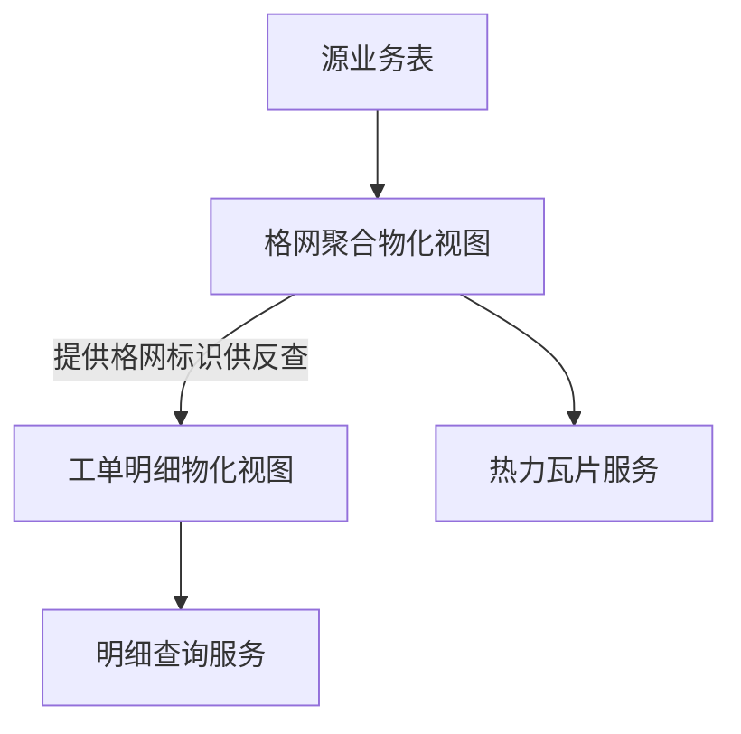

本篇是《百万级点数据：MVT + WebGL 热力渲染与 FBO 连通域热区工单统计》系列的第一篇，聚焦**数据层**：为何要拆成两个物化视图、格网标识如何设计才能稳定复用、索引怎么摆放，以及源数据更新后两个物化视图的刷新顺序与原因。

# 数据层：双物化视图

## 背景环境

本篇依赖如下组件，其它小版本需自行回归验证。

| 项 | 版本 / 说明 |
| --- | --- |
| **PostgreSQL** | 关系型数据库，版本以部署环境为准 |
| **PostGIS** | 空间扩展；本篇涉及的物化视图、`ST_*` 格网聚合、空间索引均依赖该扩展 |

---

## 1. 为何需要两个物化视图

面对百万级别的点数据，直接把源表接给热力瓦片服务是不可行的：单条记录一个要素，瓦片体积和渲染压力都会随数据量线性膨胀。合理的做法是先在数据库侧把点位**按格网 + 筛选维度预聚合**，用少量格网行替代海量原始点；但预聚合之后，原始记录的完整属性就丢了——用户点击某个热区想看明细时，聚合结果给不出答案。

于是数据层拆成两个职责清晰、互不越界的物化视图：

| 物化视图 | 职责 | 为何独立 |
| --- | --- | --- |
| **格网聚合物化视图** | 格心坐标 + 格内工单数 + 筛选维度，供热力瓦片服务消费 | 瓦片只适合轻量几何与少量属性；百万级别点数据必须先在服务端预聚合、减列，才能支撑流畅的分块渲染 |
| **工单明细物化视图** | 单条业务记录的完整属性 + 关联格网标识，供热区点击下钻查询 | 热力展示只需要「这个格子有多少条」这一个数字；点击查明细需要完整业务列，不能把全部列塞进面向渲染的瓦片里 |

格网聚合物化视图的聚合键是**格心坐标 + 发生年份 + 事项专题 + 业务场景 + 所属区县** 这一组合，它们共同唯一确定一行格网记录——同一个格子在不同年份、不同专题、不同场景、不同区县下，会分别产出独立的一行，各自维护自己的格内工单数。

两个物化视图之间的依赖关系与各自的消费出口如下：



工单明细物化视图**依赖**格网聚合物化视图——它需要从后者拿到「格网标识」写入自己的每一行，这也是第 5 节要讲的刷新顺序的根本原因。

---

## 2. 格网标识稳定性

格网聚合物化视图的每一行都带一个整型的**格网标识**，它是热区点击下钻能够工作的前提：

- **同一业务格网**：只要格心坐标、发生年份、事项专题、业务场景、所属区县这组业务键不变，每次刷新后格网标识**保持不变**，格内工单数可以变化。
- **格网从聚合结果中消失**：说明该业务键对应的原始点位已经清零，对应行被删除。
- **格网重新出现**：只要业务键与刷新前的全表数据一致，格网标识会与消失前**相同**（标识的生成方式是对全表业务键做确定性排序后编号，而不是对某个字段做哈希映射）。

这一点很关键：前端在地图上标注热区、并在用户点击时发起「按格网标识批量查询明细」的请求，全靠格网标识跨刷新保持稳定；如果标识会随机漂移，用户上一次看到的热区编号，下一次刷新后可能就对应了另一个格子，体验上会出现「张冠李戴」。

---

## 3. 格网标识为何必须进热力瓦片

矢量瓦片规范要求每个要素携带一个**数字型** feature id；具体到 GeoServer 的矢量瓦片扩展，也是按同一约束解析要素标识的（参见 [GeoServer 2.24.x · Vector Tiles](https://docs-archive.geoserver.org/2.24.x/en/user/extensions/vectortiles/index.html)）。如果服务端无法从库表里稳定取得这样一个整型标识，通常会退化为拿几何或字符串拼接出一个伪主键——这类值无法映射为瓦片要求的数字 id，服务端会针对每个要素反复输出「无法获取数字 id」一类的告警，量级上去后会造成服务容器日志体积暴涨（这类问题可用关键词 `geoserver mvt numeric id` 搜索到相关社区讨论，本文不展开具体产品的日志表现）。

结论很直接：**格网聚合物化视图必须物化一个整型的格网标识列**，并且这个列要能被瓦片服务识别为要素的数字 fid（常见做法是对该列单独建一个唯一索引，供服务端自动推断为主键候选）。

### 格网标识的生成算法

格网标识不能用哈希函数（如对业务键做定长哈希后截断为 32 位整数）来生成——数十万级别的格网行规模下，32 位哈希空间的碰撞概率并不能忽略，一旦碰撞就会有两个不同的格子共享同一个数字 fid，瓦片渲染与热区反查都会出错。

稳妥的做法是对全表业务键做**确定性排序**后用行号编号：

```sql
row_number() OVER (
  ORDER BY 格心坐标, 发生年份, 事项专题, 业务场景 NULLS LAST, 所属区县
) AS 格网标识
```

只要排序键的取值集合不变，`row_number()` 在每次刷新后都会给同一行业务键分配相同的编号——这正是第 2 节「格网标识稳定性」成立的技术前提。

---

## 4. 索引设计

索引设计要同时服务两件事：**查询层**的筛选性能，以及**瓦片服务**对数字 fid 的正确识别。下面按两个物化视图分别说明，重点是「为什么建」而不是具体 DDL。

### 4.1 格网聚合物化视图

| 索引类型 | 作用对象（抽象） | 设计动机 |
| --- | --- | --- |
| 空间索引 | 格心坐标 | 加速构建阶段的空间聚合、extent 统计与库内排查 |
| 复合 B-tree | 发生年份、事项专题、业务场景、所属区县 | 与前端四维度筛选组合对齐，加速带完整筛选条件的查询 |
| 单列 B-tree（各建一个） | 事项专题 / 业务场景 / 所属区县 | 支撑只按单一维度过滤、不带其它条件的查询路径，与复合索引互补 |
| **唯一**索引 | 格网标识 | 供瓦片服务识别数字 fid；同时是热区点击 `关联格网标识 IN (...)` 反查的基础 |
| **不建**索引 | 业务键组合（格心坐标 + 发生年份 + 事项专题 + 业务场景 + 所属区县） | 见下方「故障案例」 |

> **故障案例：业务键唯一索引会让属性只剩权重列**
>
> 如果在业务键组合上建了一个**复合唯一索引**，某些 PostGIS 图层服务在自动推断主键时，会把这组唯一索引识别成复合主键候选列。而服务默认不对外暴露主键列，于是这几个筛选维度列全部从对外属性中**消失**，最终瓦片或查询结果里只剩下权重列（格内工单数）。这不是主动裁剪属性的优化行为，而是索引设计不当引出的**非预期故障**——排查方向是检查库表上是否存在覆盖全部筛选维度的复合唯一索引，而不是去改服务端的暴露主键开关（改动那个开关反而会引出几何列与主键列冲突的新问题）。
>
> 正确的做法是：业务键组合上**只建普通索引甚至不建索引**，稳定的整型格网标识才是唯一索引的载体。

### 4.2 工单明细物化视图

| 索引类型 | 作用对象（抽象） | 设计动机 |
| --- | --- | --- |
| 唯一索引 | 工单主键 | 行级唯一约束；同时是「支持并发刷新」的前置条件（见下） |
| B-tree | 关联格网标识 | 热区点击下钻：`关联格网标识 IN (...)` 批量反查 |
| 复合 B-tree | 业务场景、发生年份、所属区县 | 支撑不依赖格网标识的短筛选条件查询（如按视口范围叠加维度筛选） |
| 空间索引 | 工单几何 | 支撑基于地图可视范围的空间查询 |

### 4.3 索引设计如何决定刷新策略

两个物化视图在刷新方式上的差异，根源就在于是否具备一个**行级唯一索引**：

- 格网聚合物化视图**没有**在业务键组合上建唯一索引（原因见 4.1 故障案例），因此它**只能**用普通刷新——刷新期间该视图会短暂不可查询。
- 工单明细物化视图在工单主键上有唯一索引，因此**可以**用并发刷新——刷新期间原有数据仍可被查询，直到新数据整体切换。

这也解释了为什么两个视图不能同时刷新、必须有先后顺序：工单明细物化视图的并发刷新依赖的唯一索引在工单主键上，但它每一行还需要携带来自格网聚合物化视图的「关联格网标识」——这个值不是工单表自带的，而是**反查**得到的。

### 4.4 工单明细物化视图如何取得「关联格网标识」

工单明细物化视图构建时，对每一条业务记录按**与格网聚合视图完全相同的算法**重新计算出它所属的格心坐标，再用这组「格心坐标 + 发生年份 + 事项专题 + 业务场景 + 所属区县」的复合业务键，去格网聚合物化视图里反查唯一匹配的那一行，取其格网标识写入本行：

```sql
INNER JOIN 格网聚合物化视图 g
  ON g.格心坐标 = 本行按同一格网算法重算出的格心坐标
 AND g.发生年份 = 本行发生年份
 AND g.事项专题 = 本行事项专题
 AND g.业务场景 IS NOT DISTINCT FROM 本行业务场景
 AND g.所属区县 = 本行所属区县
```

这里有一个容易忽略的细节：**业务场景**这一维度允许为空（部分业务记录无法归类到任何预设场景），因此匹配业务场景时要使用「空值安全」的比较方式，而不能用普通等号——普通等号在两边都是空值时不会判定为相等，会导致这部分记录反查不到格网标识。

这条反查链路决定了两件事：第一，格网聚合物化视图必须**先于**工单明细物化视图存在；第二，格网聚合物化视图必须是**已刷新到最新状态**的，否则反查会用旧的格网标识匹配新的业务记录，造成明细与热力展示的格网标识不一致。

---

## 5. 源数据更新后：先聚合，后明细

结合前面几节的结论，源表发生增量或修正后，两个物化视图应当依序刷新：


对应的示例 SQL：

```sql
-- 步骤 1：刷新格网聚合物化视图（普通刷新，不改变已有格网的格网标识）
REFRESH MATERIALIZED VIEW 格网聚合物化视图;

-- 步骤 2：在步骤 1 完成后再刷新工单明细物化视图（依赖最新的格网标识，可并发刷新）
REFRESH MATERIALIZED VIEW CONCURRENTLY 工单明细物化视图;
```

**顺序原因回顾**：

- 工单明细物化视图的每一行都要通过反查拿到「关联格网标识」（见 4.4），这个反查的目标表就是格网聚合物化视图；如果反过来先刷新工单明细物化视图，反查到的会是格网聚合物化视图**刷新前**的旧数据，新增或变化的业务记录可能匹配不到正确的格网标识。
- 两者刷新方式不同（4.3）：格网聚合物化视图只能普通刷新，期间该视图短暂不可查询；工单明细物化视图可以并发刷新，不阻塞查询。把「不可并发、影响短暂」的一步放在前面，再执行「可并发、影响小」的一步，也更符合刷新窗口的直觉安排。

至于刷新后瓦片服务缓存与数据库结果的一致性问题（例如缓存的旧瓦片仍带着刷新前的格内工单数），属于服务层的运维范畴，本篇不展开，留给下一篇讨论查询层与输出层的分工。

---

## 小结

- 一个物化视图承载聚合，一个承载明细，两者用一个稳定的整型「格网标识」串联起来。
- 格网标识必须走确定性排序生成，不能用哈希映射，且必须能被瓦片服务识别为数字要素 id。
- 索引设计直接决定了刷新策略：业务键组合上不建唯一索引，是为了避免服务端把它误判为主键而隐藏筛选属性；工单明细物化视图靠自身主键的唯一索引获得并发刷新的能力。
- 刷新顺序由「谁反查谁」决定：先刷新被依赖的格网聚合物化视图，再刷新依赖它的工单明细物化视图。

下一篇进入服务层，看这两个物化视图如何分别发布成瓦片服务与明细查询服务，以及为什么瓦片输出的属性要做主动裁剪。

---

## 系列导航

- 总览：[百万级点数据：MVT + WebGL 热力渲染与 FBO 连通域热区工单统计](https://www.cnblogs.com/zheyi420/p/22182243)
- 下一篇：[02-服务层-MVT瓦片与按需明细查询](https://www.cnblogs.com/zheyi420/p/22182306)

---

## References

- [GeoServer 2.24.x User Manual](https://docs-archive.geoserver.org/2.24.x/en/user/)
- [GeoServer 2.24.x · Vector Tiles](https://docs-archive.geoserver.org/2.24.x/en/user/extensions/vectortiles/index.html)
