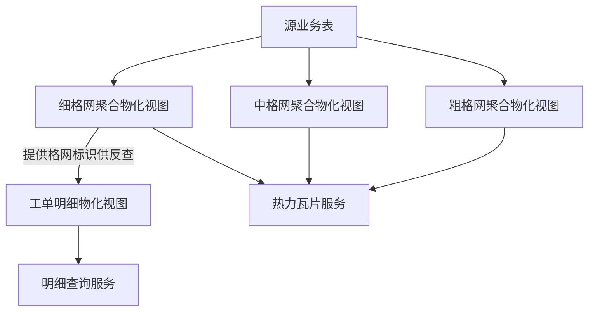
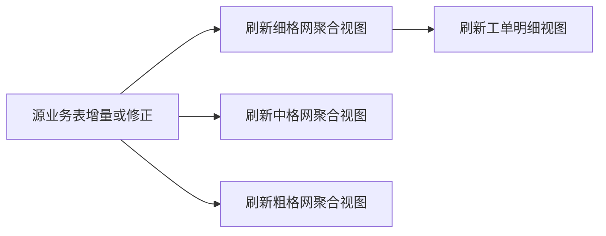

本篇是《百万级点数据：MVT + WebGL 热力渲染与 FBO 连通域热区工单统计》系列的第一篇，聚焦**数据层**：为何把预聚合结果拆成一个「三档格网」的物化视图族外加一个明细物化视图、格网标识如何设计才能稳定复用、索引怎么摆放，以及源数据更新后这几个视图的刷新顺序与原因。

# 数据层：双物化视图与三格网 LOD

## 背景环境

本篇依赖如下组件，其它小版本需自行回归验证。

| 项 | 版本 / 说明 |
| --- | --- |
| **PostgreSQL** | 关系型数据库，版本以部署环境为准 |
| **PostGIS** | 空间扩展；本篇涉及的物化视图、`ST_*` 格网聚合、空间索引均依赖该扩展 |

---

## 1. 为何是「三格网聚合视图族 + 工单明细视图」

面对三百万级别的点数据，直接把源表接给热力瓦片服务是不可行的：单条记录一个要素，瓦片体积和渲染压力都会随数据量线性膨胀。合理的做法是先在数据库侧把点位**按格网 + 筛选维度预聚合**，用少量格网行替代海量原始点；但预聚合之后，原始记录的完整属性就丢了——用户点击某个热区想看明细时，聚合结果给不出答案。

于是数据层拆成两类职责清晰、互不越界的物化视图：

| 物化视图 | 职责 | 为何独立 |
| --- | --- | --- |
| **格网聚合物化视图族**（细 / 中 / 粗三档） | 格心坐标 + 格内工单数 + 筛选维度，供热力瓦片服务消费；三档**结构完全相同、只有格网步长不同** | 瓦片只适合轻量几何与少量属性；三百万级点数据必须先在服务端预聚合、减列，还要按缩放档位提供不同粗细的聚合结果 |
| **工单明细物化视图** | 单条业务记录的完整属性 + 关联格网标识，供热区点击下钻查询 | 热力展示只需要「这个格子有多少条」这一个数字；点击查明细需要完整业务列，不能把全部列塞进面向渲染的瓦片里 |

三档格网聚合视图的聚合键完全一致，都是**格心坐标 + 发生年份 + 事项专题 + 业务场景 + 所属区县**这一组合，它们共同唯一确定一行格网记录——同一个格子在不同年份、不同专题、不同场景、不同区县下，会分别产出独立的一行，各自维护自己的格内工单数。三档之间的差别只有一个：把点位归入哪个格心时所用的**格网步长**。因为聚合口径相同，三档各自的格内工单数总和相等，都等于源表参与聚合的点数。

这些物化视图之间的依赖关系与各自的消费出口如下：



图里有两处值得先点出来，它们是后面几节反复呼应的前提：

- **三档格网聚合视图彼此没有依赖**，都只从源表聚合而来，可以并行刷新；
- **只有细格网那一档指向工单明细视图**。工单明细视图需要从格网聚合视图拿到「格网标识」写入自己的每一行，而这个关联只建在细格网上——中、粗两档与工单明细视图之间没有任何依赖边。原因见第 6 节。

---

## 2. 三格网 LOD 的动机

如果只维护细格网这一档会怎样？在地图缩到很小比例时，一个瓦片会覆盖极大的地理范围，覆盖密集区域的细格网单切片内的点数量就上了10万量级。这些数据在小比例下无需高精度的显示，却实打实地推高了瓦片体积、瓦片解码耗时与服务端缓存占用——付出的代价与看到的信息量完全不成比例。

所以数据层并行维护三份聚合结果，用同一套聚合逻辑、不同的格网步长：

| 抽象档位 | 典型视口 `sourceZ` | 格网步长（约） |
| --- | --- | --- |
| 细格网 | `>= 13` | 约 `0.00005°` |
| 中格网 | `11`–`12` | 约 `0.001°` |
| 粗格网 | `< 11` | 约 `0.003°` |

粗格网把点位归并到更大的格子里，行数与要素密度都随之下降，低缩放档位的瓦片因此轻得多。前端按当前视口的 `sourceZ` 选择对应档位的图层（服务层与前端如何配合见 [02-服务层-MVT瓦片与按需明细查询](https://www.cnblogs.com/zheyi420/p/22182306)）。

值得注意的是**预聚合本身的压缩效果**：主验证数据集约三百万条点数据，聚合到细格网后行数降至**五十万量级**；中格网、粗格网行数**逐级减少**（细（50万） > 中（35万） > 粗（20万））。相对原始点数据有**明显压缩**，具体比例因数据集空间分布而异。

需要强调的是，三格网**不是**引入了第四类业务表，而是同一份聚合逻辑的三个步长实例。数据层的结构仍然是「格网聚合 + 明细」这两类职责。

---

## 3. 格网标识：稳定性与作用域

格网聚合物化视图的每一行都带一个整型的**格网标识**，它是热区点击下钻能够工作的前提。

### 3.1 跨刷新的稳定性

- **同一业务格网**：只要格心坐标、发生年份、事项专题、业务场景、所属区县这组业务键不变，每次刷新后格网标识**保持不变**，格内工单数可以变化。
- **格网从聚合结果中消失**：说明该业务键对应的原始点位已经清零，对应行被删除。
- **格网重新出现**：只要业务键与刷新前的全表数据一致，格网标识会与消失前**相同**。

这一点很关键：前端在地图上标注热区、并在用户点击时发起「按格网标识批量查询明细」的请求，全靠格网标识跨刷新保持稳定；如果标识会随机漂移，用户上一次看到的热区，下一次刷新后可能就对应了另一个格子，体验上会出现「张冠李戴」。

### 3.2 生成算法：确定性排序，而非哈希

格网标识不能用哈希函数（如对业务键做定长哈希后截断为 32 位整数）来生成——在细格网聚合物化视图**约五十万行**的规模下（中、粗格网更少），32 位哈希空间的碰撞概率并不能忽略，一旦碰撞就会有两个不同的格子共享同一个数字标识，瓦片渲染与热区反查都会出错。

稳妥的做法是对全表业务键做**确定性排序**后用行号编号：

```sql
row_number() OVER (
  ORDER BY 格心坐标, 发生年份, 事项专题, 业务场景 NULLS LAST, 所属区县
) AS 格网标识
```

只要排序键的取值集合不变，行号在每次刷新后都会给同一行业务键分配相同的编号——这正是 3.1 中「标识稳定」成立的技术前提。建库后仍建议跑一次碰撞检测，确认标识与业务键一一对应。

### 3.3 作用域：只在单一档位内唯一

行号是在**各自档位的视图内部**从 1 开始编号的，三档互不知晓对方的编号。也就是说，细格网里的标识 `1` 与粗格网里的标识 `1` 指向的是**完全不同的格子**，两者之间没有任何换算关系。

由此可以得到一条硬约束：**格网标识只在单一档位内唯一，跨档位不可混用**。任何「拿到一批格网标识去查明细」的动作，都必须明确这批标识属于哪一档；把中格网上采集到的标识送去查一个建立在细格网上的关联表，得到的结果是无意义的。这也直接决定了第 6 节的关联方式与下钻能力的边界。

---

## 4. 格网标识为何必须进热力瓦片

矢量瓦片规范要求每个要素携带一个**数字型** feature id；具体到 GeoServer 的矢量瓦片扩展，也是按同一约束解析要素标识的（参见 [GeoServer 2.24.x · Vector Tiles](https://docs-archive.geoserver.org/2.24.x/en/user/extensions/vectortiles/index.html)）。如果服务端无法从库表里稳定取得这样一个整型标识，通常会退化为拿几何或字符串拼接出一个伪主键——这类值无法映射为瓦片要求的数字 id，服务端会针对每个要素反复输出「无法获取数字 id」一类的告警，量级上去后会造成服务容器日志体积暴涨（这类问题可用关键词 `geoserver mvt numeric id` 搜索到相关社区讨论，本文不展开具体产品的日志表现）。

结论很直接：**三档格网聚合物化视图都必须物化一个整型的格网标识列**，并且这个列要能被瓦片服务识别为要素的数字 fid（常见做法是对该列单独建一个唯一索引，供服务端自动推断为主键候选）。

另外要区分清楚：格网聚合视图在**库内**仍然物化着四个筛选维度列，服务端的筛选表达式也仍然引用这些列名；但这**不等于**瓦片里携带了这些列。瓦片输出属性的主动裁剪属于服务层的话题，留到 [02-服务层-MVT瓦片与按需明细查询](https://www.cnblogs.com/zheyi420/p/22182306) 展开。

---

## 5. 索引设计

索引设计要同时服务两件事：**查询层**的筛选性能，以及**瓦片服务**对数字 fid 的正确识别。下面按两类物化视图分别说明，重点是「为什么建」而不是具体 DDL。

### 5.1 格网聚合物化视图（三档共用同一套策略）

三档结构相同，索引策略也完全一致，逐档各建一套。

| 索引类型 | 作用对象（抽象） | 设计动机 |
| --- | --- | --- |
| 空间索引 | 格心坐标 | 加速构建阶段的空间聚合、extent 统计与库内排查 |
| 复合 B-tree | 发生年份、事项专题、业务场景、所属区县 | 与前端四维度筛选组合对齐，加速带完整筛选条件的查询 |
| 单列 B-tree（各建一个） | 事项专题 / 业务场景 / 所属区县 | 支撑只按单一维度过滤、不带其它条件的查询路径，与复合索引互补 |
| **唯一**索引 | 格网标识 | 供瓦片服务识别数字 fid；同时是热区点击 `关联格网标识 IN (...)` 反查的基础 |
| **不建**索引 | 业务键组合（格心坐标 + 发生年份 + 事项专题 + 业务场景 + 所属区县） | 见下方「故障案例」 |

> **故障案例：业务键唯一索引会让属性只剩权重列**
>
> 如果在业务键组合上建了一个**复合唯一索引**，某些 PostGIS 图层服务在自动推断主键时，会把这组唯一索引识别成复合主键候选列。而服务默认不对外暴露主键列，于是这几个筛选维度列全部从对外属性中**消失**，最终瓦片或查询结果里只剩下权重列（格内工单数）。这不是主动裁剪属性的优化行为，而是索引设计不当引出的**非预期故障**——排查方向是检查库表上是否存在覆盖全部筛选维度的复合唯一索引，而不是去改服务端的暴露主键开关（改动那个开关反而会引出几何列与主键列冲突的新问题）。
>
> 正确的做法是：业务键组合上**只建普通索引甚至不建索引**，稳定的整型格网标识才是唯一索引的载体。

### 5.2 工单明细物化视图

| 索引类型 | 作用对象（抽象） | 设计动机 |
| --- | --- | --- |
| 唯一索引 | 工单主键 | 行级唯一约束；同时是「支持并发刷新」的前置条件（见下） |
| B-tree | 关联格网标识 | 热区点击下钻：`关联格网标识 IN (...)` 批量反查 |
| 复合 B-tree | 业务场景、发生年份、所属区县 | 支撑不依赖格网标识的短筛选条件查询（如按视口范围叠加维度筛选） |
| 空间索引 | 工单几何 | 支撑基于地图可视范围的空间查询 |

### 5.3 索引设计如何决定刷新策略

两类物化视图在刷新方式上的差异，根源就在于是否具备一个**行级唯一索引**：

- 格网聚合物化视图**没有**在业务键组合上建唯一索引（原因见 5.1 故障案例），因此它**只能**用普通刷新——刷新期间该视图会短暂不可查询。虽然格网标识列上有唯一索引，但它是刷新过程中现算出来的行号，并不是能把新旧两版数据对上号的业务身份，并发刷新所需的「按唯一键做差异比对」在这里不成立。
- 工单明细物化视图在工单主键上有唯一索引，且这个主键来自源表、跨刷新恒定，因此**可以**用并发刷新——刷新期间原有数据仍可被查询，直到新数据整体切换。

---

## 6. 工单明细物化视图如何取得「关联格网标识」

### 6.1 关联条件

工单明细物化视图构建时，对每一条业务记录按**与细格网聚合视图完全相同的算法**重新计算出它所属的格心坐标，再用这组「格心坐标 + 发生年份 + 事项专题 + 业务场景 + 所属区县」的复合业务键，去细格网聚合物化视图里反查唯一匹配的那一行，取其格网标识写入本行：

```sql
INNER JOIN 细格网聚合物化视图 g
  ON ST_Equals(g.格心坐标, 本行按同一格网算法重算出的格心坐标)
 AND g.发生年份 = 本行发生年份
 AND g.事项专题 = 本行事项专题
 AND g.业务场景 IS NOT DISTINCT FROM 本行业务场景
 AND g.所属区县 IS NOT DISTINCT FROM 本行所属区县
```

有两个细节容易写错，而且错了以后**不报错、只是数据对不上**。

**其一，几何维度用相等判定函数，而不是等号。** 几何类型的等号比较的是内部表示是否逐字节一致，不同来源、不同构造路径产生的同一个点未必满足；判断「是不是同一个格心」应当用空间意义上的几何相等判定。

**其二，可空维度必须用空值安全的比较。** 业务场景和所属区县这两个维度**都**允许为空：前者是因为部分业务记录无法归类到任何预设场景，后者是因为源表本身就存在区划缺失的记录。普通等号在两边都是空值时不会判定为相等，这部分记录会直接被内连接过滤掉，拿不到格网标识。

> **踩坑：区县为空的记录被等号吃掉，热区合计与下钻条数对不上**
>
> 这个坑最初只在业务场景那一维上做了空值安全处理，所属区县仍然用等号。表面上看没有任何异常——建库不报错，抽查几个热区也都能点开列表。问题出在**数据一致性**上：主验证数据集里有两万多条记录的区县为空，它们在细格网聚合视图里正常参与了聚合、计入了格内工单数，却因为等号比较而没能在工单明细视图里拿到格网标识，整行被内连接丢弃。
>
> 结果就是前端热区圆标上显示的合计（来自格网聚合的计数）比点击后拉到的明细条数（来自工单明细视图）要多，而且只在恰好包含这些记录的热区上才对不上，排查时很容易误判成前端聚合逻辑的问题。把该维度也改成空值安全比较后两边即刻对齐。
>
> 一般化的结论：**凡是参与关联的维度只要允许为空，就必须用空值安全的比较**，不能只处理最先想到的那一个。

### 6.2 为什么只挂细格网：一个业务取舍

前面说过，格网标识只在单一档位内唯一（3.3）。那么工单明细视图里的「关联格网标识」，究竟指向哪一档？

答案是**只指向细格网**，而且只维护这一份关联。这不是技术限制，而是明确的业务取舍：产品上只有在足够细的视图比例尺才提供热区点击下钻——粗、中格网服务的是「远看趋势」的场景，一个格子覆盖的范围太大，点开一份混杂的明细列表对用户没有意义。既然中、粗档位不需要反查，就没有必要为它们各维护一份关联，也就避免了三倍的构建耗时与存储开销（明细视图本身行数与源表同量级，首次构建是很耗时的操作）。

对应到实现上，热区圆标仅在地图视图比例尺 **≥ 1:20000** 时可点击下钻；更粗比例尺下用户仍可看热力趋势，但不发起明细查询。在该可点击比例尺范围内，前端加载的是**细格网（5m）** MVT 图层，此时采集到的格网标识与工单明细物化视图中的「关联格网标识」同属细格网体系，因此数据层只需维护**一份**与细格网关联的工单明细 MV。这条链路的前端侧见 [05-前端-热区识别、计算与绘制](https://www.cnblogs.com/zheyi420/p/22182374)。

如果你的产品要求**任一档位都能点击下钻**，这里需要改造，而不是照搬：

- 每一档格网各需要一份自己的关联关系——要么为每档各建一个明细视图，要么在同一个明细视图里为每档各存一列关联标识（后者行数不变但列数增加，且每档的关联都要按各自的格网步长重算一次格心）；
- 关联时重算格心的步长、以及与之匹配的那一档聚合视图，都必须与目标档位严格对应，不能混用；
- 下游的下钻查询要能感知「当前是哪一档」，用对应的那一列或那张表去反查；
- 刷新链路也随之变化——每一档的聚合视图都会成为明细侧的上游。

### 6.3 关联链路带来的两个约束

这条反查链路决定了两件事：第一，细格网聚合物化视图必须**先于**工单明细物化视图存在；第二，细格网聚合物化视图必须是**已刷新到最新状态**的，否则反查会用旧的格网标识匹配新的业务记录，造成明细与热力展示的格网标识不一致。这正是下一节刷新顺序的由来。

---

## 7. 源数据更新后：先聚合，后明细

结合前面几节的结论，源表发生增量或修正后，各物化视图应当按下图依序刷新：



三档聚合视图只依赖源表、互不依赖，**可以并行刷新**；工单明细视图只等**细格网**这一档完成，与中、粗两档没有先后关系。

对应的示例 SQL：

```sql
-- 步骤 1：刷新三档格网聚合物化视图（普通刷新，不改变已有格网的格网标识；三条互不依赖）
REFRESH MATERIALIZED VIEW 细格网聚合物化视图;
REFRESH MATERIALIZED VIEW 中格网聚合物化视图;
REFRESH MATERIALIZED VIEW 粗格网聚合物化视图;

-- 步骤 2：在细格网聚合视图完成后再刷新工单明细物化视图（依赖最新的格网标识，可并发刷新）
REFRESH MATERIALIZED VIEW CONCURRENTLY 工单明细物化视图;
```

**顺序原因回顾**：

- 工单明细物化视图的每一行都要通过反查拿到「关联格网标识」（见 6.1），反查的目标表就是细格网聚合物化视图；如果反过来先刷新工单明细物化视图，反查到的会是细格网聚合视图**刷新前**的旧数据，新增或变化的业务记录可能匹配不到正确的格网标识。
- 两者刷新方式不同（5.3）：格网聚合视图只能普通刷新，期间该视图短暂不可查询；工单明细视图可以并发刷新，不阻塞查询。把「不可并发、影响短暂」的一批放在前面，再执行「可并发、影响小」的一步，也更符合刷新窗口的直觉安排。

至于刷新后瓦片服务缓存与数据库结果的一致性问题（例如缓存的旧瓦片仍带着刷新前的格内工单数），属于服务层的运维范畴，本篇不展开，留给下一篇讨论查询层与输出层的分工。

---

## 小结

- 数据层是「格网聚合视图族 + 工单明细视图」两类职责：前者按细 / 中 / 粗三档步长各存一份，供不同缩放档位的热力瓦片消费；后者存完整业务属性，供点击下钻。
- 三档共用同一套聚合键与索引策略，彼此无依赖、可并行刷新；格网标识只在单一档位内唯一，跨档位不可混用。
- 格网标识必须走确定性排序生成，不能用哈希映射，且必须能被瓦片服务识别为数字要素 id。
- 索引设计直接决定了刷新策略：业务键组合上不建唯一索引，是为了避免服务端把它误判为主键而隐藏筛选属性；工单明细视图靠源表主键的唯一索引获得并发刷新的能力。
- 工单明细视图只与**细格网**建立关联，是「只在细格网档位提供下钻」这一产品取舍的直接结果；关联条件里几何要用相等判定函数，可空维度必须用空值安全比较，否则热区合计与下钻明细会对不上。
- 刷新顺序由「谁反查谁」决定：三档聚合视图并行刷新，细格网完成后再刷新工单明细视图。

下一篇进入服务层，看这些物化视图如何分别发布成三档瓦片服务与明细查询服务，以及为什么瓦片输出的属性要做主动裁剪。

---

## 系列导航

- 总览：[百万级点数据：MVT + WebGL 热力渲染与 FBO 连通域热区工单统计](https://www.cnblogs.com/zheyi420/p/22182243)
- 下一篇：[02-服务层-MVT瓦片与按需明细查询](https://www.cnblogs.com/zheyi420/p/22182306)

---

## References

- [GeoServer 2.24.x User Manual](https://docs-archive.geoserver.org/2.24.x/en/user/)
- [GeoServer 2.24.x · Vector Tiles](https://docs-archive.geoserver.org/2.24.x/en/user/extensions/vectortiles/index.html)
