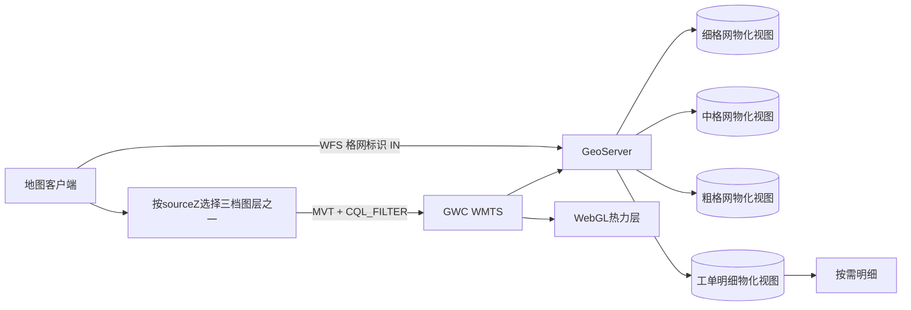
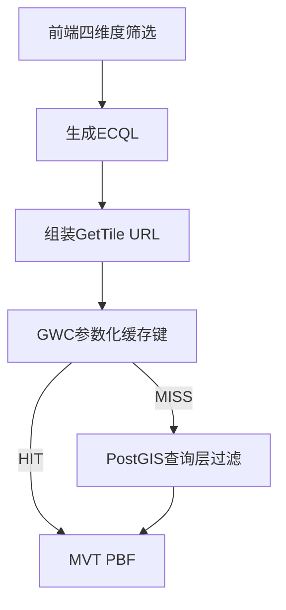
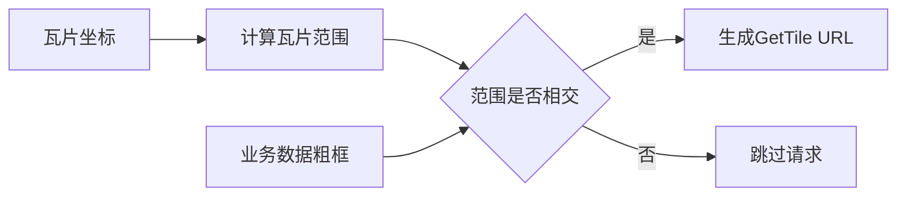
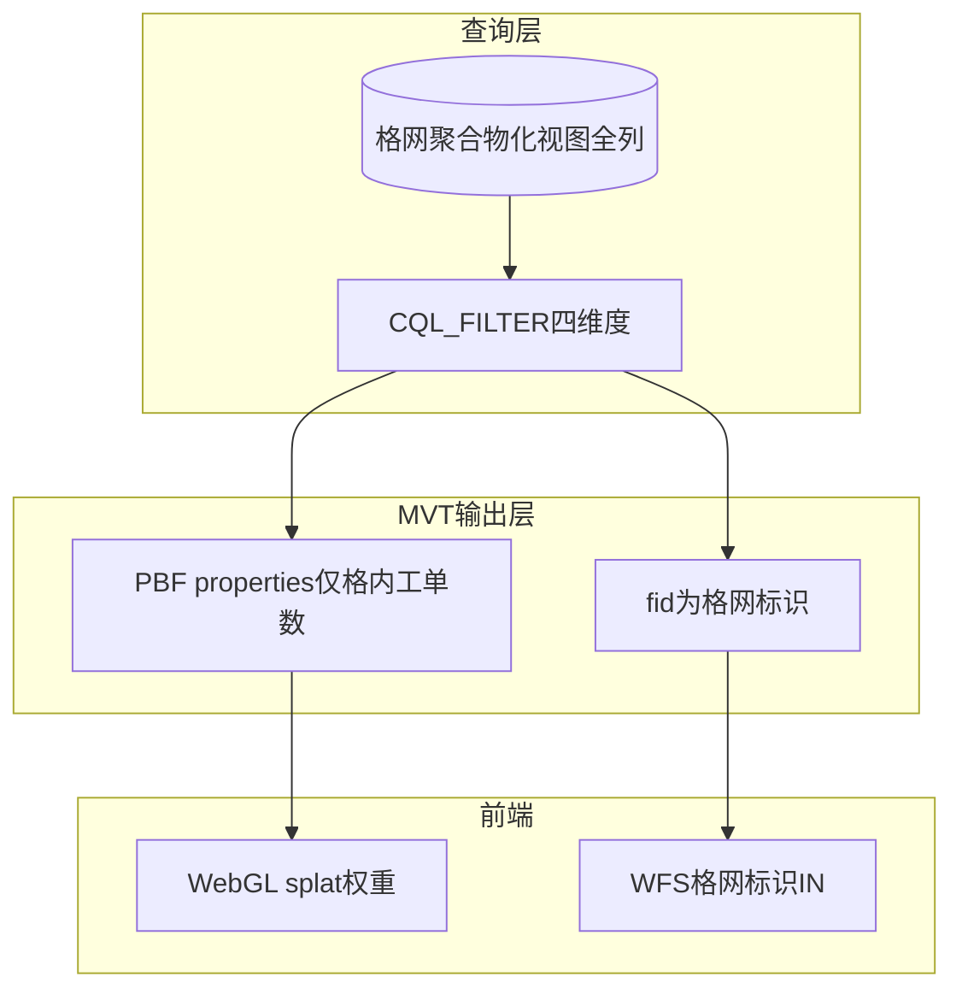
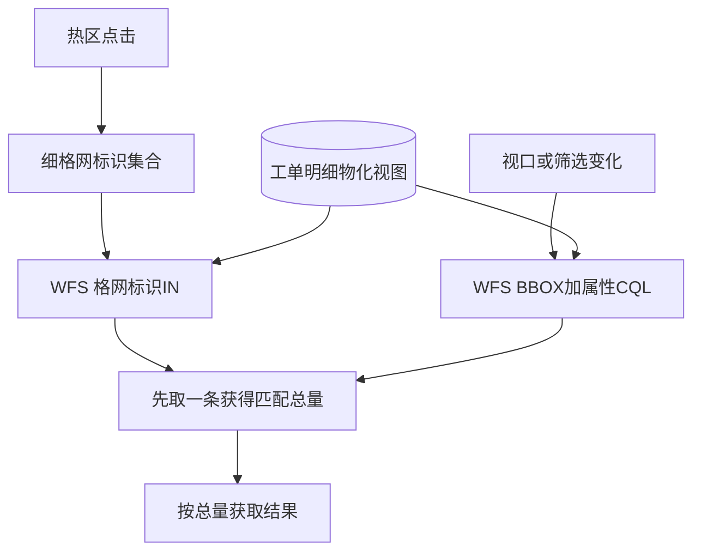
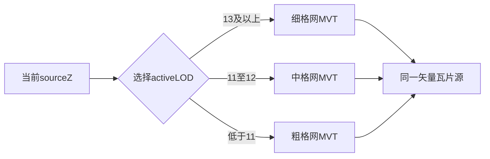
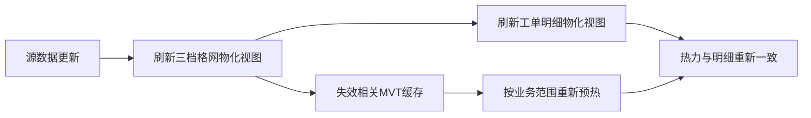

本篇是《百万级点数据：MVT + WebGL 热力渲染与 FBO 连通域热区工单统计》系列的第二篇，聚焦**服务层**：多分辨率格网如何发布为按需切换的 MVT 图层，筛选字段为什么可以留在查询层而不进入 PBF，以及热区点击为何应走独立 WFS。

# 服务层：MVT 瓦片与按需明细查询

## 背景环境

本篇基于以下环境验证，其它小版本需自行回归。

| 项 | 版本 / 说明 |
| --- | --- |
| **GeoServer** | **2.24.x**（实现环境 **2.24.2**） |
| **Vector Tiles 扩展** | GeoServer 需安装 MVT 输出扩展 |
| **GeoWebCache** | 随 GeoServer 2.24.x，提供参数化 WMTS 瓦片缓存 |
| **PostGIS** | 作为 GeoServer 数据源，承载三档格网聚合物化视图与工单明细物化视图 |

本文涉及的 GeoServer 能力以 [GeoServer 2.24.x User Manual](https://docs-archive.geoserver.org/2.24.x/en/user/) 为准。

---

## 1. 服务层要解决什么

数据层并不是把百万级别点数据直接交给地图客户端，而是准备两类数据出口。当前主验证场景约三百万条点数据，单一细格网已经难以兼顾各缩放层级：

| 数据源 | 服务出口 | 主要用途 |
| --- | --- | --- |
| **格网聚合物化视图族** | 每个业务数据源发布细、中、粗三档 MVT 图层 | 按视口和 `sourceZ` 传输格心、格内工单数与数字 fid |
| **工单明细物化视图** | 独立 WFS 2.0 图层 | 热区点击反查完整工单；必要时支持有界视口查询 |

两类出口解决的是不同问题：

- 热力图随视口、缩放和筛选频繁变化，需要按瓦片分块、缓存并由前端 WebGL 渲染。
- 工单明细字段多、单行体积大，只应在用户下钻时按需查询。
- 低 zoom 若仍使用细格网，单瓦片要素过密；因此服务层要提供三档格网 MVT，而不是只发布一个格网图层。

端到端关系如下：



这里的“三档 MVT + 一套 WFS”是一个完整的数据集契约。系统可以绑定多套结构相同的业务数据集，切换时替换对应的 MVT 图层集合和 WFS 图层，而不需要改变前端渲染与查询协议。

---

## 2. 为什么选择 MVT 矢量瓦片

格网聚合结果是 Point 要素。前端需要读取格内工单数作为 splat 权重，并在热区识别后拿到格网标识。MVT 比栅格 WMS 更适合这条链路。

| 对比维度 | 方案 A：栅格 WMS 热力图 | 方案 B：MVT 矢量瓦片 |
| --- | --- | --- |
| 前端可控性 | 服务端直接出图，前端只能显示结果 | 前端读取格网点与权重，自定义 splat、色带和阈值 |
| 动态筛选 | 每组条件都由服务端重新渲染图片 | `CQL_FILTER` 下推查询，不同参数组合进入独立缓存键 |
| 多分辨率 | 通常依赖服务端样式切换 | `sourceZ` 直接选择细、中、粗格网图层 |
| 热区下钻 | 图片不携带格网身份 | MVT 数字 fid 可衔接 WFS 反查 |
| 传输内容 | 传输渲染结果 | PBF 可主动裁剪，只保留权重与 fid |

本系列选择**方案 B**：服务层负责“预聚合、过滤、分块与缓存”，前端负责“GPU 渲染、连通域识别与交互”。

---

## 3. GWC WMTS 与 `CQL_FILTER`

### 3.1 GetTile 请求形态

前端生成的 MVT 请求可以抽象为：

```text
WMTS GetTile
  SERVICE=WMTS
  VERSION=1.0.0
  REQUEST=GetTile
  LAYER=<当前业务数据集 + 当前LOD对应图层>
  TILEMATRIXSET=<与宿主地图CRS一致的GridSet>
  TILEMATRIX=<当前sourceZ对应矩阵>
  TILEROW=<row>
  TILECOL=<col>
  FORMAT=application/vnd.mapbox-vector-tile
  CQL_FILTER=<可选ECQL>
```

`CQL_FILTER` 为空时不应发送空参数，而是直接省略该项，使无筛选请求命中统一的基线瓦片缓存。

### 3.2 GridSet 必须与地图 View CRS 对齐

GWC Tile Layer 的 GridSet、GetTile 的 `TILEMATRIXSET` 和前端瓦片源的 projection 应与地图 View 使用同一 CRS。这样瓦片坐标、行列号和视口计算处于同一空间参考中，不需要在客户端额外重投影。

这里不应照搬某个项目的 EPSG 代号。无论宿主使用 CGCS2000、Web Mercator 还是其它工程 CRS，原则都是：**以宿主地图 CRS 为准，服务端 GridSet 与前端 View 成对配置。**

### 3.3 四维度筛选如何进入 ECQL

筛选维度包括事项专题、业务场景、发生年份和所属区县。当前交互约定中，事项专题与业务场景互斥；年份和区县可与其中一项组合。

| 选择状态 | ECQL 形态 |
| --- | --- |
| 单个字符串值 | `字段 = '值'` |
| 多个字符串值 | `字段 IN ('值1','值2')` |
| 单个数值 | `字段 = 数值` |
| 多个数值 | `字段 IN (数值1,数值2)` |
| 该维度为“全部” | 省略该条件 |
| 所有维度均为默认值 | 整个 URL 不带 `CQL_FILTER` |

字符串中的单引号必须按 ECQL 规则转义为两个单引号，不能直接拼接原始输入。

### 3.4 Parameter Filter 与参数化缓存

GWC 需要显式允许 `CQL_FILTER` 作为 Parameter Filter。否则同一 z/x/y 在不同筛选条件下可能共用错误缓存。



筛选发生在 GeoServer 查询 PostGIS 时；GWC 负责按完整请求参数区分缓存；前端只需在筛选变化后刷新瓦片源，不需要自行合并旧、新瓦片数据。

---

## 4. Seed 范围与前端 bbox 门控

GWC Seed 不应覆盖整个 GridSet，而应限制在业务数据实际覆盖范围内。

| 设计点 | 原因 |
| --- | --- |
| Seed Bounding box 与业务范围一致 | 避免生成大量无数据瓦片 |
| Bounding box 可略宽于真实 extent | 容纳边界瓦片，并避免离群点把服务范围无限撑大 |
| 不在通用方案中固化坐标 | 不同数据集、城市和 CRS 的范围不同 |

前端还应进行运行时门控：计算待请求瓦片的地理范围，若与业务粗框完全不相交，`tileUrlFunction` 直接返回空，不生成 HTTP 请求。



Seed bbox 是服务端预热边界，`tileUrlFunction` 门控是客户端请求边界。两者应基于同一业务范围语义，但不等于要把 GridSet 的全球 extent 改成业务 bbox。

---

## 5. 格网标识为什么要作为数字 feature id

MVT 的 feature id 字段是数字类型。若 GeoServer 要输出 fid，就必须能从数据源解析到稳定整数；复合字符串身份不能直接替代数字 id。

格网标识承担两个职责：

1. 在 MVT 中作为数字 fid，前端无需额外 property 即可取得。
2. 在细格网热区点击时，作为 WFS 明细反查的关联键。

同一业务格在物化视图刷新后应保持格网标识稳定，格内工单数可以变化。常见发布方式是为整型格网标识提供唯一约束，让 GeoServer 将其推断为要素身份。

需要避免两类错误：

- 不要把“格心 + 四维度筛选列”的业务聚合键整体暴露成复合唯一主键候选，否则 GeoServer 可能隐藏本应参与 CQL 的列。
- 不要为解决 fid 问题而开启不必要的“暴露主键”，尤其不要让几何列参与主键元数据。

数据层的稳定格网标识与索引设计见[上一篇](https://www.cnblogs.com/zheyi420/p/22182285)。

---

## 6. 查询层与输出层必须分离

MVT 属性裁剪的核心原则是：

> **查询层保留筛选所需的全列，输出层只携带前端真正消费的数据。**

| 层级 | 保留内容 | 用途 |
| --- | --- | --- |
| **PostGIS 格网物化视图** | 格心、格内工单数、四维度筛选列、格网标识 | 聚合、筛选、校验和 fid 推断 |
| **GeoServer CQL 查询层** | 事项专题或业务场景、发生年份、所属区县 | 在生成当前瓦片前过滤要素 |
| **MVT PBF properties** | **仅格内工单数** | 前端 WebGL splat 权重 |
| **MVT feature id** | **格网标识** | 当前帧去重、热区统计和细格网明细反查 |
| **WFS 明细图层** | 工单完整属性与关联格网标识 | 热区列表、统计和有界查询 |



瓦片 properties 不包含筛选字段，并不代表服务端不能按这些字段筛选。CQL 在查询层先执行，Customize attributes 在编码 PBF 时再裁剪，两者处于不同阶段。

因此前端不应假设能从瓦片 properties 读取发生年份、事项专题、业务场景或所属区县；当前热力实现只消费格内工单数、数字 fid 和 Point 几何。

---

## 7. 为什么要裁剪 MVT 属性

低 zoom 瓦片覆盖范围大。若每个格网点都重复携带年份、专题、场景和区县等字符串，PBF 体积、GWC 磁盘占用和网络传输都会被放大。

通过 GeoServer Vector Tiles 的 **Customize attributes**，可以只输出“格内工单数”这一 property，并把“格网标识”保留在 feature id 中。

在本文项目业务数据背景下，属性裁剪使 PBF 体积下降约 **26%**。该结果与数据分布、字符串长度和瓦片密度有关，读者需要在自己的数据集上回归；通常低 zoom、格网密集、字符串字段较长时收益更明显。

### 7.1 主动裁剪与配置故障不能混淆

| 情形 | 原因 | 是否预期 |
| --- | --- | --- |
| 业务聚合键 UNIQUE 导致筛选列被隐藏 | GeoServer 将复合业务键误识别为主键候选 | **故障** |
| PostGIS Store 误开启“暴露主键” | 几何列与主键元数据可能发生冲突 | **故障** |
| Customize attributes 仅保留格内工单数 | 查询层字段仍完整，只缩减 PBF 输出 | **预期** |

判断标准不是“PBF 里是否只剩一个 property”，而是：

- GeoServer 查询层能否继续使用四维度字段执行 CQL；
- GetTile 输出是否只包含格内工单数与数字 fid；
- WFS 明细是否仍具有完整业务属性。

发布配置或输出属性发生变化后，必须失效并重新预热相关服务端瓦片缓存，否则 GWC 仍可能返回旧 PBF。这里不展开具体清理命令和 Seed 矩阵。

---

## 8. WFS 独立图层如何分工

工单明细物化视图发布为独立 WFS 2.0 图层，不加入 MVT Seed。它承担两条边界明确的按需查询路径。

### 8.1 热区点击：只按关联格网标识查询

热区连通域来自当前 CQL 条件下的 MVT。用户点击热区时，前端已经收集到该连通域所覆盖的格网标识，因此 WFS 只需：

```text
关联格网标识 IN (...)
```

这里不重复附加事项专题、业务场景、年份和区县条件。筛选已体现在当前 MVT 及其热区几何中，重复拼接四维度 ECQL 反而会让两条契约耦合。

当前数据模型中，工单明细只关联**细格网**标识，格网标识也只保证在单一档位内有意义。因此细格网档提供热区明细下钻；若产品要求中、粗格网也能下钻，需要分别建立对应档位的关联关系，并让查询端按 active LOD 选择关联键，不能跨档位混用格网标识。

### 8.2 视口查询：`BBOX` 与属性条件写进同一 CQL

有界视口查询使用：

```text
BBOX(工单几何, 当前视口范围, '宿主CRS')
AND 业务场景
AND 发生年份
AND 所属区县
```

空间范围直接写入 `CQL_FILTER` 的 `BBOX(...)`，不再同时传独立 `bbox` KVP。当前工单明细视图物化了业务场景、发生年份和所属区县，没有物化事项专题，因此事项专题只下推到 MVT 查询层，不能直接拼入该 WFS。若产品要求按专题查询视口明细，应先建立专题到业务场景的映射，或在明细视图中显式物化专题字段。

当前请求策略先以 `count=1` 获取响应中的匹配总量，再按总量拉取完整结果，不依赖 `resultType=hits`。原因是部分 GeoServer 配置下 `hits` 可能返回 XML，而普通 JSON GetFeature 响应已经包含匹配总数。

两条路径的区别如下：



热区下钻是本系列主路径；视口查询只是同一 WFS 明细层上的另一种有界访问方式，不能把两者概括成“所有 WFS 都携带热力筛选表达式”。

---

## 9. 三格网 LOD 如何发布与选择

每个业务数据源发布三个结构一致、格网精度不同的 GWC MVT 图层：

| `sourceZ` | active LOD | 作用 |
| --- | --- | --- |
| `>= 13` | 细格网（约 5m） | 保留更细的空间分布 |
| `11`–`12` | 中格网（约 100m） | 降低中等视口下的要素密度 |
| `< 11` | 粗格网（约 300m） | 控制低 zoom 大范围瓦片体积 |

`sourceZ` 是瓦片源实际请求的层级，不应简单等同于 UI 显示的 View zoom。`tileUrlFunction` 根据 `sourceZ` 选择当前 active LOD 对应的 `LAYER`，三档图层共用同一套 CQL 与 PBF 输出契约。



同一业务数据集内跨 LOD 缩放时，不主动清空三档瓦片缓存，以便用户来回缩放时复用已加载资源；但 WebGL renderer 必须只合成当前 active LOD，避免目标档位尚未到达时继续显示上一档热力。该问题与覆写方案将在系列第 04 篇展开。

CQL 变化时刷新当前瓦片源；切换业务数据集时替换三档 `LAYER` 集合并重新请求当前视口。这里的“缓存保留”指前端瓦片缓存，不等于忽略 GWC 的参数化缓存键。

---

## 10. 多业务数据集共用同一契约

前端可以绑定多套业务数据集，每套都包含“三档格网 MVT + 一套工单 WFS”。数据集切换只改变 MVT `LAYER` 集合和 WFS 要素类型，GridSet、CQL 生成规则、PBF 输出字段、LOD 阈值及 WFS 双路径保持一致。

这种设计把业务数据差异留在服务配置层，避免把数据集名称、宿主页面或切换控件写进渲染与查询核心。

---

## 11. MVT HTTP gzip：与裁剪和 LOD 互补

GWC 磁盘缓存通常保存未压缩 PBF，HTTP 响应层可以再使用 gzip 减少传输字节。三种优化作用在不同阶段：

| 优化 | 减少什么 |
| --- | --- |
| **三格网 LOD** | 降低低 zoom 瓦片中的格网要素数量 |
| **MVT 属性裁剪** | 减少每个要素携带的重复字段 |
| **HTTP gzip** | 压缩最终网络响应字节 |

三者是互补关系，不能用 gzip 替代数据建模和输出裁剪。本篇只说明传输契约，不展开 Tomcat、nginx 或容器配置。

---

## 12. 数据更新后的缓存一致性

数据库刷新与 GWC 瓦片更新不是同一件事。格内工单数变化后，如果旧 PBF 仍在缓存中，用户可能看到旧热力，却从 WFS 查到新明细。

正确的概念流程是：



三档格网物化视图之间没有依赖，可以分别刷新；工单明细的关联格网标识依赖最新细格网结果，因此应在细格网就绪后刷新。图层输出属性或发布配置变化时，同样需要失效并重建相关 MVT 缓存。

具体缓存清理、Seed 命令和预热矩阵属于运维手册，不在本文展开。

---

## 小结

- 服务层发布的是“每业务数据集三档格网 MVT + 一套工单 WFS”，不是把全量工单塞进一个瓦片图层。
- GWC WMTS 的 GridSet 应与地图 View CRS 对齐；`CQL_FILTER` 进入参数化缓存键。
- `sourceZ >= 13` 选细格网，`11`–`12` 选中格网，`sourceZ < 11` 选粗格网。
- 查询层保留四维度筛选列，PBF properties 仅输出格内工单数，格网标识作为数字 fid。
- 热区点击 WFS 只按细格网标识集合下钻；视口 WFS 才使用 `BBOX + 属性条件`。
- Customize attributes 主动裁剪与索引、主键配置故障必须分开判断。
- 三格网 LOD、属性裁剪和 HTTP gzip 分别减少要素数量、单要素字段与传输字节。
- 数据刷新或发布配置变化后，必须同步失效并重建 MVT 缓存，才能保持热力与明细一致。

下一篇进入前端渲染层，说明为什么不能直接使用 OpenLayers 内置 Heatmap，以及 `tileUrlFunction` 如何把三档 MVT 接入同一 WebGL 热力管线。

---

## 系列导航

- 总览：[百万级点数据：MVT + WebGL 热力渲染与 FBO 连通域热区工单统计](https://www.cnblogs.com/zheyi420/p/22182243)
- 01：[数据层：双物化视图与三格网 LOD](https://www.cnblogs.com/zheyi420/p/22182285)
- 02：[服务层：MVT 瓦片与按需明细查询](https://www.cnblogs.com/zheyi420/p/22182306)
- 03：[前端：热力图 WebGL 渲染管线](https://www.cnblogs.com/zheyi420/p/22182345)
- 04：[前端：矢量瓦片 Renderer 覆写与 LOD composite](https://www.cnblogs.com/zheyi420/p/22699358)
- 05：[前端：热区识别、计算与绘制](https://www.cnblogs.com/zheyi420/p/22182374)

---

## References

- [GeoServer 2.24.x User Manual](https://docs-archive.geoserver.org/2.24.x/en/user/)
- [GeoServer 2.24.x · Vector Tiles](https://docs-archive.geoserver.org/2.24.x/en/user/extensions/vectortiles/index.html)
- [GeoServer 2.24.x · GeoWebCache](https://docs-archive.geoserver.org/2.24.x/en/user/geowebcache/index.html)
- [GeoServer 2.24.x · WFS](https://docs-archive.geoserver.org/2.24.x/en/user/services/wfs/index.html)
- [GeoServer 2.24.x · CQL tutorial](https://docs-archive.geoserver.org/2.24.x/en/user/tutorials/cql/cql_tutorial.html)
- [Mapbox Vector Tile specification](https://github.com/mapbox/vector-tile-spec)
