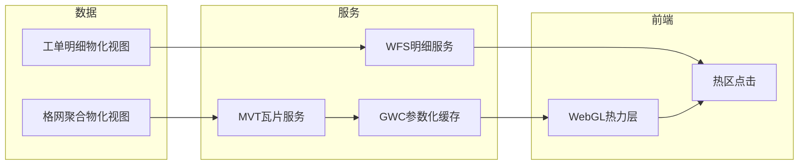
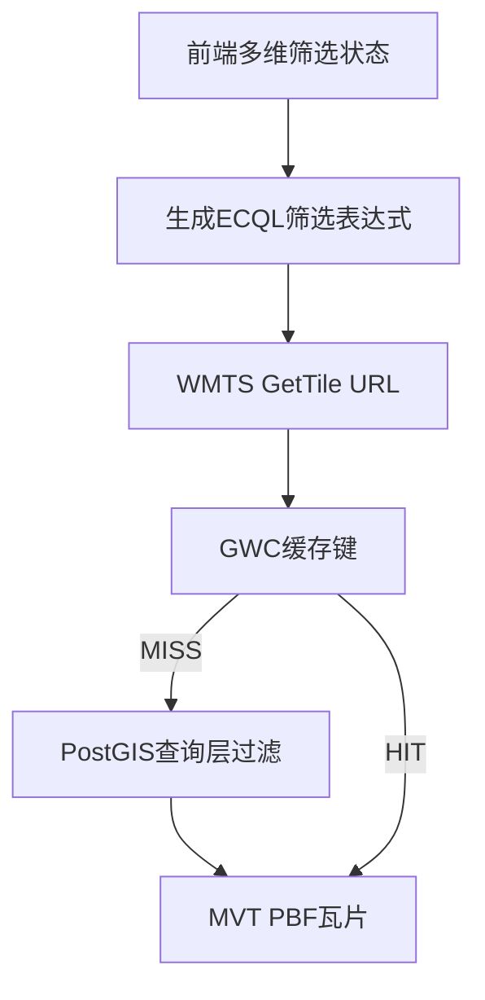
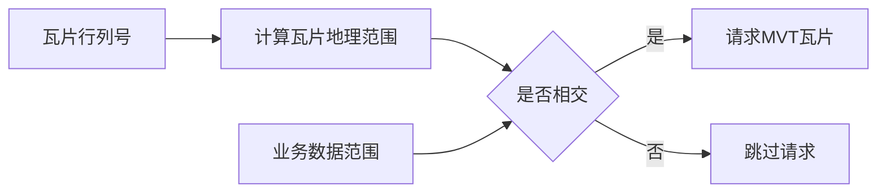
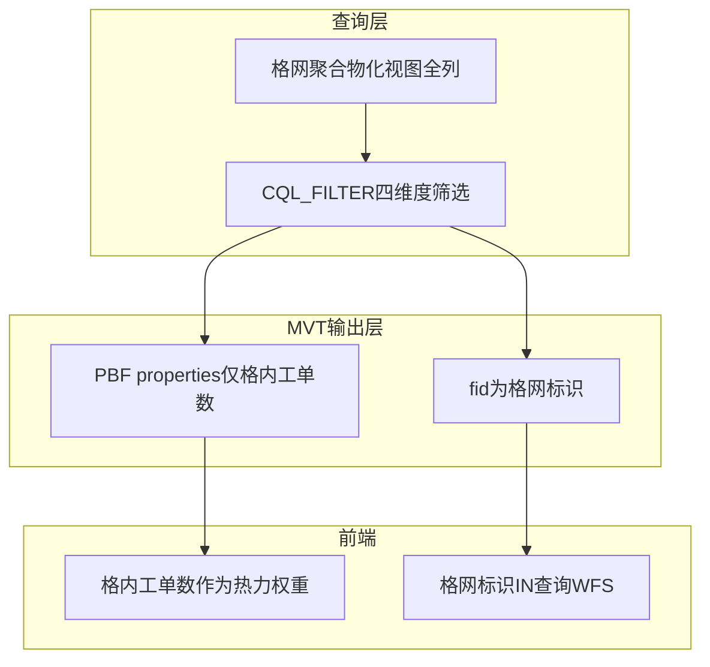

本篇是《百万级点数据：MVT + WebGL 热力渲染与 FBO 连通域热区工单统计》系列的第二篇，聚焦**服务层**：两个物化视图如何分别发布为热力瓦片与明细查询服务，为什么 MVT 要做属性裁剪，以及前端筛选、瓦片缓存、热区点击查询之间如何分工。

# 服务层：MVT 瓦片与按需明细查询

## 背景环境

本篇依赖如下组件，其它小版本需自行回归验证。

| 项 | 版本 / 说明 |
| --- | --- |
| **GeoServer** | **2.24.x**（实现环境 **2.24.2**）；需安装 Vector Tiles（MVT）扩展 |
| **GeoWebCache** | 随 GeoServer 2.24.x；用于 WMTS 瓦片缓存 |
| **PostGIS** | 作为 GeoServer 数据源；承载格网聚合物化视图与工单明细物化视图 |
| **宿主地图 CRS** | GWC GridSet 与地图 View 所用坐标系对齐 |

---

## 1. 服务层要解决什么

数据层已经把百万级别点数据拆成了两个物化视图：

| 数据源 | 服务出口 | 主要用途 |
| --- | --- | --- |
| **格网聚合物化视图** | MVT 矢量瓦片 | 热力渲染；按专题、场景、年份、区县等维度筛选 |
| **工单明细物化视图** | WFS 明细查询 | 热区点击后拉取完整工单列表；必要时支持有界视口查询 |

服务层的核心设计是：**热力展示走瓦片，明细查询走按需 WFS**。两条出口互不替代，原因也很直接：

- 热力图需要频繁随地图视口、缩放级别和筛选条件刷新，适合按 z/x/y 分块缓存。
- 工单明细包含完整业务属性，体积大、字段多，只应在用户点击热区或发起有界查询时按需拉取。
- MVT 只承载渲染所需的轻量信息，不能把明细物化视图的全部字段塞进每个瓦片。

整体关系如下：



---

## 2. 为什么选择 MVT 矢量瓦片

格网聚合物化视图输出的是「格心坐标 + 格内工单数 + 筛选维度」这一类点要素。对于这类数据，MVT 比栅格 WMS 更适合承担热力图底层数据通道。

| 对比维度 | 方案 A：栅格 WMS 热力图 | 方案 B：MVT 矢量瓦片 |
| --- | --- | --- |
| 前端可控性 | 服务端直接出图，前端只能显示结果 | 前端拿到格网点和格内工单数，可用 WebGL 自定义 splat、颜色和阈值 |
| 动态筛选 | 每组筛选条件都要服务端重新渲染图片 | `CQL_FILTER` 下推到查询层，不同参数组合可作为 GWC 缓存键 |
| 热区识别 | 前端难以知道每个热区包含哪些格网 | 瓦片要素带格网标识 fid，可用于热区点击反查 |
| 数据传输 | 图片大小与渲染结果相关 | PBF 可裁剪属性，只传热力所需字段 |

本系列选择**方案 B**：把服务层定位为「轻量矢量数据分发 + 参数化缓存」，把热力视觉、热区识别和交互留给前端完成。这样前端可以在同一套 MVT 数据上同时做 WebGL 热力渲染、FBO 连通域识别和热区点击下钻。

---

## 3. GWC WMTS 与 `CQL_FILTER`

服务层通过 GWC WMTS 对 MVT 瓦片做缓存。请求形态可以抽象为：

```text
WMTS GetTile
  LAYER=<热力格网图层>
  TILEMATRIXSET=<与宿主地图CRS一致的GridSet>
  TILEMATRIX=<z>
  TILEROW=<row>
  TILECOL=<col>
  FORMAT=application/vnd.mapbox-vector-tile
  CQL_FILTER=<可选筛选表达式>
```

这里有三个关键点。

第一，**GridSet 要与宿主地图 View 所用坐标系对齐**。例如项目使用 CGCS2000、Web Mercator 或其它工程 CRS 时，GWC TileMatrixSet 应与前端 View 的 projection 对齐，避免客户端拿到瓦片后再做额外重投影。本文不写死某个 EPSG 代号，实际以宿主地图坐标系为准。

第二，**筛选条件进入 `CQL_FILTER`**。专题、场景、年份、区县等筛选维度都在数据库查询层存在。前端多选后拼成 ECQL：

```text
事项专题 IN (...) AND 发生年份 IN (...) AND 所属区县 = ...
```

当用户处于全选或全部状态时，对应维度可以省略；全部维度都未收窄时，请求可以不带 `CQL_FILTER`。

第三，**GWC Parameter Filter 要允许 `CQL_FILTER`**。同一个瓦片行列号，在不同筛选表达式下代表不同结果，缓存键也必须区分这些参数组合。否则用户切换筛选条件时，可能命中上一组条件的旧瓦片。

参数化缓存链路如下：



---

## 4. Seed 范围与前端请求门控

GWC Seed 的目标不是「把全世界所有瓦片都预热一遍」，而是把**业务数据实际覆盖范围内**、常用 zoom 范围内的瓦片提前生成。合理的 Seed bbox 应略宽于业务数据范围，但不应被离群点无限拉大。

| 设计点 | 原因 |
| --- | --- |
| Seed bbox 与实际业务范围一致 | 避免对无数据区域生成大量空瓦片 |
| bbox 可略宽于真实数据 extent | 防止边界附近数据在瓦片切分上被误排除 |
| 不在博文中固化具体坐标 | 不同业务、不同城市、不同 CRS 的范围都不同 |

前端也应做一层轻量门控：当某个 z/x/y 瓦片的地理范围与业务数据范围完全不相交时，直接不生成 GetTile URL。这样可以减少无意义请求，也能避免 GWC 在 Dynamic 子集外反复处理空瓦片。



Seed 是服务端缓存策略，前端门控是运行时请求策略。两者目标一致：把服务能力集中在真正有数据、用户真正会看的区域。

---

## 5. 查询层与输出层分离

MVT 属性裁剪是本篇最重要的服务层契约。它的原则是：

> **查询层保留全列，输出层主动瘦身。**

格网聚合物化视图在数据库中仍然包含筛选维度。GeoServer 查询层也仍然可以用这些字段执行 `CQL_FILTER`。但最终输出给前端的 MVT PBF，不需要携带所有筛选字段。

| 层级 | 保留内容 | 用途 |
| --- | --- | --- |
| **PostGIS 物化视图** | 格心坐标、格内工单数、发生年份、事项专题、业务场景、所属区县、格网标识 | 查询、筛选、fid 推断、数据校验 |
| **CQL 查询层** | 发生年份、事项专题、业务场景、所属区县 | 服务端过滤当前瓦片要素 |
| **MVT PBF properties** | **仅格内工单数** | 前端 WebGL splat 权重 |
| **MVT feature id** | **格网标识** | 前端热区聚合后反查明细 |
| **WFS 明细服务** | 工单完整属性 + 关联格网标识 | 热区点击下钻、列表与统计 |

对应数据流如下：



这种拆分可以避免一个常见误解：**瓦片里不带筛选字段，不代表不能按筛选字段过滤**。筛选发生在 GeoServer 查询 PostGIS 的阶段；裁剪发生在写出 MVT PBF 的阶段。前端不应从瓦片 properties 里读取发生年份、事项专题、业务场景或所属区县，它只消费「格内工单数」和 feature id。

---

## 6. 为什么要裁剪 MVT 属性

低 zoom 下，一个瓦片可能覆盖很大的地理范围，也可能包含大量格网点。如果每个点都重复携带年份、专题、场景、区县等字符串属性，PBF 体积会明显增大，GWC 磁盘占用和网络传输都会被放大。

而前端热力渲染真正需要的只有两个信息：

1. **格内工单数**：作为 splat 权重，经归一化后决定热力强度。
2. **格网标识**：作为 feature id，供热区识别后反查明细。

其它筛选字段已经在服务端查询层用过了，继续输出到 PBF 里只会增加体积。通过 GeoServer Vector Tiles 的 **Customize attributes**，MVT 输出可以主动只保留「格内工单数」这个 property，并让「格网标识」作为数字 fid 出现在要素 id 上。

在本文项目业务数据背景下，这类属性裁剪带来了约 **26%** 的 PBF 体积下降。这个数字只代表一组业务数据与字段长度下的实测结果，读者在自己的数据集上应自行回归，但趋势通常一致：低 zoom、格网密集、字符串字段多时，收益更明显。

---

## 7. 主动裁剪与故障只剩权重列

需要特别区分两种「输出只剩格内工单数」：

| 情形 | 原因 | 是否预期 | 处理方向 |
| --- | --- | --- | --- |
| 业务聚合键唯一索引导致属性只剩格内工单数 | 服务端把业务键组合误识别为主键候选列，默认不暴露主键列，于是筛选维度被隐藏 | **故障** | 回到数据层检查索引设计，避免把业务键组合暴露成唯一主键候选 |
| PostGIS Store 误开启暴露主键 | 几何列与主键分量等元数据冲突，可能引发 WFS 或几何解析异常 | **故障** | 保持默认不暴露主键；让稳定整型格网标识承担 fid |
| Customize attributes 仅勾选格内工单数 | 主动减小 PBF 体积，筛选仍在查询层完成 | **预期** | 发布配置变更后失效并重建相关瓦片缓存 |

这三者表面结果相似，排查方向完全不同。

主动裁剪的前提是：GeoServer 查询层仍能看到发生年份、事项专题、业务场景、所属区县这些字段；只是 MVT GetTile 输出时不再把它们写入 PBF。如果查询层字段也消失了，`CQL_FILTER` 就会失败，那不是裁剪优化，而是图层发布或索引设计出了问题。

---

## 8. WFS 明细服务如何分工

工单明细物化视图发布为独立 WFS 图层，不进入 GWC MVT Seed。它承担两类按需查询。

### 8.1 热区点击下钻

用户点击热区圆标时，前端已经知道这个连通域内涉及哪些格网标识。此时 WFS 查询只需要：

```text
关联格网标识 IN (...)
```

不需要再附带专题、场景、年份、区县的 ECQL。原因是这些筛选已经体现在当前 MVT 结果中：热区是基于当前筛选条件下的瓦片识别出来的，连通域内的格网标识集合本身就是筛选后的结果。

这条路径是本系列的主路径：


### 8.2 有界视口查询

如果产品还需要「查询当前视口内的业务记录点位」这类能力，WFS 可以使用单一 `CQL_FILTER` 同时表达空间范围和属性筛选：

```text
BBOX(工单几何, ...) AND 业务场景 = ... AND 发生年份 IN (...) AND 所属区县 = ...
```

注意这里的空间范围应写入 `CQL_FILTER` 的 `BBOX(...)`，避免把独立 `bbox` 参数与 `CQL_FILTER` 混用。不同 GeoServer 版本和服务配置下，两者同时出现可能导致解析行为不一致。

视口查询不是本系列主线，本文只强调边界：**热区点击按格网标识，视口查询按 BBOX + 属性条件**，不要把两条路径混成「所有 WFS 都附带热力筛选表达式」。

---

## 9. 缓存一致性

服务层一旦引入 GWC，就必须接受一个现实：数据库刷新与缓存瓦片不是同一件事。

源数据更新后，数据层会先刷新格网聚合物化视图，再刷新工单明细物化视图。此时数据库已经是新结果，但 GWC 里可能还保留着旧的 MVT PBF。若不处理缓存，用户可能看到旧热力、点击后却查到新明细，造成展示与下钻短暂不一致。

因此，服务层需要在数据刷新后安排瓦片缓存失效与重新预热。本文不展开具体缓存清理命令、预热命令或预热矩阵，它们属于运维手册；在架构层面只需要记住：

- 数据刷新解决的是**库内结果更新**。
- 瓦片缓存失效解决的是**GetTile 输出更新**。
- 两者都完成后，MVT 热力和 WFS 明细才重新对齐。

---

## 小结

- 服务层把格网聚合物化视图发布为 MVT 矢量瓦片，把工单明细物化视图发布为独立 WFS。
- GWC WMTS 负责缓存 MVT，`CQL_FILTER` 作为参数化缓存键的一部分；GridSet 应与宿主地图 CRS 对齐。
- MVT 的查询层和输出层要分离：筛选字段留在 PostGIS 与 CQL 查询层，PBF properties 主动裁剪到仅「格内工单数」，格网标识作为 fid。
- 热区点击 WFS 只按 `关联格网标识 IN (...)` 查询，不重复附带四维度 ECQL；视口类 WFS 才使用 `BBOX + 属性条件`。
- 属性裁剪是预期优化，业务键唯一索引或暴露主键导致属性异常消失是故障，二者不能混为一谈。

下一篇进入前端渲染层，看为什么不能直接使用 OpenLayers 内置 Heatmap，以及如何把 Heatmap 的 splat 与 gradient 思路迁移到 MVT 矢量瓦片上。

---

## 系列导航

- 总览：[百万级点数据：MVT + WebGL 热力渲染与 FBO 连通域热区工单统计](https://www.cnblogs.com/zheyi420/p/22182243)
- 上一篇：[01-数据层-双物化视图](https://www.cnblogs.com/zheyi420/p/22182285)
- 下一篇：[03-前端-热力图WebGL渲染管线](https://www.cnblogs.com/zheyi420/p/22182345)

---

## References

- [GeoServer 2.24.x User Manual](https://docs-archive.geoserver.org/2.24.x/en/user/)
- [GeoServer 2.24.x · Vector Tiles](https://docs-archive.geoserver.org/2.24.x/en/user/extensions/vectortiles/index.html)
- [GeoServer 2.24.x · GeoWebCache](https://docs-archive.geoserver.org/2.24.x/en/user/geowebcache/index.html)
- [GeoServer 2.24.x · WFS](https://docs-archive.geoserver.org/2.24.x/en/user/services/wfs/index.html)
- [GeoServer 2.24.x · CQL tutorial](https://docs-archive.geoserver.org/2.24.x/en/user/tutorials/cql/cql_tutorial.html)
- [Mapbox Vector Tile specification](https://github.com/mapbox/vector-tile-spec)
