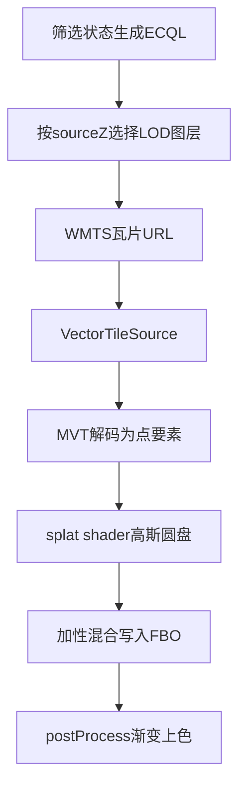
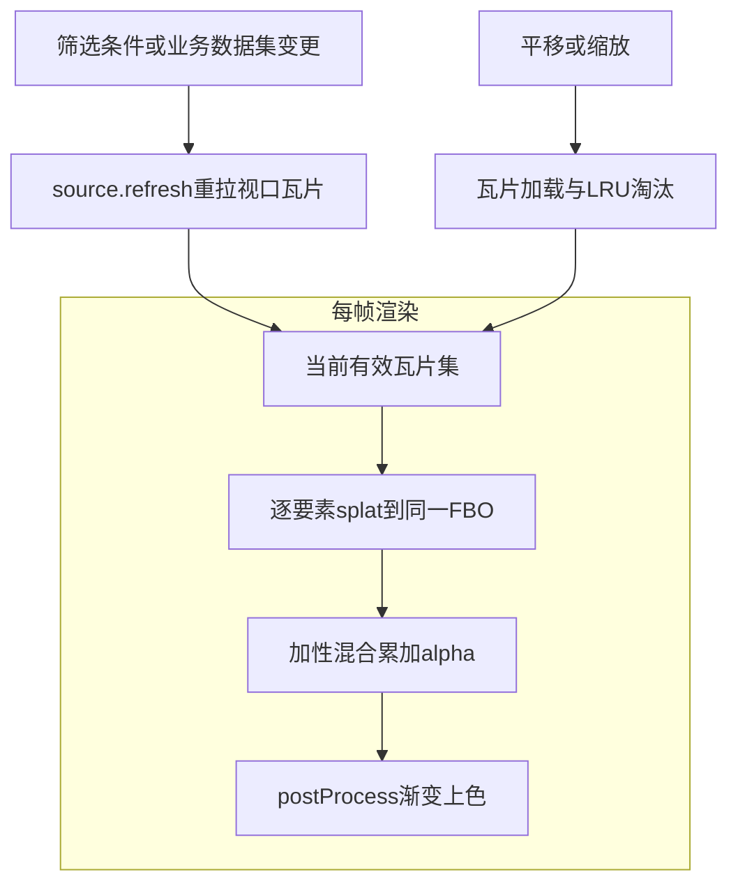

本篇是《百万级点数据：MVT + WebGL 热力渲染与 FBO 连通域热区工单统计》系列的第三篇，聚焦**前端（上）**：为什么不能直接使用 OpenLayers 内置 Heatmap，如何把它的 splat 与 gradient 思路迁移到 MVT 矢量瓦片上，`tileUrlFunction` 如何按 `sourceZ` 在三档格网图层之间选择，以及按视口分页到达的瓦片如何在 GPU 上融合成一张连续的热力图。

# 前端（上）：热力图 WebGL 渲染管线

## 背景环境

本篇依赖如下组件，其它小版本需自行回归验证。

| 项 | 版本 / 说明 |
| --- | --- |
| **OpenLayers** | **10.6.1**；本篇涉及的私有扩展点与该版本锁定，升级需逐项回归（见 §2.3） |
| **MVT 瓦片服务** | 热力数据来自服务层 GWC WMTS 输出的**三档**格网 MVT 图层（细 / 中 / 粗，见[上一篇](https://www.cnblogs.com/zheyi420/p/22182306)）；GridSet 与宿主地图 View 所用坐标系对齐 |
| **WebGL 能力** | 依赖 OpenLayers 的 WebGL 矢量瓦片渲染层（`ol/layer/WebGLVectorTile`）与全屏后处理机制 |

---

## 1. 为什么不能直接用 ol/layer/Heatmap

OpenLayers 内置了 `ol/layer/Heatmap`，为什么不能直接 `new Heatmap({ source: vectorTileSource })`？先看它的源码行为：`Heatmap.js` 的 `createRenderer()` 用 `ShaderBuilder` 组装 splat shader，再附上一个 gradient 全屏后处理，最终返回 **`WebGLVectorLayerRenderer`**——这是面向「非瓦片」矢量源的渲染器。同时它的 `source` 选项在类型与运行时上的假设都是 `ol/source/Vector`：全量要素一次性装进内存，渲染时逐要素 splat。

对照本方案的现实：

| 内置 Heatmap 假设 | 本方案现实 |
| --- | --- |
| 绑定 `ol/source/Vector`，全量要素在内存 | 数据来自 **MVT 矢量瓦片**，按视口分块加载、按需淘汰 |
| `createRenderer()` 创建 `WebGLVectorLayerRenderer` | 需要带瓦片语义的 `WebGLVectorTileLayerRenderer`（瓦片队列、瓦片坐标、按瓦片组织绘制批次） |
| 无瓦片生命周期概念 | 必须处理瓦片加载、LRU 淘汰、筛选条件变更后的刷新 |

三个假设全部不成立。即便用类型断言把 `VectorTileSource` 硬塞进去，走的也是非瓦片 renderer 路径，瓦片化加载与筛选刷新都无从谈起。

**结论**：复用 `Heatmap.js` 里的 **splat shader 数学** 与 **gradient 后处理**，但把它们挂载到 **`ol/layer/WebGLVectorTile`** 这个瓦片 WebGL 层上；不能直接实例化 `Heatmap`。

---

## 2. OL 覆写与扩展：六个关键点

### 2.1 扩展点总览

把 Heatmap 的 GPU 管线移植到 WebGLVectorTile，需要在六个点上做覆写或扩展。每一处都对照 OL 源码说明「不扩展会怎样、扩展后得到什么」：

| 扩展点 | 未覆写 / 未扩展时的缺口 | 本方案做法（概念级） | 覆写后实现的能力 |
| --- | --- | --- | --- |
| **不用 `ol/layer/Heatmap`** | 内置层绑定 `ol/source/Vector`，`createRenderer()` 走 `WebGLVectorLayerRenderer`；无矢量瓦片生命周期 | 以 `VectorTileSource` + `WebGLVectorTile` 为宿主，**复刻** Heatmap 的 splat 与 gradient 数学，而非实例化 `Heatmap` | 三百万级格网**按视口分块**加载；筛选变更仅 `source.refresh()`，由 GPU 每帧对当前有效瓦片集重绘融合 |
| **`postProcesses` 全屏后处理** | `WebGLVectorTile` 公开 `Options` **未暴露** `postProcesses`；没有后处理，splat 只能累加 alpha，无法映射冷蓝→热红 | 自定义 `WebGLVectorTile` **子类**，覆写 `createRenderer()`，向 renderer 注入 `postProcesses_`（OL 10.6.x 最小侵入点） | 与内置 Heatmap **同构**的「splat 加性混合 → gradient 纹理上色」；**同一 WebGL 层**产出可供[第 05 篇](https://www.cnblogs.com/zheyi420/p/22182374)做 alpha 阈值分割的热力画面 |
| **`AsShaders` 形式 style** | 公开类型把 `style` 收窄为 `FlatStyleLike`；Heatmap 实际走的是 `ShaderBuilder` 组装的 `AsShaders` 分支 | 用公开的 `ShaderBuilder` / `compileUtil` **复刻** `Heatmap.js#createRenderer` 中的 splat GLSL；构造子类时以类型断言传入 | 按要素属性（格内工单数）计算 **per-feature 热力权重**；`radius` / `blur` 以 uniform 注入，可与视觉调参联动 |
| **gradient 纹理与 postProcess shader** | 内置 Heatmap 在 `createRenderer` 闭包内创建 `createGradient(colors)` 与 fragmentShader，外部拿不到 | 复刻 1×256 色带 canvas；在图层选项中自行组装 `postProcesses`（`u_gradientTexture`、`u_opacity`） | 色带可配置；整体透明度可调；视觉与服务端、产品色带对齐 |
| **`tileUrlFunction` LOD 选层** | 单一 `LAYER` 无法同时兼顾各缩放层级：低 zoom 细格网单瓦片要素过密，高 zoom 粗格网又丢失空间分布 | 按 `sourceZ` 解析当前 **active LOD**，把 WMTS URL 的 `LAYER` 指向三档格网图层之一（阈值与上一篇 §9 一致） | 视口缩放自动请求对应精度的 MVT；三档瓦片共用同一 `VectorTileSource` 与同一 WebGL 层；renderer 侧如何保证「只画当前档」见[下一篇](https://www.cnblogs.com/zheyi420/p/22699358) |
| **WebGL 层销毁** | `WebGLVectorTile` 须显式 `dispose()` 才能释放 GL context / FBO / postProcess 纹理，否则泄漏 | `removeLayer` 后调用 `layer.dispose()`（公开 API）；瓦片源缓存另行清理（见 §5.3） | 功能关闭或离页后 GPU 资源可回收；与第 05 篇 FBO 分析管线的生命周期一致 |

### 2.2 注入 postProcesses 的最小侵入实现

先看 OL 源码给出的钩子：`ol/renderer/webgl/Layer.js` 的基类 `WebGLLayerRenderer` 在构造函数里把 `options.postProcesses` 存入私有字段 `postProcesses_`；每帧 `prepareFrame()` 时用它构造 `new WebGLHelper({ postProcesses })`。问题在于：`ol/layer/WebGLVectorTile.js` 的 `createRenderer()` 创建 `WebGLVectorTileLayerRenderer` 时只透传了 `style / variables / disableHitDetection`，**没有** `postProcesses` 入口，这个字段默认是 `undefined`。

于是最小侵入点就是：子类化图层，在 `createRenderer()` 里创建 renderer 之后把后处理链写进它的私有字段：

```ts
// 概念伪代码：自定义 WebGLVectorTile 子类，注入 postProcesses
class HeatmapVectorTileLayer extends WebGLVectorTileLayer {
  constructor(options) {
    const { postProcesses, ...rest } = options
    super(rest)
    this.heatmapPostProcesses = postProcesses
  }

  createRenderer() {
    // 创建（自定义的）瓦片 renderer；renderer 自身的覆写见下一篇
    const renderer = new CustomVectorTileRenderer(this, { style: this.style_ })
    // 基类 prepareFrame() 读取该私有字段，构造 WebGLHelper({ postProcesses })
    renderer.postProcesses_ = this.heatmapPostProcesses
    return renderer
  }
}
```

样式侧同理：`style` 在 d.ts 里被收窄为 `FlatStyleLike`，但 renderer 的运行时分支本就接受 `AsShaders`——`WebGLVectorTileLayerRenderer` 组装样式渲染器时以 `'builder' in style` 判定，携带 `ShaderBuilder` 的样式对象会原样进入 shader 渲染路径（Heatmap 自己就是这么走的）。因此把 `ShaderBuilder` 组装结果以类型断言传入即可，运行时行为与内置 Heatmap 完全一致。

### 2.3 为什么值得覆写

内置 Heatmap 把「矢量全量 + splat + gradient」封在一层里；本方案的数据在 **MVT 瓦片**上，必须把 Heatmap 的 **GPU 数学**拆出来绑到 **WebGLVectorTile**，用子类补上官方未导出的 **postProcesses** 能力，再配合 **LOD URL 选层**，才能得到**可瓦片化、可筛选刷新、可后处理上色、可按缩放换档**的热力层。这一步同时是后两篇的前提：第 05 篇的热区识别要对「屏幕上真实看到的 alpha」做阈值分割，只有当 gradient 上色以 postProcess 形式跑在同一 WebGL 层内，CPU 侧才能拿到与视觉一致的累积 alpha；第 04 篇则解决三档瓦片共存于同一瓦片源时「renderer 只画当前档」的问题。

**版本锁定**：`postProcesses_` 注入依赖 `ol/renderer/webgl/Layer.js` 的私有字段命名；`AsShaders` 断言依赖 `WebGLVectorTileLayerRenderer` 的运行时分支。这两处都不是公开 API，本系列锁定 **OpenLayers 10.6.1**，升级 OL 版本时须逐项回归上述扩展点；若官方后续公开 `postProcesses` 入参，只需替换子类这一处。

---

## 3. 渲染管线全景

从筛选条件到屏幕上的热力图，完整管线如下：



逐段说明。

**LOD 选层（resolveLod）**。上一篇发布的三档格网 MVT 图层共享同一套 CQL 与 PBF 输出契约。`tileUrlFunction` 拿到瓦片坐标后，先按 OL 为当前视口选定的 `sourceZ` 解析 active LOD：`sourceZ >= 13` 取细格网，`11`–`12` 取中格网，低于 `11` 取粗格网，再把对应图层名写进 WMTS GetTile 的 `LAYER` 参数。也就是说，三档图层在前端看来是同一条 URL 模板的不同参数取值——瓦片源与 WebGL 层都只有一份。

**瓦片源（filter → url → vts）**。`VectorTileSource` 内置与 GWC GridSet 对齐的 `WMTSTileGrid`，无需请求 GetCapabilities。`tileUrlFunction` 里还有一道请求门控：瓦片地理范围与业务数据范围不相交时直接不生成 URL（OL 允许瓦片 URL 为空，该瓦片不会发起请求，见上一篇 §4）；否则拼出带 `TILEMATRIX / TILEROW / TILECOL` 的 WMTS GetTile URL，筛选条件非默认时附加 `CQL_FILTER`。筛选状态变化时只更新「下一次生成 URL 所用的 CQL」，再调 `source.refresh()` 让 OL 重新拉取视口瓦片。

**解码（vts → decode）**。MVT format 把 PBF 解码为点要素。这里承接上一篇的 **MVT 属性裁剪契约**：前端只消费两个信息——properties 里的**格内工单数**（splat 权重）与 feature id 上的**格网标识**（反查锚点）；事项专题、业务场景、发生年份、所属区县等筛选维度已在服务端查询层生效，**不从瓦片 properties 读取**。

**splat（decode → splat → fbo）**。每个格网点要素被渲染成一个 `(radius + blur) * 2` 像素的 quad，片元 shader 按到中心的距离做高斯衰减，再乘上 per-feature 权重：

```glsl
// 片元：高斯圆盘 splat（等价 ol/layer/Heatmap.js 思路）
float t = smoothstep(0., 1., (1. - length(coordsPx * 2. / quadSize)) * blurSlope);
gl_FragColor = vec4(t * weight, ...);
```

权重来自要素的格内工单数，经归一化后作为 attribute 传入（见 §5.1）；`radius` / `blur` 以 uniform 注入，调参时无需重建样式。quad 之间用**加性混合**写入同一张组 FBO——多点、多瓦片的权重在 alpha 通道里不断累加，这就是「热量」的载体。

**上色（fbo → grad）**。postProcess 阶段把 FBO 里累积的 alpha 当作纵坐标，去采样一张 1×256 的渐变纹理（蓝→青→绿→黄→橙→红），替换 RGB 并乘上整体透明度：

```glsl
// postProcess：用累积 alpha 采样渐变纹理（等价 ol/layer/Heatmap.js 的 post-pass）
vec4 color = texture2D(u_image, v_texCoord);
gl_FragColor.a = color.a * u_opacity;
gl_FragColor.rgb = texture2D(u_gradientTexture, vec2(0.5, color.a)).rgb;
gl_FragColor.rgb *= gl_FragColor.a;
```

渐变纹理由一个 1×256 的 canvas 线性渐变生成；`WebGLHelper` 遇到 `HTMLCanvasElement` 类型的 uniform 会自动上传为 2D 纹理。splat 阶段只关心「热多少」，颜色映射全部推迟到 post-pass——这正是内置 Heatmap 的设计，本方案原样复刻。

---

## 4. 新瓦片如何融入已有热力

瓦片化之后必然要回答一个问题：视口边缘不断有新瓦片加载进来、旧瓦片被淘汰，热力图怎么保持连续？答案是**不做任何手写的合并逻辑**。

OL 的 WebGL 瓦片渲染是**每帧对当前有效瓦片集整体重绘**的：帧与帧之间不保留「上一帧的热力」，每个要素的 splat 都在同一帧里重新写入同一张 FBO，加性混合天然完成跨瓦片、跨要素的叠加。所以「新瓦片融入」不是一次增量合并，而是下一帧把它和既有瓦片一起再画一遍。



这条语义带来两个直接推论。

第一，**筛选变更只需 `source.refresh()`**。CQL 变化后 OL 会重拉视口内瓦片（URL 里的 `CQL_FILTER` 已更新），新瓦片到达后自然进入下一帧的有效瓦片集，前端无需做任何新旧数据 diff。

第二，**不要在 CPU 侧合并瓦片要素缓存**。一个容易想到的错误路线是：监听瓦片加载事件，把各瓦片要素合并进一份「全量列表」再喂给渲染。这与 GPU 帧语义完全冲突：

| 对比维度 | 方案 A：CPU 合并瓦片要素缓存 | 方案 B：每帧重绘有效瓦片集（本方案） |
| --- | --- | --- |
| 数据一致性 | 需手动对齐 OL 为 overzoom 选择的源级 z（sourceZ）与当前筛选条件，`refresh` 后旧瓦片极易残留、统计与画面脱节 | 有效瓦片集由 OL 维护，帧内重绘天然一致 |
| 实现成本 | 多一份全量要素缓存，加加载、淘汰、刷新三条同步循环 | 零融合代码，加性混合即合并 |
| 内存占用 | 全量要素常驻内存，随浏览范围增长 | 只画当前帧需要的瓦片 |

理解了「每帧重绘」，就不会再去寻找增量合并点。剩下两个与瓦片缓存有关的策略值得一提。

**同场景跨档缩放不清缓存**。三档 LOD 的瓦片 URL 只在 `LAYER` 参数上不同，它们可以并存于同一个瓦片源缓存：来回缩放时旧档瓦片不主动清除（purge），再次回到该档位可直接复用。但「缓存里并存」不等于「可以同时画」——OL 默认的 composite 逻辑并不区分瓦片属于哪一档，需要 renderer 覆写来保证屏幕上只出现 active LOD 的内容，这正是[下一篇](https://www.cnblogs.com/zheyi420/p/22699358)的主题。

**切换业务数据集按图层白名单清理**。切换到另一套业务数据集时，前端按「当前数据集的三档图层」为白名单清理瓦片缓存中非本数据集的瓦片，再刷新重拉——概念上仍是「换 URL 键 + refresh」，不涉及逐要素数据合并。

真正需要维护时序的只有一件事：筛选刷新后等待瓦片重新到达，再驱动依赖瓦片的下游计算——这正是第 05 篇热区识别要处理的「短暂归零」时序。

---

## 5. 其他重点

### 5.1 权重归一化：对数压缩 + 幂次拉差

格内工单数是长尾分布：少数格网几十上百件，大量格网只有个位数。线性映射会让绝大多数格网挤在低权重区，个别大值又把色带顶穿。本方案默认用「对数压缩 + 幂次拉差」把原始计数压到 [0, 1]：

```ts
// 单格热力权重（概念伪代码，默认模式）
const linear = Math.min(1, Math.log(格内工单数 + 1) / Math.log(Math.max(1, 热力饱和标准)))
const weight = Math.pow(linear, 1.4) // 幂次 > 1，压低中低段
```

**热力饱和标准**（单格累计多少件算「最热」）决定归一化分母：调大它需要更多工单叠加才饱和，适合密集区域防止整图过红；幂次曲线进一步拉开中低段差异，让「温」和「热」在色带上更可区分。实现上还保留了不做幂次的纯对数模式作为对照项，默认启用「对数 + 幂次」组合。

### 5.2 调参如何生效

`radius`、`blur`、整体透明度、热力饱和标准都不写死在 shader 里：前两者是 splat 的 uniform，透明度是 postProcess 的 uniform，饱和标准参与 weight attribute 的回调计算。视觉类参数变更后做两件事：`layer.changed()` 通知重绘（uniform 与 attribute 回调取最新值）、`source.refresh()` 让瓦片按当前上下文重新进入渲染管线。

有两个例外值得记住：**筛选条件（CQL）变化只调 `source.refresh()`**，不需要碰图层；而「热区阈值」这类只影响 CPU 侧识别的参数走 `cpuOnly` 捷径——复用已捕获的掩膜重算，完全不触发瓦片刷新（见[第 05 篇](https://www.cnblogs.com/zheyi420/p/22182374)的性能分级）。视觉调参的交互不在本系列展开，这里只需理解：**所有视觉调参最终都落在 uniform / attribute 上，GPU 重绘即生效**。

### 5.3 资源销毁

WebGL 层不会随 `removeLayer` 自动释放：OL 明确要求对 WebGL 图层手动 `dispose()`，否则 GL context、FBO、postProcess 纹理都会泄漏。瓦片源侧也有一个坑：OL 10.6 的 `TileSource#clear()` 是空实现，`VectorTileSource` 没有覆盖它——`refresh()` 也只调这个空 `clear()` 再触发重绘，并不会释放已缓存瓦片。因此关闭功能时须遍历瓦片缓存把已解析的 MVT 瓦片逐个 `dispose()`，再 `source.dispose()`，否则已解码的要素与底层二进制数据会长期驻留内存。完整顺序：

1. `map.removeLayer(heatmapLayer)`；
2. `heatmapLayer.dispose()`——释放渲染助手（含 postProcess FBO 与渐变纹理）；
3. 清理瓦片源内部缓存并 `source.dispose()`。

与 §2 的注入点一样，瓦片缓存的内部结构同样锁定 OL 10.6.1，升级需回归。

---

## 小结

- 内置 `ol/layer/Heatmap` 绑定全量 `Vector` 源与无瓦片语义的 renderer，不能直接承载 MVT；本方案把它的 splat 与 gradient 数学迁移到 `WebGLVectorTile` 子类。
- 六个扩展点中，`postProcesses_` 私有注入与 `AsShaders` 断言是版本敏感点，本系列锁定 OpenLayers 10.6.1。
- `tileUrlFunction` 按 `sourceZ` 在三档格网图层间选层；三档瓦片共存于同一瓦片源缓存，但屏幕上只显示哪一档由 renderer 决定——这是下一篇的主题。
- 多瓦片融合不靠 CPU 合并：每帧对当前有效瓦片集重新 splat + 加性混合；筛选变更只调 `source.refresh()`。
- 权重默认经「对数 + 幂次」归一化并封顶，配合热力饱和标准与色带，控制稀疏与密集区域的视觉平衡。
- 热力层就绪后，接下来两篇分别解决「多档瓦片只画当前档」（04）与「画出来的热斑怎么标、怎么点」（05）。

---

## 系列导航

- 总览：[百万级点数据：MVT + WebGL 热力渲染与 FBO 连通域热区工单统计](https://www.cnblogs.com/zheyi420/p/22182243)
- 01：[数据层：双物化视图与三格网 LOD](https://www.cnblogs.com/zheyi420/p/22182285)
- 02：[服务层：MVT 瓦片与按需明细查询](https://www.cnblogs.com/zheyi420/p/22182306)
- 03：[前端：热力图 WebGL 渲染管线](https://www.cnblogs.com/zheyi420/p/22182345)
- 04：[前端：矢量瓦片 Renderer 覆写与 LOD composite](https://www.cnblogs.com/zheyi420/p/22699358)
- 05：[前端：热区识别、计算与绘制](https://www.cnblogs.com/zheyi420/p/22182374)

---

## References

- [OpenLayers Heatmap 示例](https://openlayers.org/en/latest/examples/heatmap-earthquakes.html)
- [ol/layer/Heatmap.js（v10.6.1）](https://github.com/openlayers/openlayers/blob/v10.6.1/src/ol/layer/Heatmap.js)
- [ol/layer/WebGLVectorTile.js（v10.6.1）](https://github.com/openlayers/openlayers/blob/v10.6.1/src/ol/layer/WebGLVectorTile.js)
- [ol/renderer/webgl/Layer.js（v10.6.1）](https://github.com/openlayers/openlayers/blob/v10.6.1/src/ol/renderer/webgl/Layer.js)
- [Mapbox Vector Tile specification](https://github.com/mapbox/vector-tile-spec)
