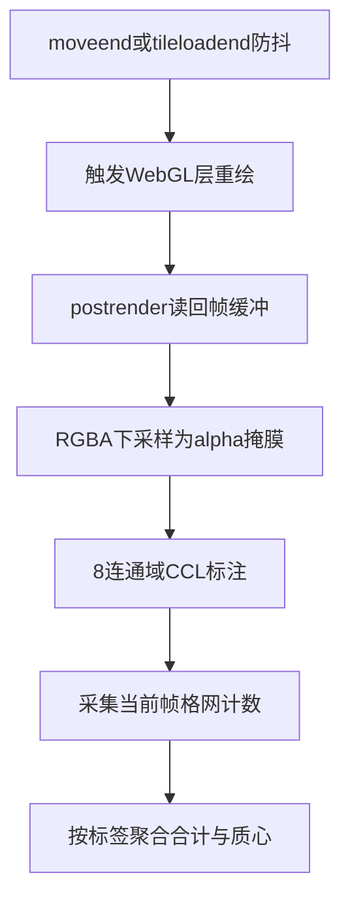
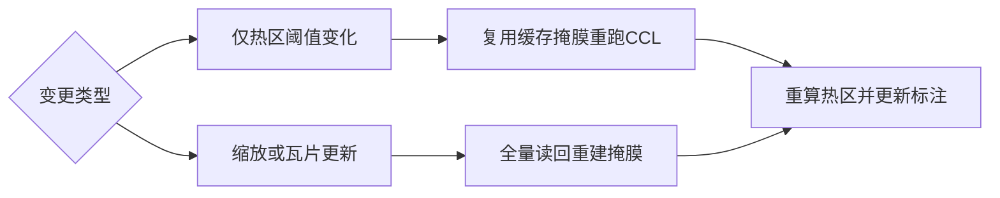
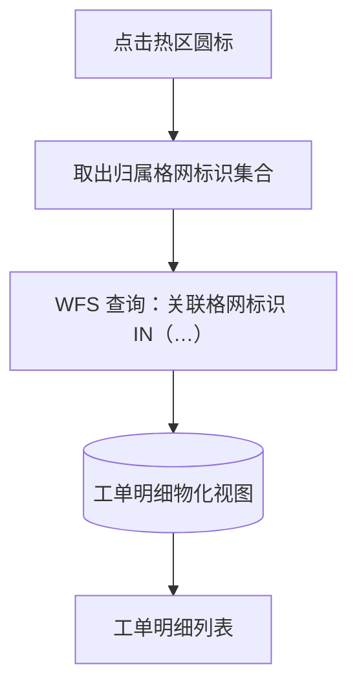

本篇是《百万级点数据：MVT + WebGL 热力渲染与 FBO 连通域热区工单统计》系列的第四篇（末篇），聚焦**前端（下）**：热力图画出来之后，如何把屏幕上「看起来热」的区域识别成可统计、可点击的热区。上一篇解决了「瓦片化热力怎么画」，本篇解决「画出来的热斑怎么标、怎么点」——在同一个 WebGL 热力层之上完成帧缓冲读回、连通域标注（CCL）、热区合计与质心计算、边界与圆标绘制，最终点击热区下钻到工单明细，与总览篇的端到端数据流闭环。

# 前端（下）：热区识别、计算与绘制

## 背景环境

本篇依赖如下组件，其它小版本需自行回归验证。

| 项 | 版本 / 说明 |
| --- | --- |
| **OpenLayers** | **10.6.1**，与上一篇锁定同一版本；本篇涉及的私有渲染结构使用点与该版本锁定，升级需逐项回归 |
| **WebGL 热力层** | 承接上一篇构建的自定义 `WebGLVectorTile` 子类（splat + gradient 全屏后处理）；本篇所有识别都发生在这一层产出的画面上 |

---

## 1. 识别：为什么用 FBO readback，而不是格网几何聚类

先明确「热区」到底是什么。一个直觉的误区是把它当成 GIS 对象：拿到格心坐标，做 DBSCAN 之类的空间聚类，把距离相近的格网归并成区。但用户看到的热区并不是格网点的邻接关系，而是 splat 晕染之后**屏幕上连成一片的亮斑**——两个格网中心可能隔了几个格距，只要半径够大、权重够高，晕染在像素上就是连通的；反过来，两个相邻格网权重都极低时，视觉上也构不成「热」。

所以本方案把热区定义为**像素级视觉对象**：把阈值划在 GPU 上色后的 alpha 上，对超过阈值的像素做连通域分割。这样识别出的每一片热区，边界与合计都严格对应用户屏幕上看到的那一块热斑，标注即所见。

这也解释了为什么识别必须承接上一篇的覆写：如果热力层没有通过 `postProcesses` 注入完成 gradient 上色，帧缓冲里就只有 splat 累加的原始 alpha，没有「与屏幕一致」的上色后语义；如果退回内置 Heatmap + 全量 `Vector` 源，又承载不了百万级格网的瓦片化规模。本篇的识别管线建立在上一篇覆写后的**同一个 WebGL 热力层**之上，而不是另起一套几何聚类。

| 对比维度 | 方案 A：格网几何聚类 | 方案 B：FBO readback + 像素掩膜（本方案） |
| --- | --- | --- |
| 热区定义 | 格心坐标的 GIS 邻接（距离 / 密度阈值） | 上色后 alpha 超过热区阈值的连通像素 |
| 与视觉一致性 | 聚类参数与 splat 半径、权重是两套体系，边界常与看到的热斑不符 | 掩膜与用户所见热斑同源，标注即所见 |
| 调参联动 | 调 splat 半径不影响聚类结果，需另调聚类参数 | 半径、模糊、透明度变化直接改变晕染，识别结果同步变化 |
| 合计归属 | 聚类簇内格网计数之和 | 连通域标签下格网计数之和，归属更贴合视觉边界 |

改造点：把识别对象从「数据」换成「画面」。原因：热区本来就是给用户看的，让识别与渲染共用同一套像素事实，比维护两套分立模型更可靠。

---

## 2. 承接上一篇覆写后的热区能力

热区识别不是 OpenLayers 的开箱能力，而是上一篇覆写链路在 CPU 侧的延伸。下表逐项说明「覆写 → 能力」的承接关系：

| 上一篇覆写 / 扩展 | 本篇由此得到的能力 | 说明（概念） |
| --- | --- | --- |
| `postProcesses` + gradient 上色 | **视觉一致的热区阈值** | 热区阈值作用在 postProcess 之后的 alpha 上，CCL 掩膜与用户所见热斑同源 |
| splat + 瓦片级 GPU 融合 | **连通域边界贴合晕染** | 热区轮廓来自像素域 8-连通，而非格网 Voronoi 或多边形并集 |
| MVT + `AsShaders` 权重 | **热区合计工单数** | 连通域内按标签聚合当前帧格网的格内工单数，与 splat 权重同源 |
| 同一 WebGL 热力层实例 | **缩放 / 筛选后标注与热力同步** | 平移缩放结束、瓦片到达触发重绘后重新识别；筛选切换先失效再刷新，时序与瓦片语义一致 |
| 掩膜缓存 + cpuOnly 路径 | **仅改阈值时快速重算** | 热区阈值调参可只重跑 CCL，不必重拉瓦片（依赖已捕获的 alpha 掩膜） |

上一篇解决「瓦片化热力怎么画」，本篇解决「画出来的热斑怎么标、怎么点」，二者共享同一个覆写后的 WebGL 层。如果只做格网中心点聚类而不走 postProcess alpha，识别结果就会与 splat 视觉脱节——用户看到的亮斑和系统认定的热区对不上。这是本系列坚持 FBO 掩膜路径的产品原因，而不是 OL API 演示。

---

## 3. 识别管线

从地图交互到热区统计结果，完整管线如下：



逐段说明。

**触发与防抖（trigger → render）**。平移缩放结束（`moveend`）与瓦片加载完成（`tileloadend`）都会调度一次识别，约 300ms 防抖，避免连续交互期间反复读回。调度成功时先标记「待读回」，并通知 WebGL 层重绘一帧。

**读回（render → readback）**。读回必须发生在图层的 `postrender` 之后——只有这一帧的 splat 加性混合与 gradient 上色都执行完，帧缓冲里的 alpha 才与屏幕所见一致。实现上是从渲染助手把 postProcess 之后的全屏 RGBA 读回 CPU 侧，并做 Y 轴翻转对齐屏幕坐标系（WebGL 原点在左下）。这是对 OL 私有渲染结构的又一个使用点，与上一篇的注入点一样锁定 10.6.1，此处不展开细节。

**掩膜（readback → mask）**。对全屏 RGBA 直接做连通域太贵，先下采样成长边不超过 512 的掩膜栅格，每个栅格单元取其覆盖像素块内**最大**的 splat alpha——宁可保留小热斑，也不让平均化把细窄的热连通冲淡。postProcess 输出是预乘 alpha，且整体透明度也乘在 alpha 通道上，因此读回的 finalAlpha 要先按整体透明度反推回 splat 累积 alpha，再按**热区阈值**二值化，得到布尔热像素栅格。

**连通域标注（mask → ccl）**。这一步是经典的 CCL（Connected Component Labeling，连通分量标记）问题：输入是阈值化后的二值掩膜，输出是一张同尺寸的 label 图——背景为 0，每片连通区域得到一个递增的整数标签（1, 2, 3…）。连通性取 **8-连通**（上下左右加四个对角），而不是 4-连通：高斯晕染斜向相连是常态，8-连通更贴合肉眼对「连成片」的判断。算法概念与实现思路可参考[炸鸡人博客《二值图像的连通域标记》](https://zhajiman.github.io/post/connected_component_labelling/)（Seed-Filling 与 Two-Pass 讲解）与[火山引擎开发者社区《连通域的原理与 Python 实现》](https://developer.volcengine.com/articles/7385112150811656242)（4/8 邻接概念）。本方案在浏览器侧用 BFS 实现，等价于 Seed-Filling 的 8 邻域蔓延：扫描到一个未标记的热像素即入队，逐层向外蔓延直到整片区域打满同一标签。掩膜长边只有 512，一次全图 BFS 的成本完全可控，不需要引入 OpenCV、scipy 这类图像库。

```ts
// CCL 概念伪代码：8-连通 BFS 种子填充
for (const pixel of raster) {
  if (!isHot(pixel) || labeled(pixel)) continue
  labelId += 1
  queue.push(pixel)
  while (queue.length) {
    const p = queue.pop()
    label[p] = labelId
    for (const n of neighbors8(p))       // 8 邻域
      if (isHot(n) && !labeled(n)) queue.push(n)
  }
}
// 输出：label 图（0 = 背景，1..N = 连通域标签）
```

**采集（ccl → collect）**。并行地，从当前帧的有效瓦片上采集每个格网的格心屏幕位置与格内工单数。这里的关键是「同一帧语义」：瓦片必须与 WebGL 当前渲染使用同一 sourceZ、同一筛选条件，否则筛选刷新后残留的旧瓦片会被重复计数。采集实现的瓦片过滤细节不展开，只需记住它与渲染共用瓦片事实。

**聚合（collect → aggregate）**。把每个格网单元的屏幕位置映射回掩膜栅格，取到它所属的连通域标签：同一标签下累加格内工单数得到**热区合计**；质心按格内工单数对地理坐标加权——工单更密的一侧会把圆标锚点拉向它，比几何中心更符合「热区重心」的直觉。某个标签下没有可用计数时（例如热斑中心恰好在瓦片边缘），回退到该标签首个栅格单元的屏幕中心再转地理坐标。最后丢弃无热像素或无计数的标签，按合计降序输出热区列表。

**性能分级**。管线有两条成本不同的路径，由变更类型决定：



只调热区阈值时，掩膜栅格本身不变，走 cpuOnly 捷径：复用缓存的 splatAlpha 栅格，仅重跑阈值化、CCL 与聚合，不读帧缓冲、不重拉瓦片，两条路径使用各自独立的防抖定时器，互不取消。缩放换档或瓦片更新时画面内容已变，必须走全量读回重建掩膜。

---

## 4. 绘制

识别结果有两类可视化产物：

| 能力 | 实现 | 为何 |
| --- | --- | --- |
| 热区工单数圆标 | `ol/Overlay` DOM，质心锚点 | 不随缩放变形；可点击下钻；DOM 便于做分档视觉与层叠控制 |
| 热区边界 | `ol/source/ImageCanvas` + Image 图层 | 像素级贴合晕染边界；随视口缓存与重绘（见 §5） |

**圆标**。每个热区一个 DOM 圆标，锚定在加权质心上，中心数字为热区合计。视觉按合计的十进制位数分档：位数越多圆越大、字号越大；颜色直接采样自同一条热力色带的高亮区段，让圆标与热斑视觉同源——用户看到「红得发紫」的热斑上压着同色系的大数字，认知成本最低。选中某个热区时用加深底色的高亮圆标替换普通圆标。

**边界**。把连通域标签大于 0 的栅格单元轮廓描成阶梯形白色边线，叠加在热力层之上，勾勒出每片热区的外轮廓。为什么这条边界不用矢量面而要用 `ImageCanvasSource`，值得单独一节用 OL 源码说明。

---

## 5. 为什么用 ImageCanvasSource 绘制热区边界

**OL 源码行为**。`ol/source/ImageCanvas.js` 要求传入一个 `canvasFunction(extent, resolution, pixelRatio, size, projection)`：每当图层需要影像时，OL 按当前视口（经 `ratio` 放大）调用它，由它返回一张画好的 canvas。返回结果被 source 缓存——revision 未变、resolution 与 pixelRatio 相同、且缓存 canvas 的 extent 包含本次请求 extent 时直接复用；任何一个条件不满足就重新回调 `canvasFunction`。若 canvas 内容本身变了（例如重新识别出新的标签栅格），则要显式调用 `changed()` 使缓存失效。`interpolate` 控制影像重采样是否线性插值，默认开启。

**本方案缺口**。热区边界是**像素掩膜的阶梯形轮廓**，不是预定义的矢量多边形。splat 晕染的边界天然在像素级：若把掩膜轮廓矢量化成 Polygon，要么轮廓追踪加顶点简化导致边界失真，要么保留全部折点导致几何动辄数千顶点、每次识别都要重建，成本与收益完全不对等。

**选型**。捕获时刻（CCL 完成时）把标签大于 0 的栅格单元四角通过 `getCoordinateFromPixel` 转成地理坐标，得到一批**地理锚定的四边形**；`canvasFunction` 内再把这些四边形映射回当前 canvas 的像素坐标，只描「与上下左右邻居标签不同」的外边，连成阶梯形轮廓：

```ts
// canvasFunction 概念伪代码：按当前视口重绘地理锚定的阶梯边界
function canvasFunction(extent, resolution, pixelRatio, size, projection) {
  const canvas = createCanvas(size)
  for (const cell of geoCells) {            // 捕获时刻生成的地理锚定栅格
    const quadPx = cell.quad.map(toCanvasPx) // 地理坐标 → 当前 canvas 像素
    strokeOuterEdges(quadPx, cell.labelId)   // 仅描与邻居标签不同的边
  }
  return canvas
}
```

因为四边形是地理锚定的，地图平移、缩放时 OL 会按新的 extent 与 resolution 重新回调 `canvasFunction`，同一批栅格被重新投影绘制，边界自然与热力跟手；同时把 `interpolate` 关掉，让重采样保持最近邻，维持像素级的阶梯感而不是被插值糊成软边。

| 对比维度 | 方案 A：Vector 多边形 | 方案 B：ImageCanvas（本方案） |
| --- | --- | --- |
| 边界贴合度 | 需把像素掩膜矢量化（轮廓追踪 + 简化），易失真 | 像素级阶梯边界，与晕染天然一致 |
| 更新成本 | 每次识别重建矢量几何，顶点多时昂贵 | 重绘 canvas 描边，成本随栅格规模线性 |
| 视口跟随 | 矢量地理锚定，跟随免费 | 需维护捕获时刻的地理锚定；OL 缓存机制按 extent 自动重绘 |
| 交互能力 | 可做要素级选中、编辑 | 纯展示，命中交互交给 Overlay 圆标 |

热区边界是纯展示要素，不需要矢量交互；用 ImageCanvas 以最小的结构换来像素级贴合与免费的重绘调度，是这个场景下的合理选择。

---

## 6. 其他难点

**sourceZ 与筛选条件对齐**。OL 为 overzoom 会选择一个源级 z（sourceZ），统计采集的瓦片必须与 WebGL 当前帧渲染的瓦片同 sourceZ、同筛选条件；否则缩放换档或筛选刷新的瞬间，旧瓦片上的格网会被重复计数，热区合计虚高。这与上一篇「每帧重绘有效瓦片集」的语义同源：统计不能自己另搞一套瓦片视图，必须跟随渲染使用的同一瓦片事实。

**筛选切换后标注短暂归零**。筛选条件变化时，管线先主动失效：清空圆标、边界与统计数字，避免旧标签指向新数据；随后瓦片源刷新，新瓦片到达并完成渲染后再重新识别，标注恢复。这段「先归零再恢复」是预期时序而非缺陷——与其展示与新筛选不匹配的旧热区，不如短暂清空。还有一个容易漏掉的兜底：新瓦片全部命中缓存时不会触发瓦片加载事件，需要再以渲染完成事件补一次调度，否则标注会一直停在归零态。

**Overlay 层叠顺序**。圆标、高亮、定位闪烁三类标注同处地图 Overlay 容器，靠固定的层级带避免互相遮挡：普通圆标在底层；选中热区的高亮圆标抬升一层，压过邻近普通圆标；从工单列表触发的定位闪烁标记最高，且为纯展示、不拦截地图交互。

---

## 7. 热区点击查询：回扣数据层

热区圆标不只是展示，还是下钻入口。点击某个圆标时，聚合阶段已经收集好该热区归属的全部格网标识，直接发起一次 WFS 查询：



两个设计要点。

第一，**查询不重复携带筛选维度**。与第二篇的契约一致：热区点击 WFS 只按 `关联格网标识 IN (...)` 查询，不再附带事项专题、业务场景、发生年份、所属区县的 ECQL——当前这片热区的几何本身就是筛选生效后的产物，筛选已经在 MVT 层体现过了，回带四维度既冗余又容易因口径不一致查空。数据量上先以一次小分页请求探出总数，再一次拉齐，避免盲拉超大结果集。

第二，**这条路径为什么成立，要回到第一篇**。工单明细物化视图物化了「关联格网标识」列并为其建了索引，正是为这条 `IN` 反查准备的；格网标识在格网聚合物化视图刷新后保持稳定，热区合计来自 MVT 的格内工单数，明细来自 WFS——两种数据各走最优通道，又靠同一个稳定标识对齐。至此，总览篇的端到端数据流完整闭环：源业务表 → 双物化视图 → MVT 热力 + WFS 明细 → WebGL 渲染 → FBO 连通域热区 → 点击回到明细。

---

## 小结

- 热区是屏幕像素级的视觉对象：识别走「读回帧缓冲 → 下采样掩膜 → 8-连通域标注 → 聚合合计与质心」，标注即所见，这是它相对格网几何聚类的核心价值。
- 全部能力承接上一篇的覆写：没有 postProcess 上色后的 alpha，就没有视觉一致的热区阈值；识别与渲染共享同一个 WebGL 热力层。
- 热区边界用 `ImageCanvasSource` 绘制地理锚定的阶梯轮廓，随视口缓存与重绘；圆标用 `ol/Overlay` 锚在加权质心，按合计位数分档视觉。
- 统计必须与渲染对齐同一 sourceZ、同一筛选条件；筛选切换后的「先归零再恢复」是预期时序。
- 点击下钻只携带归属格网标识集合，依赖数据层双物化视图设计——「百万级点数据 → 热力 → 热区 → 明细」的链路至此闭环。

---

## 系列导航

- 总览：[百万级点数据：MVT + WebGL 热力渲染与 FBO 连通域热区工单统计](https://www.cnblogs.com/zheyi420/p/22182243)
- 上一篇：[03-前端-热力图WebGL渲染管线](https://www.cnblogs.com/zheyi420/p/22182345)

---

## References

- [二值图像的连通域标记（炸鸡人博客）](https://zhajiman.github.io/post/connected_component_labelling/)
- [连通域的原理与 Python 实现（火山引擎开发者社区）](https://developer.volcengine.com/articles/7385112150811656242)
- [ol/source/ImageCanvas.js（v10.6.1）](https://github.com/openlayers/openlayers/blob/v10.6.1/src/ol/source/ImageCanvas.js)
- [ol/Overlay.js（v10.6.1）](https://github.com/openlayers/openlayers/blob/v10.6.1/src/ol/Overlay.js)
- [ol/source/VectorTile.js（v10.6.1）](https://github.com/openlayers/openlayers/blob/v10.6.1/src/ol/source/VectorTile.js)
