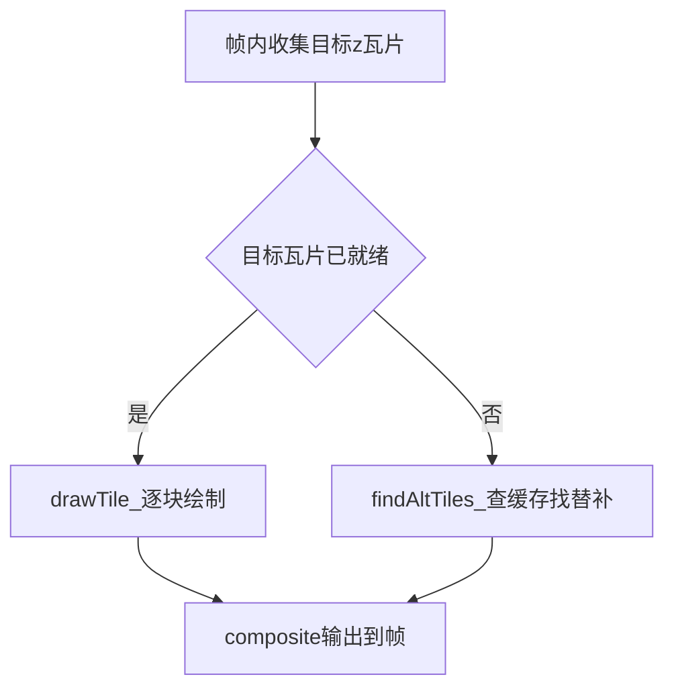
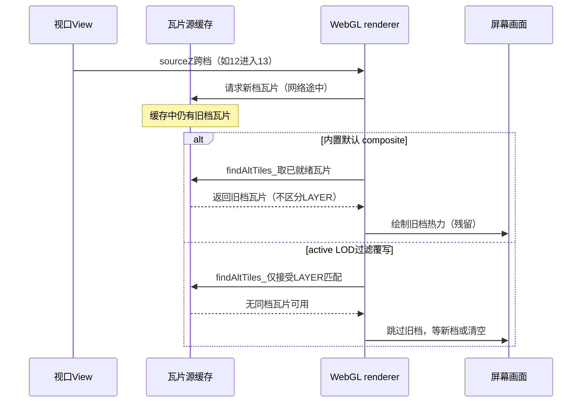
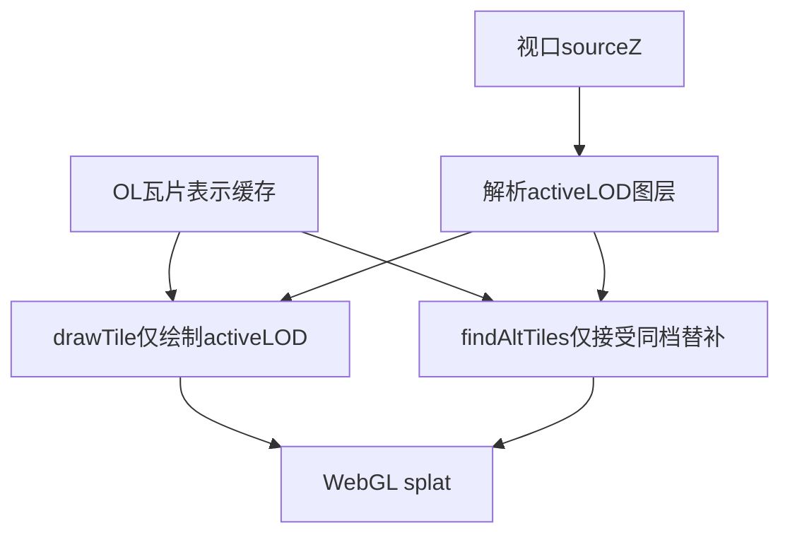

本篇是《百万级点数据：MVT + WebGL 热力渲染与 FBO 连通域热区工单统计》系列的第四篇，聚焦**前端（中）**：三格网 LOD 下，三档图层的瓦片会同时缓存在同一个 `VectorTileSource` 里；OpenLayers 默认的瓦片 composite 并不区分瓦片属于哪一档，缩放跨档时会继续绘制**旧档位瓦片**，导致热力画面与热区标注出现**旧档位残留**。本篇说明为什么必须覆写 `WebGLVectorTileLayerRenderer` 的 `findAltTiles_` / `drawTile_`，让每一帧只 composite 与 active LOD 一致的瓦片。

# 前端（中）：矢量瓦片 Renderer 覆写与 LOD composite

## 背景环境

本篇依赖如下组件，其它小版本需自行回归验证。

| 项 | 版本 / 说明 |
| --- | --- |
| **OpenLayers** | **10.6.1**，与[第三篇](https://www.cnblogs.com/zheyi420/p/22182345)锁定同一版本；本篇覆写的 renderer 私有结构（`tileRepresentationCache`、`findAltTiles_` / `drawTile_`）与该版本锁定，升级需逐项回归 |
| **WebGL 热力层** | 承接第三篇构建的自定义 `WebGLVectorTile` 子类（splat + gradient 全屏后处理）；瓦片源按 `sourceZ` 在三档格网图层间选层（见[第二篇](https://www.cnblogs.com/zheyi420/p/22182306) §9） |

---

## 1. OL 源码行为：TileLayerBase 如何 composite 瓦片

先看 OL 源码行为。`ol/layer/WebGLVectorTile.js` 创建的 `WebGLVectorTileLayerRenderer` 继承自 `ol/renderer/webgl/TileLayerBase.js`。TileLayerBase 为每帧渲染维护一张 **`tileRepresentationCache`**（LRU 缓存）：加载完成的瓦片会以「可绘制表示」（tile representation）的形式进入缓存，等待被帧绘制取用。

关键点在缓存键的组成：**source 标识 + source 版本号 + 瓦片 z/x/y**。注意其中**没有瓦片 URL**，自然也没有 URL 里的 `LAYER` 参数——从缓存的视角看，所有瓦片都属于「同一个 source」。

每帧绘制分两条路径：

- **当前档瓦片**：目标 z 上已就绪的瓦片，逐块经 `drawTile_` 绘制；
- **替补瓦片**：目标瓦片未就绪时，`findAltTiles_` 会先向下一级（z+1 的子瓦片）、再向上一级（z-1 的父瓦片）在缓存中查找已就绪的表示，拿来兜底绘制，避免白屏或空洞。

这套机制对「单图层瓦片源」完全正确：缓存里的瓦片都属于同一图层，任何替补都比空白强。

## 2. 本方案缺口：三格网 LOD 共用 VectorTileSource

本方案的现实不同：三档格网图层共用**同一个** `VectorTileSource`，`tileUrlFunction` 只是按 `sourceZ` 改写 URL 里的 `LAYER` 参数（见第三篇 §3）。在 OL 眼里这些瓦片同属于一个 source，缓存键只认 z/x/y——于是缓存里可以同时躺着细格网与中格网两套瓦片，而默认 composite **不区分它们属于哪一档**。

缺口在缩放跨档的瞬间暴露。视口从 `sourceZ 12`（中格网）进入 `13`（细格网）时，新档瓦片还在网络途中，OL 的兜底逻辑会从缓存里捞出**上一档已加载的瓦片**继续绘制。对普通瓦片图层，这是「模糊一点但不出戏」的正确策略；对本方案却不行——splat 是加性混合，粗格网与细格网的空间分布本就不同，屏幕上呈现的是**旧档位热力残留**；而热区识别（[第五篇](https://www.cnblogs.com/zheyi420/p/22182374)）读取的正是这张画面，旧档残留会一并带进标注。

这里必须把问题性质说准：这是「**旧档位内容在切换窗口期残留**」，不是「同一数据被画了两次」。格网计数的采集路径与 renderer 走同一套 URL 过滤（见 §4），不存在重复累计格内工单数的问题；本篇要解决的是**画面与新档位不一致的时序窗口**。

| 维度 | 内置 OL composite | active LOD 过滤覆写 |
| --- | --- | --- |
| 多 LAYER 缓存 | 缓存键不含 URL，不区分瓦片属于哪一档 | 按瓦片 URL 的 `LAYER=` 与当前 `sourceZ` 判定档位 |
| LOD 切换瞬间 | 旧档瓦片作为替补继续绘制，热力呈旧档分布 | 旧档不进入绘制；等新档瓦片到达，或保持清空 |
| 热区合计采集 | （若不做同一过滤，统计与画面错位） | 与 renderer 共用同一套 active LOD 判定 |
| 问题归因 | — | **旧档位残留**，而非格网计数重复累计 |

切换窗口期内两种行为的差异如下：

## 3. 覆写方案：findAltTiles_ / drawTile_ 过滤 active LOD

概念做法分四步（概念级描述，不展开实现类名）：

1. 自定义 renderer **子类**继承 `WebGLVectorTileLayerRenderer`，只覆写两个方法：`findAltTiles_` 与 `drawTile_`。
2. 对每块待参与绘制的瓦片先解析它的实际请求 URL：OL 的瓦片渲染对象（`VectorRenderTile`）经 `getSourceTiles()[0].getTileUrl()` 拿到源瓦片 URL。
3. 用「URL 的 `LAYER=` 参数」与「当前视口 `sourceZ` 应对的档位」比对，一致才允许进入 composite：`drawTile_` 对不匹配的瓦片直接跳过；`findAltTiles_` 只把**同档**的替补瓦片加入查找表。
4. 当前档没有任何可绘制瓦片时，下游 UI（第五篇的热区圆标、边界、高亮等）清掉旧内容，但帧缓冲重算照常继续——宁可短暂无标注，也不显示与新档位不符的旧标注。

效果上，缓存层面三档并存（来回缩放零成本复用），绘制层面任何时刻只有一档。splat 的加性混合语义保持不变——只是参与混合的瓦片集合被严格限定在当前档。

## 4. 与统计路径的对齐

renderer 的这套过滤语义并非独享。第五篇的热区合计采集使用**同一套**「`LAYER=` + `sourceZ` + 当前 CQL」判定来挑选参与统计的瓦片：画面画哪档、统计算哪档、URL 请求哪档，三者始终一致。这也是本方案把「跨档不 purge 缓存」作为前提仍能成立的原因——缓存可以混，绘制与统计不能混。

---

## 小结

- OL 的瓦片表示缓存键不含 URL，默认 composite 不区分多档图层；三格网 LOD 共用同一瓦片源时，必须自行过滤。
- 只需覆写 `findAltTiles_` / `drawTile_` 两个点，即可把每帧 composite 限定在 active LOD；问题的正确表述是**旧档位热力与标注残留**，不是计数虚高。
- 当前档无瓦片时下游标注清空、重算继续，保证标注与画面始终同档。
- 该覆写与第三篇的 `postProcesses_` 注入一样依赖 OL 私有结构，锁定 OpenLayers 10.6.1，升级须回归 `TileLayerBase` 的相关实现。
- 画面侧就绪后，下一篇解决「画出来的热斑怎么标、怎么点」：在同一 WebGL 层之上做 FBO readback、连通域识别与点击下钻。

---

## 系列导航

- 总览：[百万级点数据：MVT + WebGL 热力渲染与 FBO 连通域热区工单统计](https://www.cnblogs.com/zheyi420/p/22182243)
- 01：[数据层：双物化视图与三格网 LOD](https://www.cnblogs.com/zheyi420/p/22182285)
- 02：[服务层：MVT 瓦片与按需明细查询](https://www.cnblogs.com/zheyi420/p/22182306)
- 03：[前端：热力图 WebGL 渲染管线](https://www.cnblogs.com/zheyi420/p/22182345)
- 04：[前端：矢量瓦片 Renderer 覆写与 LOD composite](https://www.cnblogs.com/zheyi420/p/22699358)
- 05：[前端：热区识别、计算与绘制](https://www.cnblogs.com/zheyi420/p/22182374)

---

## References

- [ol/renderer/webgl/TileLayerBase.js（v10.6.1）](https://github.com/openlayers/openlayers/blob/v10.6.1/src/ol/renderer/webgl/TileLayerBase.js)
- [ol/renderer/webgl/VectorTileLayer.js（v10.6.1）](https://github.com/openlayers/openlayers/blob/v10.6.1/src/ol/renderer/webgl/VectorTileLayer.js)
- [ol/layer/WebGLVectorTile.js（v10.6.1）](https://github.com/openlayers/openlayers/blob/v10.6.1/src/ol/layer/WebGLVectorTile.js)
- [ol/source/VectorTile.js（v10.6.1）](https://github.com/openlayers/openlayers/blob/v10.6.1/src/ol/source/VectorTile.js)
