# MVT WebGL 热力图 + 连通域热区（CCL）— 博客合集 Agent 指南

本目录存放**独立技术博客系列**，记录「海量点数据 → 三格网 LOD 预聚合 → MVT 矢量瓦片热力 → GPU splat 渲染 → WebGL renderer LOD composite → FBO 热区识别（CCL）→ 点击获取热区工单明细」的端到端方案。

**目标**：读者或其他公司的 AI / Agent 阅读本合集后，能据此拆解实施计划、编写操作手册，并结合自身项目实现前端核心能力。**不要求**复制粘贴任何特定仓库代码。

---

## 1. 合集元信息

### 1.1 定位


| 阶段 | 能力 |
| --- | --- |
| 数据 | 每业务数据源：**三格网**格网聚合物化视图（5m / 100m / 300m）+ 工单明细 MV；源数据更新后有明确刷新顺序 |
| 服务 | 每数据源 **3 个 MVT 图层**（LOD 组）+ GWC WMTS + **MVT GetTile 输出属性裁剪**（PBF 仅格内工单数 + 格网标识 fid）+ WFS（按需明细）；HTTP **gzip** 压缩传输（与属性裁剪、LOD **互补**，不写 Tomcat/nginx SOP） |
| 前端（渲染） | `tileUrlFunction` 按 `sourceZ` 选 LOD 图层 + 自定义 WebGL 矢量瓦片层 + splat shader + gradient 后处理 |
| 前端（LOD composite） | 自定义 `WebGLVectorTile` **renderer 子类**，override `findAltTiles_` / `drawTile_`，仅 composite **active LOD** 瓦片，避免 LOD 切换时 **旧档位热力/热区标注残留** |
| 前端（热区） | FBO readback → 8-连通域标注（CCL）→ Overlay / ImageCanvas 绘制 → 热区点击 WFS；格网 cnt 采集同样按 active LOD URL 过滤（**非**重复累计问题） |


**CCL（Connected Component Labeling，连通分量标记 / 连通域标注）**：热区识别本质是对 GPU 上色后的 alpha 掩膜做像素级连通域分割。写作时可引用**中文讲解类**文章说明算法概念，推荐：

- 主引用：[二值图像的连通域标记（炸鸡人博客）](https://zhajiman.github.io/post/connected_component_labelling/) — Seed-Filling（BFS/DFS）、Two-Pass、8 邻域、标签图语义，与浏览器侧 BFS 实现最贴近
- 辅引用：[连通域的原理与 Python 实现（火山引擎开发者社区）](https://developer.volcengine.com/articles/7385112150811656242) — 4 邻接 vs 8 邻接概念、两遍扫描与种子填充法概览


### 1.2 目标读者（仅 Agent 内化，勿写入正式博文）

下列读者画像供 Agent 调整各篇深度、侧重点与术语粒度；**正式博文正文不写**「面向 xxx 读者」类表述。

- 架构师 / GIS 工程师：理解数据与服务分工、选型依据
- 前端工程师（OpenLayers + WebGL）：实现渲染管线与热区识别绘制


### 1.3 写作目标

- **讲透彻**：多用 mermaid 流程图、架构图、对比表；少贴大段源码
- **可复用**：抽象业务字段、泛化技术名词；读者换库换库表仍能套用思路
- **有依据**：凡未使用 OpenLayers 开箱能力之处，须结合 `ol/`* 源码说明「为何不能直接用、如何扩展」

#### 1.3.1 流程 / 管线 / 数据流须配 mermaid（硬性）

凡正文**讲解、拆解或对比**下列内容，**必须**在同节或紧接其后配 **mermaid** 图（`flowchart TB/LR`、`sequenceDiagram` 等），**禁止**仅用纯文字段落或列表代替图示：

| 类型 | 典型场景（本系列） | 图示要求 |
| --- | --- | --- |
| **数据流** | 端到端主路径、双查询路径、源表 → 物化视图 → 瓦片/WFS、跨层数据如何流动 | `flowchart`；节点写抽象角色（如「格网聚合物化视图」「MVT 瓦片服务」），勿绑真实图层名 |
| **管线** | WebGL 渲染管线（瓦片 → splat → gradient）、FBO readback + CCL 识别管线、查询层 vs 输出层 | 按阶段/模块串联；可与数据流分图，不可省略 |
| **流程** | 物化视图刷新顺序、热区点击下钻、瓦片请求与重绘触发、CQL 变更后的刷新链 | 体现**先后**或**分支**；必要时用 `sequenceDiagram` |

**执行要点**：

- 章节标题或正文出现「数据流」「管线」「流程」「链路」「路径」「从…到…」「刷新顺序」「请求路径」等且描述**步骤、阶段或跨组件传递**时，视为触发本规则。
- 一节若同时涉及多种（如总览的端到端数据流 + 分层架构），可用多张 mermaid，或一张图覆盖主路径；**不得**只写文字无图。
- 全系列仍保持每篇 **≥2 张** mermaid（见 **§4**、**§6**、**§8**）；本规则是在此基础上的**下限加强**：凡属流程/管线/数据流叙述，该段**必须有图**。
- **对比表、索引示意、覆写对照表**不可替代流程类 mermaid；表与图可并存。
- mermaid 节点标签遵守 **§1.7**（如客户端层用「前端」、`subgraph` 勿写「浏览器」）。

### 1.4 Dev-Wiki 惯例

- 博文以 **Markdown** 存于本目录；系列配图放 `[assets/](./assets/)`（按需创建）
- **链接分工**（勿混用）：
  - **本 `AGENTS.md` 及仓库内维护**：合集内交叉引用使用 Dev-Wiki **项目相对路径**（以 `/Blog/mvt-webgl_heatmap-ccl/…` 开头），例如 `[/Blog/mvt-webgl_heatmap-ccl/01-数据层-双物化视图与三格网 LOD.md](/Blog/mvt-webgl_heatmap-ccl/01-数据层-双物化视图与三格网 LOD.md)`
  - **各篇正式博文正文**（`00–05` 的 `.md`）：系列内交叉引用、系列导航表使用 **博客园线上 URL**（见 **§1.5**「线上」列）；正文**勿**写 Dev-Wiki 路径
  - **配图**：存 `./assets/`，本目录内各 `.md` 引用图片使用 **相对路径** `./assets/文件名.png`，例如 ``；**勿**对配图使用 `/Blog/mvt-webgl_heatmap-ccl/assets/…` 绝对路径
- **配图清单（Agent 内化）**：各篇实拍/复用配图明细见 [`配图清单.md`](/Blog/mvt-webgl_heatmap-ccl/配图清单.md)（**03 篇**见 **§8**；插入位置、图注文案、U1–U4 / D1–D2 编号以清单为准）
- 勿使用 Obsidian `[[wikilink]]` 语法


### 1.5 系列目录（6 篇）


| 序号 | 文件名（Dev-Wiki） | 线上（博客园） | 标题方向 |
| --- | --- | --- | --- |
| 00 | `[百万级点数据：MVT + WebGL 热力渲染与 FBO 连通域热区工单统计.md](/Blog/mvt-webgl_heatmap-ccl/百万级点数据：MVT + WebGL 热力渲染与 FBO 连通域热区工单统计.md)` | https://www.cnblogs.com/zheyi420/p/22182243 | 总览；**副标题/正文**点出主验证约 **三百万** 点数据与三格网 LOD；端到端架构、选型表、各篇导航 |
| 01 | `[01-数据层-双物化视图与三格网 LOD.md](/Blog/mvt-webgl_heatmap-ccl/01-数据层-双物化视图与三格网 LOD.md)` | https://www.cnblogs.com/zheyi420/p/22182285 | 双 MV + **三格网 MV 族**（每精度一档）；格网标识与索引；源数据更新后的刷新顺序（正文章节，非标题） |
| 02 | `[02-服务层-MVT瓦片与按需明细查询.md](/Blog/mvt-webgl_heatmap-ccl/02-服务层-MVT瓦片与按需明细查询.md)` | https://www.cnblogs.com/zheyi420/p/22182306 | 三格网 LOD 发布；`sourceZ` 阈值；查询层 vs 输出层；**MVT 属性裁剪**；§11 MVT HTTP gzip（篇幅：一段技术陈述，无运维 SOP）；双业务数据集（篇幅：1–2 句抽象契约）；MVT/WFS 分工 |
| 03 | `[03-前端-热力图WebGL渲染管线.md](/Blog/mvt-webgl_heatmap-ccl/03-前端-热力图WebGL渲染管线.md)` | https://www.cnblogs.com/zheyi420/p/22182345 | 不用内置 Heatmap；postProcesses / AsShaders；**tileUrlFunction LOD 选层**；**§3.1** 视口快照 / 掩膜计算边界；§4 每帧重绘 / 筛选 `refresh()`；**§4.1** 同 LOD 缩放、`TILEMATRIX` 升级与短暂直缝；§5.1–5.3 权重/调参/销毁；**7 处配图**（见 §6 / 配图清单 §8，含 `掩膜计算边界.jpg`）；**不含** renderer 覆写 |
| 04 | `[04-前端-矢量瓦片Renderer覆写与LOD-composite.md](/Blog/mvt-webgl_heatmap-ccl/04-前端-矢量瓦片Renderer覆写与LOD-composite.md)` | https://www.cnblogs.com/zheyi420/p/22699358 | **`TileLayerBase` 三段论**：`findAltTiles_` / `drawTile_` active LOD 过滤；避免旧档位热力/热区标注残留 |
| 05 | `[05-前端-热区识别、计算与绘制.md](/Blog/mvt-webgl_heatmap-ccl/05-前端-热区识别、计算与绘制.md)` | https://www.cnblogs.com/zheyi420/p/22182374 | 承接 03+04；FBO+CCL；ImageCanvas 边界；热区点击与双 MV；active LOD 统计对齐 |


**本次 Agent 任务边界**：仅维护本 `AGENTS.md`；各篇 `.md` 正文由后续迭代撰写。


### 1.6 本系列验证环境（背景环境基准）

实现向博文（**01–05**）正文**开篇**（导语或第一章之前）须列出**本篇所依赖**的运行环境与版本，避免读者误用文档或 API。**00** 篇给出下表**全集**；后续各篇仅复述与本篇相关的子集。

| 组件 | 本系列验证/锁定值 | 博文写法 |
| --- | --- | --- |
| **PostgreSQL** | 关系型库（版本以部署为准） | **01** 篇必写；说明需 **PostGIS** 扩展 |
| **PostGIS** | 空间扩展（物化视图、`ST_*` 格网聚合） | 与 PostgreSQL 同节列出；**不写**连接串 |
| **GeoServer** | **2.24.x**（实现环境 **2.24.2**；文档见 **§2.2.1**） | **02** 篇必写；可注明 Vector Tiles 扩展 |
| **GeoWebCache** | 随 GeoServer 2.24.x | **02** 篇与 GeoServer 同节 |
| **OpenLayers** | **10.6.1**（与 **§5** 锁定一致） | **03**、**04**、**05** 篇必写 |
| **宿主地图 CRS** | 与实现一致，**不写死** EPSG 代号 | **03** 篇可一句带过「GridSet 与 view CRS 对齐」 |

**原则**：

- 写**验证过的主版本**（如 OL `10.6.1`、GeoServer `2.24.2`），并注明「其它小版本需自行回归」；
- PostgreSQL/PostGIS 若无统一小版本号，写 **「PostgreSQL + PostGIS（需支持物化视图与空间函数）」**，勿编造 PG 15/16 等未在仓库文档固化的数字；
- **禁止**宿主机 IP、容器名、连接串（延续 **§2.1**）。

**开篇 Markdown 模板**（Agent 复制到各篇正文最前，仅列本篇相关行）：

```markdown
## 背景环境

| 项 | 版本 / 说明 |
| --- | --- |
| … | 仅列本篇相关组件 |
```

**各篇开篇须列范围**：

| 篇 | 开篇须列 |
| --- | --- |
| **00** | **全集**基准表（上表完整 + 一句「后续各篇仅复述本篇相关子集」） |
| **01** | PostgreSQL、PostGIS；物化视图能力前提 |
| **02** | GeoServer 2.24.x（2.24.2）、GWC、MVT Vector Tiles 扩展；PostGIS 为数据源（一句） |
| **03** | OpenLayers 10.6.1；WebGL 矢量瓦片相关能力前提 |
| **04** | OpenLayers 10.6.1（与 03 一致）；`TileLayerBase` renderer 覆写前提 |
| **05** | OpenLayers 10.6.1（与 03、04 一致）；可注明依赖同一 OL 版本 |

### 1.7 正式博文文体与用语（Agent 内化）

下列约定来自总览篇撰写与人工修订；**全系列 00–05 正文须遵守**。Definition of Done（**§8**）仅用于 Agent 写完对照自检，**勿**在正式博文文末附 DoD checklist。

| 主题 | 要求 |
| --- | --- |
| **篇序表述** | 00 称「**总览篇**」，勿写「第 0 篇」 |
| **目标读者** | 见 **§1.2**，仅 Agent 内化；正文导语与章节**不出现**受众描述 |
| **点数据用语** | 泛指海量地理点要素时用「**点数据**」，勿写「工单点」。业务记录仍可称「工单」「工单明细」「格内工单数」等抽象字段名 |
| **实现字段名** | 博文正文**禁止** `cnt`、`grid_id` 等实现侧列名/字段名；须用「格内工单数」「格网标识」「格网计数」等抽象名。AGENTS/DoD 内化短语「非 cnt 虚高」仅作 Agent 对照，**不得**写入博文正文 |
| **数据规模** | 总览**主标题/文件名仍用「百万级」**；正文/副标题可写「当前方案验证规模约**三百万**条点数据」。Agent 内化主案例为**三百万级**；；格网 MV 行数情况为细（50万）、中（35万）、粗（20万），**不写**精确行数 |
| **双业务数据集** | 总览/02 可各 **1–2 句**抽象「多套三格网 MVT + WFS，前端可切换业务数据集」；**不写**切换 UI / 宿主细节 |
| **renderer 缺口表述** | **勿**将 WebGL renderer 覆写缺口写成「重复 splat / cnt 虚高」；正确叙事为 LOD 切换时 **旧档位热力/热区标注残留**（见 **§4.4**） |
| **缩放/刷新/LOD 四分边界** | 须区分：**同 LOD 缩放** → `TILEMATRIX` 升级、新切片未 ready 时的**短暂瓦片直缝**（03 **§4.1**，非 splat 错误）；**筛选变更** → `source.refresh()` 重拉（03 §4）；**跨 LOD 阈值** → 旧档位 composite **残留**（04 专讲）；**缩小/平移动画中** → GPU 热力每帧重绘 vs 热区标注/边界沿用**上一份 FBO 视口快照**（03 **§3.1**，`moveend` 后重算对齐，**非**故障排查段落）。**勿**混写为 cnt 虚高或 FBO 增量合并失败 |
| **热区与缩放** | 交互**结束后**（`moveend` / 瓦片齐备）热区 CCL 与热力对齐更新；**缩放动画过程中**可短暂出现热力已扩、圆标/边界仍限上一快照（03 **§3.1**）。**勿**称热区为「中观」能力，**勿**写「放大后识别热区」 |
| **产品比例尺互斥** | 默认**勿**在系列博文写视口蓝标/点位互斥、自动开关等宿主产品策略（见 **§2.3**）。**例外**：**01 §6.2** 为论证「仅细格网关联、单工单明细 MV」，**允许**写热区点击比例尺门槛（视图 **≥ 1:20000**）及该比例尺下与**细格网（5m）** LOD 的对齐关系 |
| **三层命名** | 分工表与架构叙述用「**数据 / 服务 / 前端**」；勿用「浏览器」作为分层名称。mermaid `subgraph` 客户端层标签用 `前端`。运行环境偶可写「地图客户端」 |
| **选型对比表** | 列名用「**方案 A / 方案 B**」，选择列写「**方案 B**」；总结段用「**改造点**」「**原因**」，勿写「一句话」 |
| **总览·数据层叙述** | 「将三百万级点数据作**三格网**格网聚合、减列，得到适合热力图、数据量尽可能小的物化视图族」 |
| **总览·前端层叙述** | 「负责按 LOD 读取、解析、热力渲染、renderer 过滤 composite、热区连通域识别与交互」 |
| **流程 / 管线 / 数据流配图** | 见 **§1.3.1**：凡讲解流程、管线、数据流（含端到端路径、刷新顺序、渲染/识别管线、双查询路径等），**必须**同节配 mermaid；禁止纯文字代替 |
| **禁止元写作入正文** | 见 **§1.7.1**；篇幅/编辑指令（如「gzip 传输一句」「不写运维细节」）**不得**出现在 00–05 正文 |

### 1.7.1 禁止元写作入正文（Agent 内化）

下列约定**仅**供 Agent / DoD / 配图清单内化；**00–05 正文禁止**出现同类表述。

| 类别 | Agent 内化（AGENTS / DoD / 配图清单） | 博文正文（00–05） |
| --- | --- | --- |
| 篇幅/编辑指令 | 「gzip 传输一句」「双数据集一句」「不写 Tomcat/nginx SOP」「不写 UI/宿主细节」 | **禁止**；改为直接写技术事实或链到对应篇 |
| 否定式写作合约 | 「不写运维细节」「勿写…」「不写…」作为对读者的说明 | **禁止** |
| 读者向指路 | — | **允许**：「详见 02 篇」「留给下一篇」「此处不展开实现细节」当且仅当是在说明**阅读范围或技术边界**，而非交代作者没写多少 |

**自检**：正文 grep 不应出现 `不写运维`、`gzip 传输一句`、`不写具体 UI` 等 Agent 短语；导航表「本篇解决什么」列用读者向技术摘要，勿抄 DoD 篇幅用语。

---

## 2. 写作禁区与独立性契约


### 2.1 禁止出现


| 类别   | 禁止内容                                                     |
| ---- | -------------------------------------------------------- |
| 项目绑定 | 任何 monorepo 名、插件目录名、内部 `status-*` / `docs/` 路径、宿主页面路径    |
| 数据泄露 | 真实数据库列名、GeoServer 工作空间/图层名、行政区业务常量表                      |
| 运维手册 | Seed 矩阵、Docker 日志轮转、宿主机 IP/端口、维护窗口 runbook、Truncate 操作细节 |
| 代码堆砌 | 可复制粘贴的完整实现；单段超过约 30 行须改为伪代码或拆图                           |


### 2.2 允许出现


| 类别       | 允许内容                                                                                                                         |
| -------- | ---------------------------------------------------------------------------------------------------------------------------- |
| 技术泛称     | 「格网聚合物化视图」「工单明细物化视图」「MVT 瓦片服务」「WebGL 矢量瓦片层」                                                                                  |
| 抽象字段     | 见第 3 节对照表                                                                                                                    |
| 数据刷新     | 概念级刷新顺序 + **示例 SQL 语句**（不含环境连接串与运维 SOP）                                                                                      |
| OL 源码    | 公开模块路径，如 `ol/layer/Heatmap.js`；Agent 查阅路径见 **§5.0**（本地 `node_modules` → GitHub `v10.6.1` 回退）；**不写**入博文                       |
| 外部权威链接   | OL 官方文档、GeoServer **2.24.x** 归档文档（见 **§2.2.1**）、中文 CCL 讲解博客等                                                                 |
| CCL 外部引用 | **优先**中文讲解博客/教程；**勿用** Wikipedia、百度百科、NVIDIA PVA、**OpenCV/CV 库 API 接口文档**（如 `docs.opencv.ac.cn` 的 `connectedComponents` 函数页） |


### 2.2.1 GeoServer 文档查阅（写作 Agent 必读）

撰写 01 / 02 篇或引用 GeoServer 能力说明时，**仅**使用 **2.24.x** 归档文档（与部署环境一致；**禁止** `docs.geoserver.org/stable`、`/latest` 或未锁定版本的主站文档）。

| 项 | 值 |
| --- | --- |
| **入口** | [GeoServer 2.24.x User Manual](https://docs-archive.geoserver.org/2.24.x/en/user/) |
| **URL 前缀** | `https://docs-archive.geoserver.org/2.24.x/en/user/` + 相对路径 |

**常用子页（相对 `en/user/`）**：

| 主题 | 相对路径 |
| --- | --- |
| Vector Tiles（MVT） | `extensions/vectortiles/index.html`（含 **Customize attributes** 概念，用于输出属性裁剪） |
| GeoWebCache | `geowebcache/index.html` |
| WFS | `services/wfs/index.html` |
| CQL / ECQL | `tutorials/cql/cql_tutorial.html` |

**硬性要求**：

- 博文与 References 中的 GeoServer 外链须落在上述 **2.24.x** 归档域下；勿链到 `stable` / `main` / 其它小版本归档。
- **开篇「背景环境」**（见 **§1.6**）：**必须**写清 GeoServer **2.24.x**（建议写实现 **2.24.2**）及文档入口 **§2.2.1**。
- **正文技术叙述**：可继续泛称「GeoServer MVT / GWC / WFS」，不必每段重复版本号；Agent 内化查阅时须锁定 2.24.x。
- **OpenLayers** 同理：**03** / **04** / **05** 开篇写 **10.6.1**（**§5**）；正文模块路径仍用 `ol/...`，不必每段重复版本号。


### 2.3 非目标（全系列）

- 筛选条 UI、视口蓝标、调参面板、右栏列表面板 — **不单独成篇**（实现相对简单；热区点击可在 **05** 中顺带讲）
- **比例尺档位与热区/点位等功能互斥、自动开关等产品策略** — 默认不写进系列博文（见 **§1.7**「产品比例尺互斥」）；**例外**见 **01 §6.2**（热区点击比例尺门槛 + 细格网 LOD 对齐，用于解释单工单明细 MV）
- Cesium / 三维路径
- 具体行政区业务映射表全文（仅说明「需要专题/场景映射层」）

---


## 3. 抽象字段对照表

博文正文**统一使用下表左侧抽象名**，禁止出现右侧「实现侧对应」列（该列仅供写作 Agent 内化，勿写入博文）。

### 3.1 格网聚合物化视图（热力 MVT 数据源）


| 抽象名（博文用语） | 业务含义                          | 实现侧对应（勿写入博文）   |
| --------- | ----------------------------- | -------------- |
| 格心坐标      | 固定精度格网中心点（WGS84 Point）        | `geom`         |
| 格内工单数     | 该格内工单数量，作为热力权重                | `cnt`          |
| 发生年份      | 由工单创建时间解析的日历年                 | `year`         |
| 事项专题      | 由事项分类路径映射的一级专题                | `matter_topic` |
| 业务场景      | 由事项路径模式映射的场景标签；与「事发地址场景」不同    | `scene_type`   |
| 所属区县      | 工单行政区划                        | `area`         |
| 格网标识      | 整型稳定主键，供 MVT feature id 与点选反查 | `grid_id`      |


**聚合键语义**：`(格心坐标, 发生年份, 事项专题, 业务场景, 所属区县)` 唯一确定一行格网记录。

> **库表 vs MVT 输出**：上表四维度筛选列存在于格网 MV 与 **CQL 查询层**；**不出现在** MVT PBF properties（见 **§3.4**、02 篇「MVT 属性裁剪」）。

### 3.1.1 三格网 LOD（格网聚合物化视图族）

每业务数据源维护 **三档**格网聚合物化视图，结构相同、格网步长不同：


| 抽象档位 | 典型 `sourceZ` 阈值（博文可写） | 格网步长（约） |
| --- | --- | --- |
| 细格网（5m） | `>= 13` | 约 `0.00005°` |
| 中格网（100m） | `11`–`12` | 约 `0.001°` |
| 粗格网（300m） | `< 11` | 约 `0.003°` |


**动机（Agent 内化）**：三百万级点数据在低 zoom 若仅用细格网，单瓦片格网过密；粗/中格网降密，与前端按 `sourceZ` 选层配合。博文用抽象档位名，**不写**真实图层名。

### 3.2 工单明细物化视图（WFS 数据源）


| 抽象名    | 业务含义               |
| ------ | ------------------ |
| 工单主键   | 单条工单唯一 ID          |
| 关联格网标识 | 指向**细格网**聚合行，支撑热区点击批量反查；格网标识仅在单一档位内唯一，跨档位不可混用 |
| 发生年份   | 与聚合维度一致，供视口筛选      |
| 业务场景   | 与聚合维度一致            |
| 事项名称路径 | 多级事项分类全文，供统计下钻     |
| 其余业务属性 | 列表/详情展示（地址、时间、状态等） |


### 3.3 前端运行时概念


| 抽象名 | 含义 |
| --- | --- |
| 筛选表达式 | 专题/场景/年份/区县多选组合的服务端 ECQL；**主要**下推至 MVT `CQL_FILTER`（列名在查询层；**不**从瓦片 properties 读取）。**热区点击 WFS** 不携带该四维度表达式 |
| 业务数据集（抽象） | 同一前端可绑定不同预聚合数据源；各含 **三格网 MV + 工单明细 MV** 及对应 MVT/WFS 服务 |
| active LOD | 当前视口 `sourceZ` 应对的格网精度档位（细 / 中 / 粗） |
| LOD 切换残留 | 跨 active LOD 时，若目标档位 MVT 未就绪，须避免 WebGL composite 仍绘制**上一档**瓦片，导致热力/热区标注残留 |
| 热力权重 | 格内工单数经上限归一化后的 splat 强度 |
| 热区阈值 | GPU 上色后 alpha 达到「算热区」的门槛 |
| 热区合计 | 连通域内归属格网的工单数之和（采集路径同样按 **active LOD** URL 过滤） |
| 连通域标签 | CCL 算法输出的像素域 ID（labelId） |


### 3.4 MVT 瓦片输出契约（与库表分离）

博文须区分 **PostGIS / CQL 查询层** 与 **GetTile PBF 输出层**；勿让读者误以为瓦片内携带格网 MV 全部列。


| 抽象概念 | 博文表述 |
| --- | --- |
| 库表 / CQL 查询层 | 格网聚合物化视图仍含四维度筛选列 + 格内工单数 + 格网标识；`CQL_FILTER` 仍引用四维度列名 |
| MVT PBF properties | **仅**「格内工单数」 |
| MVT feature id | 「格网标识」（整型） |
| 前端不得假设 | 从瓦片 properties 读取发生年份 / 事项专题 / 业务场景 / 所属区县 |
| 工单明细 | 热区点击、列表详情走 **独立 WFS 图层**（工单明细物化视图），不受热力 MVT 裁剪影响 |

**写作提示**：GeoServer 图层 **Customize attributes**（概念，见 02 篇 §8）仅勾选「格内工单数」；格网标识须能解析为 MVT **数字 fid**（常见为 `UNIQUE (格网标识)` 供自动推断，见 01 §C）。发布配置变更后须**失效并重预热服务端瓦片缓存**（概念一句，不写 Truncate/Seed 手册）。

### 3.5 WFS 查询分工（勿与 MVT CQL 混写）

| 路径 | 系列重点 | 博文 CQL / 筛选 |
| --- | --- | --- |
| **热区点击下钻** | **05** 篇主路径 | **仅** `关联格网标识 IN (...)`；**不**再附带专题/场景/年份/区县 ECQL |
| **视口类查询** | 非重点，总览可一句 | `BBOX(几何,…)` + 筛选维度（若产品实现该路径） |

**写作提示**：勿写「前端筛选表达式同时作用于 MVT 与全部 WFS」；热力筛选走 MVT；热区下钻 WFS 以格网标识列表为准（筛选已在 MVT 层体现于当前热区几何）。


---


## 4. 各篇写作大纲

每篇须包含：**背景环境**（开篇，见 **§1.6**）、必写章节、必配图（≥2 张 mermaid 或等效图）、交叉引用。凡涉及**流程、管线、数据流**的章节须遵守 **§1.3.1**（同节必有 mermaid）。各篇大纲中的**目标读者**与 **§8 DoD** 仅供 Agent 内化（见 **§1.2**、**§1.7**），**勿**写入正式博文正文。

---


### 4.0 总览 — `百万级点数据：MVT + WebGL 热力渲染与 FBO 连通域热区工单统计.md`

> **目标读者（Agent 内化）**：技术负责人、全栈/GIS 架构师。

**必写章节**：

0. **背景环境**（开篇 **§1.6** 全集基准表 + 一句「后续各篇仅复述本篇相关子集」）
1. 业务问题：总览标题仍用「百万级」；正文/副标题点出主验证约 **三百万** 点数据；需三格网 LOD 热力 + 热区连通域标注（与热力同步）+ 点击查明细
2. 三层分工：数据三格网预聚合 → 多 MVT 瓦片服务 → **前端** LOD 选层 + renderer 过滤 + GPU 渲染 + CPU 后分析（见 **§1.7**）
3. 端到端数据流（主流程 mermaid，含三格网分支与 renderer 过滤节点）
4. 选型决策表（≥4 行对比；列名 **方案 A / 方案 B**，见 **§1.7**）：
  - 内置 `ol/layer/Heatmap` vs MVT + 自定义 WebGL
  - 栅格 WMS 热力 vs MVT 矢量瓦片
  - 单物化视图 vs 双物化视图
  - **单格网 MVT vs 三格网 LOD MVT**（低 zoom 瓦片体积 / 格网密度）
5. 系列导航：链接 01–**05**（博客园线上 URL，见 **§1.5**）；总览可 **1–2 句**抽象双业务数据集（多套 LOD + WFS）

**文体**：导语称「**总览篇**」；遵守 **§1.7**；**勿**附文末 DoD。

**必配图**：

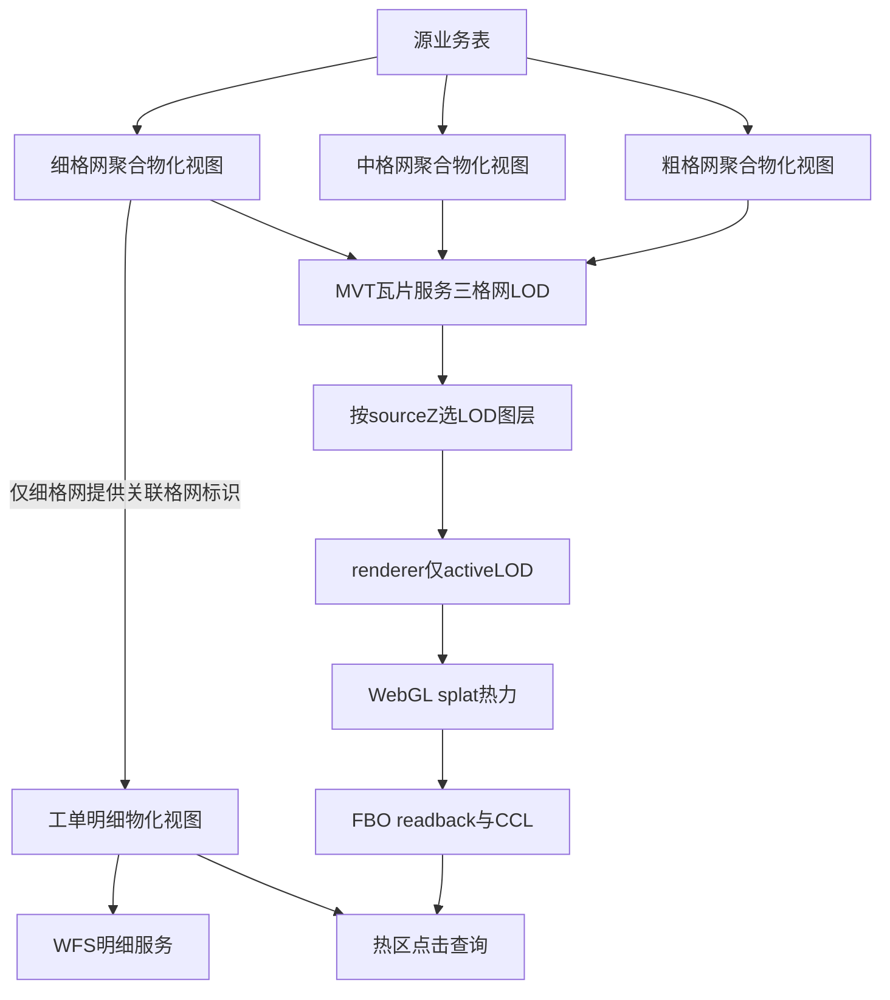


**交叉引用**：01（双 MV + 三格网）、02（MVT/WFS/LOD/gzip）、03（渲染）、04（renderer）、05（热区）。

**DoD**：

- [ ] 开篇「背景环境」表（**§1.6** 全集基准表）
- [ ] 无 monorepo / 真实字段名
- [ ] 含 01–**05** 博客园线上链接（见 **§1.5**；04 待更新链可标注）
- [ ] ≥2 张 mermaid + ≥1 张选型对比表（含单格网 vs 三格网 LOD）

---


### 4.1 数据层 — `01-数据层-双物化视图与三格网 LOD.md`

**目标读者（Agent 内化）**：数据工程师、后端、需理解热力数据模型的前端。

**必写章节**：

0. **背景环境**（开篇：**PostgreSQL**、**PostGIS**；物化视图能力前提，见 **§1.6**）

#### A. 为何需要两个物化视图


| 视图 | 职责 | 为何独立 |
| --- | --- | --- |
| **三格网格网聚合物化视图族**（细 / 中 / 粗） | 格心 + 格内工单数 + 筛选维度；三档结构相同、步长不同 | 三百万级点数据在低 zoom 单用细格网过密；MVT 须按 zoom 选档；服务端预聚合 |
| 工单明细物化视图 | 单条工单完整属性 + 关联格网标识 | 热力展示只需计数；热区点击需 WFS 拉明细，不能把全部列塞进 MVT |


#### B. 格网标识稳定性

- 同一业务格网：刷新后 **格网标识不变**，**格内工单数可变**
- 热区点击 `关联格网标识 IN (...)` 依赖此稳定性


#### C. 格网标识为何必须进热力 MVT（与服务层 02 呼应）

- Mapbox Vector Tile 规范要求要素 **数字型 feature id**
- 若 GeoServer 无法从库表取得稳定整型 id，会反复输出 `Cannot obtain numeric id` 类 WARN，**容器 stdout 日志暴涨**
- 博文可引用：
  - [GeoServer 2.24.x · Vector Tiles](https://docs-archive.geoserver.org/2.24.x/en/user/extensions/vectortiles/index.html)（全文 GeoServer 引用见 **§2.2.1**）
  - 社区讨论：合成字符串 FID 无法映射为 MVT 数字 id 的问题（搜索关键词：`geoserver mvt numeric id`）
- **结论**：格网聚合物化视图须物化 **整型格网标识** 列，并确保 GeoServer 能解析为 MVT **数字 fid**（常见做法：`UNIQUE (格网标识)` 供自动推断；**勿**再为业务聚合键建 UNIQUE 索引，见 §D）
- **库表 ≠ PBF**：格网 MV **库内仍物化**四维度列供 CQL；**不等于** MVT 瓦片内携带这些列（详见 02 篇「MVT 属性裁剪」）


#### D. 索引设计（概念，勿写运维 DDL 手册）

博文须说明「为何建这些索引」，用抽象字段名，可配对比表。

**格网聚合物化视图**（三档共用索引策略）


| 索引类型            | 作用对象（抽象）                  | 设计动机                                                                                           |
| --------------- | ------------------------- | ---------------------------------------------------------------------------------------------- |
| 空间索引            | 格心坐标                      | 加速 MV 构建时的空间聚合、extent 统计与库内排查                                                                  |
| 复合 / 单列 B-tree  | 发生年份、事项专题、业务场景、所属区县       | 与前端 ECQL 筛选维度对齐，加速带筛选条件的查询与校验                                                                  |
| **唯一**索引        | 格网标识                      | MVT 数字 feature id、热区 `关联格网标识 IN (...)` 反查；`REFRESH` 后标识稳定依赖物化列 + 唯一约束语义                        |
| **不建**业务聚合键唯一索引 | `(格心, 年份, 专题, 场景, 区县)` 组合 | 业务键在 `GROUP BY` 下已逻辑唯一，但**不宜**再暴露为库表 UNIQUE 供 GeoServer 误推主键；格网标识列单独承担 MVT 数字 fid（与 §C、02 篇呼应）。误建该 UNIQUE 会导致 GeoServer **非预期**仅输出格内工单数（**故障**，与 02 篇主动 **Customize attributes** 裁剪区分） |

**PostGIS Store 前置（02 篇可一句）**：DataStore **勿开启**「暴露主键」（Expose primary keys）；保持默认**不暴露**。若误将几何列与业务键一同暴露为主键，可能引发 WFS / WKB 解析类错误——与「业务聚合键 UNIQUE 误隐藏列」为**不同**故障路径。


**工单明细物化视图**


| 索引类型          | 作用对象（抽象）            | 设计动机                                                |
| ------------- | ------------------- | --------------------------------------------------- |
| 唯一索引          | 工单主键                | 行级唯一、`REFRESH MATERIALIZED VIEW CONCURRENTLY` 的前置条件 |
| B-tree        | 关联格网标识              | 热区点击 WFS：`关联格网标识 IN (...)` 批量反查                     |
| 复合 B-tree（按需） | 业务场景、发生年份、所属区县 + 空间 | 视口类 WFS 的 `BBOX + 筛选`（本系列非重点，可一句带过）                 |
| 空间索引          | 工单几何                | 视口 `BBOX` 查询（若明细层承担该路径）                             |


**与刷新策略的关系**（衔接 §E，不在此展开运维）：

- 格网 MV 常因无合适 **CONCURRENTLY** 唯一键而用普通 `REFRESH`
- 工单明细 MV 在 **工单主键唯一索引** 存在时，可在格网 MV 刷新完成后 `CONCURRENTLY` 刷新

**必配图（建议）**：双 MV 各建哪些索引、服务查询路径（MVT CQL / WFS `IN` / WFS `BBOX`）指向哪些索引的示意表或简图。

#### E. 源数据更新后的刷新顺序

**概念流程**：

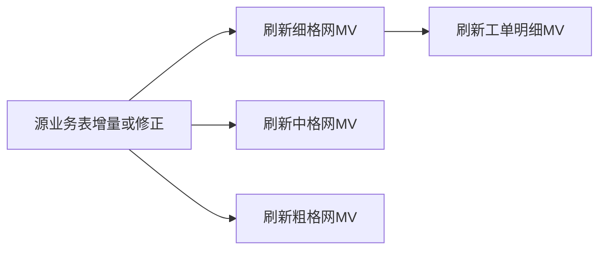


**顺序原因**：工单明细 MV 通过 JOIN/关联从**细格网** MV 取得「关联格网标识」；**细格网 MV 须**先于工单 MV 刷新，否则关联错位或缺失。中 / 粗格网 MV 与工单 MV **无依赖**，三档之间亦互不依赖，可并行刷新。

**示例 SQL（博文须写出，但不展开运维）**：

```sql
-- 步骤 1：刷新三档格网聚合物化视图（普通 REFRESH，不改变已有格网标识；三条互不依赖）
REFRESH MATERIALIZED VIEW 细格网聚合物化视图;
REFRESH MATERIALIZED VIEW 中格网聚合物化视图;
REFRESH MATERIALIZED VIEW 粗格网聚合物化视图;

-- 步骤 2：在细格网 MV 完成后刷新工单明细（依赖最新格网标识；与中 / 粗格网无先后关系）
REFRESH MATERIALIZED VIEW CONCURRENTLY 工单明细物化视图;
```

**补充说明（概念级）**：

- 三档格网 MV 通常 **不支持** CONCURRENTLY（或无唯一业务键索引），用普通 `REFRESH`
- 工单明细 MV 在工单主键上有唯一索引时，可用 `CONCURRENTLY` 降低锁表影响
- 刷新后瓦片内 `格内工单数` 需与服务端缓存一致 — 02 篇一句带过「瓦片需与库一致」，**不写** Truncate/Seed 步骤

#### F. 三格网 LOD 动机（三百万级）

- **问题**：三百万级点数据若仅维护细格网（如 5m），低 zoom 视口下单瓦片格网要素过密，MV 行数、MVT PBF 体积与 GWC 缓存压力均过大
- **方案**：并行维护中格网（100m）、粗格网（300m），与服务层、前端 `sourceZ` 阈值对齐（见 **§3.1.1**、02 篇 §9）
- **与双 MV 关系**：仍为「格网 MV 族 + 工单明细 MV」；不是第四类业务表，而是**同一聚合逻辑、三种格网步长**
- **写作提示（勿漏）**：工单明细 MV **只**与细格网档建立关联、只维护一份，属**业务取舍**。01 §6.2 须写清因果链：热区点击仅在视图比例尺 **≥ 1:20000** 时开放；该比例尺下前端加载**细格网（5m）** MVT，采集的格网标识与明细 MV 的「关联格网标识」同属细格网体系，故数据层只需一份明细 MV。若产品要求**任一档位都能下钻**，需为每档各建一份关联（各档步长重算格心、下游按档位选表/选列），DDL 与整体方案均需相应改造

**必配图**：

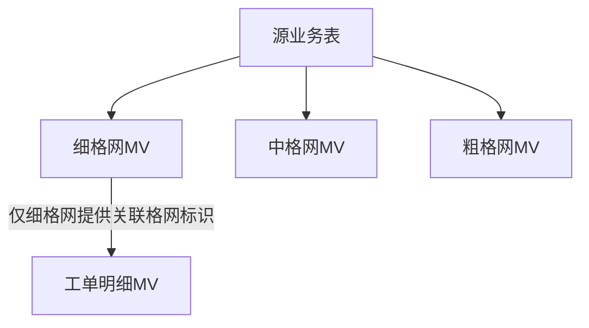

**非目标**：GWC Truncate、GeoServer Reload、Seed 矩阵。

**交叉引用**：02（三 MVT 发布、sourceZ 阈值）、05（热区点击反查）。

**DoD**：

- [ ] 开篇「背景环境」表（**§1.6**：PG/PostGIS）
- [ ] 双 MV + **三格网 MV 族**职责对比表
- [ ] 索引设计表（格网 MV + 工单 MV）及设计动机
- [ ] 刷新顺序 mermaid + 示例 SQL（三格网 + 工单，作为正文章节，标题不含「刷新顺序」）
- [ ] 刷新链路与依赖图**只画细格网 → 工单 MV**（中 / 粗格网与工单 MV 无依赖边）
- [ ] §F 三格网 LOD 动机 mermaid
- [ ] §6.2 热区点击比例尺门槛（≥ 1:20000）+ 细格网 LOD 对齐 + 单明细 MV 因果链
- [ ] 格网标识稳定性 + MVT 数字 id 必要性（含外部链接）
- [ ] 无真实表名/列名；正文无 `cnt` / `grid_id` 等实现字段名

---


### 4.2 服务层 — `02-服务层-MVT瓦片与按需明细查询.md`

**目标读者（Agent 内化）**：GIS 服务工程师、需对接瓦片 URL 的前端。

**必写章节**：

0. **背景环境**（开篇：**GeoServer 2.24.x**（2.24.2）、**GWC**、MVT Vector Tiles 扩展；PostGIS 为数据源一句，见 **§1.6**）
1. **为何 MVT 矢量瓦片**：格网为 Point 要素，按视口分块；比栅格 WMS 更适合动态 CQL 筛选
2. **GWC WMTS + CQL_FILTER**：
  - **GWC Tile Layer 的 GridSet 须与宿主地图 view 所用 CRS 一致**（`TILEMATRIXSET` / `projection` 与 OL `View` 对齐），无需瓦片在客户端重投影，减少计算开销
  - 筛选参数进入 URL，不同 ECQL 组合可独立缓存
  - **写作约束**：博文**勿写死**某一 EPSG 代号；若需举例，可用「如 CGCS2000 / Web Mercator」等占位并注明「以宿主 CRS 为准」
3. **Seed 范围（概念）**：
  - 须设置与实际业务数据范围一致的 **Bounding box**（可略宽于数据 extent，用于规避离群点撑大图层边框）
  - 避免对无数据区域 Seed，否则耗时长且产生无用瓦片
  - **不写**具体 Seed 命令与矩阵
4. **Parameter Filter**：放开 `CQL_FILTER`，支撑前端四维度多选下推
5. **格网标识作为 MVT feature id**：与 01 呼应；支撑热区 `关联格网标识 IN (...)`
6. **WFS 独立图层**：热区点击 / 按需 BBOX；不把全量明细列塞进 MVT
7. **bbox 门控**：数据范围外 `tileUrlFunction` 返回空，不请求瓦片
8. **MVT 属性裁剪（查询层 vs 输出层）**：
  - **问题**：低 zoom（如 z=8）密集格网瓦片体积大、传输慢、GWC 磁盘占用高；根因之一是 PBF 内每个 feature 重复携带四列字符串筛选属性，而前端热力**不读取**这些字段
  - **原则**：**查询层全列、输出层瘦身** — CQL 在 GeoServer 查询层过滤；PBF 只带 splat 权重与反查必需的格网标识 fid
  - **手段（概念）**：图层 **Customize attributes**（GeoServer 2.24.x Vector Tiles，见 **§2.2.1**）仅保留「格内工单数」；格网标识须能解析为 MVT **数字 fid**（常见为 `UNIQUE (格网标识)` 供自动推断，见 01 §C）（不写管理页逐步截图级 SOP）
  - **缓存一致性（概念一句）**：发布配置变更后，**须失效并重预热服务端瓦片缓存**，否则 GWC 仍可能返回含旧属性的瓦片 — **不写** Truncate/Seed 命令与矩阵（遵守 §2.1）
  - **主动裁剪 vs 故障**（必写对比表）：

| 情形 | 原因 | 是否预期 |
| --- | --- | --- |
| 业务聚合键 UNIQUE 索引导致属性只剩格内工单数 | GeoServer 误隐藏列 | **故障**（见 01 §D） |
| PostGIS Store 误开启「暴露主键」 | 几何列与 PK 分量冲突等 | **故障**（见 01 §D Store 前置） |
| Customize attributes 仅勾选格内工单数 | 主动减小 PBF 体积 | **预期** |

  - **效果（博文可写，勿写宿主机路径 / GWC 目录 tree_stats）**：属性裁剪后**显著减小体积**（本文项目业务数据背景下实测约 **26%**，读者需自行回归）；低 zoom、格网密集瓦片收益更明显。勿引用 GWC 某 zoom 段目录总量或单环境磁盘快照作通用结论。
  - **前端契约**：热力权重 ← PBF properties「格内工单数」；热区点击 WFS ← `关联格网标识 IN (...)`（**不**重复四维度 ECQL）；四维度筛选 ← MVT URL `CQL_FILTER`（**不读**瓦片 properties）。见 **§3.5**
9. **三格网 LOD 发布**：
  - 每业务数据源 **3 个 GWC MVT 图层**（细 / 中 / 粗格网 MV 各一）；`tileUrlFunction` 按 `sourceZ` 选其一
  - **sourceZ ↔ 精度对照**（博文用抽象阈值，与 **§3.1.1** 一致）：

| sourceZ | active LOD（抽象） |
| --- | --- |
| ≥ 13 | 细格网（如 5m） |
| 11–12 | 中格网（如 100m） |
| < 11 | 粗格网（如 300m） |

  - 同场景缩放跨阈值 **不 purge** 三档 GWC 缓存（概念）；切换 **业务数据集** 或 CQL 才 refresh / 失效相关缓存（抽象一句，不写 purge 实现）
10. **双业务数据集（抽象一句）**：前端可绑定多套「三格网 MVT + 工单 WFS」；切换时换 **LAYER 集合**并重拉视口瓦片。**勿**写宿主 UI、tab 或 purge 代码细节
11. **MVT HTTP gzip（简略）**：GWC 磁盘通常存 **未压缩** PBF；HTTP 响应层 **gzip** 可缩短传输时延，与 PBF 属性裁剪、三格网 LOD **互补**。**禁止**展开 Tomcat `server.xml`、nginx 或容器运维 SOP（§2.1）

**必配图**：

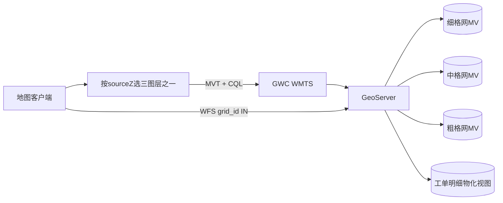

**查询层 vs 输出层（必配图 2）**：

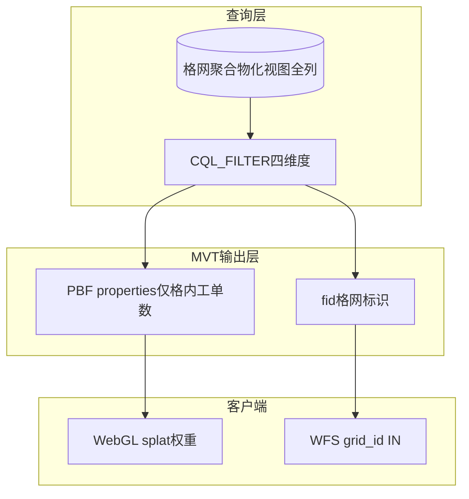


**交叉引用**：01（格网标识、三格网 MV、索引故障区分）、03（瓦片解码仅读格内工单数 + fid、LOD URL 选层）、04（renderer 与 active LOD）、05（WFS 点击）。

**外部文档**：GeoServer MVT / GWC / WFS / CQL 说明引用 **§2.2.1**（锁定 [2.24.x User Manual](https://docs-archive.geoserver.org/2.24.x/en/user/)）。

**DoD**：

- [ ] 开篇「背景环境」表（**§1.6**：GeoServer 2.24.x 背景环境）
- [ ] GridSet 与宿主地图 CRS 对齐动机讲清（泛化表述，不写死 EPSG 代号）
- [ ] Seed bbox 原则（无操作手册）
- [ ] **§9 三格网 LOD**：3 MVT/数据源 + sourceZ 对照表
- [ ] **§10 双业务数据集**一句 + **§11 gzip 传输**一句（无运维 SOP）
- [ ] MVT vs WFS 分工表
- [ ] **查询层 vs 输出层**对照 + **主动裁剪 vs 故障**区分表（§8）
- [ ] MVT 输出契约（仅格内工单数 property + 格网标识 fid，见 §3.4）
- [ ] 瓦片体积优化动机与缩减效果（显著减小 + 可写本项目约 26% 并注明读者自行回归）；禁止 GWC 目录 MiB / tree_stats 对比
- [ ] 缓存失效概念一句（无 Truncate/Seed 手册）
- [ ] GeoServer 外链落在 2.24.x 归档域（§2.2.1）
- [ ] 无图层名/工作空间名

---


### 4.3 前端（上）— `03-前端-热力图WebGL渲染管线.md`

**目标读者（Agent 内化）**：OpenLayers + WebGL 前端工程师。

**必写章节**（须满足 **OL 源码三段论**，见第 5 节）：

0. **背景环境**（开篇：**OpenLayers 10.6.1**；WebGL 矢量瓦片相关能力前提；GridSet 与 view CRS 对齐可一句带过，见 **§1.6**）

#### A. 为何不用 `ol/layer/Heatmap`

对照 `ol/layer/Heatmap.js`：


| 内置 Heatmap 假设                                   | 本方案现实                             |
| ----------------------------------------------- | --------------------------------- |
| 绑定 `ol/source/Vector`，全量要素在内存                   | 数据来自 **MVT 矢量瓦片**，按视口分页           |
| `createRenderer()` → `WebGLVectorLayerRenderer` | 需要 `WebGLVectorTileLayerRenderer` |
| 无瓦片生命周期                                         | 须处理瓦片加载/淘汰/CQL refresh            |


**结论**：复用 `Heatmap.js` 内 **splat shader 数学** 与 **postProcesses gradient**，但挂载到 **矢量瓦片 WebGL 层**；**不能**直接 `new Heatmap({ source: vectorTileSource })`（类型与 renderer 路径均不匹配）。

#### B. OL 覆写与扩展：原因与实现能力

博文须用**对比表 + 1 段总结**讲清：本方案在哪些点**未使用** OL 开箱类/构造参数，而是通过**子类继承、复刻 Heatmap 管线、组装 postProcess** 才跑通；**勿**在本节展开 **renderer LOD composite**（见 **§4.4**）、Overlay / ImageCanvas 等标准组合用法，**勿**展开 `readPixels`、`sourceTiles_` 等读内部状态细节（留给 **05** 篇识别管线一笔带过即可）。

| 扩展点 | 未覆写 / 未扩展时的缺口（对照 `Heatmap.js` 或 `WebGLVectorTile`） | 本方案做法（概念级，不写仓库路径） | 覆写后实现的能力 |
| --- | --- | --- | --- |
| **不用 `ol/layer/Heatmap`** | 内置层绑定 `ol/source/Vector`，`createRenderer()` 走 `WebGLVectorLayerRenderer`；无矢量瓦片生命周期 | 以 `VectorTileSource` + `WebGLVectorTile` 为宿主，**复刻** Heatmap 的 splat 与 gradient 数学，而非实例化 `Heatmap` | 三百万级格网**按视口分块**加载；CQL 变更仅 `source.refresh()`，由 GPU 每帧对当前有效瓦片集重绘融合 |
| **`postProcesses` 全屏后处理** | `WebGLVectorTile` 公开 `Options` **未暴露** `postProcesses`；无后处理则 splat 仅累加 alpha，无法映射冷蓝→热红 | 自定义 `WebGLVectorTile` **子类**，覆写 `createRenderer()`，向 renderer 注入 `postProcesses_`（OL 10.6.x 最小侵入点；升级须回归字段名） | 与内置 Heatmap **同构**的「splat 加性混合 → gradient 纹理上色」；**同一 WebGL 层**产出可供 **05** 篇做 alpha 阈值的热力图画面 |
| **`AsShaders` 形式 style** | 公开类型将 `style` 收窄为 `FlatStyleLike`；Heatmap 实际走 `ShaderBuilder` + `AsShaders` 分支 | 用公开 `ShaderBuilder` / `compileUtil` **复刻** `Heatmap.js#createRenderer` 中 splat GLSL；构造子类时以类型断言传入 | 按要素属性（格内工单数）计算 **per-feature weight**；`radius` / `blur` 以 uniform 注入 |
| **gradient 纹理与 postProcess shader** | 内置 Heatmap 在 `createRenderer` 内闭包创建 `createGradient(colors)` 与 fragmentShader | 复刻 1×256 色带 canvas；在图层选项中组装 `postProcesses`（`u_gradientTexture`、`u_opacity`） | 色带可配置；整体透明度可调 |
| **`tileUrlFunction` LOD 选层** | 单 LAYER 无法同时满足低 zoom 与中高 zoom 格网密度 | 按 `sourceZ` 解析 **active LOD**，WMTS URL 的 `LAYER` 指向三格网图层之一（与 02 篇 §9 一致） | 视口缩放自动请求对应精度 MVT；**renderer 侧 active LOD 过滤**见 **§4.4** |
| **WebGL 层销毁** | `WebGLVectorTile` 须显式 `dispose()` 释放 GL context / FBO / postProcess 纹理，否则泄漏 | `removeLayer` 后调用 `webglLayer.dispose()`（公开 API） | 插件关闭 / 离页后 GPU 资源可回收 |

**必写一段（原因 → 能力）**：内置 Heatmap 把「矢量全量 + splat + gradient」封在一层里；本方案数据在 **MVT 瓦片**上，必须把 Heatmap 的 **GPU 数学**拆出来绑到 **WebGLVectorTile**，并用子类补上官方未导出的 **postProcesses** 能力，再配合 **LOD URL 选层**，才能得到**可瓦片化、可 CQL 刷新、可后处理上色**的热力层——**05** 篇热区识别能 threshold **屏幕所见 alpha**；**04** 篇解决 LOD 切换时 WebGL composite 的旧档位残留（**非** cnt 虚高，见 §4.4）。

**OL 版本锁定**：`postProcesses_` 注入依赖 `ol/renderer/webgl/Layer.js` 私有字段；`AsShaders` 断言依赖 `WebGLVectorTileLayerRenderer.applyOptions_` 运行时分支。博文须注明锁定 **OL 10.6.1**，升级须回归上述扩展点。**不含** `TileLayerBase` renderer 覆写（见 **§4.4**）。正文章节可拆为 **§2.1 扩展表**、**§2.2 postProcess 伪代码**、**§2.3 splat 伪代码**（大纲 §B 表与之对应）。

#### C. 渲染管线

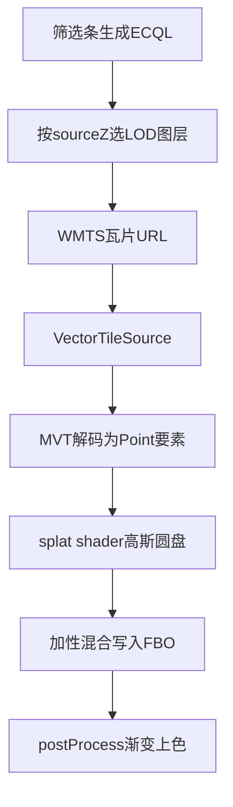

**配图（Agent 内化，博文 §3）**：

| 编号 | 文件 | 插入位置 |
| --- | --- | --- |
| U1 | `03-pipeline-gradient.png` | §3 mermaid **之后** |
| D2 | `01-devtools-fine-layer-url.png`（复用 02-D3） | U1 **之后** |
| U5 | `掩膜计算边界.jpg` | **§3.1** 引子段落后（见 §C.1） |

图注用语见 [`配图清单.md`](/Blog/mvt-webgl_heatmap-ccl/配图清单.md) **§8**（产出层抽象字段，无 `cnt` / `grid_id`）。

#### C.1 视口快照：热区标注与边界的计算范围（博文 §3.1）

> **章节顺序**：位于 **§3 渲染管线**（§C mermaid 与 U1/D2 配图）**之后**、**§4 新瓦片融入**（§D）**之前**。

- **引子**：放大 → 开启热力与「显示热区工单数 / 显示热区边界」→ 计算完成 → **缩小**；抓拍某一帧：外围已有热力，圆标与红色阶梯边界仍集中在中心
- **必写对比表**：热力图（MVT + WebGL 每帧） vs 热区圆标/边界（FBO 整屏 readback + CCL + 视口内格网计数）；列：渲染/计算来源、有效范围、典型更新时机
- **必写 mermaid**：WebGL 热力 → 交互结束后 FBO readback → 下采样掩膜 → CCL → 采集视口内格网计数 → Overlay 圆标 / ImageCanvas 边界
- **配图**：`掩膜计算边界.jpg`（U5）；图注说明「缩小瞬间」范围不一致，承下 04（active LOD composite）、05（坐标映射与 CCL 细节）
- **边界**：本节只建立「GPU 热力 → 视口快照 → 标注/边界」分工；**非**故障排查、**非**修复方案；与 §4.1 直缝、04 跨 LOD 残留区分
- **§2.3 交叉**：postProcess 产出的成品 alpha 亦为 §3.1 视口快照输入

#### D. 新瓦片如何融入已有热力

**§D 主节（博文 §4）**：

- **无手写 CPU 融合循环**；每帧 WebGL 对 **当前有效瓦片集** 重新 splat 到同一 FBO，加性混合即「融合」
- **必配图 mermaid**（每帧重绘因果）：

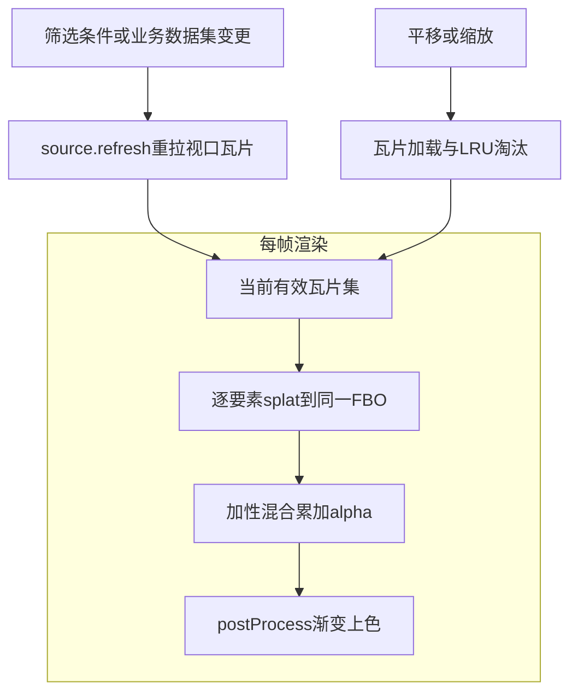

- **筛选 refresh 两推论**：CQL 变更仅 `source.refresh()`；**方案 A/B CPU 合并对比表**（CPU 合并瓦片要素缓存 vs 每帧重绘有效瓦片集）
- **配图**：`03-filter-refresh-compare.png`（U2）、`03-devtools-refresh-tiles.png`（D1）
- CQL 或 **业务数据集** 变更：`source.refresh()`（及概念级 purge 非 active 数据集缓存），OL 重拉视口瓦片并重绘
- **同场景跨 LOD 缩放**：三档 MVT 可并存于 `VectorTileSource` 缓存；**不 purge** 三档缓存以加速来回缩放（概念）；**renderer 须**仅 composite active LOD（§4.4）
- **MVT 契约**：瓦片解码后前端**只消费**「格内工单数」（splat weight）与 feature id（格网标识）；四维度筛选**不读**瓦片 properties，与 02 篇「MVT 属性裁剪」一致
- **05 筛选归零时序**（概念一句）：筛选 refresh 后等待瓦片到达，再驱动依赖瓦片的下游热区识别

**§D.1 缩放加载：同 LOD 下的瓦片矩阵升级（博文 §4.1）**

> **章节顺序**：位于 §4 **末段**（筛选 refresh、缓存策略、05 时序段落**之后**），非紧接 §4 开篇 mermaid。

- **三类变化对照表**：

| 维度 | 放大后典型变化 | 是否为本节讨论对象 |
| --- | --- | --- |
| **WMTS 瓦片矩阵** | `TILEMATRIX` / `TILEROW` / `TILECOL`（sourceZ）升高 | **是** |
| **三格网 LOD（`LAYER`）** | 仅当 sourceZ 跨过 11 / 13 阈值时才切换 | **否**（阈值内放大） |
| **筛选 CQL** | 变更才 `refresh()` 重拉 | **否** |

- **缩放因果 mermaid**：

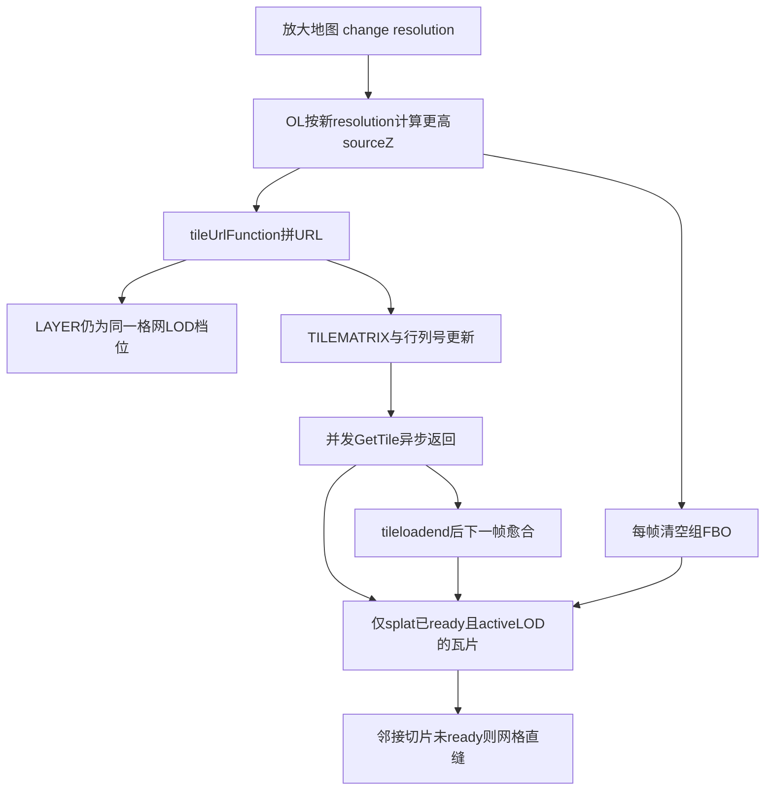

- **配图**：`mvt-切片更新时效果.png`（U4）
- **边界句**：与 **筛选 refresh**（03 §4）、**跨 LOD 阈值 composite 残留**（04 专讲）区分；短暂直缝是「每帧重绘有效瓦片集」在缩放加载下的正常中间态，**非** splat 参数错误或 FBO 增量合并失败

#### E. 其他重点

博文 **§5** 拆为三节（大纲 E 与之对应）：

- **§5.1 权重归一化**：对数压缩 + 幂次拉差（抽象名「热力饱和标准」）；`03-tuning-auto-expand.png`（U3）
- **§5.2 调参如何生效**：`radius` / `blur` / 透明度 / 饱和标准经 uniform 或 attribute；CQL 变更**仅** `source.refresh()`；热区阈值 `cpuOnly` 捷径一句指向 **05**
- **§5.3 资源销毁**：`webglLayer.dispose()`；`VectorTileSource#clear()` 在 OL 10.6.1 为空实现，须遍历释放 MVT 瓦片后再 `source.dispose()`

博文 **§B 覆写表** 已涵盖 `postProcesses` 子类与 `AsShaders`；**§2.2 postProcess 伪代码** 已在正文章节展开，本节 **§E** 不重复标准 `VectorTileSource` / `MVT` 用法。

**核心伪代码（splat，等价 Heatmap.js 思路）**：

```glsl
// 片元：高斯圆盘 splat（示意）
float t = smoothstep(0., 1., (1. - length(coordsPx * 2. / quadSize)) * blurSlope);
gl_FragColor = vec4(t * weight, ...);
```

**交叉引用**：02（WMTS/CQL、**MVT 属性裁剪**、**LOD 三图层**、gzip 一句）、**04**（renderer active LOD 过滤；03 **§4.1** 已覆盖同 LOD 缩放加载中间态）、05（FBO/CCL 承接同一 WebGL 层；**§3.1** 承下 05 识别管线细节）。

**DoD**：

- [ ] 开篇「背景环境」表（**§1.6**：OL 10.6.1 背景环境）
- [ ] Heatmap.js vs WebGLVectorTile 对比表（§A）
- [ ] **OL 覆写与扩展表**（§B）：含 postProcesses、AsShaders、**LOD URL 选层**；**不含** renderer 行
- [ ] 渲染管线 mermaid 含 **resolveLod** + **§3 配图** U1 / D2（§C）
- [ ] **§3.1** 双管线对比表 + 视口快照 mermaid + **U5** `掩膜计算边界.jpg`；与 §4.1 / 04 / 05 边界句（§C.1）
- [ ] §4 **每帧重绘** mermaid + CPU 方案 A/B 对比表 + 筛选 refresh 配图 U2 / D1（§D）
- [ ] **§4.1** 三类变化表 + 缩放因果 mermaid + U4 + 与 refresh / 04 边界说明（§D.1）
- [ ] **7 处配图**已插入且图注符合 §1.7（清单 §8，含 1 JPG）
- [ ] §5.1–5.3（权重公式、调参路径、销毁顺序）
- [ ] 小结含「同 LOD 直缝」与「热力每帧 vs 热区视口快照」各一句
- [ ] ≥1 段 OL 源码三段论（Heatmap `createRenderer` 与 WebGLVectorTile 缺口）
- [ ] 无插件路径

---


### 4.4 前端（中）— `04-前端-矢量瓦片Renderer覆写与LOD-composite.md`

**目标读者（Agent 内化）**：OpenLayers WebGL 矢量瓦片工程师；须理解多 LOD 共用 `VectorTileSource` 时的 composite 语义。

**必写章节**（须满足 **OL 源码三段论**，对照 `ol/renderer/webgl/TileLayerBase.js`）：

0. **背景环境**（开篇：**OpenLayers 10.6.1**（与 03 一致）；见 **§1.6**）

#### A. OL 默认 composite 行为

1. **OL 源码行为**：`WebGLVectorTileLayerRenderer` 继承 `TileLayerBase`；overzoom 时 `findAltTiles_` 从 `tileRepresentationCache` 取 **其它 z / 其它已加载瓦片** 参与 composite；`drawTile_` 绘制所有 ready 表示
2. **本方案缺口（须写准）**：
   - **前置（03 §4.1）**：**同 LOD 内** `TILEMATRIX` 升级导致的**短暂瓦片直缝**已在 03 篇说明；**本篇**专讲 **跨 active LOD 阈值** 时 composite 仍绘制**上一档 LAYER** 的**残留**问题——**勿**与直缝混为一谈
   - 三格网 LOD 共用 **同一** `VectorTileSource` 时，缓存中可并存 **不同精度 LAYER** 的瓦片
   - OL **默认不过滤 LAYER** → 缩放 crossing active LOD 时，若 **目标档位 MVT 尚未加载**，WebGL 仍可能 composite **上一档 active LOD** 的瓦片
   - **表现**：热力图与热区标注呈现 **旧档位内容残留**，而非用户期望的新档位（或空窗等待新瓦片）
   - **明确否定**：格网计数采集路径经 **active LOD URL 过滤**（与 renderer 同一套 `LAYER=` + `sourceZ` 语义），**不是**「重复 splat / 重复累计 cnt 导致虚高」叙事
3. **覆写方案（概念）**：
   - 自定义 renderer **子类**，override `findAltTiles_` / `drawTile_`
   - 经瓦片 URL 的 `LAYER=` + 当前 `viewSourceZ` 判定 **active LOD**（`VectorRenderTile` → source tile URL）
   - 无 eligible 瓦片时：清 overlay / 热区 mask / 高亮，**继续** FBO 重算（避免 stale UI）

**必写对比表**（≥3 行）：

| 维度 | 内置 OL composite | active LOD 过滤覆写 |
| --- | --- | --- |
| 多 LAYER 缓存 | 可能绘制非 active 精度瓦片 | 仅 composite 与 active LOD 一致的瓦片 |
| LOD 切换瞬间 | 易显示旧档位热力 | 旧档位不进入 splat；等待新档或清空 |
| 热区 cnt 采集 | （若未过滤 URL 会错位） | 与 renderer **同一** active LOD 过滤语义 |
| 问题归因 | — | **残留**，非 cnt 重复累计 |

**必配图**：

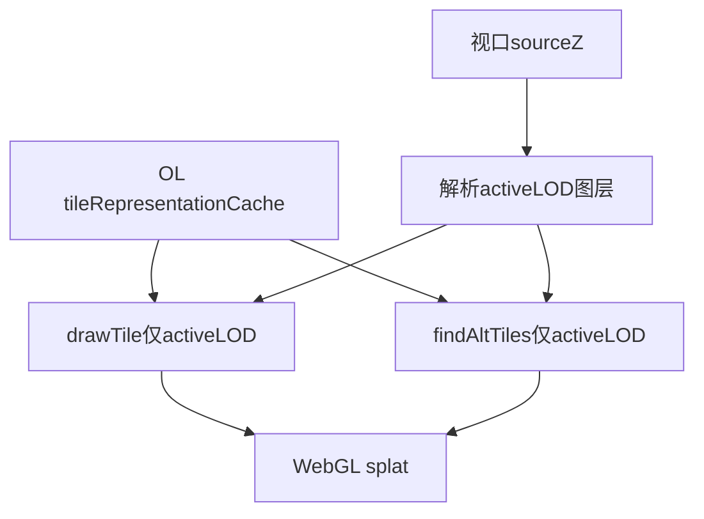

**交叉引用**：02（三 MVT 图层、sourceZ 阈值）、03（同一 WebGL 层、LOD URL 选层；**§4.1** 同 LOD 缩放直缝）、05（热区 cnt 与 active LOD 对齐）。

**DoD**：

- [ ] 开篇「背景环境」表（**§1.6**：OL 10.6.1）
- [ ] **TileLayerBase 三段论** + **残留**问题正述（**非** cnt 虚高）
- [ ] 覆写对比表 + mermaid
- [ ] 无插件路径 / 无实现类名

---


### 4.5 前端（下）— [`05-前端-热区识别、计算与绘制.md`](/Blog/mvt-webgl_heatmap-ccl/05-前端-热区识别、计算与绘制.md)

**目标读者（Agent 内化）**：需实现「看得懂的热区」与「点得中的下钻」的前端工程师。

**正文章节映射**（A–G 对应博文 §1–§7；§C 内嵌 §3.1–§3.7 子节编号与正文一致）：

0. **背景环境**（开篇：**OpenLayers 10.6.1**（与 03、04 一致）；见 **§1.6**）

#### A. 识别：为何 FBO readback，而非格网几何聚类（正文 §1）

- 热区是 **splat 晕染后的视觉连通区域**，不是格网中心点的 GIS 邻接
- 阈值划在 **GPU 上色后的 alpha** 上，标注与屏幕所见一致
- **与 03 + 04 的衔接**：03 子类注入 `postProcesses` 完成 gradient 上色；04 renderer 过滤保证 composite 与 **active LOD** 一致。05 篇识别管线**建立在同一 WebGL 热力层之上**，而非格网几何聚类。
- **必写**：方案 A（格网几何聚类）vs 方案 B（FBO + 像素掩膜）对比表（≥4 行）

#### B. 承接 03 / 04 后的热区能力（正文 §2）

博文须说明：**热区识别不是 OL 开箱能力**，而是 03 覆写 + 04 renderer 过滤在 CPU 侧的延伸。用下表写清「前置能力 → 热区能力」，**勿**展开 `readPixels` / `sourceTiles_` 实现细节。

| 03 / 04 能力 | 05 篇由此得到的能力 | 说明（概念） |
| --- | --- | --- |
| `postProcesses` + gradient 上色 | **视觉一致的热区阈值** | CCL 掩膜与用户所见「热斑」同源 |
| 04 active LOD composite | **热力与标注不残留旧档位** | 与格网计数采集同一 URL / active LOD 过滤语义 |
| splat + 瓦片级 GPU 融合 | **连通域边界贴合晕染** | 像素域 8-连通，非格网 Voronoi |
| MVT + splat weight | **热区合计工单数** | 连通域内聚合 **active LOD** 下当前帧格网 **格内工单数** |
| 同一 WebGL 热力层实例 | **缩放 / 筛选后标注与热力同步** | 平移缩放结束、瓦片到达后重识别；筛选切换先失效再刷新 |
| 掩膜缓存 + `cpuOnly` 路径 | **仅改阈值时快速重算** | 不必重拉 MVT（依赖已捕获 splat alpha 掩膜） |

**必写一段**：03 解决「瓦片化热力怎么画」；04 解决「LOD 切换时不 composite 错档」；05 解决「画出来的热斑怎么标、怎么点」。

#### C. 识别管线（正文 §3）

**总览 mermaid**（与正文 §3 顶图一致；节点用语对齐正文，如「读回帧缓冲」而非 `readPixels`）：

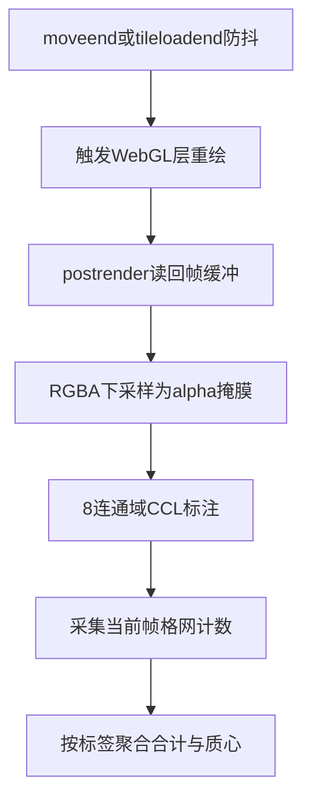

**§3.1 触发与防抖**。`moveend` / `tileloadend` 调度识别，约 300ms 防抖；标记待读回并触发 WebGL 层重绘。

**§3.2 读回**。须在 `postrender` 之后读回 postProcess 完成后的 RGBA；Y 轴翻转对齐屏幕坐标系。锁定 OL 10.6.1，**不**展开私有渲染结构细节。

**§3.3 掩膜（readback → mask）**。下采样成长边 ≤512 的掩膜栅格；每格取覆盖块内 splat alpha **最大值**（非平均）；预乘 alpha 按整体透明度反推 splat 累积 alpha，再按热区阈值二值化。交叉引用 §3.3.1。

**§3.3.1 为何下采样到长边 512 的掩膜（必写）**

- **性能**：全分辨率 CCL 成本随视口面积线性涨（常见 CSS 视口 ~1920×900 约 170 万像素）；长边 512 后通常十余万像素（如 512×241），BFS 规模封顶
- **保真**：粗格内取 splat alpha **最大值**，宁可保留小热斑、不让平均化冲淡细窄连通
- **一致**：MVT 归属查表与掩膜共用 `pixelScale`（`floor(screenPx / pixelScale)`），避免「全分辨率 CCL、粗栅格查表」两套尺度

| 维度 | 做法 | 效果 |
| --- | --- | --- |
| **性能** | 长边上限 512，CCL 在粗栅格上 BFS | 连通域规模有顶；与每帧 FBO 读回成本解耦 |
| **保真** | 粗格内取 splat alpha **最大值** | 细窄热连通不易被平均化抹掉 |
| **一致** | MVT 查表与掩膜共用 `pixelScale` | 热区标签与格网合计在同一粗栅格上对齐 |

诚实表述：粗化引入边界误差（§3.4.1 注意点）；长边 512 在验证视口下**实测轮廓与合计可接受**，属工程折中；常量可调需回归 CCL 耗时与边界误差。


**§3.4 连通域标注（mask → ccl）**。8-连通 CCL；浏览器侧 BFS（等价 Seed-Filling 8 邻域）。外部引用：[炸鸡人博客 · 二值图像的连通域标记](https://zhajiman.github.io/post/connected_component_labelling/)、[火山引擎 · 连通域的原理与 Python 实现](https://developer.volcengine.com/articles/7385112150811656242)。可选 CCL 概念伪代码块。**不必**调用 OpenCV / scipy。

**§3.4.1 格网归属与坐标映射（必写）**

热区归属是两条数据线在同一套 **CSS 屏幕像素** 空间汇合后的查表，**不是**格网 GIS 邻接。

**双线汇合 mermaid**：

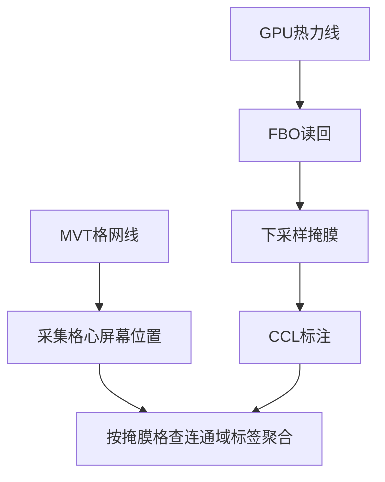

**必写内容清单**：

1. **三套坐标系表**（地理坐标 / OL CSS 屏幕像素 / 掩膜栅格索引）及角色说明
2. **DevTools 澄清**：`canvas width` 为设备像素，不参与 MVT↔掩膜查表；FBO 读回后 ÷ `pixelRatio` 还原 CSS，再下采样
3. **完整数字示例**：屏 A（2880×1351、`scale(0.666667)` → CSS ~1920×900.67、掩膜 512×241、`pixelScale` 3.75）；屏 B（2561×1172 → 掩膜 ~512×235）；walkthrough `screenPx=(750,420)` → `(gx,gy)` → 查连通域标签 → 累加格内工单数
4. **正向映射公式**（概念伪代码，无仓库路径）
5. **坐标系关系（ASCII 框图，硬性）**：双层叠加示意（OL CSS 视口 + MVT 投屏 → 掩膜格；下层 WebGL 设备像素 canvas + FBO → pixelRatio → 下采样）。须放入 fenced code block；**禁止**仅用 mermaid 替代
6. **反向显示两条路径表**：圆标（地理加权质心 + `ol/Overlay`）/ 边界（掩膜格四角 → 地理 quad + `ImageCanvas`）；说明**不**经掩膜格回写屏幕；fallback（无格网计数时掩膜格中心 → 地理）一句
7. **完整映射链（ASCII 三阶段框图，硬性）**：阶段 1 FBO→掩膜+CCL；阶段 2 MVT 归属查表；显示分叉圆标/边界。须放入 fenced code block；**禁止**仅用 mermaid 替代
8. **映射注意点**（4 条）：粗化误差；圆标质心与 CCL 视觉解耦；单点采样；视口门控

**§3.5 采集（ccl → collect）**。并行采集格心屏幕位置与格内工单数；**必须**交叉引用 §3.4.1。同一帧 active LOD（`LAYER=` + `sourceZ`）、同一 CQL、按格网标识去重；与 04 renderer composite 共用瓦片事实。**不写** `sourceTiles_` 遍历。

**§3.6 聚合（collect → aggregate）**。`screenPx` → 掩膜格 → 连通域标签；累加格内工单数、地理加权质心；无数据标签丢弃。圆标/边界显示路径交叉引用 §3.4.1「反向显示」。

**§3.7 性能分级**。mermaid：仅热区阈值变化 → 复用缓存掩膜重跑 CCL（cpuOnly）；缩放/瓦片更新 → 全量读回重建掩膜。两条路径独立防抖、互不取消。

#### D. 绘制（正文 §4）

**须交叉引用 §3.4.1**（圆标地理加权质心、边界掩膜格捕获 quad）。

| 能力 | 实现 | 为何 |
| --- | --- | --- |
| 热区工单数圆标 | `ol/Overlay` DOM，质心锚点 | 不随缩放变形；可点击下钻（**勿**在博文写具体比例尺档位策略，见 **§1.7**） |
| 热区边界 | `ol/source/ImageCanvas` + Image 图层 | 像素级贴合晕染边界；随视口缓存与重绘（见 §E） |

圆标按合计十进制位数分档视觉；边界阶梯形白线引出 §5 ImageCanvas 选型。

#### E. 为何使用 `ImageCanvasSource` 绘制热区边界（正文 §5）

对照 `ol/source/ImageCanvas.js` 三段论：

1. **OL 源码行为**：`canvasFunction(extent, resolution, pixelRatio, size, projection)` 按当前视口 extent 生成 canvas；结果由 source **缓存**；内容变化时须 `changed()` 失效；`interpolate` 控制重采样
2. **本方案缺口**：热区边界来自 **像素掩膜栅格的阶梯形轮廓**，不是预定义 Vector 多边形；splat 边界在像素级，矢量面难以贴合
3. **选型**：捕获时刻将连通域标签 >0 的栅格单元四角转为 **地理锚定四边形**；`canvasFunction` 内映射回 canvas 像素，只描外边缘；`interpolate` 关闭以保持阶梯感

**对比表**：

| 方案 | 优点 | 缺点 |
| --- | --- | --- |
| Vector 多边形 | 原生矢量编辑 | 难以表达 GPU 晕染边界；顶点多、更新成本高 |
| ImageCanvas | 像素级贴合；随视口缓存 | 需维护捕获时刻地理锚定；命中交互交给 Overlay 圆标 |

#### F. 其他难点（正文 §6）

- **active LOD 三方对齐**：格网计数采集、WebGL composite（04 renderer）、`tileUrlFunction` 选层须共用同一套 URL / `sourceZ` / CQL 过滤语义
- **筛选切换后标注短暂归零**：先 invalidate 清空 → 瓦片 refresh → 识别恢复；`rendercomplete` 兜底（瓦片全缓存时不触发 `tileloadend`）

**勿写**：空间交互锁 — 非本系列目标。**勿写**视口蓝标/点位互斥等宿主产品策略（**§1.7**、**§2.3**；**01 §6.2** 热区点击比例尺门槛为例外）。**勿写** cnt 重复累计 / splat 虚高误述（该短语仅 AGENTS 内化，不得写入博文）。

#### G. 热区点击查询：回扣数据层（正文 §7）

**必写 mermaid**：点击圆标 → 取出归属格网标识集合 → WFS `关联格网标识 IN (...)` → 工单明细列表。

- 查询**不重复携带**四维度 ECQL（筛选已在 MVT 层体现）
- 回扣 **01 双 MV**：明细 MV 物化关联格网标识；格网标识稳定；热区合计来自 MVT、明细来自 WFS

**非目标**：筛选条、视口蓝标、调参面板、右栏列表。

**交叉引用**：01（双 MV + 三格网、格网标识）、02（WFS 契约）、03（postProcess / splat）、04（active LOD composite）。

**小结须含**：§3.3.1（512 下采样）、§3.4.1（`pixelScale` 查表、地理锚定显示）要点 bullet。

**DoD**：

- [ ] 开篇「背景环境」表（**§1.6**：OL 10.6.1）
- [ ] §1 选型对比表 + §2 承接能力表（§A–§B）
- [ ] §3 总览 mermaid + §3.1–§3.2 触发/读回
- [ ] §3.3.1：512 下采样动机表 + 子 mermaid
- [ ] §3.4 CCL 外部引用（+ 可选伪代码）
- [ ] §3.4.1：三套坐标系表 + 屏 A/B 数字示例 + walkthrough
- [ ] §3.4.1：**两张 ASCII**（坐标系关系、完整映射链）；反向显示表 + 注意点 4 条
- [ ] §3.5–§3.7 采集/聚合/性能分级（含性能分级 mermaid）
- [ ] §4 交叉引用 §3.4.1；§5 ImageCanvas 三段论 + 对比表
- [ ] §6 active LOD 对齐 + 筛选归零时序；§7 热区点击 mermaid + 双 MV
- [ ] 全文 ≥5 张 mermaid（总览、512 子流程、双线汇合、性能分级、热区点击）
- [ ] 博文正文无 `cnt`、`grid_id`、monorepo/插件路径；ASCII 图用「连通域标签」「格内工单数」
- [ ] **无** cnt 虚高误述；**无**空间交互锁章节；**无** `sourceTiles_` / `readPixels` 实现展开

---


## 5. OpenLayers 源码研读指引

> **仅供写作 Agent 内化**；博文引用时只写 `ol/...` 模块路径，不写任何仓库绝对路径或 `node_modules` 路径。  
> **锁定版本**：OpenLayers **10.6.1**（与实现一致；升级须全文回归）。


### 5.0 源码查询路径（写作 Agent 必读）

撰写 **03–05** 篇或执行 OL 源码三段论时，按下列顺序查阅 **10.6.1** 源码（**禁止**误用 `main` / `latest` / 其它版本标签）：


| 优先级   | 来源                | 说明                                                                                                                                                                                                                                                                                                                                            |
| ----- | ----------------- | --------------------------------------------------------------------------------------------------------------------------------------------------------------------------------------------------------------------------------------------------------------------------------------------------------------------------------------------- |
| 1（首选） | 本机 `node_modules` | `C:\AIRace\Dev\Project\yunyan\yunyan-frontend_develop\node_modules\.pnpm\ol@10.6.1\node_modules\ol\` 下按相对路径读取，例如 `layer/Heatmap.js` 对应 `...\ol\layer\Heatmap.js`                                                                                                                                                                              |
| 2（回退） | GitHub 源码树        | 当 Agent 工具**无法访问**上述本地目录（工作区未挂载、路径不存在、沙箱不可读等）时，**必须**改用 [OpenLayers v10.6.1 ·](https://github.com/openlayers/openlayers/tree/v10.6.1/src/ol) `src/ol` 在线浏览；单文件可用 `https://github.com/openlayers/openlayers/blob/v10.6.1/src/ol/<相对路径>`（如 `[layer/Heatmap.js](https://github.com/openlayers/openlayers/blob/v10.6.1/src/ol/layer/Heatmap.js)`） |


**硬性要求**：

- 回退查询时 URL 中版本标签**只能是** `v10.6.1`，不得替换为 `master`、`main` 或 `en/latest` 对应分支。
- 本地路径与 GitHub 路径模块名一致：`ol/layer/Heatmap.js` ↔ `src/ol/layer/Heatmap.js`。
- 博文正文仍只写 `ol/...` 模块名；§5.0 的路径仅供 Agent 内化，**勿**写入对外发布的系列博文。
- **官方 Examples 外链**：OpenLayers 官网**未提供**按小版本归档的 `en/v10.6.1/examples/` 交互示例页，仅有 `en/latest`。博文 References 可保留 `en/latest` 作概念示例；正文须注明本系列实现以 **OL 10.6.1** 源码为准。**源码链接**（GitHub `blob/v10.6.1`）必须锁定 v10.6.1。


### 5.1 必读模块


| 模块                                     | 读什么                                                                                           | 对应博文  |
| -------------------------------------- | --------------------------------------------------------------------------------------------- | ----- |
| `ol/layer/Heatmap.js`                  | `createRenderer()`：`ShaderBuilder`、splat `smoothstep`、`postProcesses` gradient fragmentShader | 03    |
| `ol/layer/WebGLVectorTile.js`          | `createRenderer()` → `WebGLVectorTileLayerRenderer`；**无** `postProcesses` 公开入参                | 03    |
| `ol/renderer/webgl/Layer.js`           | `prepareFrame()` 读取 `postProcesses_` 构造 `WebGLHelper`                                         | 03    |
| `ol/renderer/webgl/TileLayerBase.js`   | `findAltTiles_`、`drawTile_`、`tileRepresentationCache`；overzoom composite 语义                    | **04**    |
| `ol/renderer/webgl/VectorTileLayer.js` | WebGL 矢量瓦片绘制入口；与 `TileLayerBase` 继承关系                                                      | 03、**04** |
| `ol/source/ImageCanvas.js`             | `canvasFunction` 签名、缓存、`changed()` 失效语义                                                       | **05**    |
| `ol/source/VectorTile.js`              | 瓦片 LRU、`refresh()` 行为                                                                         | 03、**04**、05 |
| `ol/Overlay.js`                        | DOM 标注锚点与定位                                                                                   | **05**    |


### 5.2 三段论写作模板

凡 **未直接使用 OL 开箱能力** 之处，博文须按以下结构展开（配对比表或简图）：

```text
1. OL 源码行为：<模块> 假设了什么、提供了什么
2. 本方案缺口：我们的数据形态/规模/瓦片化与上述假设哪里不一致
3. 选型/扩展：复用哪段 shader 数学 / 子类注入哪个私有扩展点 / 为何换 ImageCanvas
```

**示例提纲（03 篇）**：

- `Heatmap.js` 使用 `WebGLVectorLayerRenderer` + `postProcesses`，且 `options.source` 类型为 `Vector` → 无法直接用于 `VectorTileSource` → 自定义 `WebGLVectorTile` 子类，在 `createRenderer()` 向 renderer 写入 `postProcesses_`

**示例提纲（04 篇 — renderer）**：

- `TileLayerBase.js` 不区分 MVT `LAYER` → LOD 切换时 composite 旧档位瓦片 → **残留**（非 cnt 虚高）→ 自定义 renderer 子类 override `findAltTiles_` / `drawTile_`，按 URL + `sourceZ` 过滤 active LOD

**示例提纲（05 篇 — ImageCanvas）**：

- `ImageCanvas.js` 按 extent 缓存 canvas → 热区边界是像素掩膜阶梯形，非静态几何 → 用 `canvasFunction` 在捕获锚定下绘制栅格边界


### 5.3 Heatmap.js 关键片段（写作引用锚点）

以下为 OL 10.6.1 行为摘要，博文可用伪代码复述：

```javascript
// ol/layer/Heatmap.js — createRenderer() 核心思路
builder.setSymbolSizeExpression(`vec2(radius + blur) * 2.`)
  .setSymbolColorExpression(`vec4(smoothstep(...) * weight)`);
return new WebGLVectorLayerRenderer(this, {
  style: { builder, attributes, uniforms },
  postProcesses: [{
    fragmentShader: `// 用累积 alpha 采样 gradient 纹理`,
  }],
});
```

---


## 6. 图表与代码规范


| 规则      | 要求                                              |
| ------- | ----------------------------------------------- |
| mermaid | 每篇 ≥2 张；总览/管线篇可 3+。**硬性**：凡正文讲解**流程、管线、数据流**（见 **§1.3.1**），该节**必须**配 mermaid，禁止纯文字代替 |
| 对比表     | 内置方案 vs 本方案，≥3 行                                |
| 代码块     | 伪代码或 10–30 行核心片段；标注「等价 OL Heatmap postProcess」等 |
| 外部链接    | CCL 讲解博客、GeoServer **2.24.x** MVT（§2.2.1）、OL API / 源码优先 |
| 图片      | 存 `./assets/`，Markdown 用相对路径 `./assets/` 引用；篇级插入位置与图注见 [`配图清单.md`](/Blog/mvt-webgl_heatmap-ccl/配图清单.md)（03 篇 **§8**） |


---


## 7. 关键技术概念清单（写作时按需展开）

1. 格网预聚合：点 → 格心 + 计数
2. **三格网 LOD**：5m / 100m / 300m 三档 MV + 三 MVT 图层 + 前端 `sourceZ` 选层
3. MVT 矢量瓦片：按 z/x/y 分块 Mapbox Vector Tile
4. **MVT 属性裁剪**：查询层全列、PBF 输出仅格内工单数 + 格网标识 fid（Customize attributes）
5. **查询层与输出层分离**：CQL 引用 MV 四维度列；瓦片 properties 不携带筛选列
6. GWC WMTS + CQL_FILTER：参数化瓦片缓存键
7. **MVT HTTP gzip**：GWC 磁盘存未压缩 PBF；HTTP 层 gzip 缩短传输；与属性裁剪、LOD **互补**（不写运维 SOP）
8. **GWC 缓存与 PBF 体积**：属性裁剪后显著减小体积（本文项目业务数据背景下实测约 **26%**，读者需自行回归）；低 zoom、格网密集瓦片收益更明显；**三格网 LOD** 进一步降低低 zoom 瓦片要素密度（勿写 GWC 目录 MiB 快照）
9. WebGL splat + 加性混合：多瓦片权重叠加
10. Gradient post-pass：累积 alpha → 伪彩色
11. 瓦片 sourceZ：OL 为 overzoom 选择的源级 z；既驱动 **LOD 选层**（`LAYER`），也驱动 WMTS **瓦片矩阵层级**（`TILEMATRIX`）；统计与 renderer 均须对齐 **active LOD**
12. **同 LOD 缩放瓦片矩阵升级**：`change:resolution` **不**触发 `source.refresh()`；更高 `TILEMATRIX` 切片异步加载；每帧 FBO 重绘 → 短暂**瓦片直缝** → 切片齐备后愈合（03 **§4.1**）
13. **视口快照 vs 每帧 GPU 热力**（03 **§3.1**）：热区圆标/边界基于交互结束后的 FBO 整屏 readback + 掩膜边界；缩放动画中热力可先扩至外围、标注仍限上一快照；`moveend` 后重算对齐（**非**故障排查）
14. **WebGL renderer 覆写**：`findAltTiles_` / `drawTile_` 仅 composite active LOD；避免 **旧档位残留**（**非** cnt 重复累计叙事）
15. **双业务数据集切换**（抽象）：多套三格网 MVT + WFS；切换时换 LAYER 集合并重拉瓦片（一句，不写 UI）
16. FBO readback：GPU 结果 CPU 化
17. 8-连通域 CCL：像素级热区分割
18. 双查询路径：热区 `格网标识 IN` vs 视口 `BBOX + 筛选`（后者非系列重点，可一句带过）
19. 稳定格网标识：刷新后业务格不变则 ID 不变

---


## 8. 系列 Definition of Done（仅 Agent 自检，勿写入正式博文）


### 8.1 合集级（全部 6 篇完成后）

- [ ] 无 monorepo、插件目录、真实字段名、运维 SOP
- [ ] **01–05 博文正文**无 `cnt`、`grid_id` 等实现字段名（抽象名见 **§3**、**§1.7**）
- [ ] **01–05** 正文开篇含「背景环境」，且组件与 **§1.6** 一致
- [ ] **00** 含全集背景环境基准表（**§1.6**）
- [ ] 抽象字段在 01 / **05** 交叉一致
- [ ] 00 含 01–**05** 博客园线上导航（见 **§1.5**；04 待更新链可标注）
- [ ] OL 非自带能力处均有源码三段论
- [ ] 每篇 ≥2 mermaid + 核心对比表
- [ ] 凡流程 / 管线 / 数据流章节均有 mermaid（**§1.3.1**），无纯文字代替
- [ ] 02 篇含 MVT 输出契约、属性裁剪、**三格网 LOD**、§11 gzip 技术陈述（无运维 SOP）
- [ ] **04 篇含 renderer 缺口正述（旧档位残留，非 cnt 虚高）**
- [ ] **00–05 正文**无「不写/一句/勿写」类编辑元语言（见 **§1.7.1**）


### 8.2 分篇速查


| 篇   | 关键验收                                         |
| --- | -------------------------------------------- |
| 00  | **开篇背景环境**（§1.6 全集表）+ 三百万主案例 + LOD 端到端图 + **单格网 vs 三格网**选型 + 导航 01–05；**正文无实现字段名** |
| 01  | **开篇背景环境**（PG/PostGIS）+ 双 MV + **三格网 MV 族** + 索引设计 + 刷新顺序（三格网 + 工单 SQL）+ §F LOD 动机 + **§6.2 比例尺/细格网/单明细 MV** |
| 02  | **开篇背景环境**（GeoServer 2.24.x）+ **§9 三 MVT/sourceZ** + **§10 双数据集一句** + **§11 gzip 一句** + 属性裁剪 + MVT/WFS 分工 |
| 03  | **开篇背景环境**（OL 10.6.1）+ §A–B 覆写表/postProcess + §3 管线 mermaid/配图 U1·D2 + **§3.1 视口快照/双管线/U5** + §4 每帧重绘/refresh/§4.1 直缝/配图 U2·D1·U4 + §5.1–5.3/配图 U3 + **7 处 assets**（含 1 JPG）；无 renderer 覆写 |
| **04**  | **开篇背景环境**（OL 10.6.1）+ **TileLayerBase 三段论标题**（OL 源码行为 / 本方案缺口 / 覆写方案）+ **残留问题（非 cnt 虚高）** + 覆写对比表 + mermaid |
| **05**  | **开篇背景环境**（OL 10.6.1）+ §1–§2 选型/承接表 + §3 管线（**§3.3.1 512 下采样**、**§3.4.1 坐标映射含双屏算例与两张 ASCII**、§3.5–§3.7 采集/聚合/性能分级）+ §4–§5 绘制与 ImageCanvas 三段论 + §6 active LOD/筛选归零 + §7 热区点击与双 MV |


---


## 9. Agent 执行顺序（写博文时）

1. 阅读本 `AGENTS.md` 全文 + **§1.7** 文体用语 + **§1.3.1** mermaid 硬性规则 + **§2.2.1** GeoServer 2.24.x 文档入口 + 第 5 节 OL 源码（含 §5.0 本地 / GitHub 回退路径）
2. **内化事实**时可对照实现侧 GeoServer MVT 稳定态与三格网 LOD、renderer active LOD 过滤等行为，但博文遵守 **§2.1**：不得出现 monorepo / 插件目录 / `status-*` 路径 / 实现类名
3. 按 **00 → 01 → 02 → 03 → 04 → 05** 顺序撰写（博文正文交叉引用用 **§1.5** 博客园 URL；`AGENTS.md` 内用 Dev-Wiki 相对路径）
4. 每篇写完对照第 8.2 分篇 DoD 自检（**勿**在博文文末附 DoD checklist）
5. 全文完成后对照第 8.1 合集 DoD
6. **禁止**在博文中出现实现仓库路径、目标读者表述、文末 DoD；**禁止**将 Seed/容器/runbook 扩写成运维章节；**禁止** cnt 重复累计 / splat 虚高误述；**禁止**元写作表述渗入正文（见 **§1.7.1**）

---


## 10. References（外部）

- [OpenLayers Heatmap 示例](https://openlayers.org/en/latest/examples/heatmap-earthquakes.html) — 概念示例（官方仅提供 latest 交互页；本系列以 OL **10.6.1** 为准）
- [OpenLayers v10.6.1 源码目录](https://github.com/openlayers/openlayers/tree/v10.6.1/src/ol) `src/ol` — 本地 `node_modules` 不可读时的**唯一**在线回退入口（须锁定 v10.6.1）
- [OpenLayers WebGLVectorTile（v10.6.1）](https://github.com/openlayers/openlayers/blob/v10.6.1/src/ol/layer/WebGLVectorTile.js) — 矢量瓦片 WebGL 层源码示例
- [OpenLayers TileLayerBase（v10.6.1）](https://github.com/openlayers/openlayers/blob/v10.6.1/src/ol/renderer/webgl/TileLayerBase.js) — `findAltTiles_` / `drawTile_` / overzoom composite（04 篇）
- [GeoServer 2.24.x User Manual](https://docs-archive.geoserver.org/2.24.x/en/user/) — GeoServer 官方文档**唯一**入口（勿用 `stable` / `latest`）
- [GeoServer 2.24.x · Vector Tiles](https://docs-archive.geoserver.org/2.24.x/en/user/extensions/vectortiles/index.html)
- [二值图像的连通域标记（炸鸡人博客）](https://zhajiman.github.io/post/connected_component_labelling/) — Seed-Filling、Two-Pass、8 邻域；CCL 概念与浏览器 BFS 实现的主引用
- [连通域的原理与 Python 实现（火山引擎开发者社区）](https://developer.volcengine.com/articles/7385112150811656242) — 4/8 邻接、两遍扫描与种子填充法概览（辅引用）
- [Mapbox Vector Tile specification](https://github.com/mapbox/vector-tile-spec)

