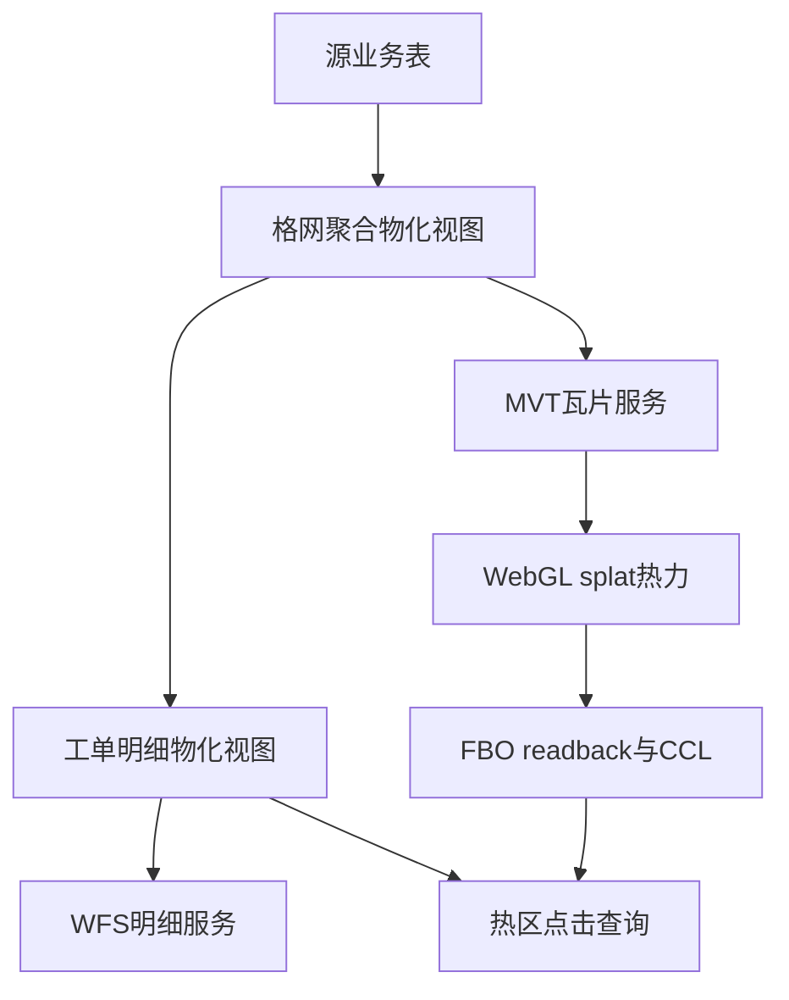
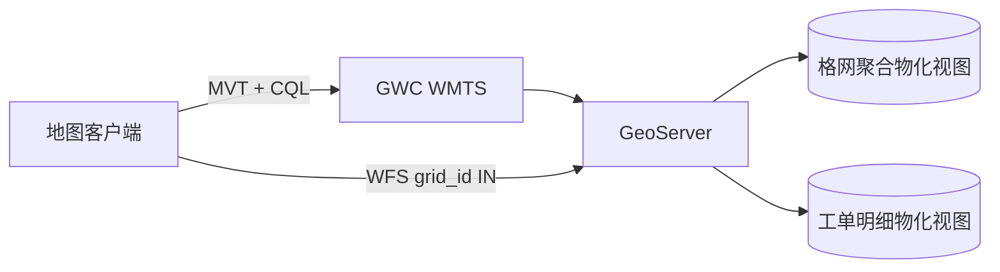
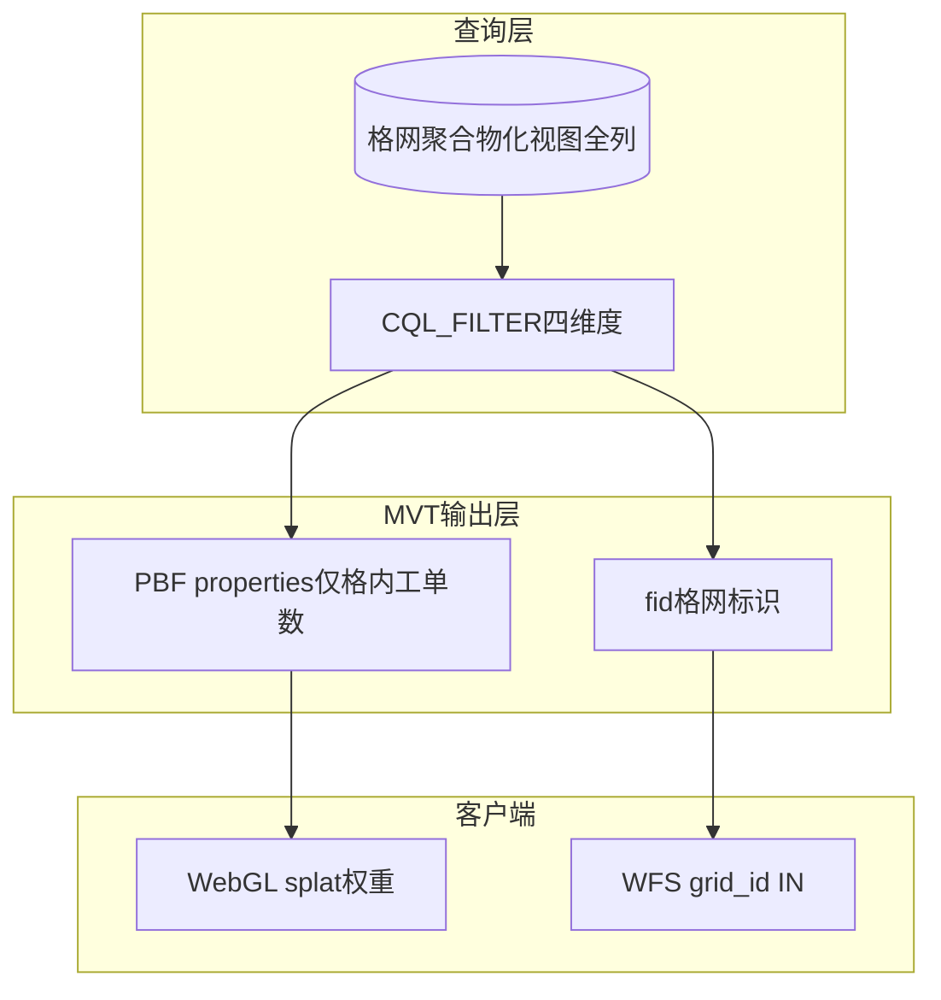
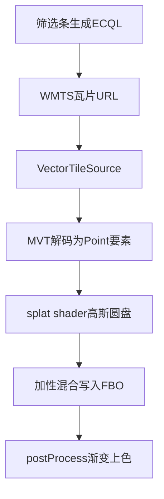
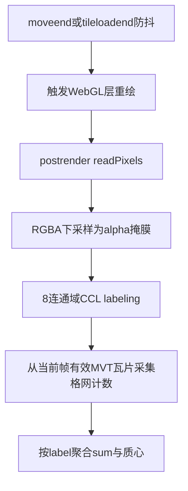

# MVT WebGL 热力图 + 连通域热区（CCL）— 博客合集 Agent 指南

本目录存放**独立技术博客系列**，记录「海量点数据 → 格网预聚合 → MVT 矢量瓦片热力 → GPU splat 渲染 → FBO 热区识别（CCL）→ 点击获取热区工单明细」的端到端方案。

**目标**：读者或其他公司的 AI / Agent 阅读本合集后，能据此拆解实施计划、编写操作手册，并结合自身项目实现前端核心能力。**不要求**复制粘贴任何特定仓库代码。

---

## 1. 合集元信息

### 1.1 定位


| 阶段     | 能力                                                               |
| ------ | ---------------------------------------------------------------- |
| 数据     | 双物化视图：格网聚合 + 工单明细；源数据更新后有明确刷新顺序                                  |
| 服务     | MVT 矢量瓦片（热力）+ GWC WMTS 缓存 + **MVT GetTile 输出属性裁剪**（PBF 仅格内工单数 + 格网标识 fid）+ WFS（按需明细） |
| 前端（渲染） | 自定义 WebGL 矢量瓦片层 + splat shader + gradient 后处理                    |
| 前端（热区） | FBO readback → 8-连通域标注（CCL）→ Overlay / ImageCanvas 绘制 → 热区点击 WFS |


**CCL（Connected Component Labeling，连通分量标记 / 连通域标注）**：热区识别本质是对 GPU 上色后的 alpha 掩膜做像素级连通域分割。写作时可引用**中文讲解类**文章说明算法概念，推荐：

- 主引用：[二值图像的连通域标记（炸鸡人博客）](https://zhajiman.github.io/post/connected_component_labelling/) — Seed-Filling（BFS/DFS）、Two-Pass、8 邻域、标签图语义，与浏览器侧 BFS 实现最贴近
- 辅引用：[连通域的原理与 Python 实现（火山引擎开发者社区）](https://developer.volcengine.com/articles/7385112150811656242) — 4 邻接 vs 8 邻接概念、两遍扫描与种子填充法概览


### 1.2 目标读者（仅 Agent 内化，勿写入正式博文）

下列读者画像供 Agent 调整各篇深度、侧重点与术语粒度；**正式博文正文不写**「面向 xxx 读者」类表述。

- 架构师 / GIS 工程师：理解数据与服务分工、选型依据
- 前端工程师（OpenLayers + WebGL）：实现渲染管线与热区识别绘制


### 1.3 写作目标

- **讲透彻**：多用 mermaid 流程图、架构图、对比表；少贴大段源码
- **可复用**：抽象业务字段、泛化技术名词；读者换库换库表仍能套用思路
- **有依据**：凡未使用 OpenLayers 开箱能力之处，须结合 `ol/`* 源码说明「为何不能直接用、如何扩展」


### 1.4 Dev-Wiki 惯例

- 博文以 **Markdown** 存于本目录；系列配图放 `[assets/](./assets/)`（按需创建）
- 合集内交叉引用使用 **绝对路径**，例如 `[/Blog/mvt-webgl_heatmap-ccl/01-数据层-双物化视图.md](/Blog/mvt-webgl_heatmap-ccl/01-数据层-双物化视图.md)`
- 勿使用 Obsidian `[[wikilink]]` 语法


### 1.5 系列目录（5 篇）


| 序号  | 文件名                                                                            | 标题方向                                    |
| --- | ------------------------------------------------------------------------------ | --------------------------------------- |
| 00  | `[百万级点数据：MVT + WebGL 热力渲染与 FBO 连通域热区工单统计.md](/Blog/mvt-webgl_heatmap-ccl/百万级点数据：MVT + WebGL 热力渲染与 FBO 连通域热区工单统计.md)` | 端到端架构、选型决策表、各篇导航；MVT/WebGL 热力、FBO 连通域热区工单统计 |
| 01  | `[01-数据层-双物化视图.md](/Blog/mvt-webgl_heatmap-ccl/01-数据层-双物化视图.md)`               | 为何两个 MV；格网标识与索引设计；源数据更新后的刷新顺序（正文章节，非标题） |
| 02  | `[02-服务层-MVT瓦片与按需明细查询.md](/Blog/mvt-webgl_heatmap-ccl/02-服务层-MVT瓦片与按需明细查询.md)` | 查询层 vs 输出层；**MVT 属性裁剪**与瓦片体积优化；MVT/WFS 分工 |
| 03  | `[03-前端-热力图WebGL渲染管线.md](/Blog/mvt-webgl_heatmap-ccl/03-前端-热力图WebGL渲染管线.md)`   | 不用内置 Heatmap；**OL 覆写表**（postProcesses / AsShaders）；管线；瓦片融合 |
| 04  | `[04-前端-热区识别、计算与绘制.md](/Blog/mvt-webgl_heatmap-ccl/04-前端-热区识别、计算与绘制.md)`       | 承接 03 覆写后的热区能力；FBO+CCL；ImageCanvas 边界；点击与双 MV          |


**本次 Agent 任务边界**：仅维护本 `AGENTS.md`；各篇 `.md` 正文由后续迭代撰写。


### 1.6 本系列验证环境（背景环境基准）

实现向博文（**01–04**）正文**开篇**（导语或第一章之前）须列出**本篇所依赖**的运行环境与版本，避免读者误用文档或 API。**00** 篇给出下表**全集**；后续各篇仅复述与本篇相关的子集。

| 组件 | 本系列验证/锁定值 | 博文写法 |
| --- | --- | --- |
| **PostgreSQL** | 关系型库（版本以部署为准） | **01** 篇必写；说明需 **PostGIS** 扩展 |
| **PostGIS** | 空间扩展（物化视图、`ST_*` 格网聚合） | 与 PostgreSQL 同节列出；**不写**连接串 |
| **GeoServer** | **2.24.x**（实现环境 **2.24.2**；文档见 **§2.2.1**） | **02** 篇必写；可注明 Vector Tiles 扩展 |
| **GeoWebCache** | 随 GeoServer 2.24.x | **02** 篇与 GeoServer 同节 |
| **OpenLayers** | **10.6.1**（与 **§5** 锁定一致） | **03**、**04** 篇必写 |
| **宿主地图 CRS** | 与实现一致，**不写死** EPSG 代号 | **03** 篇可一句带过「GridSet 与 view CRS 对齐」 |

**原则**：

- 写**验证过的主版本**（如 OL `10.6.1`、GeoServer `2.24.2`），并注明「其它小版本需自行回归」；
- PostgreSQL/PostGIS 若无统一小版本号，写 **「PostgreSQL + PostGIS（需支持物化视图与空间函数）」**，勿编造 PG 15/16 等未在仓库文档固化的数字；
- **禁止**宿主机 IP、容器名、连接串（延续 **§2.1**）。

**开篇 Markdown 模板**（Agent 复制到各篇正文最前，仅列本篇相关行）：

```markdown
## 背景环境

| 项 | 版本 / 说明 |
| --- | --- |
| … | 仅列本篇相关组件 |
```

**各篇开篇须列范围**：

| 篇 | 开篇须列 |
| --- | --- |
| **00** | **全集**基准表（上表完整 + 一句「后续各篇仅复述本篇相关子集」） |
| **01** | PostgreSQL、PostGIS；物化视图能力前提 |
| **02** | GeoServer 2.24.x（2.24.2）、GWC、MVT Vector Tiles 扩展；PostGIS 为数据源（一句） |
| **03** | OpenLayers 10.6.1；WebGL 矢量瓦片相关能力前提 |
| **04** | OpenLayers 10.6.1（与 03 一致）；可注明依赖 03 同一 OL 版本 |

### 1.7 正式博文文体与用语（Agent 内化）

下列约定来自总览篇撰写与人工修订；**全系列 00–04 正文须遵守**。Definition of Done（**§8**）仅用于 Agent 写完对照自检，**勿**在正式博文文末附 DoD checklist。

| 主题 | 要求 |
| --- | --- |
| **篇序表述** | 00 称「**总览篇**」，勿写「第 0 篇」 |
| **目标读者** | 见 **§1.2**，仅 Agent 内化；正文导语与章节**不出现**受众描述 |
| **点数据用语** | 泛指海量地理点要素时用「**点数据**」，勿写「工单点」。业务记录仍可称「工单」「工单明细」「格内工单数」等抽象字段名 |
| **数据规模** | 业务场景用「**百万级别**」点数据，勿写「数十万条」 |
| **热区与缩放** | 热区连通域（CCL）与热力**同步**计算与渲染，随视口/瓦片更新；**勿**称热区为「中观」能力，**勿**写「放大后识别热区」 |
| **产品比例尺互斥** | **勿**在系列博文写具体比例尺档位下的功能互斥或自动切换（如「远比例尺显示热区数、近比例尺切换为点位」等当前项目产品策略）；属宿主产品细节，非本系列技术叙述目标 |
| **三层命名** | 分工表与架构叙述用「**数据 / 服务 / 前端**」；勿用「浏览器」作为分层名称。mermaid `subgraph` 客户端层标签用 `前端`。运行环境偶可写「地图客户端」 |
| **选型对比表** | 列名用「**方案 A / 方案 B**」，选择列写「**方案 B**」；总结段用「**改造点**」「**原因**」，勿写「一句话」 |
| **总览·数据层叙述** | 「将百万级点数据作格网聚合、减列，得到适合热力图、数据量尽可能小的物化视图」 |
| **总览·前端层叙述** | 「负责读取、解析、热力渲染、热区连通域识别与交互」 |

---


## 2. 写作禁区与独立性契约


### 2.1 禁止出现


| 类别   | 禁止内容                                                     |
| ---- | -------------------------------------------------------- |
| 项目绑定 | 任何 monorepo 名、插件目录名、内部 `status-*` / `docs/` 路径、宿主页面路径    |
| 数据泄露 | 真实数据库列名、GeoServer 工作空间/图层名、行政区业务常量表                      |
| 运维手册 | Seed 矩阵、Docker 日志轮转、宿主机 IP/端口、维护窗口 runbook、Truncate 操作细节 |
| 代码堆砌 | 可复制粘贴的完整实现；单段超过约 30 行须改为伪代码或拆图                           |


### 2.2 允许出现


| 类别       | 允许内容                                                                                                                         |
| -------- | ---------------------------------------------------------------------------------------------------------------------------- |
| 技术泛称     | 「格网聚合物化视图」「工单明细物化视图」「MVT 瓦片服务」「WebGL 矢量瓦片层」                                                                                  |
| 抽象字段     | 见第 3 节对照表                                                                                                                    |
| 数据刷新     | 概念级刷新顺序 + **示例 SQL 语句**（不含环境连接串与运维 SOP）                                                                                      |
| OL 源码    | 公开模块路径，如 `ol/layer/Heatmap.js`；Agent 查阅路径见 **§5.0**（本地 `node_modules` → GitHub `v10.6.1` 回退）；**不写**入博文                       |
| 外部权威链接   | OL 官方文档、GeoServer **2.24.x** 归档文档（见 **§2.2.1**）、中文 CCL 讲解博客等                                                                 |
| CCL 外部引用 | **优先**中文讲解博客/教程；**勿用** Wikipedia、百度百科、NVIDIA PVA、**OpenCV/CV 库 API 接口文档**（如 `docs.opencv.ac.cn` 的 `connectedComponents` 函数页） |


### 2.2.1 GeoServer 文档查阅（写作 Agent 必读）

撰写 01 / 02 篇或引用 GeoServer 能力说明时，**仅**使用 **2.24.x** 归档文档（与部署环境一致；**禁止** `docs.geoserver.org/stable`、`/latest` 或未锁定版本的主站文档）。

| 项 | 值 |
| --- | --- |
| **入口** | [GeoServer 2.24.x User Manual](https://docs-archive.geoserver.org/2.24.x/en/user/) |
| **URL 前缀** | `https://docs-archive.geoserver.org/2.24.x/en/user/` + 相对路径 |

**常用子页（相对 `en/user/`）**：

| 主题 | 相对路径 |
| --- | --- |
| Vector Tiles（MVT） | `extensions/vectortiles/index.html`（含 **Customize attributes** 概念，用于输出属性裁剪） |
| GeoWebCache | `geowebcache/index.html` |
| WFS | `services/wfs/index.html` |
| CQL / ECQL | `tutorials/cql/cql_tutorial.html` |

**硬性要求**：

- 博文与 References 中的 GeoServer 外链须落在上述 **2.24.x** 归档域下；勿链到 `stable` / `main` / 其它小版本归档。
- **开篇「背景环境」**（见 **§1.6**）：**必须**写清 GeoServer **2.24.x**（建议写实现 **2.24.2**）及文档入口 **§2.2.1**。
- **正文技术叙述**：可继续泛称「GeoServer MVT / GWC / WFS」，不必每段重复版本号；Agent 内化查阅时须锁定 2.24.x。
- **OpenLayers** 同理：**03** / **04** 开篇写 **10.6.1**（**§5**）；正文模块路径仍用 `ol/...`，不必每段重复版本号。


### 2.3 非目标（全系列）

- 筛选条 UI、视口蓝标、调参面板、右栏列表面板 — **不单独成篇**（实现相对简单；热区点击可在 04 中顺带讲）
- **比例尺档位与热区/点位等功能互斥、自动开关等产品策略** — 不写进系列博文（见 **§1.7**「产品比例尺互斥」）
- Cesium / 三维路径
- 具体行政区业务映射表全文（仅说明「需要专题/场景映射层」）

---


## 3. 抽象字段对照表

博文正文**统一使用下表左侧抽象名**，禁止出现右侧「实现侧对应」列（该列仅供写作 Agent 内化，勿写入博文）。

### 3.1 格网聚合物化视图（热力 MVT 数据源）


| 抽象名（博文用语） | 业务含义                          | 实现侧对应（勿写入博文）   |
| --------- | ----------------------------- | -------------- |
| 格心坐标      | 固定精度格网中心点（WGS84 Point）        | `geom`         |
| 格内工单数     | 该格内工单数量，作为热力权重                | `cnt`          |
| 发生年份      | 由工单创建时间解析的日历年                 | `year`         |
| 事项专题      | 由事项分类路径映射的一级专题                | `matter_topic` |
| 业务场景      | 由事项路径模式映射的场景标签；与「事发地址场景」不同    | `scene_type`   |
| 所属区县      | 工单行政区划                        | `area`         |
| 格网标识      | 整型稳定主键，供 MVT feature id 与点选反查 | `grid_id`      |


**聚合键语义**：`(格心坐标, 发生年份, 事项专题, 业务场景, 所属区县)` 唯一确定一行格网记录。

> **库表 vs MVT 输出**：上表四维度筛选列存在于格网 MV 与 **CQL 查询层**；**不出现在** MVT PBF properties（见 **§3.4**、02 篇「MVT 属性裁剪」）。

### 3.2 工单明细物化视图（WFS 数据源）


| 抽象名    | 业务含义               |
| ------ | ------------------ |
| 工单主键   | 单条工单唯一 ID          |
| 关联格网标识 | 指向格网聚合行，支撑热区点击批量反查 |
| 发生年份   | 与聚合维度一致，供视口筛选      |
| 业务场景   | 与聚合维度一致            |
| 事项名称路径 | 多级事项分类全文，供统计下钻     |
| 其余业务属性 | 列表/详情展示（地址、时间、状态等） |


### 3.3 前端运行时概念


| 抽象名   | 含义                       |
| ----- | ------------------------ |
| 筛选表达式 | 专题/场景/年份/区县多选组合的服务端 ECQL；**主要**下推至 MVT `CQL_FILTER`（列名在查询层；**不**从瓦片 properties 读取）。**热区点击 WFS** 不携带该四维度表达式 |
| 热力权重  | 格内工单数经上限归一化后的 splat 强度   |
| 热区阈值  | GPU 上色后 alpha 达到「算热区」的门槛 |
| 热区合计  | 连通域内归属格网的工单数之和           |
| 连通域标签 | CCL 算法输出的像素域 ID（labelId） |


### 3.4 MVT 瓦片输出契约（与库表分离）

博文须区分 **PostGIS / CQL 查询层** 与 **GetTile PBF 输出层**；勿让读者误以为瓦片内携带格网 MV 全部列。


| 抽象概念 | 博文表述 |
| --- | --- |
| 库表 / CQL 查询层 | 格网聚合物化视图仍含四维度筛选列 + 格内工单数 + 格网标识；`CQL_FILTER` 仍引用四维度列名 |
| MVT PBF properties | **仅**「格内工单数」 |
| MVT feature id | 「格网标识」（整型） |
| 前端不得假设 | 从瓦片 properties 读取发生年份 / 事项专题 / 业务场景 / 所属区县 |
| 工单明细 | 热区点击、列表详情走 **独立 WFS 图层**（工单明细物化视图），不受热力 MVT 裁剪影响 |

**写作提示**：GeoServer 图层 **Customize attributes**（概念，见 02 篇 §8）仅勾选「格内工单数」；格网标识须能解析为 MVT **数字 fid**（常见为 `UNIQUE (格网标识)` 供自动推断，见 01 §C）。发布配置变更后须**失效并重预热服务端瓦片缓存**（概念一句，不写 Truncate/Seed 手册）。

### 3.5 WFS 查询分工（勿与 MVT CQL 混写）

| 路径 | 系列重点 | 博文 CQL / 筛选 |
| --- | --- | --- |
| **热区点击下钻** | 04 篇主路径 | **仅** `关联格网标识 IN (...)`；**不**再附带专题/场景/年份/区县 ECQL |
| **视口类查询** | 非重点，总览可一句 | `BBOX(几何,…)` + 筛选维度（若产品实现该路径） |

**写作提示**：勿写「前端筛选表达式同时作用于 MVT 与全部 WFS」；热力筛选走 MVT；热区下钻 WFS 以格网标识列表为准（筛选已在 MVT 层体现于当前热区几何）。


---


## 4. 各篇写作大纲

每篇须包含：**背景环境**（开篇，见 **§1.6**）、必写章节、必配图（≥2 张 mermaid 或等效图）、交叉引用。各篇大纲中的**目标读者**与 **§8 DoD** 仅供 Agent 内化（见 **§1.2**、**§1.7**），**勿**写入正式博文正文。

---


### 4.0 总览 — `百万级点数据：MVT + WebGL 热力渲染与 FBO 连通域热区工单统计.md`

> **目标读者（Agent 内化）**：技术负责人、全栈/GIS 架构师。

**必写章节**：

0. **背景环境**（开篇 **§1.6** 全集基准表 + 一句「后续各篇仅复述本篇相关子集」）
1. 业务问题：百万级别点数据，需热力展示 + 热区连通域标注（与热力同步，非「放大后识别」）+ 点击查明细
2. 三层分工：数据预聚合 → 瓦片服务 → **前端** GPU 渲染 + CPU 后分析（见 **§1.7** 三层命名与叙述模板）
3. 端到端数据流（主流程 mermaid）
4. 选型决策表（≥3 行对比；列名 **方案 A / 方案 B**，见 **§1.7**）：
  - 内置 `ol/layer/Heatmap` vs MVT + 自定义 WebGL
  - 栅格 WMS 热力 vs MVT 矢量瓦片
  - 单物化视图 vs 双物化视图
5. 系列导航：链接 01–04（绝对路径）

**文体**：导语称「**总览篇**」；遵守 **§1.7**；**勿**附文末 DoD。

**必配图**：




**交叉引用**：01（双 MV）、02（MVT/WFS）、03（渲染）、04（热区）。

**DoD**：

- [ ] 开篇「背景环境」表（**§1.6** 全集基准表）
- [ ] 无 monorepo / 真实字段名
- [ ] 含 01–04 绝对路径链接
- [ ] ≥2 张 mermaid + ≥1 张选型对比表

---


### 4.1 数据层 — `01-数据层-双物化视图.md`

**目标读者（Agent 内化）**：数据工程师、后端、需理解热力数据模型的前端。

**必写章节**：

0. **背景环境**（开篇：**PostgreSQL**、**PostGIS**；物化视图能力前提，见 **§1.6**）

#### A. 为何需要两个物化视图


| 视图       | 职责                | 为何独立                                |
| -------- | ----------------- | ----------------------------------- |
| 格网聚合物化视图 | 格心 + 格内工单数 + 筛选维度 | MVT 只适合轻量几何与少量属性；百万级格网必须服务端预聚合      |
| 工单明细物化视图 | 单条工单完整属性 + 关联格网标识 | 热力展示只需计数；热区点击需 WFS 拉明细，不能把全部列塞进 MVT |


#### B. 格网标识稳定性

- 同一业务格网：刷新后 **格网标识不变**，**格内工单数可变**
- 热区点击 `关联格网标识 IN (...)` 依赖此稳定性


#### C. 格网标识为何必须进热力 MVT（与服务层 02 呼应）

- Mapbox Vector Tile 规范要求要素 **数字型 feature id**
- 若 GeoServer 无法从库表取得稳定整型 id，会反复输出 `Cannot obtain numeric id` 类 WARN，**容器 stdout 日志暴涨**
- 博文可引用：
  - [GeoServer 2.24.x · Vector Tiles](https://docs-archive.geoserver.org/2.24.x/en/user/extensions/vectortiles/index.html)（全文 GeoServer 引用见 **§2.2.1**）
  - 社区讨论：合成字符串 FID 无法映射为 MVT 数字 id 的问题（搜索关键词：`geoserver mvt numeric id`）
- **结论**：格网聚合物化视图须物化 **整型格网标识** 列，并确保 GeoServer 能解析为 MVT **数字 fid**（常见做法：`UNIQUE (格网标识)` 供自动推断；**勿**再为业务聚合键建 UNIQUE 索引，见 §D）
- **库表 ≠ PBF**：格网 MV **库内仍物化**四维度列供 CQL；**不等于** MVT 瓦片内携带这些列（详见 02 篇「MVT 属性裁剪」）


#### D. 索引设计（概念，勿写运维 DDL 手册）

博文须说明「为何建这些索引」，用抽象字段名，可配对比表。

**格网聚合物化视图**


| 索引类型            | 作用对象（抽象）                  | 设计动机                                                                                           |
| --------------- | ------------------------- | ---------------------------------------------------------------------------------------------- |
| 空间索引            | 格心坐标                      | 加速 MV 构建时的空间聚合、extent 统计与库内排查                                                                  |
| 复合 / 单列 B-tree  | 发生年份、事项专题、业务场景、所属区县       | 与前端 ECQL 筛选维度对齐，加速带筛选条件的查询与校验                                                                  |
| **唯一**索引        | 格网标识                      | MVT 数字 feature id、热区 `关联格网标识 IN (...)` 反查；`REFRESH` 后标识稳定依赖物化列 + 唯一约束语义                        |
| **不建**业务聚合键唯一索引 | `(格心, 年份, 专题, 场景, 区县)` 组合 | 业务键在 `GROUP BY` 下已逻辑唯一，但**不宜**再暴露为库表 UNIQUE 供 GeoServer 误推主键；格网标识列单独承担 MVT 数字 fid（与 §C、02 篇呼应）。误建该 UNIQUE 会导致 GeoServer **非预期**仅输出格内工单数（**故障**，与 02 篇主动 **Customize attributes** 裁剪区分） |

**PostGIS Store 前置（02 篇可一句）**：DataStore **勿开启**「暴露主键」（Expose primary keys）；保持默认**不暴露**。若误将几何列与业务键一同暴露为主键，可能引发 WFS / WKB 解析类错误——与「业务聚合键 UNIQUE 误隐藏列」为**不同**故障路径。


**工单明细物化视图**


| 索引类型          | 作用对象（抽象）            | 设计动机                                                |
| ------------- | ------------------- | --------------------------------------------------- |
| 唯一索引          | 工单主键                | 行级唯一、`REFRESH MATERIALIZED VIEW CONCURRENTLY` 的前置条件 |
| B-tree        | 关联格网标识              | 热区点击 WFS：`关联格网标识 IN (...)` 批量反查                     |
| 复合 B-tree（按需） | 业务场景、发生年份、所属区县 + 空间 | 视口类 WFS 的 `BBOX + 筛选`（本系列非重点，可一句带过）                 |
| 空间索引          | 工单几何                | 视口 `BBOX` 查询（若明细层承担该路径）                             |


**与刷新策略的关系**（衔接 §E，不在此展开运维）：

- 格网 MV 常因无合适 **CONCURRENTLY** 唯一键而用普通 `REFRESH`
- 工单明细 MV 在 **工单主键唯一索引** 存在时，可在格网 MV 刷新完成后 `CONCURRENTLY` 刷新

**必配图（建议）**：双 MV 各建哪些索引、服务查询路径（MVT CQL / WFS `IN` / WFS `BBOX`）指向哪些索引的示意表或简图。

#### E. 源数据更新后的刷新顺序

**概念流程**：


**顺序原因**：工单明细 MV 通过 JOIN/关联从格网聚合 MV 取得「关联格网标识」；必须先有最新格网维度，再刷新明细，否则关联错位或缺失。

**示例 SQL（博文须写出，但不展开运维）**：

```sql
-- 步骤 1：刷新格网聚合物化视图（普通 REFRESH，不改变已有格网标识）
REFRESH MATERIALIZED VIEW 格网聚合物化视图;

-- 步骤 2：在步骤 1 完成后刷新工单明细（依赖最新格网标识）
REFRESH MATERIALIZED VIEW CONCURRENTLY 工单明细物化视图;
```

**补充说明（概念级）**：

- 格网 MV 通常 **不支持** CONCURRENTLY（或无唯一业务键索引），用普通 `REFRESH`
- 工单明细 MV 在工单主键上有唯一索引时，可用 `CONCURRENTLY` 降低锁表影响
- 刷新后瓦片内 `格内工单数` 需与服务端缓存一致 — 02 篇一句带过「瓦片需与库一致」，**不写** Truncate/Seed 步骤

**非目标**：GWC Truncate、GeoServer Reload、Seed 矩阵。

**交叉引用**：02（格网标识作 MVT feature id、CQL 与索引维度）、04（热区点击反查）。

**DoD**：

- [ ] 开篇「背景环境」表（**§1.6**：PG/PostGIS）
- [ ] 双 MV 职责对比表
- [ ] 索引设计表（格网 MV + 工单 MV）及设计动机
- [ ] 刷新顺序 mermaid + 两条示例 SQL（作为正文章节，标题不含「刷新顺序」）
- [ ] 格网标识稳定性 + MVT 数字 id 必要性（含外部链接）
- [ ] 无真实表名/列名

---


### 4.2 服务层 — `02-服务层-MVT瓦片与按需明细查询.md`

**目标读者（Agent 内化）**：GIS 服务工程师、需对接瓦片 URL 的前端。

**必写章节**：

0. **背景环境**（开篇：**GeoServer 2.24.x**（2.24.2）、**GWC**、MVT Vector Tiles 扩展；PostGIS 为数据源一句，见 **§1.6**）
1. **为何 MVT 矢量瓦片**：格网为 Point 要素，按视口分块；比栅格 WMS 更适合动态 CQL 筛选
2. **GWC WMTS + CQL_FILTER**：
  - **GWC Tile Layer 的 GridSet 须与宿主地图 view 所用 CRS 一致**（`TILEMATRIXSET` / `projection` 与 OL `View` 对齐），无需瓦片在客户端重投影，减少计算开销
  - 筛选参数进入 URL，不同 ECQL 组合可独立缓存
  - **写作约束**：博文**勿写死**某一 EPSG 代号；若需举例，可用「如 CGCS2000 / Web Mercator」等占位并注明「以宿主 CRS 为准」
3. **Seed 范围（概念）**：
  - 须设置与实际业务数据范围一致的 **Bounding box**（可略宽于数据 extent，用于规避离群点撑大图层边框）
  - 避免对无数据区域 Seed，否则耗时长且产生无用瓦片
  - **不写**具体 Seed 命令与矩阵
4. **Parameter Filter**：放开 `CQL_FILTER`，支撑前端四维度多选下推
5. **格网标识作为 MVT feature id**：与 01 呼应；支撑热区 `关联格网标识 IN (...)`
6. **WFS 独立图层**：热区点击 / 按需 BBOX；不把全量明细列塞进 MVT
7. **bbox 门控**：数据范围外 `tileUrlFunction` 返回空，不请求瓦片
8. **MVT 属性裁剪（查询层 vs 输出层）**：
  - **问题**：低 zoom（如 z=8）密集格网瓦片体积大、传输慢、GWC 磁盘占用高；根因之一是 PBF 内每个 feature 重复携带四列字符串筛选属性，而前端热力**不读取**这些字段
  - **原则**：**查询层全列、输出层瘦身** — CQL 在 GeoServer 查询层过滤；PBF 只带 splat 权重与反查必需的格网标识 fid
  - **手段（概念）**：图层 **Customize attributes**（GeoServer 2.24.x Vector Tiles，见 **§2.2.1**）仅保留「格内工单数」；格网标识须能解析为 MVT **数字 fid**（常见为 `UNIQUE (格网标识)` 供自动推断，见 01 §C）（不写管理页逐步截图级 SOP）
  - **缓存一致性（概念一句）**：发布配置变更后，**须失效并重预热服务端瓦片缓存**，否则 GWC 仍可能返回含旧属性的瓦片 — **不写** Truncate/Seed 命令与矩阵（遵守 §2.1）
  - **主动裁剪 vs 故障**（必写对比表）：

| 情形 | 原因 | 是否预期 |
| --- | --- | --- |
| 业务聚合键 UNIQUE 索引导致属性只剩格内工单数 | GeoServer 误隐藏列 | **故障**（见 01 §D） |
| PostGIS Store 误开启「暴露主键」 | 几何列与 PK 分量冲突等 | **故障**（见 01 §D Store 前置） |
| Customize attributes 仅勾选格内工单数 | 主动减小 PBF 体积 | **预期** |

  - **效果（博文可写，勿写宿主机路径 / GWC 目录 tree_stats）**：属性裁剪后**显著减小体积**（本文项目业务数据背景下实测约 **26%**，读者需自行回归）；低 zoom、格网密集瓦片收益更明显。勿引用 GWC 某 zoom 段目录总量或单环境磁盘快照作通用结论。
  - **前端契约**：热力权重 ← PBF properties「格内工单数」；热区点击 WFS ← `关联格网标识 IN (...)`（**不**重复四维度 ECQL）；四维度筛选 ← MVT URL `CQL_FILTER`（**不读**瓦片 properties）。见 **§3.5**

**必配图**：



**查询层 vs 输出层（必配图 2）**：




**交叉引用**：01（格网标识、索引故障区分）、03（瓦片解码仅读格内工单数 + fid）、04（WFS 点击）。

**外部文档**：GeoServer MVT / GWC / WFS / CQL 说明引用 **§2.2.1**（锁定 [2.24.x User Manual](https://docs-archive.geoserver.org/2.24.x/en/user/)）。

**DoD**：

- [ ] 开篇「背景环境」表（**§1.6**：GeoServer 2.24.x 背景环境）
- [ ] GridSet 与宿主地图 CRS 对齐动机讲清（泛化表述，不写死 EPSG 代号）
- [ ] Seed bbox 原则（无操作手册）
- [ ] MVT vs WFS 分工表
- [ ] **查询层 vs 输出层**对照 + **主动裁剪 vs 故障**区分表（§8）
- [ ] MVT 输出契约（仅格内工单数 property + 格网标识 fid，见 §3.4）
- [ ] 瓦片体积优化动机与缩减效果（显著减小 + 可写本项目约 26% 并注明读者自行回归）；禁止 GWC 目录 MiB / tree_stats 对比
- [ ] 缓存失效概念一句（无 Truncate/Seed 手册）
- [ ] GeoServer 外链落在 2.24.x 归档域（§2.2.1）
- [ ] 无图层名/工作空间名

---


### 4.3 前端（上）— `03-前端-热力图WebGL渲染管线.md`

**目标读者（Agent 内化）**：OpenLayers + WebGL 前端工程师。

**必写章节**（须满足 **OL 源码三段论**，见第 5 节）：

0. **背景环境**（开篇：**OpenLayers 10.6.1**；WebGL 矢量瓦片相关能力前提；GridSet 与 view CRS 对齐可一句带过，见 **§1.6**）

#### A. 为何不用 `ol/layer/Heatmap`

对照 `ol/layer/Heatmap.js`：


| 内置 Heatmap 假设                                   | 本方案现实                             |
| ----------------------------------------------- | --------------------------------- |
| 绑定 `ol/source/Vector`，全量要素在内存                   | 数据来自 **MVT 矢量瓦片**，按视口分页           |
| `createRenderer()` → `WebGLVectorLayerRenderer` | 需要 `WebGLVectorTileLayerRenderer` |
| 无瓦片生命周期                                         | 须处理瓦片加载/淘汰/CQL refresh            |


**结论**：复用 `Heatmap.js` 内 **splat shader 数学** 与 **postProcesses gradient**，但挂载到 **矢量瓦片 WebGL 层**；**不能**直接 `new Heatmap({ source: vectorTileSource })`（类型与 renderer 路径均不匹配）。

#### B. OL 覆写与扩展：原因与实现能力

博文须用**对比表 + 1 段总结**讲清：本方案在哪些点**未使用** OL 开箱类/构造参数，而是通过**子类继承、复刻 Heatmap 管线、组装 postProcess** 才跑通；**勿**在本节展开 Overlay / ImageCanvas 等标准组合用法，**勿**展开 `readPixels`、`sourceTiles_` 等读内部状态细节（留给 04 篇识别管线一笔带过即可）。

| 扩展点 | 未覆写 / 未扩展时的缺口（对照 `Heatmap.js` 或 `WebGLVectorTile`） | 本方案做法（概念级，不写仓库路径） | 覆写后实现的能力 |
| --- | --- | --- | --- |
| **不用 `ol/layer/Heatmap`** | 内置层绑定 `ol/source/Vector`，`createRenderer()` 走 `WebGLVectorLayerRenderer`；无矢量瓦片生命周期 | 以 `VectorTileSource` + `WebGLVectorTile` 为宿主，**复刻** Heatmap 的 splat 与 gradient 数学，而非实例化 `Heatmap` | 百万级格网**按视口分块**加载；CQL 变更仅 `source.refresh()`，由 GPU 每帧对当前有效瓦片集重绘融合 |
| **`postProcesses` 全屏后处理** | `WebGLVectorTile` 公开 `Options` **未暴露** `postProcesses`；无后处理则 splat 仅累加 alpha，无法映射冷蓝→热红 | 自定义 `WebGLVectorTile` **子类**，覆写 `createRenderer()`，向 renderer 注入 `postProcesses_`（OL 10.6.x 最小侵入点；升级须回归字段名） | 与内置 Heatmap **同构**的「splat 加性混合 → gradient 纹理上色」；**同一 WebGL 层**产出可供 04 篇做 alpha 阈值的热力图画面（见 04 §B 衔接） |
| **`AsShaders` 形式 style** | 公开类型将 `style` 收窄为 `FlatStyleLike`；Heatmap 实际走 `ShaderBuilder` + `AsShaders` 分支 | `buildHeatmapShaderStyle` 用公开 `ShaderBuilder` / `compileUtil` **复刻** `Heatmap.js#createRenderer` 中 splat GLSL；构造子类时以类型断言传入 | 按要素属性（格内工单数）计算 **per-feature weight**；`radius` / `blur` 以 uniform 注入，与调参面板联动 |
| **gradient 纹理与 postProcess shader** | 内置 Heatmap 在 `createRenderer` 内闭包创建 `createGradient(colors)` 与 fragmentShader | `createHeatmapGradient` 复刻 1×256 色带 canvas；在图层选项中组装 `postProcesses`（`u_gradientTexture`、`u_opacity`） | 色带可配置；整体透明度可调；视觉与 GeoServer/产品色带对齐 |
| **WebGL 层销毁** | `WebGLVectorTile` 须显式 `dispose()` 释放 GL context / FBO / postProcess 纹理，否则泄漏 | `removeLayer` 后调用 `webglLayer.dispose()`（公开 API） | 插件关闭 / 离页后 GPU 资源可回收；与 04 篇 FBO 管线生命周期一致 |

**必写一段（原因 → 能力）**：内置 Heatmap 把「矢量全量 + splat + gradient」封在一层里；本方案数据在 **MVT 瓦片**上，必须把 Heatmap 的 **GPU 数学**拆出来绑到 **WebGLVectorTile**，并用子类补上官方未导出的 **postProcesses** 能力，才能得到**可瓦片化、可 CQL 刷新、可后处理上色**的热力层——这也是 04 篇热区识别能 threshold **屏幕所见 alpha** 的前提。

**OL 版本锁定**：`postProcesses_` 注入依赖 `ol/renderer/webgl/Layer.js` 私有字段；`AsShaders` 断言依赖 `WebGLVectorTileLayerRenderer.applyOptions_` 运行时分支。博文须注明锁定 **OL 10.6.1**，升级须回归上述扩展点。

#### C. 渲染管线




#### D. 新瓦片如何融入已有热力

- **无手写 CPU 融合循环**
- 每帧 WebGL 对 **当前有效瓦片集** 重新 splat 到同一 FBO，加性混合即「融合」
- CQL 变更：仅 `source.refresh()`，OL 重拉视口瓦片并重绘
- **MVT 契约**：瓦片解码后前端**只消费**「格内工单数」（splat weight）与 feature id（格网标识）；四维度筛选**不读**瓦片 properties，与 02 篇「MVT 属性裁剪」一致
- **错误方案对比**：在 CPU 侧合并各瓦片 feature 缓存 — 与 GPU 帧语义不一致、易与 sourceZ/CQL 错位


#### E. 其他重点

- 权重归一化：`weightCapCnt` + 曲线，防止单格过大导致全图饱和
- 博文 **§B 覆写表** 已涵盖 `postProcesses` 子类与 `AsShaders`；本节仅补充调参与生命周期，**不重复**展开标准 `VectorTileSource` / `MVT` 用法

**核心伪代码（splat，等价 Heatmap.js 思路）**：

```glsl
// 片元：高斯圆盘 splat（示意）
float t = smoothstep(0., 1., (1. - length(coordsPx * 2. / quadSize)) * blurSlope);
gl_FragColor = vec4(t * weight, ...);
```

**交叉引用**：02（WMTS/CQL、**MVT 属性裁剪契约**）、04（§B 承接 03 覆写后的热区识别与标注）。

**DoD**：

- [ ] 开篇「背景环境」表（**§1.6**：OL 10.6.1 背景环境）
- [ ] Heatmap.js vs WebGLVectorTile 对比表（§A）
- [ ] **OL 覆写与扩展表**（§B）：原因 + 覆写后能力，含 postProcesses 子类与 AsShaders 复刻
- [ ] 渲染管线 mermaid + 瓦片融合说明（§C–§D）
- [ ] ≥1 段 OL 源码三段论（Heatmap `createRenderer` 与 WebGLVectorTile 缺口）
- [ ] 无插件路径

---


### 4.4 前端（下）— `04-前端-热区识别、计算与绘制.md`

**目标读者（Agent 内化）**：需实现「看得懂的热区」与「点得中的下钻」的前端工程师。

**必写章节**：

0. **背景环境**（开篇：**OpenLayers 10.6.1**（与 03 一致）；可注明依赖 03 同一 OL 版本，见 **§1.6**）

#### A. 识别：为何 FBO readback，而非格网几何聚类

- 热区是 **splat 晕染后的视觉连通区域**，不是格网中心点的 GIS 邻接
- 阈值划在 **GPU 上色后的 alpha** 上，标注与屏幕所见一致
- **与 03 覆写的衔接**：若 03 未通过子类注入 `postProcesses` 完成 gradient 上色，则没有与屏幕一致的「上色后 alpha」语义；若退回内置 `Heatmap` + 全量 `Vector`，则无法承载 MVT 瓦片规模。04 篇的识别管线**建立在 03 §B 覆写后的同一 WebGL 热力层之上**，而非另建一套几何聚类。

#### B. 承接 03 覆写后的热区能力

博文须说明：**热区识别不是 OL 开箱能力**，而是 03 篇覆写链路在 CPU 侧的延伸。用下表写清「覆写 → 能力」，**勿**在本节展开 `readPixels` / `renderer.helper` / `sourceTiles_` 等实现细节（识别管线 mermaid 可保留节点名，正文一笔带过即可）。

| 03 覆写 / 扩展（见 03 §B） | 04 篇由此得到的能力 | 说明（概念） |
| --- | --- | --- |
| `postProcesses` + gradient 上色 | **视觉一致的热区阈值** | `regionAlphaThreshold` 作用在 postProcess 之后的 alpha，CCL 掩膜与用户所见「热斑」同源 |
| splat + 瓦片级 GPU 融合 | **连通域边界贴合晕染** | 热区轮廓来自像素域 8-连通，而非格网 Voronoi/多边形并集 |
| MVT + `AsShaders` weight | **热区合计工单数** | 连通域内按 label 聚合当前帧格网的 `格内工单数`（与 splat 权重同源数据） |
| 同一 `HeatmapMvtWebGLLayer` 实例 | **缩放 / CQL 后标注与热力同步** | `moveend` / `tileloadend` 触发重绘后重新识别；CQL 切换时先 invalidate 再 refresh 的时序与 03 瓦片语义一致 |
| 掩膜缓存 + `cpuOnly` 路径 | **仅改阈值时快速重算** | 热区阈值调参可只重跑 CCL，不必重拉 MVT（依赖已捕获的 alpha 掩膜；实现细节不写） |

**必写一段**：03 解决「瓦片化热力怎么画」；04 解决「画出来的热斑怎么标、怎么点」。二者共享**同一覆写后的 WebGL 层**；若产品只做格网中心点聚类而不走 postProcess alpha，则与 splat 视觉脱节——这是本系列坚持 FBO 掩膜路径的**产品原因**，不是 OL API 演示。

#### C. 识别管线




**CCL**：对二值/alpha 掩膜做 8-连通域标注。博文须用 1–2 段话说明：输入为阈值化掩膜、输出为 label 图（背景为 0）、8-连通与 4-连通的区别。外部引用推荐 [炸鸡人博客 · 二值图像的连通域标记](https://zhajiman.github.io/post/connected_component_labelling/)（Seed-Filling / Two-Pass 讲解 + Python 示例）；4/8 邻接概念可辅以 [火山引擎 · 连通域的原理与 Python 实现](https://developer.volcengine.com/articles/7385112150811656242)。本方案在浏览器侧用 BFS（等价 Seed-Filling 的 8 邻域蔓延）实现，**不必**调用 OpenCV / scipy 等库 API。

**格网计数采集（一笔带过）**：须与 WebGL 当前帧同一 sourceZ、同一 CQL；避免 refresh 后旧瓦片重复计数——**不写** `sourceTiles_` 遍历实现。

**性能分级**：

- 仅改热区阈值：`cpuOnly` 重跑 CCL，不重读 FBO
- 缩放换档 / 瓦片更新：全量 FBO readback


#### D. 绘制


| 能力      | 实现                                        | 为何                |
| ------- | ----------------------------------------- | ----------------- |
| 热区工单数圆标 | `ol/Overlay` DOM，质心锚点                     | 不随缩放变形；可点击下钻（**勿**在博文写具体比例尺档位策略，见 **§1.7**） |
| 热区边界    | `ol/source/ImageCanvas` + `ImageCanvas` 层 | 见下文 D             |


#### E. 为何使用 `ImageCanvasSource` 绘制热区边界

对照 `ol/source/ImageCanvas.js` 三段论：

1. **OL 源码行为**：`canvasFunction(extent, resolution, pixelRatio, size, projection)` 按当前视口 extent 生成 canvas；结果由 source **缓存**；几何变化时须 `source.changed()` 失效
2. **本方案缺口**：热区边界来自 **像素掩膜栅格的阶梯形轮廓**，不是预定义 Vector 多边形；splat 边界在像素级，矢量面难以贴合
3. **选型**：捕获时刻将 labelId>0 的栅格单元转为 **地理锚定四角**，在 canvasFunction 内绘制阶梯形边界；地图平移/缩放时 OL 自动按 extent 重绘，边界与热力 **跟手**

**对比表**：


| 方案          | 优点          | 缺点                      |
| ----------- | ----------- | ----------------------- |
| Vector 多边形  | 原生矢量编辑      | 难以表达 GPU 晕染边界；顶点多、更新成本高 |
| ImageCanvas | 像素级贴合；随视口缓存 | 需维护捕获时刻地理锚定与掩膜一致性       |


#### F. 其他难点（checklist 级须在正文展开）

- **sourceZ 对齐**：统计用 sourceZ 必须与 WebGL 矢量瓦片渲染一致（与 03 瓦片融合语义一致）
- **CQL 切换后标注短暂归零**：先 invalidate 清空 → 瓦片 refresh → `tileloadend` 后再识别（预期时序，非缺陷；与 03 `source.refresh()` 联动）
- **Overlay z-index**：圆标、高亮、定位闪烁的层叠顺序

**勿写**：空间交互锁（测量/标绘互斥）— 非本系列目标。**勿写**比例尺档位与热区/点位等功能互斥或自动切换（**§1.7**、**§2.3**）。

#### G. 热区点击查询（回扣数据层）

- 点击圆标 → WFS `关联格网标识 IN (...)` → 打开工单列表
- 说明此路径如何依赖 **01 双 MV** 设计（明细 MV 存关联格网标识）

**非目标**：筛选条、视口蓝标、调参面板、右栏列表。

**交叉引用**：01（双 MV、格网标识）、03（§B 覆写表、同一 WebGL 层 FBO / postProcess 语义）。

**DoD**：

- [ ] 开篇「背景环境」表（**§1.6**：OL 10.6.1 背景环境）
- [ ] 03 覆写衔接说明（§A–§B）+ **承接覆写后的热区能力表**
- [ ] 识别管线 mermaid + CCL 外部引用（§C）
- [ ] ImageCanvas 三段论 + 对比表（§E）
- [ ] 热区点击与双 MV 回扣（§G）
- [ ] ≥2 张 mermaid
- [ ] 无空间交互锁章节；**无** `sourceTiles_` / `readPixels` 实现展开

---


## 5. OpenLayers 源码研读指引

> **仅供写作 Agent 内化**；博文引用时只写 `ol/...` 模块路径，不写任何仓库绝对路径或 `node_modules` 路径。  
> **锁定版本**：OpenLayers **10.6.1**（与实现一致；升级须全文回归）。


### 5.0 源码查询路径（写作 Agent 必读）

撰写 03 / 04 篇或执行 OL 源码三段论时，按下列顺序查阅 **10.6.1** 源码（**禁止**误用 `main` / `latest` / 其它版本标签）：


| 优先级   | 来源                | 说明                                                                                                                                                                                                                                                                                                                                            |
| ----- | ----------------- | --------------------------------------------------------------------------------------------------------------------------------------------------------------------------------------------------------------------------------------------------------------------------------------------------------------------------------------------- |
| 1（首选） | 本机 `node_modules` | `C:\AIRace\Dev\Project\yunyan\yunyan-frontend_develop\node_modules\.pnpm\ol@10.6.1\node_modules\ol\` 下按相对路径读取，例如 `layer/Heatmap.js` 对应 `...\ol\layer\Heatmap.js`                                                                                                                                                                              |
| 2（回退） | GitHub 源码树        | 当 Agent 工具**无法访问**上述本地目录（工作区未挂载、路径不存在、沙箱不可读等）时，**必须**改用 [OpenLayers v10.6.1 ·](https://github.com/openlayers/openlayers/tree/v10.6.1/src/ol) `src/ol` 在线浏览；单文件可用 `https://github.com/openlayers/openlayers/blob/v10.6.1/src/ol/<相对路径>`（如 `[layer/Heatmap.js](https://github.com/openlayers/openlayers/blob/v10.6.1/src/ol/layer/Heatmap.js)`） |


**硬性要求**：

- 回退查询时 URL 中版本标签**只能是** `v10.6.1`，不得替换为 `master`、`main` 或 `en/latest` 对应分支。
- 本地路径与 GitHub 路径模块名一致：`ol/layer/Heatmap.js` ↔ `src/ol/layer/Heatmap.js`。
- 博文正文仍只写 `ol/...` 模块名；§5.0 的路径仅供 Agent 内化，**勿**写入对外发布的系列博文。


### 5.1 必读模块


| 模块                                     | 读什么                                                                                           | 对应博文  |
| -------------------------------------- | --------------------------------------------------------------------------------------------- | ----- |
| `ol/layer/Heatmap.js`                  | `createRenderer()`：`ShaderBuilder`、splat `smoothstep`、`postProcesses` gradient fragmentShader | 03    |
| `ol/layer/WebGLVectorTile.js`          | `createRenderer()` → `WebGLVectorTileLayerRenderer`；**无** `postProcesses` 公开入参                | 03    |
| `ol/renderer/webgl/Layer.js`           | `prepareFrame()` 读取 `postProcesses_` 构造 `WebGLHelper`                                         | 03    |
| `ol/renderer/webgl/VectorTileLayer.js` | 瓦片级 WebGL 绘制入口                                                                                | 03    |
| `ol/source/ImageCanvas.js`             | `canvasFunction` 签名、缓存、`changed()` 失效语义                                                       | 04    |
| `ol/source/VectorTile.js`              | 瓦片 LRU、`refresh()` 行为                                                                         | 03、04 |
| `ol/Overlay.js`                        | DOM 标注锚点与定位                                                                                   | 04    |


### 5.2 三段论写作模板

凡 **未直接使用 OL 开箱能力** 之处，博文须按以下结构展开（配对比表或简图）：

```text
1. OL 源码行为：<模块> 假设了什么、提供了什么
2. 本方案缺口：我们的数据形态/规模/瓦片化与上述假设哪里不一致
3. 选型/扩展：复用哪段 shader 数学 / 子类注入哪个私有扩展点 / 为何换 ImageCanvas
```

**示例提纲（03 篇）**：

- `Heatmap.js` 使用 `WebGLVectorLayerRenderer` + `postProcesses`，且 `options.source` 类型为 `Vector` → 无法直接用于 `VectorTileSource` → 自定义 `WebGLVectorTile` 子类，在 `createRenderer()` 向 renderer 写入 `postProcesses_`

**示例提纲（04 篇）**：

- `ImageCanvas.js` 按 extent 缓存 canvas → 热区边界是像素掩膜阶梯形，非静态几何 → 用 `canvasFunction` 在捕获锚定下绘制栅格边界


### 5.3 Heatmap.js 关键片段（写作引用锚点）

以下为 OL 10.6.1 行为摘要，博文可用伪代码复述：

```javascript
// ol/layer/Heatmap.js — createRenderer() 核心思路
builder.setSymbolSizeExpression(`vec2(radius + blur) * 2.`)
  .setSymbolColorExpression(`vec4(smoothstep(...) * weight)`);
return new WebGLVectorLayerRenderer(this, {
  style: { builder, attributes, uniforms },
  postProcesses: [{
    fragmentShader: `// 用累积 alpha 采样 gradient 纹理`,
  }],
});
```

---


## 6. 图表与代码规范


| 规则      | 要求                                              |
| ------- | ----------------------------------------------- |
| mermaid | 每篇 ≥2 张；总览/管线篇可 3+                              |
| 对比表     | 内置方案 vs 本方案，≥3 行                                |
| 代码块     | 伪代码或 10–30 行核心片段；标注「等价 OL Heatmap postProcess」等 |
| 外部链接    | CCL 讲解博客、GeoServer **2.24.x** MVT（§2.2.1）、OL API / 源码优先 |
| 图片      | 存 `./assets/`，Markdown 用绝对路径引用                  |


---


## 7. 关键技术概念清单（写作时按需展开）

1. 格网预聚合：点 → 格心 + 计数
2. MVT 矢量瓦片：按 z/x/y 分块 Mapbox Vector Tile
3. **MVT 属性裁剪**：查询层全列、PBF 输出仅格内工单数 + 格网标识 fid（Customize attributes）
4. **查询层与输出层分离**：CQL 引用 MV 四维度列；瓦片 properties 不携带筛选列
5. GWC WMTS + CQL_FILTER：参数化瓦片缓存键
6. **GWC 缓存与 PBF 体积**：属性裁剪后显著减小体积（本文项目业务数据背景下实测约 **26%**，读者需自行回归）；低 zoom、格网密集瓦片收益更明显（勿写 GWC 目录 MiB 快照）
7. WebGL splat + 加性混合：多瓦片权重叠加
8. Gradient post-pass：累积 alpha → 伪彩色
9. 瓦片 sourceZ：OL 为 overzoom 选择的源级 z，统计须对齐
10. FBO readback：GPU 结果 CPU 化
11. 8-连通域 CCL：像素级热区分割
12. 双查询路径：热区 `格网标识 IN` vs 视口 `BBOX + 筛选`（后者非系列重点，可一句带过）
13. 稳定格网标识：刷新后业务格不变则 ID 不变

---


## 8. 系列 Definition of Done（仅 Agent 自检，勿写入正式博文）


### 8.1 合集级（全部 5 篇完成后）

- [ ] 无 monorepo、插件目录、真实字段名、运维 SOP
- [ ] **01–04** 正文开篇含「背景环境」，且组件与 **§1.6** 一致
- [ ] **00** 含全集背景环境基准表（**§1.6**）
- [ ] 抽象字段在 01 / 04 交叉一致
- [ ] 00 含 01–04 绝对路径导航
- [ ] OL 非自带能力处均有源码三段论
- [ ] 每篇 ≥2 mermaid + 核心对比表
- [ ] 02 篇含 MVT 输出契约与属性裁剪动机（§3.4、4.2 §8）


### 8.2 分篇速查


| 篇   | 关键验收                                         |
| --- | -------------------------------------------- |
| 00  | **开篇背景环境**（§1.6 全集表）+ 端到端图 + 选型表 + 导航链接 |
| 01  | **开篇背景环境**（PG/PostGIS）+ 双 MV 表 + 索引设计 + 刷新顺序图 + 示例 SQL + 格网标识/MVT id |
| 02  | **开篇背景环境**（GeoServer 2.24.x）+ **GridSet 与宿主地图 CRS 对齐**（泛化表述）+ Seed bbox 原则 + **MVT 属性裁剪与瓦片契约** + MVT/WFS 分工 |
| 03  | **开篇背景环境**（OL 10.6.1）+ 不用 Heatmap 论证 + **§B OL 覆写表** + 渲染管线 + 瓦片融合                  |
| 04  | **开篇背景环境**（OL 10.6.1）+ **承接 03 覆写能力表** + FBO/CCL 管线 + ImageCanvas 三段论 + 热区点击回扣 01     |


---


## 9. Agent 执行顺序（写博文时）

1. 阅读本 `AGENTS.md` 全文 + **§1.7** 文体用语 + **§2.2.1** GeoServer 2.24.x 文档入口 + 第 5 节 OL 源码（含 §5.0 本地 / GitHub 回退路径）
2. **内化事实**时可对照实现侧 GeoServer MVT 稳定态说明（含 Customize attributes、查询层 vs 输出层等），但博文遵守 **§2.1**：不得出现 monorepo / 插件目录 / `status-*` 路径
3. 按 00 → 01 → 02 → 03 → 04 顺序撰写（后篇可引用前篇绝对路径）
4. 每篇写完对照第 8.2 分篇 DoD 自检（**勿**在博文文末附 DoD checklist）
5. 全文完成后对照第 8.1 合集 DoD
6. **禁止**在博文中出现实现仓库路径、目标读者表述、文末 DoD；**禁止**将 Seed/容器/runbook 扩写成运维章节

---


## 10. References（外部）

- [OpenLayers Heatmap 示例](https://openlayers.org/en/latest/examples/heatmap-earthquakes.html) — 理解内置层边界
- [OpenLayers v10.6.1 源码目录](https://github.com/openlayers/openlayers/tree/v10.6.1/src/ol) `src/ol` — 本地 `node_modules` 不可读时的**唯一**在线回退入口（须锁定 v10.6.1）
- [OpenLayers WebGLVectorTile（v10.6.1）](https://github.com/openlayers/openlayers/blob/v10.6.1/src/ol/layer/WebGLVectorTile.js) — 矢量瓦片 WebGL 层源码示例
- [GeoServer 2.24.x User Manual](https://docs-archive.geoserver.org/2.24.x/en/user/) — GeoServer 官方文档**唯一**入口（勿用 `stable` / `latest`）
- [GeoServer 2.24.x · Vector Tiles](https://docs-archive.geoserver.org/2.24.x/en/user/extensions/vectortiles/index.html)
- [二值图像的连通域标记（炸鸡人博客）](https://zhajiman.github.io/post/connected_component_labelling/) — Seed-Filling、Two-Pass、8 邻域；CCL 概念与浏览器 BFS 实现的主引用
- [连通域的原理与 Python 实现（火山引擎开发者社区）](https://developer.volcengine.com/articles/7385112150811656242) — 4/8 邻接、两遍扫描与种子填充法概览（辅引用）
- [Mapbox Vector Tile specification](https://github.com/mapbox/vector-tile-spec)

