业务需求概括：  
基于约**三百万**条量级的业务**点数据**，前端实现流畅的热力图渲染与多维筛选交互；在 splat 晕染形成的视觉热区上做连通域识别与合计标注；支持点击热区查询区内业务明细。方案采用**三格网 LOD** 预聚合、双物化视图、MVT 矢量瓦片与自定义 WebGL 渲染链路（含 **active LOD** 过滤），避免低缩放级别单档格网过密与 LOD 切换时的旧档位残留。

# 总览

本文是该解决方案博客系列的**总览篇**，给出端到端方案的总览图与关键选型依据。

本系列将讲解：海量点数据场景下，为何采用「**三格网 LOD** + 双物化视图 + 多 MVT 矢量瓦片 + 自定义 WebGL 渲染 + renderer LOD composite + FBO 热区识别」这一组合，以及后续五篇（01–05）各自解决什么问题。

---

## 背景环境

本系列在下列环境中完成验证与联调。其它小版本需自行回归。

| 项               | 版本 / 说明                                           |
| --------------- | ------------------------------------------------- |
| **PostgreSQL**  | 关系型库（版本以部署为准）；需支持物化视图                             |
| **PostGIS**     | 空间扩展；需支持物化视图与 `ST_*` 格网聚合                         |
| **GeoServer**   | **2.24.x**（实现环境 **2.24.2**）；含 Vector Tiles（MVT）扩展 |
| **GeoWebCache** | 随 GeoServer 2.24.x                                |
| **OpenLayers**  | **10.6.1**                                        |
| **宿主地图 CRS**    | 切片 GridSet 与地图 View 所用坐标系对齐                       |

> 后续各篇（01–05）正文开篇仅复述与本篇相关的子集。

---

## 1. 问题识别

典型场景是：地图上能基于**点数据**渲染热力情况；源数据经处理后或自身携带年份、事项分类、业务场景、所属区划等可筛选维度。当前方案主验证规模约**三百万**条点数据（总览标题仍用「百万级」泛指海量规模）。

需要解决的三大问题：

1. **热力展示**：做热力图渲染，支持全量数据范围查看，并提供专题、场景、年份、区县等多维筛选，但不能靠客户端全量渲染所有点（必定卡顿）  
  ➡️ 数据端对源表做**三格网 LOD**格网聚合（细 / 中 / 粗三档，结构相同、步长不同）与减列【_源数据压缩_】；服务端按视口 `sourceZ` 发布 **3 个 MVT 图层**并通过 GWC 缓存切片【_服务层预计算_】；HTTP 传输层可对 PBF 做 **gzip** 压缩（与属性裁剪、LOD **互补**，不写运维细节）。

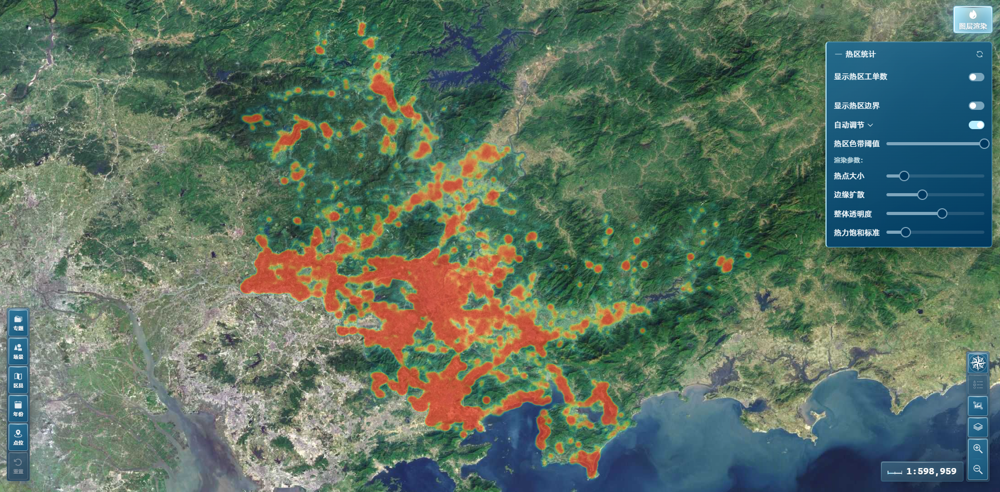

*图：主验证业务数据集下区域比例尺的 WebGL 热力渲染（splat + gradient），筛选尚未收窄至单一专题。*

2. **热区识别与标注**：基于渲染出的热力图，识别 splat 晕染形成的视觉高热区域，并显示各热区所含业务点合计  
  ➡️ 在 GPU 上色后的 alpha 掩膜上做 **8-连通域标注（CCL）**，绘制热区合计圆标与边界——与热力**同步**计算与渲染，随视口与瓦片更新而刷新；格网计数采集与 WebGL composite 共用 **active LOD** URL 过滤语义。

「热区色带阈值」决定 FBO readback 后哪些像素计入连通热区：阈值越低，掩膜覆盖范围越大，圆标与合计随之变化；在「热力饱和标准」等其它参数固定时，屏上合计可与**格网聚合物化视图**同视野聚合对齐。

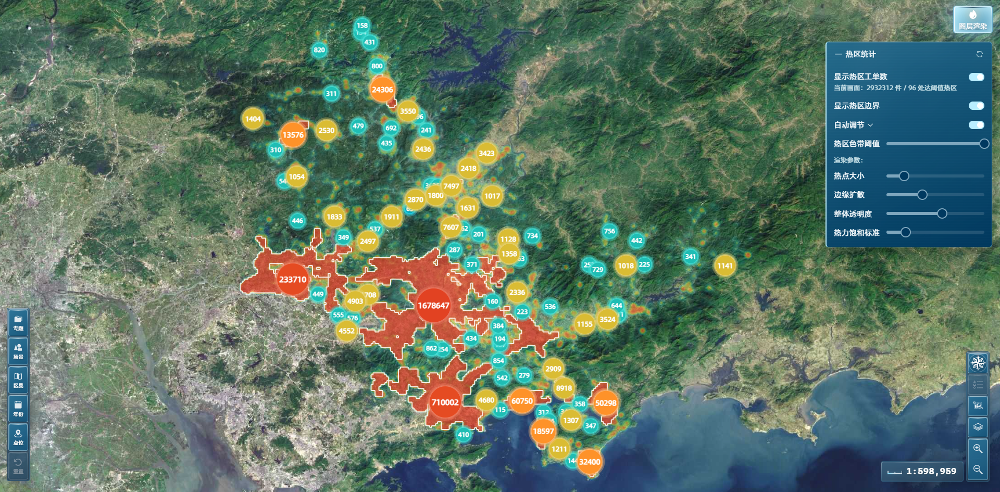

*图：与热力同步刷新的热区合计圆标与像素级边界（非格网几何聚类）。*

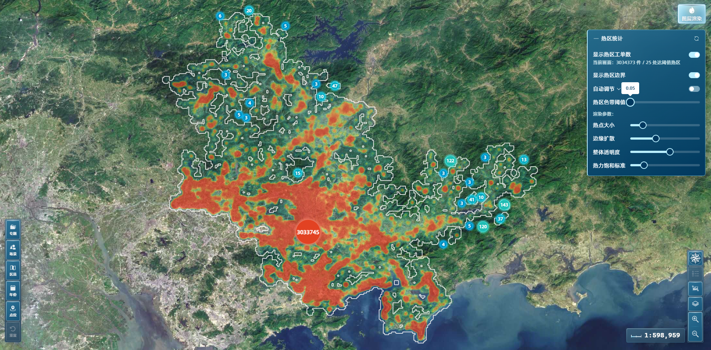

*图：关闭自动调节并降低「热区色带阈值」后，FBO 掩膜阈值放宽，识别出的连通热区范围扩大。*

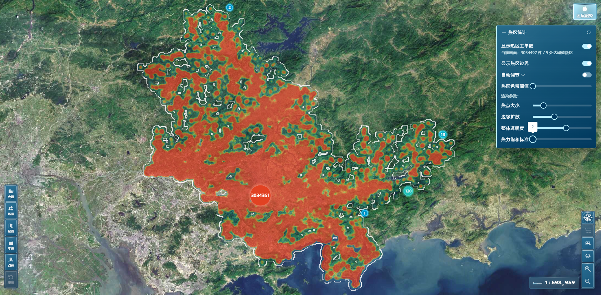

*图：在相同阈值下调整「热力饱和标准」后，屏上热区合计可与格网聚合物化视图同视野聚合合计一致，验证 CCL 与格网计数采集对齐。*

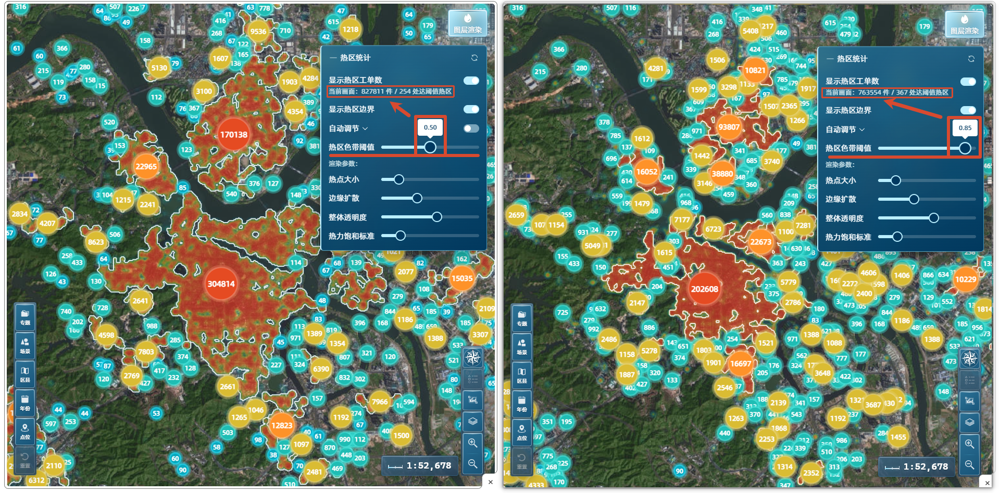

*图：相同视图下仅「热区色带阈值」不同（左低右高），CCL 掩膜与热区合计数随之变化。*

3. **热区内业务数据详情查看**：用户点击热区图标，能查看对应热区内业务点的完整属性；热力 MVT 仅携带「格内工单数」与格网标识，无法满足明细展示  
  ➡️ 另建**工单明细物化视图**，经 WFS 按「关联格网标识 IN (...)」反查。

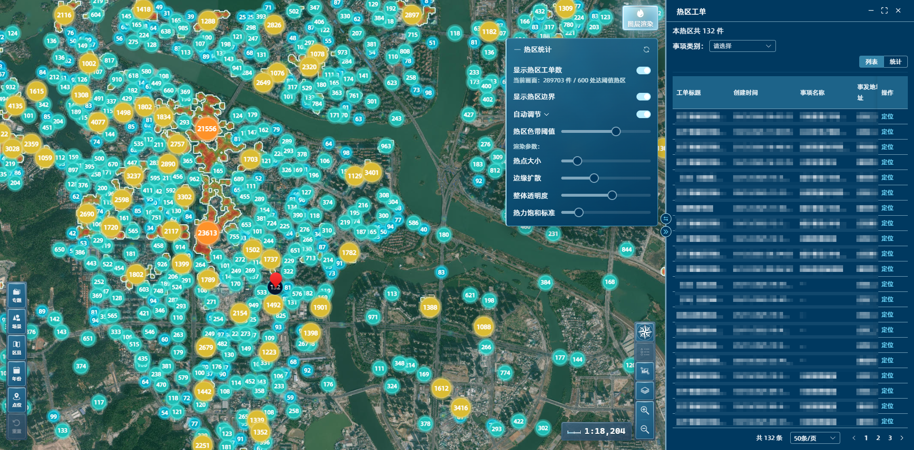

*图：热区点击经 WFS 按关联格网标识批量反查工单明细，不依赖 MVT 瓦片 properties。*

要解决的不是「画一张静态热力图」，而是贯穿数据、服务、前端的完整链路。下图概括从源数据到可交互热区的五个阶段：

---

## 2. 三层分工

方案按职责拆为三层，每层只承担自己擅长的部分：

| 层      | 职责                 | 关键技术                                                                                                                                         |
| ------ | ------------------ | -------------------------------------------------------------------------------------------------------------------------------------------- |
| **数据** | **三格网**格网预聚合 + 工单明细保留 | 每业务数据源：细 / 中 / 粗三档格网聚合物化视图 + 工单明细 MV；**格网标识**刷新后稳定、**格内工单数**可更新                                                                                                             |
| **服务** | 热力瓦片 + 按需明细        | 每数据源 **3 个 MVT 图层**（LOD 组）+ GWC WMTS + `CQL_FILTER`；**查询层**保留全列筛选，**PBF 输出**仅「格内工单数」+ 格网标识 fid；GWC 磁盘存未压缩 PBF，HTTP 层 **gzip** 可缩短传输（详见 [02-服务层-MVT瓦片与按需明细查询](https://www.cnblogs.com/zheyi420/p/22182306)） |
| **前端** | GPU 热力 + CPU 热区后分析 | `tileUrlFunction` 按 `sourceZ` 选 LOD 图层；自定义 WebGL splat + gradient 后处理；**renderer** 仅 composite active LOD 瓦片；FBO readback → CCL → Overlay / ImageCanvas；同一套 active LOD 语义用于格网计数采集                                                             |

**数据**将三百万级点数据作**三格网**格网聚合、减列，得到适合热力图、数据量尽可能小的物化视图族；**服务**按筛选条件与缩放档位切片出图并缓存；**前端**负责按 LOD 读取、解析、热力渲染、renderer 过滤 composite、热区连通域识别与交互。三层边界清晰，换业务库表时仍可套用同一架构。

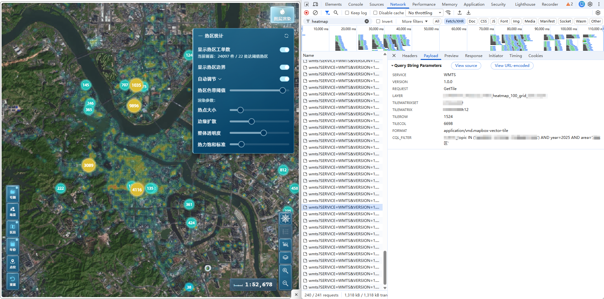

*图：数据/服务/前端分工在界面上的对应，并可见筛选下推后的 MVT 瓦片请求载荷（抽象图层与 `CQL_FILTER` 结构）。*

同一前端还可绑定**多套**「三格网 MVT + 工单 WFS」业务数据集；切换时更换 LAYER 集合并重拉视口瓦片（不写具体 UI 实现）。

各层产出与消费关系如下：

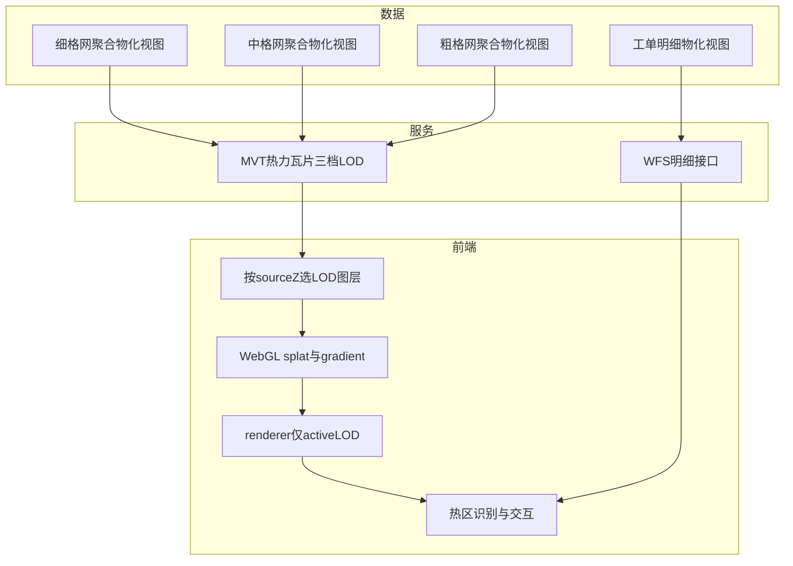

**三格网 LOD 与 `sourceZ`（抽象阈值，与实现一致）**：

| 视口 sourceZ | 对应格网档位（抽象） |
| --- | --- |
| ≥ 13 | 细格网（如 5m） |
| 11–12 | 中格网（如 100m） |
| < 11 | 粗格网（如 300m） |

---

## 3. 端到端数据流

下图展示从源数据到热区点击的主路径：

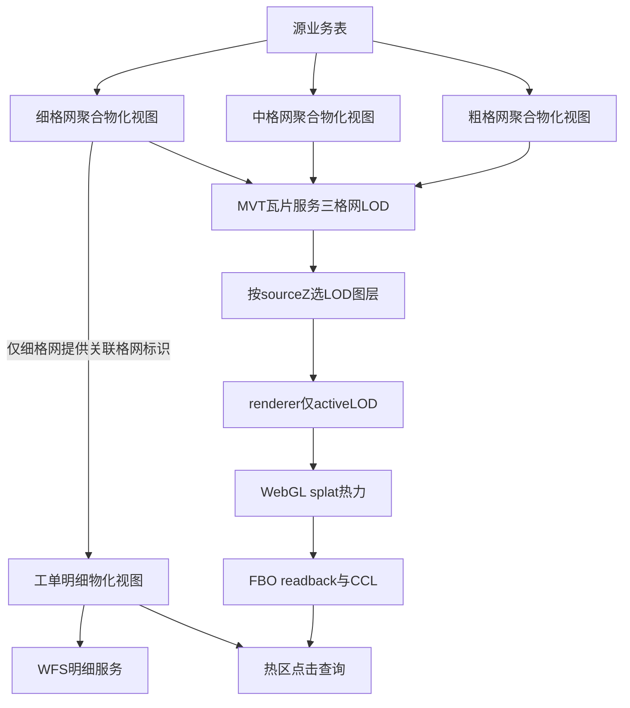

**路径说明**：

- 源业务表经 ETL 或定时任务写入**三档格网聚合物化视图**（供热力 MVT）。**工单明细物化视图**在**细格网 MV** 已存在且已刷新后构建：由源表关联细格网 MV 取得**格网标识**并保留单条业务记录完整属性——只有细格网呈现的层级才提供点击下钻，因此该关联只挂在细格网这一档上。日常数据更新时，三档格网 MV 互不依赖、**可并行刷新**；工单明细 MV 须在**细格网 MV** 刷新完成后再刷新（顺序原因见 [01-数据层-双物化视图与三格网 LOD](https://www.cnblogs.com/zheyi420/p/22182285)）。

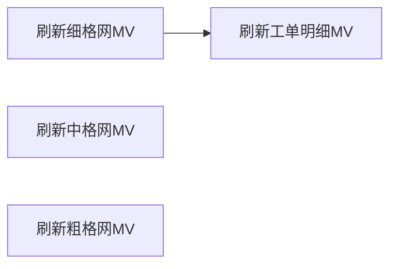

- 地图客户端经 `tileUrlFunction` 按 `sourceZ` 请求对应档位的 **MVT 瓦片**（可带 `CQL_FILTER`）；WebGL **renderer** 仅 composite 与 active LOD 一致的瓦片，避免缩放跨档时**旧档位热力/热区标注残留**（详见 [04-前端-矢量瓦片 Renderer 覆写与 LOD composite](https://www.cnblogs.com/zheyi420/p/22699358)）。
- 解码后由 WebGL 对「格内工单数」做 splat 渲染并 gradient 上色；同场景跨 LOD 缩放可保留三档瓦片缓存以加速来回缩放，由 renderer 过滤保证屏上只显示当前档。
- 瓦片就绪且热力重绘完成后，从 GPU 帧缓冲读取 alpha 掩膜，做 **8-连通域标注**；格网计数采集与 renderer 共用 active LOD URL 过滤。
- 点击圆标时，走 **WFS** 路径：`关联格网标识 IN (...)`，从工单明细物化视图拉取列表——**不**从 MVT 瓦片 properties 读取明细列。

本系列采用**双查询路径**：热力展示与下钻明细数据源、筛选契约不同，在数据层通过「格网标识」关联。

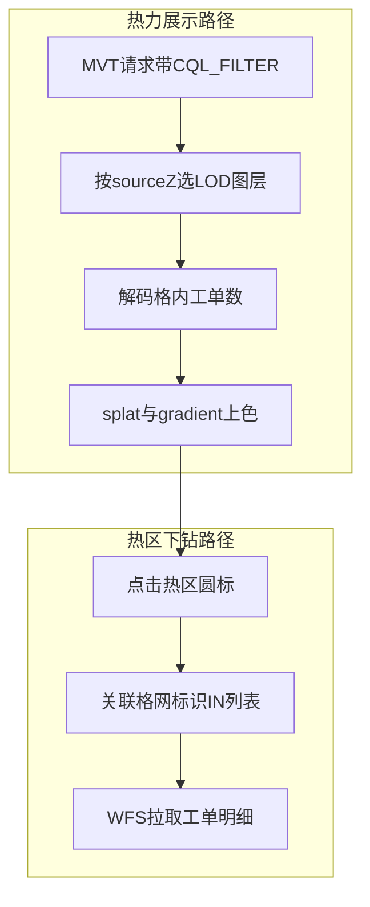

热力路径：四维度筛选下推为 MVT 的 `CQL_FILTER`。下钻路径：热区点击 **仅**按格网标识列表查询，**不**再重复四维度 ECQL（筛选已体现在当前热力 MVT 结果与热区格网集合中）。

下图与 DevTools Network 对照：热力路径以 MVT `GetTile` 为主，下钻路径在点击后出现 WFS `GetFeature`。

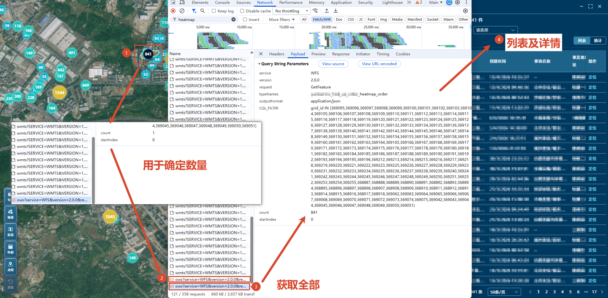

*图：Network 中热力路径（MVT GetTile）与热区下钻路径（WFS GetFeature）并行存在。*

---

## 4. 分层架构

从部署视角看，三层与两条服务出口的关系如下：

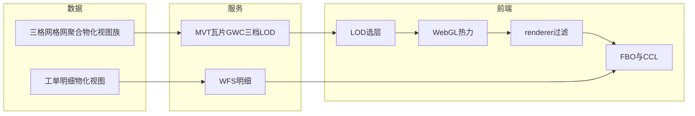

GeoServer 侧：三档格网 MV 各发布为 **MVT 矢量瓦片图层**（经 GWC 缓存）；工单 MV 发布为独立 **WFS 图层**。前端四维度筛选下推为 **MVT** 的 `CQL_FILTER`，**不**假设瓦片内携带这些筛选字段。热区点击下钻的 **WFS** **仅**按 `关联格网标识 IN (...)` 查询。

---

## 5. 选型决策

下列对比概括本系列在关键分叉上的选择及原因。详细论证见各分篇链接。

| 对比维度     | 方案 A                                | 方案 B                        | 本系列选择                                                                                                                |
| -------- | ----------------------------------- | --------------------------- | -------------------------------------------------------------------------------------------------------------------- |
| **前端热力** | 内置 `ol/layer/Heatmap` + 全量 `Vector` | MVT + 自定义 `WebGLVectorTile` | **方案 B**：内置层绑定 `Vector` 源与 `WebGLVectorLayerRenderer`，无矢量瓦片生命周期；三百万级格网须按视口分块加载                                        |
| **服务热力** | 栅格 WMS 热力图                          | MVT 格网点矢量瓦片                 | **方案 B**：格网为 Point 要素，适合按 z/x/y 分块；动态 CQL 可参数化 GWC 缓存键                                                               |
| **数据模型** | 单物化视图承载聚合与明细                        | 格网聚合 MV + 工单明细 MV           | **方案 B**：MVT 只适合轻量属性（格内工单数 + fid）；热区点击需 WFS 拉全量业务列                                                                   |
| **格网 LOD** | 单一细格网 MVT                           | 三格网 LOD（细 / 中 / 粗）+ 按 `sourceZ` 选层 | **方案 B**：低 zoom 单用细格网时单瓦片格网过密、PBF 体积与缓存压力大；粗 / 中格网降密，与视口缩放档位对齐 |
| **热区识别** | 格网中心点 GIS 聚类                        | splat 后 alpha 掩膜 + 8-连通 CCL | **方案 B**：热区是晕染后的视觉连通区域，阈值须划在 GPU 上色后的 alpha 上，标注才与屏幕所见一致（详见 [05-前端-热区识别、计算与绘制](https://www.cnblogs.com/zheyi420/p/22182374)） |

**不选内置 Heatmap 的改造点**：数据在服务端已瓦片化，客户端须复用 Heatmap 的 splat 数学，但挂载到 **WebGL 矢量瓦片层**，并补上官方未暴露的 `postProcesses` 能力——这是 [03-前端-热力图WebGL渲染管线](https://www.cnblogs.com/zheyi420/p/22182345) 的核心工作。

**不选单 MV 的原因**：把全部工单列塞进 MVT 会导致低 zoom 瓦片体积暴涨；查询层与输出层必须分离，主动裁剪 PBF 属性是预期优化，而非故障。

**三格网 LOD 的改造点**：除 URL 选层外，多 LOD 共用 `VectorTileSource` 时须 **renderer 过滤** `findAltTiles_` / `drawTile_`，仅 composite active LOD 瓦片；否则缩放跨档且新档瓦片未就绪时，屏上可能仍显示**上一档**热力与热区标注（**旧档位残留**）。这与「重复 splat 导致计数虚高」不是同一类问题——格网计数采集路径同样按 active LOD URL 过滤，与 renderer 语义一致。

---

## 6. 系列导航

按推荐阅读顺序：

| 篇      | 链接 | 本篇解决什么                                           |
| ------ | --- | ------------------------------------------------ |
| **01** | [01-数据层-双物化视图与三格网 LOD](https://www.cnblogs.com/zheyi420/p/22182285) | 双 MV + **三格网 MV 族**；格网标识与索引设计；源数据更新后的刷新顺序                   |
| **02** | [02-服务层-MVT瓦片与按需明细查询](https://www.cnblogs.com/zheyi420/p/22182306) | 三格网 LOD 发布与 `sourceZ` 阈值；查询层 vs 输出层；MVT 属性裁剪；gzip 传输一句；MVT 与 WFS 分工                 |
| **03** | [03-前端-热力图WebGL渲染管线](https://www.cnblogs.com/zheyi420/p/22182345) | 为何不用内置 Heatmap；postProcesses / AsShaders；**tileUrlFunction LOD 选层**；瓦片 GPU 融合         |
| **04** | [04-前端-矢量瓦片 Renderer 覆写与 LOD composite](https://www.cnblogs.com/zheyi420/p/22699358) | `TileLayerBase` 三段论：`findAltTiles_` / `drawTile_` active LOD 过滤；避免旧档位热力/热区标注残留 |
| **05** | [05-前端-热区识别、计算与绘制](https://www.cnblogs.com/zheyi420/p/22182374) | 承接 03+04；FBO readback + CCL；ImageCanvas 热区边界；热区点击与双 MV；active LOD 统计对齐 |

---

## References

- [GeoServer 2.24.x User Manual](https://docs-archive.geoserver.org/2.24.x/en/user/)
- [OpenLayers v10.6.1 源码目录](https://github.com/openlayers/openlayers/tree/v10.6.1/src/ol)
- [二值图像的连通域标记（炸鸡人博客）](https://zhajiman.github.io/post/connected_component_labelling/) — CCL 概念，[05-前端-热区识别、计算与绘制](https://www.cnblogs.com/zheyi420/p/22182374) 主引用
- [Mapbox Vector Tile specification](https://github.com/mapbox/vector-tile-spec)
