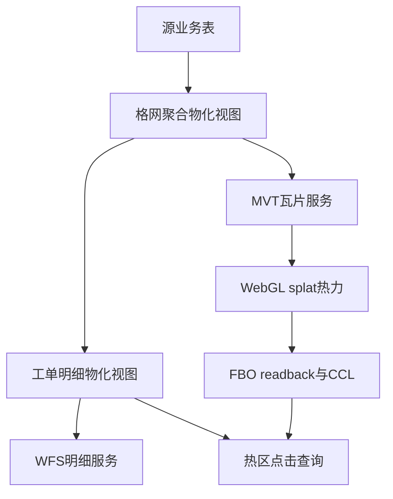
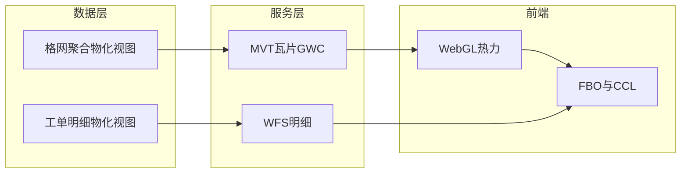

业务需求概括：  
基于一份百万数据量级的业务点数据，前端实现流畅的热力图渲染/交互，热区识别及热区内点数量统计与查询。

# 总览

本文是该解决方案博客系列的**总览篇**，给出端到端方案的总览图与关键选型依据。

本系列将讲解具体实现方案：海量点数据场景下，为何采用「双物化视图 + MVT 矢量瓦片 + 自定义 WebGL 渲染 + FBO 热区识别」这一组合，以及后续四篇各自解决什么问题。

---

## 背景环境

本系列在下列环境中完成验证与联调。其它小版本需自行回归。

| 项               | 版本 / 说明                                           |
| --------------- | ------------------------------------------------- |
| **PostgreSQL**  | 关系型库（版本以部署为准）；需支持物化视图                             |
| **PostGIS**     | 空间扩展；需支持物化视图与 `ST_*` 格网聚合                         |
| **GeoServer**   | **2.24.x**（实现环境 **2.24.2**）；含 Vector Tiles（MVT）扩展 |
| **GeoWebCache** | 随 GeoServer 2.24.x                                |
| **OpenLayers**  | **10.6.1**                                        |
| **宿主地图 CRS**    | 切片 GridSet 与地图 View 所用坐标系对齐                       |

> 后续各篇（01–04）正文开篇仅复述与本篇相关的子集。

---

## 1. 问题识别

典型场景是：地图上能基于所有**数据渲染热力情况**，源数据处理后或者自身本就携带支持筛选的如年份、事项分类、所属业务场景、所属区划及其他常规业务属性。

需要解决的三大问题：

1. **热力展示**：做热力图渲染，支持全量数据范围的热力图查看，提供专题、场景、年份、区县等关注的**多个维度筛选**，但又不能靠客户端全量渲染所有点（必定卡顿） ➡️ 数据端对源表做格网（分筛选属性）聚合（ 5m 格网格心点替代原始点坐标，通过新增权重字段标识聚合前的点数量）缩减数据量【源数据压缩】，服务端通过 MVT 方式【传输层数据压缩】分发数据给前端并通过 GWC 缓存切片【服务层预计算缓存切片文件】。
2. **热区识别与标注**：基于渲染出的热力图，识别出各个热区区域，并计算显示对应区域所含的业务点数量 ➡️ 在 splat 晕染形成的视觉高热区域上做连通域分割，绘制热区合计图标与边界——与热力**同步**计算与渲染，随视口与瓦片更新而刷新。
3. **热区内业务数据详情查看**：用户点击热区图标，能查看对应热区内业务点的所有属性信息，但为了热力图展示而做的数据压缩导致热力图所用的数据源无法满足需求 ➡️ 基于格网聚合出的数据反向另建数据源专用于查询。

要解决的不是「画一张静态热力图」，而是：**预聚合 → 压缩缓存瓦片 → GPU 融合渲染 → 像素级热区识别 → 点击反查明细** 的完整链路。

---

## 2. 三层分工

方案按职责拆为三层，每层只承担自己擅长的部分：

| 层      | 职责                 | 关键技术                                                                                                                                         |
| ------ | ------------------ | -------------------------------------------------------------------------------------------------------------------------------------------- |
| **数据** | 格网预聚合 + 工单明细保留     | 双物化视图；**格网标识**刷新后稳定、**格内工单数**可更新                                                                                                             |
| **服务** | 热力瓦片 + 按需明细        | MVT 矢量瓦片 + GWC WMTS + `CQL_FILTER`；**查询层**保留全列筛选，**PBF 输出**仅「格内工单数」+ 格网标识 fid（详见 [02-服务层-MVT瓦片与按需明细查询](https://www.cnblogs.com/zheyi420/p/22182306)） |
| **前端** | GPU 热力 + CPU 热区后分析 | WebGL splat + gradient 后处理；FBO readback → 8-连通域标注（CCL）→ Overlay / ImageCanvas 绘制                                                             |

**数据层**将百万级点数据作格网聚合、减列得到适合热力图的数据量尽可能小的物化视图；**服务层**按筛选条件切片出图缓存；**前端**负责读取、解析、热力渲染、热区连通域识别与交互。三层边界清晰，换业务库表时仍可套用同一架构。

---

## 3. 端到端数据流

下图展示从源数据到热区点击的主路径：

**路径说明**：

- 源业务表经 ETL 或定时任务写入 **格网聚合物化视图**（供热力 MVT）。**工单明细物化视图**在格网 MV 已存在且已刷新后构建：由源表关联格网 MV 取得**格网标识**并保留单条业务记录完整属性。日常数据更新时须 **先刷新格网 MV、再刷新工单明细 MV**（顺序原因见 [01-数据层-双物化视图](https://www.cnblogs.com/zheyi420/p/22182285)）。
- 地图客户端请求 **MVT 瓦片**（可带 `CQL_FILTER`），解码后由 WebGL 对「格内工单数」做 splat 渲染并 gradient 上色。
- 瓦片就绪且热力重绘完成后，从 GPU 帧缓冲读取 alpha 掩膜，做 **8-连通域标注**，在质心绘制热区合计圆标；该流程与当前视口、缩放级别同步。
- 点击圆标时，走 **WFS** 路径：`关联格网标识 IN (...)`，从工单明细物化视图拉取列表——**不**从 MVT 瓦片 properties 读取明细列。

这是本系列的**双查询路径**：热力展示走 MVT（四维度筛选下推为 MVT 的 `CQL_FILTER`）；下钻明细走 WFS（热区点击 **仅**按格网标识列表查询，**不**再重复四维度 ECQL）。二者数据源与契约不同，在数据层通过「格网标识」关联。

---

## 4. 分层架构

从部署视角看，三层与两条服务出口的关系如下：

GeoServer 侧：格网 MV 发布为 **MVT 矢量瓦片图层**（经 GWC 缓存）；工单 MV 发布为独立 **WFS 图层**。前端四维度筛选下推为 **MVT** 的 `CQL_FILTER`，**不**假设瓦片内携带这些筛选字段。热区点击下钻的 **WFS** **仅**按 `关联格网标识 IN (...)` 查询，**不**再附带专题/场景/年份/区县 ECQL（筛选已体现在当前热力 MVT 结果与热区格网集合中）。

---

## 5. 选型决策

下列对比概括本系列在关键分叉上的选择及原因。详细论证见 01–04 各篇。

| 对比维度     | 方案 A                                | 方案 B                        | 本系列选择                                                                                                                |
| -------- | ----------------------------------- | --------------------------- | -------------------------------------------------------------------------------------------------------------------- |
| **前端热力** | 内置 `ol/layer/Heatmap` + 全量 `Vector` | MVT + 自定义 `WebGLVectorTile` | **方案 B**：内置层绑定 `Vector` 源与 `WebGLVectorLayerRenderer`，无矢量瓦片生命周期；百万级格网须按视口分块加载                                        |
| **服务热力** | 栅格 WMS 热力图                          | MVT 格网点矢量瓦片                 | **方案 B**：格网为 Point 要素，适合按 z/x/y 分块；动态 CQL 可参数化 GWC 缓存键                                                               |
| **数据模型** | 单物化视图承载聚合与明细                        | 格网聚合 MV + 工单明细 MV           | **方案 B**：MVT 只适合轻量属性（格内工单数 + fid）；热区点击需 WFS 拉全量业务列                                                                   |
| **热区识别** | 格网中心点 GIS 聚类                        | splat 后 alpha 掩膜 + 8-连通 CCL | **方案 B**：热区是晕染后的视觉连通区域，阈值须划在 GPU 上色后的 alpha 上，标注才与屏幕所见一致（详见 [04-前端-热区识别、计算与绘制](https://www.cnblogs.com/zheyi420/p/22182374)） |

**不选内置 Heatmap 的改造点**：数据在服务端已瓦片化，客户端须复用 Heatmap 的 splat 数学，但挂载到 **WebGL 矢量瓦片层**，并补上官方未暴露的 `postProcesses` 能力——这是 [03-前端-热力图WebGL渲染管线](https://www.cnblogs.com/zheyi420/p/22182345) 的核心工作。

**不选单 MV 的原因**：把全部工单列塞进 MVT 会导致低 zoom 瓦片体积暴涨；查询层与输出层必须分离，主动裁剪 PBF 属性是预期优化，而非故障。

---

## 6. 系列导航

按推荐阅读顺序：

| 篇      | 链接 | 本篇解决什么                                           |
| ------ | --- | ------------------------------------------------ |
| **01** | [01-数据层-双物化视图](https://www.cnblogs.com/zheyi420/p/22182285) | 为何两个物化视图；格网标识与索引设计；源数据更新后的刷新顺序                   |
| **02** | [02-服务层-MVT瓦片与按需明细查询](https://www.cnblogs.com/zheyi420/p/22182306) | 查询层 vs 输出层；MVT 属性裁剪；MVT 与 WFS 分工                 |
| **03** | [03-前端-热力图WebGL渲染管线](https://www.cnblogs.com/zheyi420/p/22182345) | 为何不用内置 Heatmap；OL 覆写与 splat 管线；瓦片 GPU 融合         |
| **04** | [04-前端-热区识别、计算与绘制](https://www.cnblogs.com/zheyi420/p/22182374) | FBO readback + CCL；ImageCanvas 热区边界；热区点击与双 MV 回扣 |

---

## References

- [GeoServer 2.24.x User Manual](https://docs-archive.geoserver.org/2.24.x/en/user/)
- [OpenLayers v10.6.1 源码目录](https://github.com/openlayers/openlayers/tree/v10.6.1/src/ol)
- [二值图像的连通域标记（炸鸡人博客）](https://zhajiman.github.io/post/connected_component_labelling/) — CCL 概念，04 篇主引用
- [Mapbox Vector Tile specification](https://github.com/mapbox/vector-tile-spec)

