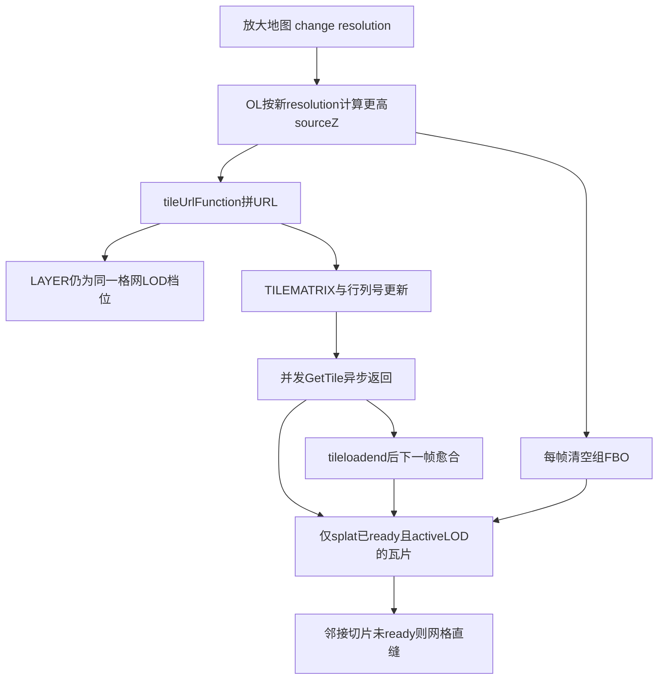
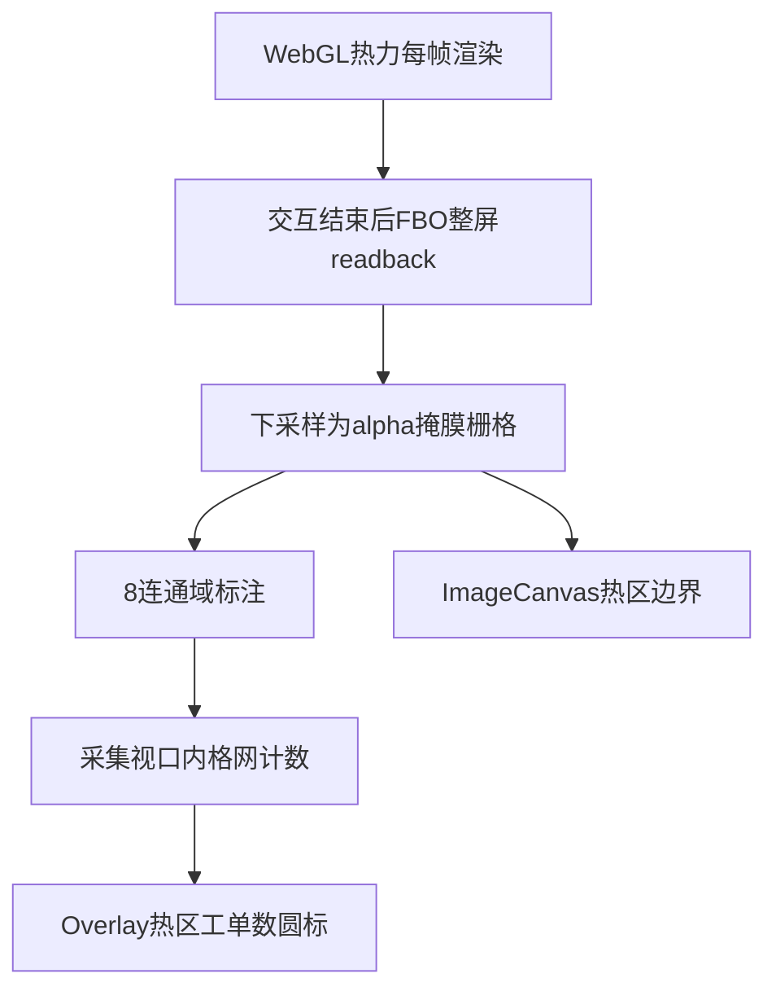

# MVT WebGL 热力图系列 — 配图清单

本清单为 [Blog/mvt-webgl_heatmap-ccl](/Blog/mvt-webgl_heatmap-ccl/AGENTS.md) **6 篇博文**的拍摄与插入执行单。截图仅存 [`./assets/`](./assets/)，博文引用路径形如 `./assets/文件名.png`（相对本目录内各 `.md`）。

**任务阶段**：

| 阶段 | 篇 | 状态 |
| --- | --- | --- |
| **已定稿** | 00 总览、01 数据、02 服务 | 配图已落盘（13 张 PNG），博文已插入（2026-09-01） |
| **已定稿** | 03 前端 WebGL 渲染 | 6 张实拍（含 1 张 JPG）+ 1 张 DevTools 复用，博文 **7 处**插图已插入（2026-09-02 增补 §3.1） |
| **待执行** | 04–05 前端两篇 | 按 §9–§10 清单拍摄并插入博文 |

---

## 0. 落实状态总览（00–03）

### 0.1 博文 ↔ 插图对照

| 篇 | 章节 | 文件名 | 来源 | 博文状态 |
| --- | --- | --- | --- | --- |
| 00 | §1 问题 1 | `00-overview-map-heatmap.png` | 实拍 | 已插入 |
| 00 | §1 问题 2 | `00-overview-regions-1.png` | 实拍 | 已插入 |
| 00 | §1 问题 2 | `00-overview-regions-2.png` | 实拍 | 已插入 |
| 00 | §1 问题 2 | `00-overview-regions-3.png` | 实拍 | 已插入 |
| 00 | §1 问题 2 | `00-overview-regionAlphaThreshold-0d5-0d85.png` | 实拍 | 已插入 |
| 00 | §1 问题 3 | `00-overview-drilldown.png` | 实拍 | 已插入 |
| 00 | §2 | `00-overview-ui-chrome-networkpayload.png` | 实拍 | 已插入 |
| 00 | §3 | `00-devtools-tile-wfs-overview.png` | 实拍 | 已插入 |
| 01 | §2 | `00-overview-map-heatmap.png` | 复用 00-U1 | 已插入 |
| 02 | §3.3 | `00-overview-ui-chrome-networkpayload.png` | 复用 00-U5 | 已插入 |
| 02 | §3.4 | `02-bridge-filter-before-after.png` | 实拍 | 已插入 |
| 02 | §8.1 | `02-devtools-wfs-grid-in.png` | 实拍 | 已插入 |
| 02 | §8.2 | `02-bridge-viewport-markers.png` | 实拍 | 已插入 |
| 02 | §8.2 | `02-devtools-wfs-bbox.png` | 实拍 | 已插入 |
| 02 | §9 | `01-devtools-fine-layer-url.png` | 复用（实拍挂 02-D3） | 已插入 |
| 03 | §3 | `03-pipeline-gradient.png` | 实拍 | 已插入 |
| 03 | §3 | `01-devtools-fine-layer-url.png` | 复用 02-D3（03-D2） | 已插入 |
| 03 | §4 | `03-filter-refresh-compare.png` | 实拍 | 已插入 |
| 03 | §4.1 | `mvt-切片更新时效果.png` | 实拍 | 已插入 |
| 03 | §4 | `03-devtools-refresh-tiles.png` | 实拍 | 已插入 |
| 03 | §5.1 | `03-tuning-auto-expand.png` | 实拍 | 已插入 |
| 03 | §3.1 | `掩膜计算边界.jpg` | 实拍 | 已插入 |

### 0.2 `assets/` 全量清单

#### 00–02 已定稿（13 张）

| 文件名 | 实拍 / 复用 | 被哪些篇引用 |
| --- | --- | --- |
| `00-overview-map-heatmap.png` | 实拍 | 00 §1、01 §2 |
| `00-overview-regions-1.png` | 实拍 | 00 §1 |
| `00-overview-regions-2.png` | 实拍 | 00 §1 |
| `00-overview-regions-3.png` | 实拍 | 00 §1 |
| `00-overview-regionAlphaThreshold-0d5-0d85.png` | 实拍 | 00 §1 |
| `00-overview-drilldown.png` | 实拍 | 00 §1 |
| `00-overview-ui-chrome-networkpayload.png` | 实拍 | 00 §2、02 §3.3 |
| `00-devtools-tile-wfs-overview.png` | 实拍 | 00 §3 |
| `01-devtools-fine-layer-url.png` | 实拍（清单挂 02-D3） | 02 §9、**03 §3（03-D2 复用）** |
| `02-bridge-filter-before-after.png` | 实拍 | 02 §3.4 |
| `02-bridge-viewport-markers.png` | 实拍 | 02 §8.2 |
| `02-devtools-wfs-grid-in.png` | 实拍 | 02 §8.1 |
| `02-devtools-wfs-bbox.png` | 实拍 | 02 §8.2 |

#### 03 篇已定稿（6 张实拍含 1 JPG + 1 张复用；博文 7 处插图）

| 文件名 | 实拍 / 复用 | 被哪些篇引用 | 博文状态 |
| --- | --- | --- | --- |
| `03-pipeline-gradient.png` | 实拍 | 03 §3 | 已插入 |
| `掩膜计算边界.jpg` | 实拍 | 03 §3.1 | 已插入 |
| `03-filter-refresh-compare.png` | 实拍 | 03 §4 | 已插入 |
| `03-tuning-auto-expand.png` | 实拍 | 03 §5.1 | 已插入 |
| `mvt-切片更新时效果.png` | 实拍 | 03 §4.1 | 已插入 |
| `03-devtools-refresh-tiles.png` | 实拍 | 03 §4 | 已插入 |
| `01-devtools-fine-layer-url.png` | **复用**（02-D3 同源） | 03 §3（03-D2） | 已插入 |

**跨篇复用 4 组**：`map-heatmap`（00+01）、`networkpayload`（00+02）、`fine-layer-url`（02 §9 + **03-D2**）、`02-bridge-filter` 语义与 03-U2 独立（03 使用 `03-filter-refresh-compare.png`）。

---

## 1. 总则

### 1.1 已确认约束

| 项 | 约定 |
| --- | --- |
| 宿主页面 | 云眼 **wsxb** 看板地图页；热力图入口「图层渲染」已激活 |
| 业务数据集 | **仅 hzql**（约三百万级点数据）；**不拍摄 dkyy** |
| 看板侧栏 | **画面不包含 wsxb 左侧看板**；拍摄前手动折叠/收起 |
| 画面可含 | 地图主区、左下筛选 Dock、右上「热区统计」面板、右侧工单抽屉（若展开）、右下角比例尺 |
| 截图类型 | (1) 系统 UI；(2) Chrome **DevTools**（主要为 Network 列表 + 单条请求 Headers/URL） |
| 敏感信息 | DevTools 可对域名、IP、完整服务根路径打马赛克；**保留** `LAYER`、`CQL_FILTER`、`TILEMATRIX`、`GetTile`、`GetFeature` 等参数键名与结构 |

### 1.2 拍摄环境检查表

- [ ] 账号具备 wsxb 热力图权限；进入页后热力图默认已开（`default-active`）
- [ ] 看板 tab 为 **first（hzql）**，勿切到 second（dkyy）
- [ ] 左侧看板已折叠，地图占满主区域
- [ ] 底图、区划等无关浮层状态固定（建议全程同一底图组合）
- [ ] 浏览器窗口宽度 ≥ 1440px；比例尺数字在截图中可读（UI 图）
- [ ] DevTools：建议独立窗口或底部面板，Network 保留「Preserve log」；过滤词预备 `GetTile`、`GetFeature`、`wfs`、`gwc`
- [ ] 拼图类：同一地理中心、同一底图，仅改变比例尺/开关/筛选

### 1.3 命名规范

```
{篇序号}-{类型}-{主题}-{变体}.png
```

| 类型前缀 | 含义 |
| --- | --- |
| `00`–`05` | 对应总览、01–05 篇 |
| `ui` 隐含在文件名主题中 | 地图/控件界面（文件名不含 `devtools`） |
| `devtools` | 浏览器开发者工具 |

- 拼图：源图分别拍摄，成品可用 `00-overview-regionAlphaThreshold-0d5-0d85.png` 等左右对比文件名落盘
- 标注版：在原文件名后加 `-annotated`，如 `02-devtools-wmts-cql-annotated.png`

### 1.4 图注与插入写法

**分层**（与 [AGENTS.md](/Blog/mvt-webgl_heatmap-ccl/AGENTS.md) §1.7、§2.1、§3 一致）：

| 层级 | 适用段落 | 用语 |
| --- | --- | --- |
| **产出层** | 各条「图注」「图注草案」「博文变更」、§11「已落实正文要点」、本节插入示例 | 须抽象化，见下表 |
| **拍摄层** | §1.1–§1.2、§4、各条「拍摄前交互」「画面应呈现」 | 可写 wsxb、hzql、tab 序号等内化操作；**勿抄进图注** |

**产出层禁用**（图注 / 博文变更 / §11 微调）：

| 类别 | 禁止示例 |
| --- | --- |
| 业务数据集代号 | hzql、dkyy |
| 宿主页面路径 | wsxb、具体路由 |
| 项目绑定 | monorepo 名、插件目录、`status-*` 路径 |
| 数据泄露 | 真实表名、GeoServer 工作空间/图层名、宿主机 IP |
| 实现字段名 | `cnt`、`grid_id` 等（用「格内工单数」「格网标识」） |
| AGENTS 禁止短语 | 「cnt 虚高」等仅 Agent 内化用语 |

**产出层允许**：

- 抽象字段：格内工单数、格网标识、关联格网标识、事项专题、业务场景、所属区县等（见 AGENTS §3）
- 技术泛称：MVT 瓦片服务、工单明细物化视图、细/中/粗格网档位等
- DevTools / WMTS / WFS / OL 参数键名：`CQL_FILTER`、`LAYER`、`GetTile`、`GetFeature`、`sourceZ`、`tileUrlFunction` 等（服务层与前端篇图注可保留）

- 图注使用 Markdown 强调语法：`*图：说明文字*`
- 插入示例：

```markdown


*图：宿主地图页（主验证业务数据集、侧栏已收起）：WebGL splat 热力色带覆盖区域范围，筛选 Dock 与热区统计面板可见。*
```

### 1.5 条目字段说明

下表各篇「配图条目」均包含：

| 字段 | 说明 |
| --- | --- |
| ID | 清单内唯一编号，便于拍摄勾选 |
| 章节 | 博文内锚点章节 |
| 插入位置 | 建议插在段前/段后/与 mermaid 并列 |
| 拍摄前交互 | 操作步骤 |
| 画面应呈现 | 验收标准 |
| 文件名 | 落盘至 `./assets/` |
| 标注版 | 是否需要框/箭头说明版 |
| 落实状态 | `已实拍` / `已复用` / `已插入博文` / `已取消` / `待拍摄` |
| 博文变更 | 插入示例、图注草案、正文微调 |

---

## 2. 复用关系

| 源文件 | 复用至博文 | 说明 |
| --- | --- | --- |
| `00-overview-map-heatmap.png` | 01 §2 | 区域比例尺热力观感（同总览 §1 问题 1） |
| `00-overview-ui-chrome-networkpayload.png` | 00 §2、**02 §3.3** | 总览三层分工；**02-U1** 筛选 Dock + Network `CQL_FILTER`（无需另拍 `02-bridge-filter-dock.png`） |
| `00-overview-drilldown.png` | 00 §1 问题 3 | 热区点击 + 右栏「热区工单」（00 已定稿） |
| `02-bridge-filter-before-after.png` | 02 §3.4 | 筛选前后热力 + 同切片有无 `CQL_FILTER`（兼覆盖原 02-D1/D2）；03 §4 使用独立实拍 `03-filter-refresh-compare.png` |
| `02-devtools-wfs-grid-in.png` | **02 §8.1**、**05 §7**（待拍） | 热区点击 WFS 仅关联格网标识 `IN` |
| `02-devtools-wfs-bbox.png` | 02 §8.2 | 视口 WFS `BBOX` + 场景 CQL |
| `01-devtools-fine-layer-url.png` | 02 §9（02-D3）、**03 §3（03-D2）** | 细格网档位 GetTile `LAYER` / `TILEMATRIX` 等 WMTS 参数（实拍挂 02-D3；03 复用为 D2） |
| `05-wfs-panel-stats.png` | **05 §7**（待拍） | 可与 drilldown 同源，侧重统计 Tab；00 已用 `drilldown` |

拍摄时可优先完成「复用源」，再按需裁切或重命名副本。**02 定稿**不引用 `04-devtools-lod-switch-layer` 等未纳入 02 博文的条目。**03 定稿**不单独拍摄 `03-devtools-tile-url-lod.png`。

---

## 3. 明确不配图（各篇）

| 篇 | 不配图的章节/内容 | 原因 |
| --- | --- | --- |
| 00 | §4 分层架构、§5 选型表 | mermaid + 对比表已自足 |
| 01 | §3 格网标识算法、**§4 格网标识进热力 MVT**、§5 索引表、§7 刷新 SQL | 纯数据/DDL 与规范论述；§4 Network URL 不呈现 fid，无合适 DevTools 画面 |
| 02 | §2 MVT vs WMS 表、§4 Seed bbox、§7 裁剪故障表、§11 gzip、§12 缓存流程 | 表 + mermaid；无 GeoServer 管理页截图 |
| 03 | §1 Heatmap 对比表、§2 覆写总览表 | 表 + 源码三段论（**§3.1 除外**：须配视口快照 UI 图） |
| 04 | §1 TileLayerBase mermaid | 机制说明；UI 仅表现「正确稳定态」 |
| 05 | §6 筛选归零时序 | 短暂中间态难稳定抓拍；文字说明即可 |

---

## 4. 建议拍摄顺序

1. **环境定格**：hzql、看板收起、热力开、默认筛选、市域比例尺  
2. **00 总览 UI 七张** + DevTools 总览（含 U2 系列与阈值对比） — **（00–02 已完成 ✓）**  
3. **02 服务层 DevTools 批量**（无 CQL → 有 CQL → LOD 细档 → WFS 两条路径） — **（00–02 已完成 ✓）**  
4. **03 筛选前后** UI + Network refresh + §4.1 缩放直缝 — **（03 已定稿 ✓）**  
5. **04 跨档缩放** UI + Network `LAYER` 变化  
6. **05 热区全套**（边界开关、高亮、阈值、右栏）  
7. **01 数据层**：§2 复用总览 `map-heatmap`（§4 不配 DevTools 图） — **（00–02 已完成 ✓）**  
8. **拼图/标注版** 后期处理  

当前 [`./assets/`](./assets/)：**00–03 共 18 张**唯一 PNG + **1 张** JPG（`掩膜计算边界.jpg`，03 §3.1）已定稿；**04–05 待拍**。

---

## 5. 00 总览篇

博文文件：`百万级点数据：MVT + WebGL 热力渲染与 FBO 连通域热区工单统计.md`

### 5.1 UI

#### 00-U1 · 市域热力总览

| 字段 | 内容 |
| --- | --- |
| 章节 | §1 问题识别（热力展示） |
| 插入位置 | §1 第 1 点段落后 |
| 拍摄前交互 | 关闭「显示热区工单数」「显示热区边界」；比例尺约 **1:500000–1:200000**（市域）；筛选保持默认（全选） |
| 画面应呈现 | 冷蓝→热红渐变热力覆盖该市范围；左下筛选 Dock（专题/场景/区县/年份/点位/重置）；右上「热区统计」面板可收起或展开；**无看板**；**图内无标注** |
| 文件名 | `00-overview-map-heatmap.png` |
| 标注版 | 否（已实拍无标注） |
| 落实状态 | 已实拍 · 已插入博文 |
| 博文变更 | **已插入** `./assets/00-overview-map-heatmap.png`；图注：*图：主验证业务数据集下区域比例尺的 WebGL 热力渲染（splat + gradient），筛选尚未收窄至单一专题。* |

#### 00-U2-1 · 热区圆标与边界（默认）

| 字段 | 内容 |
| --- | --- |
| 章节 | §1 问题 2（热区识别与标注） |
| 插入位置 | §1 第 2 点段落后（系列第 1 张） |
| 拍摄前交互 | 开启「显示热区工单数」「显示热区边界」；比例尺 **≤1:50000** 且 **≥1:20000**；选热力明显区域 |
| 画面应呈现 | 多个圆形工单数标注（数字分档大小）、白色阶梯形热区边界线与热力晕染一致；**图内无标注** |
| 文件名 | `00-overview-regions-1.png` |
| 标注版 | 否 |
| 落实状态 | 已实拍 · 已插入博文 |
| 博文变更 | **已插入** `./assets/00-overview-regions-1.png`；图注：*图：与热力同步刷新的热区合计圆标与像素级边界（非格网几何聚类）。* |

#### 00-U2-2 · 热区圆标与边界（低阈值）

| 字段 | 内容 |
| --- | --- |
| 章节 | §1 问题 2 |
| 插入位置 | §1 第 2 点段落后（系列第 2 张，紧接 U2-1） |
| 拍摄前交互 | 关闭「自动调节」；「热区色带阈值」设为 **0.05**；其余与 U2-1 同视野比例尺 |
| 画面应呈现 | 相对 U2-1，热区边界范围扩大、圆标数量或形态变化可见 |
| 文件名 | `00-overview-regions-2.png` |
| 标注版 | 否 |
| 落实状态 | 已实拍 · 已插入博文 |
| 博文变更 | **已插入** `./assets/00-overview-regions-2.png`；图注：*图：关闭自动调节并降低「热区色带阈值」后，FBO 掩膜阈值放宽，识别出的连通热区范围扩大。* |

#### 00-U2-3 · 热区圆标与边界（低阈值 + 饱和标准）

| 字段 | 内容 |
| --- | --- |
| 章节 | §1 问题 2 |
| 插入位置 | §1 第 2 点段落后（系列第 3 张） |
| 拍摄前交互 | 关闭「自动调节」；「热区色带阈值」**0.05**；「热力饱和标准」**2**；与 U2-1/2 同 bbox |
| 画面应呈现 | 「显示热区工单数」下「当前画面：」合计数值可与**格网聚合物化视图**同视野聚合合计对齐（拍摄层可对照库内校验） |
| 文件名 | `00-overview-regions-3.png` |
| 标注版 | 否 |
| 落实状态 | 已实拍 · 已插入博文 |
| 博文变更 | **已插入** `./assets/00-overview-regions-3.png`；图注：*图：在相同阈值下调整「热力饱和标准」后，屏上热区合计可与格网聚合物化视图同视野聚合合计一致，验证 CCL 与格网计数采集对齐。* |

#### 00-U2-4 · 热区色带阈值左右对比

| 字段 | 内容 |
| --- | --- |
| 章节 | §1 问题 2 |
| 插入位置 | §1 第 2 点段落后（系列第 4 张，紧接 U2-3） |
| 拍摄前交互 | 关闭「自动调节」；左「热区色带阈值」**0.5**、右 **0.85**；同地理中心、同比例尺、同 bbox；边界与圆标均开启 |
| 画面应呈现 | 左右「当前画面：」合计不同；其余调参相同 |
| 文件名 | `00-overview-regionAlphaThreshold-0d5-0d85.png` |
| 标注版 | 可选：标注左右阈值 |
| 落实状态 | 已实拍 · 已插入博文 |
| 博文变更 | **已插入** `./assets/00-overview-regionAlphaThreshold-0d5-0d85.png`；图注：*图：相同视图下仅「热区色带阈值」不同（左低右高），CCL 掩膜与热区合计数随之变化。* 博文另段说明左右热力渲染（splat + gradient）一致，差异仅在 CCL/圆标/合计/边界统计口径。 |

#### 00-U3 · 热区点击下钻

| 字段 | 内容 |
| --- | --- |
| 章节 | §1 问题 3 |
| 插入位置 | §1 第 3 点段落后 |
| 拍摄前交互 | 比例尺 **≤1:20000**；点击某一热区圆标；右侧 **热区工单** 抽屉展开，列表 Tab 有数据 |
| 画面应呈现 | 地图热区高亮或选中态 + 右栏标题「热区工单」+ 表格列表；**无看板**；**图内无标注** |
| 文件名 | `00-overview-drilldown.png` |
| 标注版 | 否 |
| 落实状态 | 已实拍 · 已插入博文 |
| 博文变更 | **已插入** `./assets/00-overview-drilldown.png`；图注：*图：热区点击经 WFS 按关联格网标识批量反查工单明细，不依赖 MVT 瓦片 properties。* |

#### 00-U5 · 三层分工与 Network payload

| 字段 | 内容 |
| --- | --- |
| 章节 | §2 三层分工 |
| 插入位置 | 「三层边界清晰…」段落后 |
| 拍摄前交互 | 热区圆标开；筛选 Dock + 热区统计面板 + 地图热力；DevTools Network 展开并选中一条 MVT 请求 payload；同框截图 |
| 画面应呈现 | 左下筛选、中部热力、右上热区统计 + Network 面板可见请求 URL/参数结构（域名可马赛克） |
| 文件名 | `00-overview-ui-chrome-networkpayload.png` |
| 标注版 | 可选 |
| 落实状态 | 已实拍 · 已插入博文 |
| 博文变更 | **已插入** `./assets/00-overview-ui-chrome-networkpayload.png`；图注：*图：数据/服务/前端分工在界面上的对应，并可见筛选下推后的 MVT 瓦片请求载荷（抽象图层与 `CQL_FILTER` 结构）。* |

### 5.2 DevTools

#### 00-D1 · MVT 与 WFS 双路径总览

| 字段 | 内容 |
| --- | --- |
| 章节 | §3 双查询路径 |
| 插入位置 | 双路径 mermaid 之后 |
| 拍摄前交互 | 先平移缩放触发若干 `GetTile`；再点击热区触发 `GetFeature`（WFS）；Network 过滤 `GetTile` 或 `GetFeature` |
| 画面应呈现 | 列表中多条 MVT GetTile + 至少一条 WFS GetFeature；选中一条可辨请求类型 |
| 文件名 | `00-devtools-tile-wfs-overview.png` |
| 标注版 | 建议：框选 MVT 与 WFS 各行 |
| 落实状态 | 已实拍 · 已插入博文 |
| 博文变更 | **已插入** `./assets/00-devtools-tile-wfs-overview.png`；图注：*图：热区点击仅按格网标识列表查询* |

---

## 6. 01 数据层

博文文件：`01-数据层-双物化视图与三格网 LOD.md`

### 6.1 UI（概念桥接）

#### 01-U1 · 低 zoom 密度压力

| 字段 | 内容 |
| --- | --- |
| 章节 | §2 三格网 LOD 的动机 |
| 插入位置 | 「单瓦片要素过密」论述段落后 |
| 拍摄前交互 | **无需单独拍摄**；与总览 §1 问题 1 同源 |
| 画面应呈现 | 区域比例尺热力覆盖（同 `00-overview-map-heatmap.png`） |
| 文件名 | **复用** `00-overview-map-heatmap.png` |
| 标注版 | 否 |
| 落实状态 | 已复用 · 已插入博文 |
| 博文变更 | **已插入** `./assets/00-overview-map-heatmap.png`；图注：*图：区域比例尺下热力观感（同总览篇）；低缩放若仅依赖细格网，单瓦片格网要素密度与瓦片体积压力与此类「远看」场景直接相关。* |

---

## 7. 02 服务层

博文文件：`02-服务层-MVT瓦片与按需明细查询.md`

### 7.1 UI

#### 02-U1 · 筛选 Dock + MVT 请求载荷

| 字段 | 内容 |
| --- | --- |
| 章节 | §3.3 四维度筛选如何进入 ECQL |
| 插入位置 | ECQL 形态表后 |
| 拍摄前交互 | **无需单独拍摄**；复用 00-U5 已拍 `00-overview-ui-chrome-networkpayload.png`（拍摄层：已选专题/区县/年份等非默认项；Network 选中一条中格网档位 GetTile，Payload 可见 `CQL_FILTER`） |
| 画面应呈现 | 左下筛选 Dock（专题/场景/区县/年份已选态）；中部热力；右上「热区统计」面板；DevTools Network 选中 MVT 请求，Payload 含 `LAYER`（中格网档位）与 `CQL_FILTER`（`matter_topic` / `year` / `area` 等 ECQL 片段可读；域名可马赛克） |
| 文件名 | **复用** `00-overview-ui-chrome-networkpayload.png` |
| 标注版 | 可选：框选 Dock 已选 chip 与 Payload 中 `CQL_FILTER` |
| 落实状态 | 已复用 · 已插入博文 |
| 博文变更 | **已插入** `./assets/00-overview-ui-chrome-networkpayload.png`；图注：*图：左下四维度筛选状态与 Network 中 MVT GetTile 载荷对照——`CQL_FILTER` 在查询层下推，瓦片 PBF properties 仍仅含格内工单数与格网标识。* |

#### 02-U2 · 筛选前后热力

| 字段 | 内容 |
| --- | --- |
| 章节 | §3.4 Parameter Filter 与参数化缓存 |
| 插入位置 | mermaid「筛选→ECQL→缓存键」之后 |
| 拍摄前交互 | **已实拍**；左右为同一地理中心与比例尺：左为全默认（无 `CQL_FILTER`），右为收窄专题（或场景）后拼图 |
| 画面应呈现 | 左右拼图；Network Payload 可见**同一** `TILEROW`/`TILECOL`（图中标注「同一切片」）；左无 `CQL_FILTER`、右含 `matter_topic=...`；「当前画面」工单合计与热力分布明显变化 |
| 文件名 | `02-bridge-filter-before-after.png` |
| 标注版 | 否（源图已含左右对照与切片标注） |
| 落实状态 | 已实拍 · 已插入博文 |
| 博文变更 | **已插入** `./assets/02-bridge-filter-before-after.png`；图注：*图：同一瓦片坐标下，未筛选时 GetTile 不带 `CQL_FILTER`（左），收窄专题后 URL 出现专题 ECQL 且屏上热力与「当前画面」合计随之变化（右）；筛选由服务端查询层生效并驱动瓦片 refresh 重绘，而非客户端合并要素缓存。* |

#### 02-U3 · 视口点位蓝标与掩膜/WFS 计数校验

| 字段 | 内容 |
| --- | --- |
| 章节 | §8.2 视口查询 |
| 插入位置 | BBOX CQL 说明段后 |
| 拍摄前交互 | **已实拍**；关闭「自动调节」；「热区色带阈值」「热力饱和标准」调至最低；开启「点位」；比例尺 ≤1:20000；Network 选中 WFS GetFeature 探针（`count=1`） |
| 画面应呈现 | 三重计数一致：①「热区统计」「当前画面」工单件数；②左下「点位」面板「当前筛选 + 当前视口范围内工单总件数」；③ DevTools `numberMatched`/`totalFeatures`；图内红字说明视口热区掩膜与 BBOX WFS 一致 |
| 文件名 | `02-bridge-viewport-markers.png` |
| 标注版 | 否（源图已含红字与箭头标注） |
| 落实状态 | 已实拍 · 已插入博文 |
| 博文变更 | **已插入** `./assets/02-bridge-viewport-markers.png`；图注：*图：在同一筛选条件与当前视口下，将「热区色带阈值」「热力饱和标准」调至最低后，「热区统计」面板「当前画面」工单合计、左下「点位」查询的视口范围内工单总件数，与 WFS `BBOX` 探针返回的匹配总量一致（图中均为 23,007 件），说明视口热区掩膜汇总与 WFS 明细统计口径对齐。掩膜路径仅基于已加载 MVT 与 FBO 掩膜在客户端重算，无需每次全量拉取 WFS，响应更快，且在本验证条件下计数一致。* |

### 7.2 DevTools

#### 02-D3 · 细档 LAYER（LOD）

| 字段 | 内容 |
| --- | --- |
| 章节 | §9 三格网 LOD |
| 插入位置 | sourceZ 对照表后 |
| 拍摄前交互 | **已实拍**；复用 `01-devtools-fine-layer-url.png`（细格网 `_heatmap_5_grid_`，比例尺约 1:14000） |
| 画面应呈现 | Network Payload 中 `LAYER` 为**细格网**档位；可选见 `CQL_FILTER` |
| 文件名 | **复用** `01-devtools-fine-layer-url.png` |
| 标注版 | 否 |
| 落实状态 | 已复用 · 已插入博文 |
| 博文变更 | **已插入** `./assets/01-devtools-fine-layer-url.png`；图注：*图：视口 `sourceZ` 较高时 GetTile 的 `LAYER` 指向细格网（约 5m）档位 MVT 图层。* |

#### 02-D5 · 热区 WFS 格网标识 IN

| 字段 | 内容 |
| --- | --- |
| 章节 | §8.1 热区点击 |
| 插入位置 | 「关联格网标识 IN」代码块后 |
| 拍摄前交互 | **已实拍**；点击热区圆标；Dock 可有专题/场景/区县/年份等已选态；Network 选中 WFS GetFeature |
| 画面应呈现 | 右栏「热区工单」列表；DevTools `CQL_FILTER` **仅**关联格网标识 `IN (...)`，无四维度 ECQL 重复；`numberMatched`/`totalFeatures` 与列表条数一致（图中 35 件） |
| 文件名 | `02-devtools-wfs-grid-in.png` |
| 标注版 | 否（源图已含红框与箭头） |
| 落实状态 | 已实拍 · 已插入博文 |
| 博文变更 | **已插入** `./assets/02-devtools-wfs-grid-in.png`；图注：*图：热区点击下钻时，尽管筛选 Dock 仍显示当前 MVT 筛选态，WFS 请求仅按关联格网标识 `IN (...)` 查询，不重复拼接事项专题/场景/年份/区县 ECQL。* |

#### 02-D6 · 视口 WFS BBOX

| 字段 | 内容 |
| --- | --- |
| 章节 | §8.2 |
| 插入位置 | 双路径 mermaid **之后**、§8.2 末段之前 |
| 拍摄前交互 | **已实拍**；Dock **仅**收窄业务场景；开启「点位」或触发视口 WFS；Network 选中 GetFeature |
| 画面应呈现 | `CQL_FILTER` 含 `BBOX(geom,...)` 与 `scene_type IN (...)`；可与左下点位统计、右上「当前画面」对照 |
| 文件名 | `02-devtools-wfs-bbox.png` |
| 标注版 | 否 |
| 落实状态 | 已实拍 · 已插入博文 |
| 博文变更 | **已插入** `./assets/02-devtools-wfs-bbox.png`；图注：*图：视口工单 WFS 在 Dock 仅选业务场景时，`CQL_FILTER` 由 `BBOX` 与 `scene_type` 等属性条件组成，与热区点击的格网标识 `IN` 路径分离。* |

> **已取消条目**（无独立实拍图，且语义已由其它图覆盖）：**02-D1/D2**（`02-bridge-filter-before-after.png` 左右对照）、**02-D4**（粗档 LOD）、**02-D7**（查询层 vs 输出层 UI）。**02 定稿**：博文共 **6 处**插图引用（4 张本篇实拍 + 2 张跨篇复用）。

---

## 8. 03 前端 WebGL 渲染

博文文件：`03-前端-热力图WebGL渲染管线.md`

### 8.1 UI

#### 03-U1 · gradient 成品热力

| 字段 | 内容 |
| --- | --- |
| 章节 | §3 渲染管线全景 |
| 插入位置 | §3 mermaid 之后 |
| 拍摄前交互 | 城中中等密度区域；关闭「显示热区工单数」「显示热区边界」；筛选默认（全选） |
| 画面应呈现 | 冷蓝→热红渐变清晰；可见 splat 晕染；**图内无标注** |
| 文件名 | `03-pipeline-gradient.png` |
| 标注版 | 否 |
| 落实状态 | 已实拍 |
| 博文变更 | 插入 `./assets/03-pipeline-gradient.png`；图注：*图：MVT 格网点经 splat 加性混合写入组 FBO，再经 gradient postProcess 映射为冷蓝→热红的成品热力（与 §3 管线 mermaid 对应）。* |

#### 03-U2 · 筛选 refresh 前后

| 字段 | 内容 |
| --- | --- |
| 章节 | §4 新瓦片如何融入 |
| 插入位置 | 「筛选变更只需 source.refresh()」段后 |
| 拍摄前交互 | **已实拍**；左右拼图：同一地理中心、同一比例尺（图中约 1:82402）；关闭「显示热区工单数」；左 Dock **无筛选**（全默认），右 Dock **仅收窄事项专题**；其余调参与底图一致 |
| 画面应呈现 | 左右对比；左热力范围大、右收窄；**图内无标注**（与 02 §3.4 独立，本图侧重 UI 热力观感 + §4 refresh 语义） |
| 文件名 | `03-filter-refresh-compare.png` |
| 标注版 | 否 |
| 落实状态 | 已实拍 |
| 博文变更 | 插入 `./assets/03-filter-refresh-compare.png`；图注：*图：同一视口与比例尺下，仅事项专题筛选不同；右图热力收窄来自 CQL 变更后 `source.refresh()` 与 GPU 每帧重绘，而非客户端合并瓦片要素缓存。* |

#### 03-U3 · 自动调节与热力饱和标准

| 字段 | 内容 |
| --- | --- |
| 章节 | §5.1–§5.2 权重与调参 |
| 插入位置 | §5.1 公式块后 |
| 拍摄前交互 | **已实拍**；左右拼图：同一视口、同一比例尺；关闭「显示热区工单数」；**左**：其余默认，自动调节 **ON**，「热力饱和标准」**100**；**右**：其余默认，自动调节 **OFF**，「热力饱和标准」**2**（理论最小值） |
| 画面应呈现 | 右图热力更易饱和变红、覆盖范围更大；左图相对稀疏；面板滑块区可见；**图内无标注** |
| 文件名 | `03-tuning-auto-expand.png` |
| 标注版 | 否 |
| 落实状态 | 已实拍 |
| 博文变更 | 插入 `./assets/03-tuning-auto-expand.png`；图注：*图：降低「热力饱和标准」后单格权重归一化分母变小，同等格内工单数映射更高 splat 权重，热力更易饱和变红；参数经 uniform/attribute 写入 WebGL 层后重绘生效。* |

#### 03-U4 · 放大后同 LOD 瓦片加载中间态（切片直缝）

| 字段 | 内容 |
| --- | --- |
| 章节 | §4 新瓦片如何融入 |
| 插入位置 | 「每帧 WebGL 对当前有效瓦片集整体重绘」或 §4 mermaid **之后**（与 03-U2 分列：U2 为筛选 refresh，U4 为缩放加载） |
| 拍摄前交互 | **已实拍**；筛选保持默认（**无 CQL 变更**）；关闭「显示热区工单数」「显示热区边界」；**连续放大地图**，使 Network 中 GetTile 的 **`TILEMATRIX` 升高**且 **`LAYER` 与放大前相同**（仍在同一格网 LOD 档位，未跨 sourceZ 阈值 11/13）；在**新 MATRIX 级切片未全部加载完成**时抓拍 |
| 画面应呈现 | 连片热区中间沿**瓦片网格**的短暂**竖直/水平直缝**（邻格未 ready）；右上「热区统计」可展开；**图内无标注** |
| 文件名 | `mvt-切片更新时效果.png`（未遵循 §1.3 命名，已落盘不改名） |
| 标注版 | 否 |
| 落实状态 | 已实拍 |
| 博文变更 | 见下「讲解要点」+ 插入 `./assets/mvt-切片更新时效果.png`；图注：*图：在同一格网 LOD 档位内放大地图后，视口改请求更高 TILEMATRIX 的 MVT 切片（LAYER 不变）；WebGL 层每帧仅对已就绪切片整体 splat 重绘组 FBO，新切片异步到达前邻格未绘制，连片热区出现沿瓦片网格的短暂直缝，待切片齐备后下一帧即愈合——属 §4「每帧重绘有效瓦片集」在缩放加载下的正常中间态，与筛选 refresh 无关。* |

**03-U4 讲解要点**（写入博文 §4 正文微调，产出层用语）：

| 维度 | 放大后变化 | 本图是否变化 |
| --- | --- | --- |
| WMTS 瓦片矩阵 | `TILEMATRIX` / `TILEROW` / `TILECOL`（sourceZ）升高，视口需更多更细切片 | **是** |
| 三格网 LOD（`LAYER`） | 仅 sourceZ 跨 11/13 阈值才切换细/中/粗格网图层 | **否** |
| 筛选 CQL | 变更才 `refresh()` 重拉 | **否** |

**机理摘要**（对照实现，内化路径勿写入图注）：

1. **放大不 `refresh()`**：`view` `change:resolution` 仅通知 WebGL 层重绘；OL 按新 resolution 向 `VectorTileSource` 索要更高 sourceZ 瓦片，`tileUrlFunction` 拼出更高 `TILEMATRIX` 的 GetTile；`LAYER` 在同 LOD 档位内不变。
2. **每帧全量重绘**：帧间不保留上一帧热力；当前帧仅 splat **已 ready** 且 active LOD 匹配的瓦片 → 未就绪格在屏上为空，与已绘邻格形成沿 `TILECOL`/`TILEROW` 边界的直缝。
3. **非 FBO 增量合并失败**：不是「旧 alpha 残留」或 splat 参数错误；`tileloadend` 后下一帧 FBO 重绘即愈合。
4. **与 03-U2/D1、04 篇边界**：U2/D1 为**筛选** → `refresh()`；04 为**跨 LOD** 旧档画面残留；本图为**同 LOD 缩放**加载中间态。勿写「筛选 refresh 导致」「计数重复累计」。



### 8.2 DevTools

#### 03-D1 · 筛选后瓦片 refresh

| 字段    | 内容                                                                                                                                                                                   |
| ----- | ------------------------------------------------------------------------------------------------------------------------------------------------------------------------------------ |
| 章节    | §4                                                                                                                                                                                   |
| 插入位置  | CPU 合并对比表后                                                                                                                                                                           |
| 拍摄前交互 | **已实拍**；左右拼图：同一视口、同一比例尺（图中约 1:1090660）；关闭「显示热区工单数」；Network Preserve log；左 Dock 无筛选，右 Dock 仅收窄事项专题；图内红字标注：「当前视口初始需要 9 张 mvt 切片 → 改筛选后同一视口 mvt 切片请求新的一批 9 个 → Network log 可见累计达到 18 个」 |
| 画面应呈现 | DevTools Network 可见 GetTile 累计条数增加；与 03-U2 互补（D1 证网络、U2 证屏上热力）                                                                                                                       |
| 文件名   | `03-devtools-refresh-tiles.png`                                                                                                                                                      |
| 标注版   | 是（源图已含红字）                                                                                                                                                                            |
| 落实状态  | 已实拍                                                                                                                                                                                  |
| 博文变更  | 插入 `./assets/03-devtools-refresh-tiles.png`；图注：*图：筛选变更后 Preserve log 下同一视口再请求一批 GetTile（示例：由 9 条增至 18 条），对应 `source.refresh()` 以新 CQL 重拉视口 MVT，无手写 merge 循环。*                        |

#### 03-D2 · tileUrlFunction URL 结构

| 字段 | 内容 |
| --- | --- |
| 章节 | §3「LOD 选层」「瓦片源」 |
| 插入位置 | resolveLod 段落后 |
| 拍摄前交互 | **无需单独拍摄**；复用 `01-devtools-fine-layer-url.png`（与 02-D3 同源；Network 选中 GetTile Payload，可见 `LAYER`、`TILEMATRIX`、`TILEROW`、`TILECOL` 等） |
| 画面应呈现 | WMTS GetTile URL 参数结构可读（域名可马赛克） |
| 文件名 | **复用** `01-devtools-fine-layer-url.png` |
| 标注版 | 否 |
| 落实状态 | 已复用 |
| 博文变更 | 插入 `./assets/01-devtools-fine-layer-url.png`；图注：*图：`tileUrlFunction` 按 sourceZ 拼装的 GWC WMTS GetTile URL（`LAYER`、`TILEMATRIX` 等）。* |

#### 03-U5 · 缩小瞬间：热力 vs 视口快照（掩膜计算边界）

| 字段 | 内容 |
| --- | --- |
| 章节 | §3.1 视口快照：热区标注与边界的计算范围 |
| 插入位置 | §3.1 引子段落后（双管线对比表之前） |
| 拍摄前交互 | **已实拍**；先放大至某一视口；开启热力图、「显示热区工单数」「显示热区边界」；待加载与热区计算完成；**缩小地图**，在缩放动画某一帧抓拍（`moveend` 尚未完成、FBO 快照未重算） |
| 画面应呈现 | 外围已有红/绿热力晕染；圆标数字与红色阶梯边界仍集中在屏幕中心（上一分析完成时的区域）；右上「热区统计」面板两开关均为 ON；比例尺约 1:175709 等大视口；**图内无标注** |
| 文件名 | `掩膜计算边界.jpg`（未遵循 §1.3 的 `.png` 后缀，已落盘不改名） |
| 标注版 | 否 |
| 落实状态 | 已实拍 · 已插入博文 |
| 博文变更 | **已插入** `./assets/掩膜计算边界.jpg`；图注：*图：缩小地图的瞬间——热力图已随当前大视口重绘至外围，热区工单数圆标与红色阶梯边界仍停留在上一分析完成时的中心区域。二者范围不一致，说明热力图跟每帧 GPU 渲染走，热区标注与边界跟视口快照走。*（正文若补充 MVT 切片加载细节，须保持产出层抽象用语，见 §1.4） |

**03-U5 讲解要点**（写入 §3.1 正文，产出层用语）：

| 维度 | 热力图 | 热区圆标 / 边界 |
| --- | --- | --- |
| 计算/渲染来源 | MVT 瓦片 + WebGL 每帧合成 | FBO 整屏 readback + CPU 连通域 + 视口内格网计数 |
| 有效范围 | 当前视口内**已就绪**有效瓦片 | **捕获时刻**整屏画面（掩膜栅格边界 = 视口矩形） |
| 典型更新 | 每帧 render；缩放时 `change:resolution` 标记 dirty | `moveend` / `tileloadend` 后 300ms 防抖 → postrender readback |

**设计逻辑摘要**（对照实现，内化路径勿写入图注）：

1. **掩膜边界 = 视口画面**：FBO readback 捕获整屏成品热力 alpha；下采样掩膜栅格与视口像素同尺度。
2. **非 GIS 格网聚类**：热区识别对 splat 晕染后的 alpha 做阈值与八连通域，非 MVT 格心邻接。
3. **缩小瞬间差异**：高频 GPU 渲染 vs 低频快照式分析；缩放结束后重算对齐。**非**故障排查、**非**修复方案段落。
4. **与 §4.1 / 04 / 05 边界**：§4.1 为同 LOD 放大直缝；04 为跨 LOD composite 残留；05 展开坐标映射与 CCL 细节。本篇 §3.1 只建立「GPU 热力 → 视口快照 → 标注/边界」分工。



> **03 定稿**：博文共 **7 处**插图引用（**6 张本篇实拍**〔含 1 JPG〕+ **1 张 DevTools 跨篇复用** = **7 张物理文件**）。已取消 **`03-devtools-tile-url-lod.png`** 单独拍摄。

---

## 9. 04 Renderer LOD composite

博文文件：`04-前端-矢量瓦片Renderer覆写与LOD-composite.md`

### 9.1 UI

#### 04-U1 · 跨档稳定画面

| 字段 | 内容 |
| --- | --- |
| 章节 | §2–§3 旧档残留与覆写方案 |
| 插入位置 | 对比表后 |
| 拍摄前交互 | 从中比例尺放大到 ≤1:20000，**等待新档瓦片加载完成**后截图 |
| 画面应呈现 | 热力细节与当前比例尺一致，无「粗网格块嵌在细视野」的错位感 |
| 文件名 | `04-lod-settled-ui.png` |
| 标注版 | 否 |
| 博文变更 | 图注：*图：active LOD 过滤后，缩放跨档完成时屏上热力与当前档位一致（非旧档位残留）。* |

#### 04-U2 · 统计与画面对齐

| 字段 | 内容 |
| --- | --- |
| 章节 | §4 与统计路径的对齐 |
| 插入位置 | 本节段首或段末 |
| 拍摄前交互 | 热区圆标开；右上显示「当前画面：X 件 / Y 处达阈值热区」 |
| 画面应呈现 | 圆标数量与面板统计一致（肉眼可核对） |
| 文件名 | `04-stats-panel-align.png` |
| 标注版 | 建议框选面板文案 |
| 博文变更 | 图注：*图：热区合计采集与 renderer composite 共用 active LOD 与 CQL 语义。* |

### 9.2 DevTools

#### 04-D1 · 跨档 LAYER 变化

| 字段 | 内容 |
| --- | --- |
| 章节 | §2 sequenceDiagram、§3 覆写 |
| 插入位置 | sequenceDiagram 后 |
| 拍摄前交互 | 记录跨档前后两条 GetTile 的 `LAYER` 参数（可拼图） |
| 画面应呈现 | 两条请求 `LAYER` 不同 |
| 文件名 | `04-devtools-lod-switch-layer.png` |
| 标注版 | **建议** |
| 博文变更 | 图注：*图：视口 sourceZ 跨档后，新 GetTile 的 `LAYER` 切换至对应格网档位。* |

#### 04-D2 · 正确 composite 行为说明

| 字段 | 内容 |
| --- | --- |
| 章节 | §3 无 eligible 瓦片时 |
| 插入位置 | 覆写方案第 4 点说明后 |
| 拍摄前交互 | 跨档瞬间 Network：新 LAYER 请求 pending，旧 LAYER 不应再被「画到屏上」（难抓拍时可仅附说明性 Network + 图注） |
| 画面应呈现 | 列表同时存在不同 `LAYER` 的 GetTile，但 UI 热力不呈现粗档块（或短暂空白） |
| 文件名 | `04-devtools-no-stale-layer.png` |
| 标注版 | **建议** + 文字说明 |
| 博文变更 | 图注：*图：缓存可并存多档瓦片，renderer 覆写保证 composite 仅 active LOD；问题本质是旧档**画面残留**而非计数重复累计。* |

---

## 10. 05 热区识别、计算与绘制

博文文件：`05-前端-热区识别、计算与绘制.md`

### 10.1 UI

#### 05-U1 · 圆标 + 边界全开

| 字段 | 内容 |
| --- | --- |
| 章节 | §3 识别管线、§4 绘制 |
| 插入位置 | §3 mermaid 后 |
| 拍摄前交互 | 圆标 + 边界开关均开；多热区场景 |
| 画面应呈现 | 数字圆标 + 白色阶梯边界 |
| 文件名 | `05-labels-boundary-full.png` |
| 标注版 | 否 |
| 博文变更 | 图注：*图：FBO readback + CCL 后的圆标合计与 ImageCanvas 阶梯边界。* |

#### 05-U2 · 边界开关对比

| 字段 | 内容 |
| --- | --- |
| 章节 | §5 ImageCanvas |
| 插入位置 | 三段论「选型」段后 |
| 拍摄前交互 | 拼图：边界 off vs on |
| 画面应呈现 | 仅圆标 vs 圆标+边界 |
| 文件名 | `05-boundary-toggle.png` |
| 标注版 | 建议 |
| 博文变更 | 图注：*图：热区边界由 ImageCanvas 按像素掩膜阶梯轮廓绘制，非矢量多边形。* |

#### 05-U3 · 热区选中高亮

| 字段 | 内容 |
| --- | --- |
| 章节 | §4 圆标 |
| 插入位置 | 「选中某个热区」句后 |
| 拍摄前交互 | 点击某一圆标，出现高亮样式 |
| 画面应呈现 | 深色高亮圆标与其他普通圆标对比 |
| 文件名 | `05-region-highlight.png` |
| 标注版 | 可选 |
| 博文变更 | 图注：*图：热区圆标选中高亮态（下钻前）。* |

#### 05-U4 · 仅调热区阈值

| 字段 | 内容 |
| --- | --- |
| 章节 | §3 性能分级 |
| 插入位置 | cpuOnly 路径说明后 |
| 拍摄前交互 | 记录调阈值前圆标数量；调高「热区阈值」滑块（自动调节关）；再截一张 |
| 画面应呈现 | 圆标数量减少，热力层颜色分布不变 |
| 文件名 | `05-threshold-slider.png` |
| 标注版 | 建议：前后拼图或标注滑块 |
| 博文变更 | 图注：*图：仅热区阈值变化时复用掩膜重跑 CCL（cpuOnly），不触发 MVT refresh。* |

#### 05-U5 · 右栏列表与统计

| 字段 | 内容 |
| --- | --- |
| 章节 | §7 热区点击查询 |
| 插入位置 | mermaid 后 |
| 拍摄前交互 | 点击热区；右栏展开；切换到统计 Tab（饼图） |
| 画面应呈现 | 列表 + 饼图统计视图 |
| 文件名 | `05-wfs-panel-stats.png` |
| 标注版 | 否 |
| 博文变更 | 图注：*图：WFS 明细在右栏展示列表与事项分类统计，闭环数据层双物化视图设计。* |

### 10.2 DevTools

#### 05-D1 · 点击触发 WFS

| 字段 | 内容 |
| --- | --- |
| 章节 | §7 设计要点 |
| 插入位置 | 「查询不重复携带筛选维度」段后 |
| 拍摄前交互 | 同 02-D5；强调无重复四维度 ECQL |
| 画面应呈现 | WFS 请求仅 IN 列表 |
| 文件名 | `05-devtools-wfs-on-click.png` |
| 标注版 | 可与 02-D5 复用 |
| 博文变更 | 图注：*图：热区点击 WFS 不重复拼接 MVT 四维度 ECQL。* |

#### 05-D2 · FBO 概念（UI）

| 字段 | 内容 |
| --- | --- |
| 章节 | §1 识别：为何 FBO |
| 插入位置 | 对比表「方案 B」行后 |
| 拍摄前交互 | 与 05-U1 类似，侧重「晕染边界与圆标对齐」特写 |
| 画面应呈现 | 热力晕染边缘与白边界重合度高 |
| 文件名 | `05-fbo-vs-geometry-concept.png` |
| 标注版 | 建议箭头沿边界 |
| 博文变更 | 图注：*图：热区边界贴合 splat 晕染像素域，而非格网中心 GIS 聚类。* |

---

## 11. 博文批量改动索引

**00 / 01 / 02 / 03 已完成**（配图落盘 + 博文已插入，见 §0）。**04–05 待执行**。图片路径统一为 `./assets/{文件名}`。

### 11.1 总览篇 `百万级点数据：MVT + WebGL 热力渲染与 FBO 连通域热区工单统计.md`

| 插图数 | 章节锚点 | 文件名 | 博文状态 |
| --- | --- | --- | --- |
| 8 | §1 问题 1 | `00-overview-map-heatmap.png` | 已插入 |
| | §1 问题 2 | `00-overview-regions-1.png`、`00-overview-regions-2.png`、`00-overview-regions-3.png`、`00-overview-regionAlphaThreshold-0d5-0d85.png` | 已插入 |
| | §1 问题 3 | `00-overview-drilldown.png` | 已插入 |
| | §2 三层分工 | `00-overview-ui-chrome-networkpayload.png` | 已插入 |
| | §3 双路径 mermaid 后 | `00-devtools-tile-wfs-overview.png` | 已插入 |

**已落实正文要点**：

- §1 问题 2：已说明「热区色带阈值」对 FBO 掩膜与 CCL 合计的影响；`regionAlphaThreshold` 对比图旁已注明**左右热力渲染（splat + gradient）一致**，差异仅在 CCL/圆标/合计/边界统计口径
- §3 双路径：已补 Network 对照句（与 D1 图呼应）
- §2 LOD 表后未插图（与清单一致）

---

### 11.2 01 篇 `01-数据层-双物化视图与三格网 LOD.md`

| 插图数 | 章节锚点 | 文件名 | 博文状态 |
| --- | --- | --- | --- |
| 1 | §2 动机 | `00-overview-map-heatmap.png`（复用） | 已插入 |

**已落实正文要点**：

- §2 段末已插图；图注强调概念桥接，非数据库截图
- §4、§6.2 未插图（与清单一致）

---

### 11.3 02 篇 `02-服务层-MVT瓦片与按需明细查询.md`

| 插图数 | 章节锚点 | 文件名 | 博文状态 |
| --- | --- | --- | --- |
| 6 处引用 | §3.3 | `00-overview-ui-chrome-networkpayload.png`（复用 00-U5） | 已插入 |
| | §3.4 | `02-bridge-filter-before-after.png` | 已插入 |
| | §8.1 | `02-devtools-wfs-grid-in.png` | 已插入 |
| | §8.2 | `02-bridge-viewport-markers.png`、`02-devtools-wfs-bbox.png` | 已插入 |
| | §9 | `01-devtools-fine-layer-url.png`（复用） | 已插入 |

**已落实正文要点**：

- §8.1、§8.2、§9 均已插入 DevTools / UI 图注
- §3.4 由 `02-bridge-filter-before-after.png` 覆盖原 D1/D2 语义，未另插 `wmts-cql` / `no-cql`
- DevTools 定稿仅 D3、D5、D6（与 §7.2 一致）

---

### 11.4 03 篇 `03-前端-热力图WebGL渲染管线.md`

| 插图数 | 章节锚点 | 文件名 | 博文状态 |
| --- | --- | --- | --- |
| 7 处引用 | §3 mermaid 后 | `03-pipeline-gradient.png` | 已插入 |
| | §3 resolveLod | `01-devtools-fine-layer-url.png`（复用 02-D3，03-D2） | 已插入 |
| | §3.1 视口快照 | `掩膜计算边界.jpg`（03-U5） | 已插入 |
| | §4 筛选 refresh | `03-filter-refresh-compare.png` | 已插入 |
| | §4.1 缩放加载中间态 | `mvt-切片更新时效果.png` | 已插入 |
| | §4 Network refresh | `03-devtools-refresh-tiles.png` | 已插入 |
| | §5.1 | `03-tuning-auto-expand.png` | 已插入 |

**已落实正文要点**：

- §3.1 已补充「视口快照 / 掩膜计算边界」：双管线对比表、缩小瞬间 UI 图（U5）、FBO→掩膜→CCL→标注/边界 mermaid；承下 05 篇详细识别管线
- §4.1 已补充「放大 + 同 LOD + 更高 TILEMATRIX」概念表、缩放因果 mermaid、机理段与 U4 图注；与 U2/D1（筛选 refresh）、04 篇（跨 LOD 残留）边界已写明
- §3 D2 复用 `01-devtools-fine-layer-url.png`；小结已提及缩放加载中间态直缝与 §3.1 视口快照分工

---

### 11.5 04 篇 `04-前端-矢量瓦片Renderer覆写与LOD-composite.md`

| 预计新增图数 | 章节锚点 | 文件名 |
| --- | --- | --- |
| 4 | §2–3 | `04-lod-settled-ui.png` |
| | §4 | `04-stats-panel-align.png` |
| | §2–3 | `04-devtools-lod-switch-layer.png` |
| | §3 | `04-devtools-no-stale-layer.png` |

**预计正文微调**：对比表后强调「残留」表述，配图注释强调旧档位画面残留，勿误述为计数重复累计。

---

### 11.6 05 篇 `05-前端-热区识别、计算与绘制.md`

| 预计新增图数 | 章节锚点 | 文件名 |
| --- | --- | --- |
| 7 | §1 | `05-fbo-vs-geometry-concept.png` |
| | §3 | `05-labels-boundary-full.png` |
| | §3 性能 | `05-threshold-slider.png` |
| | §4 | `05-region-highlight.png` |
| | §5 | `05-boundary-toggle.png` |
| | §7 | `05-wfs-panel-stats.png`、`05-devtools-wfs-on-click.png` |

---

### 11.7 全系列汇总

#### 已落实（00–03）

| 篇 | UI 图 | DevTools 图 | 博文引用数 | 状态 |
| --- | --- | --- | --- | --- |
| 00 总览 | 7 | 1 | 8 | **已落实** |
| 01 数据 | 1（复用） | 0 | 1 | **已落实** |
| 02 服务 | 3（含 1 张复用 00） | 3（含 1 张复用 01） | 6 处引用 / 4 张本篇实拍 | **已落实** |
| 03 前端上 | 5（含 1 JPG） | 1 实拍 + 1 复用 | 7 处引用 / 6 张本篇实拍 | **已落实** |

**00–03 已落盘资源**：[`./assets/`](./assets/) 共 **18 张**唯一 PNG + **1 张** JPG（见 §0.2）；跨篇复用见 §2。

#### 待拍摄（04–05）

| 篇 | UI 图 | DevTools 图 | 合计（去重复用后约） | 状态 |
| --- | --- | --- | --- | --- |
| 04 前端中 | 2 | 2 | 4 | 待拍摄 |
| 05 前端下 | 6 | 1 | 7 | 待拍摄 |

#### 全系列合计

| 范围 | UI 图 | DevTools 图 | 合计（去重复用后约） |
| --- | --- | --- | --- |
| 00–03 已落实 | 16 | 5 | 18 PNG + 1 JPG / 22 处博文引用 |
| 04–05 待办 | 8 | 3 | 约 11 张（含复用可减少实拍） |
| **全系列** | **24** | **8** | **约 18 PNG + 1 JPG 已落盘 + 约 11 张待拍** |

---

## 12. 清单版本

| 日期 | 说明 |
| --- | --- |
| 2026-08-27 | 初版：wsxb + hzql、无看板、含 DevTools Network、`./assets/` |
| 2026-08-27 | 配图引用统一为相对路径 `./assets/文件名.png` |
| 2026-08-27 | 图注/博文变更对齐 AGENTS：产出层去除 hzql 等业务实际文本；拍摄操作仍内化 |
| 2026-08-27 | 00 总览实拍同步：U2 三张+阈值对比、U5 networkpayload、移除 U4 LOD 对比 |
| 2026-08-27 | 01 §6：U1 复用总览 map-heatmap；删 U2 比例尺门控；D1 细格网实拍 + 总览 networkpayload 中格网对照 |
| 2026-08-27 | 01 §4 不配 DevTools 图；删 01-D1；`01-devtools-fine-layer-url` 改挂 02-D3 |
| 2026-09-01 | 02-U1 复用 `00-overview-ui-chrome-networkpayload.png`（筛选 Dock + Payload `CQL_FILTER`）；取消单独拍摄 `02-bridge-filter-dock.png` |
| 2026-09-01 | 02-U2/U3 已实拍；U3 图注补充掩膜与 WFS 计数一致及性能对比 |
| 2026-09-01 | 02-D1/D2/D4/D7 删除；D3 复用 `01-devtools-fine-layer-url`；D5/D6 已实拍 |
| 2026-09-01 | **00–02 配图定稿**：新增 §0 落实总览；§2 复用表去过时项；§5–7 / §11.1–11.3 / §11.7 标为已插入博文；§11 引言分阶段；D5 画面描述抽象化；`assets/` 13 张唯一 PNG |
| 2026-09-02 | **03 配图定稿**：§8 更新 U1–U3/U4/D1/D2；`03-前端-热力图WebGL渲染管线.md` 插入 **6 处**配图 + §4.1 缩放机理正文；`assets/` 累计 18 张唯一 PNG |
| 2026-09-02 | **03 博文 §3.1 增补**：`掩膜计算边界.jpg`（03-U5）；7 处插图；§3.1 视口快照 / 双管线 / mermaid；清单 §0 / §8 / §11.4 / §11.7 同步 |
