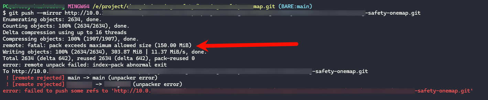
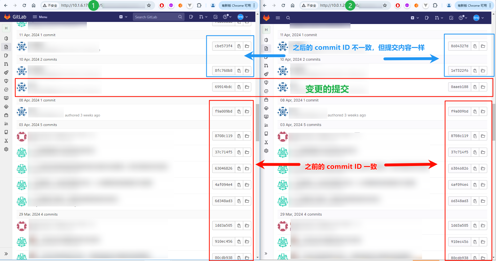
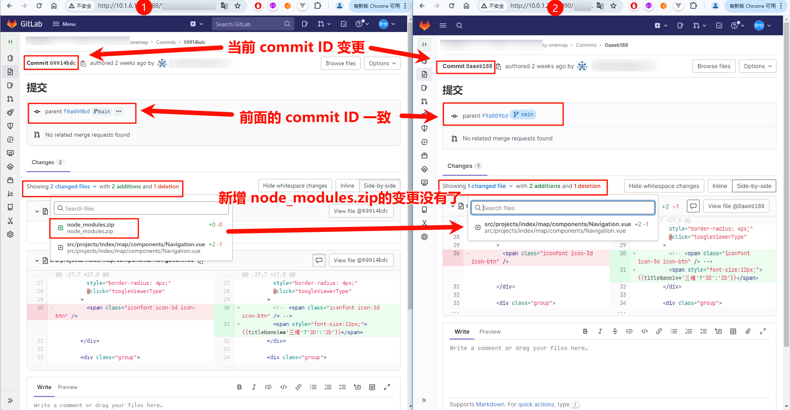

# 背景

## 需求
- GitLab仓库迁移到其他服务器的GitLab仓库。
- 不删除 Git 历史记录

## 问题
- 提交报错【我没有权限修改该限制】
	```bash
	remote: fatal: pack exceeds maximum allowed size (150.00 MiB)
	```
	

采用的迁移方式：[GitHub Docs - Duplicating a repository](https://docs.github.com/en/repositories/creating-and-managing-repositories/duplicating-a-repository)
```bash
git clone --bare https://github.com/EXAMPLE-USER/OLD-REPOSITORY.git
cd OLD-REPOSITORY.git
git push --mirror https://github.com/EXAMPLE-USER/NEW-REPOSITORY.git
cd ..
rm -rf OLD-REPOSITORY.git
```

另外的下面这种迁移方式同样会报错：
```bash
# 先删除
git remote rm origin
# 再增加
git remote add origin https://xxx/xxx/xxx.git
# 强制推送
git push -f origin <branch-name>
```

因为这是服务端 pack 大小限制导致的。


# 解决
流水账
1. 使用该方式拆分 commit 提交：[Splitting up a large push](https://docs.github.com/en/get-started/using-git/troubleshooting-the-2-gb-push-limit#splitting-up-a-large-push)
	```bash
	# 1
	git log --oneline --reverse refs/heads/BRANCH-NAME | awk 'NR % 10 == 0'
	# 2
	git push REMOTE-NAME <YOUR_COMMIT_SHA_NUMBER>:refs/heads/BRANCH-NAME
	# 3
	git push REMOTE-NAME  --mirror
	```
2. 通过拆分 commit 的方式提交失败，发现某个 commit 提交了 node_modules.zip 大小 209MB

3. 所以需要删除该文件的所有提交记录（因为有不删除 Git 历史记录的需求）
	参考
	- [Github删除某个文件的所有提交记录](https://cloud.tencent.com/developer/article/1665810)
	- [git怎么删除已经提交的文件](https://worktile.com/kb/ask/239451.html) 该blog中的命令有误，参考上文。
	`git filter-branch --force --index-filter "git rm --cached --ignore-unmatch [文件路径]" --prune-empty --tag-name-filter cat -- --all`
	我本地即执行
	`git filter-branch --force --index-filter "git rm --cached --ignore-unmatch ./node_modules.zip" --prune-empty --tag-name-filter cat -- --all`

4. 此时 `git log --pretty=oneline` 查看到因为文件 `./node_modules.zip` 的新增而产生的提交（A）前的所有commit ID 和内容都不变，但是该次提交及之后所有提交的 commit ID 都发生变化
	删除该文件的所有提交记录后：
	- 该次提交（A）的 commit 内容减少了新增该文件的变更。【原先：该文件在提交历史中，只在该次提交中发生了变更（新增）】
	- 该次提交（A）之后的 commit 内容无变化，commit ID 全部变了。
	- 该次提交（A）之前的所有 commit 内容及ID无变化。

5. 删除后，参照第 1 步，继续后续的拆分 commit 提交。


# 结果

如下图：
- 新旧仓库

- 提交（A）变更



# 参考
- [GitHub Docs - Troubleshooting the 2 GB push limit](https://docs.github.com/en/get-started/using-git/troubleshooting-the-2-gb-push-limit)
- [记一次Git仓库同步时大小超限问题的解决](https://www.banyudu.com/posts/fix-git-pack-exceeds-maximum-allowed-size-problem.b5bac6)
- [Github remote push pack size exceeded](https://stackoverflow.com/a/51468389)
- [git怎么删除已经提交的文件](https://worktile.com/kb/ask/239451.html)
	> 里面的命令有误应为
	> `git filter-branch --force --index-filter "git rm --cached --ignore-unmatch [文件路径]" --prune-empty --tag-name-filter cat -- --all`
- [Github删除某个文件的所有提交记录](https://cloud.tencent.com/developer/article/1665810)
