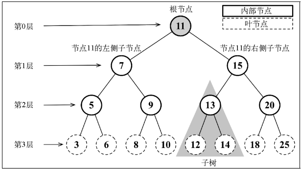
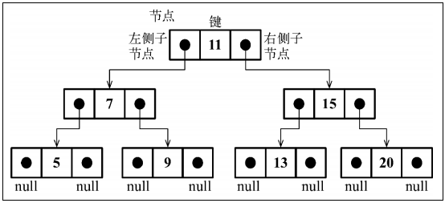

# Array 数组 _顺序数据结构_

- 最简单的内存数据结构；
- 数组存储一系列同一种数据类型的值；
- 可以在数组的任意位置上删除或添加元素；
- 数组是元素的一个有序集合，为了保证元素排列有序，它会占用更多的内存空间；
	>JS 的数组实际上是对象，是否会占用更多内存？


# Stack 栈 _顺序数据结构_

- 后进先出 LIFO: last in, first out；
- 能在添加或删除元素时进行更多控制，更为可控；
- 在回溯问题中，它可以存储访问过的任务或路径、撤销的操作；
- Java 和 C# 用栈来存储变量和方法调用，特别是处理递归算法时，有可能抛出一个栈溢出异常；

例子：
- 编程语言的编译器和内存中保存变量、方法调用等；
- 浏览器页面返回功能；
- 汉诺塔问题 https://leetcode.cn/problems/hanota-lcci/

# Queue 队列 _顺序数据结构_

- 先进先出 FIFO: first in, first out；
- 能在添加或删除元素时进行更多控制，更为可控；

例子：
- 打印队列；
- 浏览器任务队列；
- 循环队列：击鼓传花游戏；

## 双端队列 double-ended queue (deque)

- 允许同时从前端和后端添加和移除元素的特殊队列；
- 结合队列和栈，可以执行栈和队列中的操作；

例子：
- 存储一系列的撤销操作；
	>当用户在软件中进行了一个操作，该操作会被存在一个双端队列中（就像在一个栈里）。当用户点击撤销按钮时，该操作会被从双端队列尾被移除。在进行了预先定义的一定数量的操作后（操作过多后），最先进行的操作会被从双端队列头移除（而无法再撤销）。
- 回文检查器 【回文：正反都相同的单词、词组、数或一系列字符的序列】
- 优先队列


# LinkedList 链表 _顺序数据结构_

## 链表 LinkedList

- 动态数据结构，这意味着我们可以从中随意添加或移除项，它会按需进行扩容；
- 链表存储有序的元素集合，但不同于数组，链表中的元素在内存中并不是连续放置的；
- 每个元素由一个存储元素本身的节点和一个指向下一个元素的引用（也称指针或链接）组成；
- 添加或移除元素的时候不需要移动其他元素，因此需要添加和移除很多元素时，最好的选择就是链表，而非数组；
- 【缺点】在数组中，我们可以直接访问任何位置的任何元素，而要想访问链表中间的一个元素，则需要从起点（表头）开始迭代链表直到找到所需的元素；


## 双向链表 DublyLinkedList

- 相比普通链表，每个节点添加了指向前一个节点的引用；


## 循环链表 CircularLinkedList  

- 可以像链表一样只有单向引用，也可以像双向链表一样有双向引用；
- 最后一个元素指向下一个元素的指针（tail.next）不是引用 `undefined`，而是指向第一个元素（head）；
- 双向循环链表有指向 head 元素的 tail.next 和指向 tail 元素的 head.prev；


## 有序链表 SortedLinkedList

- 保持元素有序的链表结构，除了使用排序算法，还可以将元素插入到正确的位置来保证链表的有序性；

## 使用链表创建其他数据结构

好处
1. 可以复用链表数据结构中可用的操作，而不需要重写所有的逻辑代码；
	>如：在栈的实现内部使用链表数据结构会更加简单，因为不需要重新创建这些代码，也使代码的可读性更好。

2. 可以使用 LinkedList 类及其变种作为内部的数据结构来创建其他数据结构，例如栈、队列和双向队列
	- StackLinkedList
	- QueueLinkedList
	- DequeLinkedList


# Set 集合 _顺序数据结构_

ECMAScript 2015 - Set [值，值]
- [MDN JS Set](https://developer.mozilla.org/zh-CN/docs/Web/JavaScript/Reference/Global_Objects/Set) 


- 集合是由一组无序且唯一（即不能重复）的项组成的。该数据结构使用了与有限集合相同的数学概念，但应用在计算机科学的数据结构中；  

>集合是数学中基础的概念，在计算机领域也非常重要。它在计算机科学中的主要应用之一是数据库，而数据库是大多数应用程序的根基。集合被用于查询的设计和处理。当我们创建一条从关系型数据库（Oracle、Microsoft SQL Server、MySQL 等）中获取一个数据集合的查询语句时，使用的就是集合运算，并且数据库也会返回一个数据集合。当我们创建一条 SQL 查询命令时，可以指定是从表中获取全部数据还是获取其中的子集；也可以获取两张表共有的数据、只存在于一张表中的数据（不存在于另一张表中），或是存在于两张表内的数据（通过其他运算）。这些 SQL 领域的运算叫作联接，而 SQL 联接的基础就是集合运算。


**并集：** 对于给定的两个集合，返回一个包含两个集合中所有元素的新集合。
**交集：** 对于给定的两个集合，返回一个包含两个集合中共有元素的新集合。
**差集：** 对于给定的两个集合，返回一个包含所有存在于第一个集合且不存在于第二个集合的元素的新集合。
**子集：** 验证一个给定集合是否是另一集合的子集。


>在数学中，有一个叫作多重集的概念，它允许我们向集合中插入之前已经添加过的元素。多重集（或袋）在计算集合中元素的出现次数时很有用。它也在数据库系统中得到了广泛运用。


# Dictionary 字典 _非顺序数据结构_

ECMAScript 2015 - Map [键，值]
- [MDN JS Map](https://developer.mozilla.org/zh-CN/docs/Web/JavaScript/Reference/Global_Objects/Map)


- 在字典中，存储的是 [键，值] 对，其中键名是用来查询特定元素的。字典和集合很相似，集合以 [值，值] 的形式存储元素，字典则是以 [键，值] 的形式来存储元素。字典也称作映射、符号表或关联数组；
- ECMAScript 2015 的 Map 类的实现，即字典；  


# HashTable/HashMap 散列表 _非顺序数据结构_

ECMAScript 2015 - Map [键，值]
- [MDN JS Map](https://developer.mozilla.org/zh-CN/docs/Web/JavaScript/Reference/Global_Objects/Map)


>**是 Dictionary 类的一种散列表实现方式；**


>一个常见的应用是使用散列表来表示对象。**JavaScript 语言内部就是使用散列表来表示每个对象。** 此时，对象的每个属性和方法（成员）被存储为 key 对象类型，每个 key 指向对应的对象成员； 


>散列算法的作用是尽可能快地在数据结构中找到一个值。前面的顺序数据结构中，如果要在数据结构中获得一个值（使用 get 方法），需要迭代整个数据结构来找到它。如果使用散列函数，就知道值的具体位置，因此能够快速检索到该值。散列函数的作用是给定一个键值，然后返回值在表中的地址；


>良好的散列函数由以下两方面组成：
>	- 较少的插入和检索的时间（即性能）；
>	- 较低的冲突可能性；

一个好的散列函数示例：

```js
djb2HashCode(key) {
	const tableKey = this.toStrFn(key);
	let hash = 5381; // 初始化一个 hash 变量并赋值为一个质数（大多数实现都使用 5381）
	for (let i = 0; i < tableKey.length; i++) {
		// 将 hash 与 33 相乘（用作一个幻数）【幻数在编程中指直接使用的常数】
		hash = (hash * 33) + tableKey.charCodeAt(i);
	}
	return hash % 1013; // 质数，选择比我们认为的散列表大小要大的质数
}
```


>最常见的散列函数，lose lose 散列函数，方法是简单地将每个键值中的每个字母的 ASCII 值相加；
>


>在一些编程语言中，还有一种叫作散列集合的实现。散列集合由一个集合构成，但是插入、移除或获取元素时，使用的是 hashCode 函数。我们可以复用散列表中实现的所有代码来实现散列集合，不同之处在于，不再添加键值对，而是只插入值而没有键。例如，可以使用散列集合来存储所有的英语单词（不包括它们的定义）。和集合相似，散列集合只存储不重复的唯一值；

## 处理相同散列值带来的冲突

有这几种方法：分离链接、线性探查和双散列法； 

### 分离链接

>分离链接法包括为散列表的每一个位置创建一个链表并将元素存储在里面。它是解决冲突的最简单的方法，但是在 HashTable 实例之外还需要额外的存储空间。


### 线性探查

>称作线性，是因为它处理冲突的方法是将元素直接存储到表中，而不是在单独的数据结构中；

>当想向表中某个位置添加一个新元素的时候，如果索引为 position 的位置已经被占据了，就尝试 position+1 的位置。如果 position+1 的位置也被占据了，就尝试 position+2 的位置，以此类推，直到在散列表中找到一个空闲的位置；（迭代散列表，直到找到一个空闲的位置）


#### 删除元素时的区别

1. 软删除（惰性删除）
	>使用一个特殊的值（标记）来表示键值对被删除了，而不是真的删除它。经过一段时间，散列表被操作过后，我们会得到一个标记了若干删除位置的散列表。这会逐渐降低散列表的效率，因为搜索键值会随时间变得更慢。

	缺点：效率会越来越低。

	>

2. 移动一个或多个元素到之前的位置
	>需要检验是否有必要将一个或多个元素移动到之前的位置。当搜索一个键的时候，这种方法可以避免找到一个空位置。如果移动元素是必要的，我们就需要在散列表中挪动键值对。

	缺点：删除效率低。

	>

### 双散列法


---
# ES2015 WeakSet 类 和 WeakMap 类

- [MDN JS WeakSet](https://developer.mozilla.org/zh-CN/docs/Web/JavaScript/Reference/Global_Objects/WeakSet) 
- [MDN JS WeakMap](https://developer.mozilla.org/zh-CN/docs/Web/JavaScript/Reference/Global_Objects/WeakSet) 


除了 Set 和 Map 这两种新的数据结构，ES2015还增加了它们的弱化版本，WeakSet 和 WeakMap。

基本上，Map 和 Set 与其弱化版本之间仅有的区别是：
- WeakSet 或 WeakMap 没有 entries、keys 和 values 等方法；
- 只能用对象作为键。 

优点：
- 性能。WeakSet 和 WeakMap 是弱化的（用对象作为键），没有强引用的键。这使得 JavaScript 的垃圾回收器可以从中清除整个入口；？？？
- 必须用键才可以取出值；（实现使用 WeakMap 类封装 ES2015 类的私有属性） 

---

# Tree 树 _非顺序数据结构_

- 存储需要快速查找的数据；
	> 新增及删除数据时耗时；

- 树是一种分层数据的抽象模型；

- 树的结构

	- 一个树结构包含一系列存在父子关系的节点。每个节点都有一个父节点（除了顶部的第一个节点）以及零个或多个子节点；

		
	- 子树由节点和它的后代构成；
	
	- 节点的一个属性是深度，节点的深度取决于它的祖先节点的数量。比如，节点 3 有 3 个祖先节点（5、7 和 11），它的深度为 3；
	
	- 树的高度取决于所有节点深度的最大值；


## 二叉树（Binary Tree）和二叉搜索树（Binary Search Tree）

结构

- 二叉树中的节点最多只能有两个子节点：一个是左侧子节点，另一个是右侧子节点。

	> 这个定义有助于我们写出更高效地在树中插入、查找和删除节点的算法。

- 二叉搜索树（BST）是二叉树的一种

	但是**只允许你在左侧节点存储（比父节点）小的值，在右侧节点存储（比父节点）大的值。**

	

- 二叉搜索树的问题

	>取决于添加的节点数，树的一条边可能会非常深。即树的一条分支会有很多层，而其他的分支却只有几层；当需要在某条边上添加、移除和搜索某个节点时会引起一些性能问题。

	>为了解决这个问题，有一种树叫作 Adelson-Velskii-Landi 树（AVL 树）。AVL 树是一种自平衡二叉搜索树，意思是任何一个节点左右两侧子树的高度之差最多为 1。


## 树的遍历

三种方法

### 中序遍历

>一种以上行顺序（先左侧子节点 → 自身节点 → 最后右侧子节点）访问 BST 所有节点的遍历方式，也就是以从最小到最大的顺序访问所有节点。

中序遍历的一种应用就是对树进行排序操作。

```js
inOrderTraverseNode(node, callback) {
  if (node == null) return;

  this.inOrderTraverseNode(node.left, callback);
  callback(node.key);
  this.inOrderTraverseNode(node.right, callback);
}
```

### 先序遍历

>以优先于后代节点的顺序（先自身节点 → 左侧子节点 → 最后右侧子节点）访问每个节点。

先序遍历的一种应用是打印一个结构化的文档。

```js
preOrderTraverseNode(node, callback) {
  if (node == null) return;

  callback(node.key);
  this.preOrderTraverseNode(node.left, callback);
  this.preOrderTraverseNode(node.right, callback);
}
```

### 后序遍历

>先访问节点的后代节点，再访问节点本身（先左侧子节点 → 右侧子节点 → 最后自身节点）。

后序遍历的一种应用是计算一个目录及其子目录中所有文件所占空间的大小。

```js
postOrderTraverseNode(node, callback) {
  if (node == null) return;

  this.postOrderTraverseNode(node.left, callback);
  this.postOrderTraverseNode(node.right, callback);
  callback(node.key);
}
```


## 搜索树中的值

三种常执行的搜索类型

### 搜索最小值

>遍历二叉搜索树的左边直到找到树的最下层（最左端）。

```js

minNode(node) {
  let current = node;

  while (current != null && current.left != null) {
	current = current.left;
  }

  return current;
}
```

### 搜索最大值

>遍历二叉搜索树的右边直到找到树的最下层（最右端）。

```js

maxNode(node) {
  let current = node;

  while (current != null && current.right != null) {
	current = current.right;
  }

  return current;
}
```

### 搜索特定值

```js

searchNode(node, key) {
  if (node == null) {
	return false;
  }

  if (this.compareFn(key, node.key) === Compare.LESS_THAN) {
	return this.searchNode(node.left, key);
  } else if (this.compareFn(key, node.key) === Compare.BIGGER_THAN) {
	return this.searchNode(node.right, key);
  }

  return true;
}
```


### 移除一个节点

```js

removeNode(node, key) {
  if (node == null) {
	return undefined;
  }
  
  if (this.compareFn(key, node.key) === Compare.LESS_THAN) {
	// 如果移除不存在的节点值，最终只会是在叶节点的 left 和 right 再次赋值为 undefined
	node.left = this.removeNode(node.left, key);
	return node;
  } else if (this.compareFn(key, node.key) === Compare.BIGGER_THAN) {
	node.right = this.removeNode(node.right, key);
	return node;
  }
  // key is equal to node.item
  // handle 3 special conditions
  // 1 - a leaf node
  // 2 - a node with only 1 child
  // 3 - a node with 2 children

  // case 1
  if (node.left == null && node.right == null) {
	node = undefined;
	return node;
  }

  // case 2
  if (node.left == null) {
	node = node.right;
	return node;
  } else if (node.right == null) {
	node = node.left;
	return node;
  }

  // case 3
  const aux = this.minNode(node.right);
  node.key = aux.key;
  node.right = this.removeNode(node.right, aux.key);
  return node;
}
```


## 自平衡树

### Adelson-Velskii-Landi 树（AVL Tree）

> 一种自平衡二叉搜索树

添加或移除节点时，AVL 树会尝试保持自平衡（尽可能尝试转换为完全树），即任意一个节点（不论深度）的左子树和右子树高度最多相差 1。

平衡操作：向 AVL 树插入或移除节点时，可以执行单旋转或双旋转两种平衡操作平衡树的结构。

### 红黑树

> 一种自平衡二叉搜索树

- 结构
	1. 每个节点不是红的就是黑的；
	2. 树的根节点是黑的；
	3. 所有叶节点都是黑的（用 NULL 引用表示的节点）；
	4. 如果一个节点是红的，那么它的两个子节点都是黑的；
	5. 不能有两个相邻的红节点，一个红节点不能有红的父节点或子节点；
	6. 从给定的节点到它的后代节点（NULL 叶节点）的所有路径包含相同数量的黑色节点。

优缺点：
- 插入删除操作少，搜索操作多，使用 AVL 树；
- 插入删除操作较多，使用红黑树；


---
# 二叉树有两种表示方式

1. 使用指针（节点）动态表示；
    左侧子节点：`node.left`
    右侧子节点：`node.right`
    父节点：`node.parent`

2. 使用数组，通过索引值检索父节点、左侧和右侧子节点的值。
    左侧子节点的数组位置：`2 * index + 1`
    右侧子节点的数组位置：`2 * index + 2`
    父节点的数组位置：`Math.floor((index - 1) / 2)`

---
# Heap 二叉堆（堆） _非顺序数据结构_

> 一种特殊的二叉树。不是二叉搜索树（BST）。
>
>由于能高效、快速地找出最大值和最小值，常被应用于**优先队列**。
>
>也被用于著名的堆排序算法中。


## 结构特性

>是完全二叉树，并且最后一层的叶节点尽可能都是左侧子节点。

## 堆特性

>二叉堆不是最小堆就是最大堆。
>
>最小堆允许你快速导出树的最小值；
>
>最大堆允许你快速导出树的最大值；
>
>所有的节点都大于等于（最大堆）或者小于等于（最小堆）每个它的子节点。
>
>每个子节点都要大于等于父节点（最小堆）或小于等于父节点（最大堆）。  

## 堆排序算法

包含三个步骤：

1. 用数组创建一个最大堆用作源数据；
	    用最大堆得到一个升序排列的数组（从最小到最大）。***ASC - ascending sort***
	    用最小堆得到一个降序排列的数组（从最大到最小）。***DESC - descending sort***

2. 在创建最大堆后，最大的值会被存储在堆的第一个位置。我们要将它替换为堆的最后一个值，将堆的大小减 1；

3. 最后，我们将堆的根节点下移并重复步骤 2 直到堆的大小为 1。

> 堆排序算法不是一个稳定的排序算法，
> 
> 如果数组没有排好序，可能会得到不一样的结果。


# Graph 图 _非线性数据结构_

## 相关术语

> 图是网络结构的抽象模型。
> 
> 图是一组由边连接的节点（顶点）。

一个图 `G = (V, E)` 由以下元素组成：
- V, Vertex: 一组顶点；
- E, Edge: 一组边，连接 V 中的顶点；  


- 相邻顶点：由一条边连接在一起的顶点；
- 一个顶点的度：其相邻顶点的数量；
- 路径：是顶点 *v*1, *v*2, …, *vk* 的一个连续序列，其中 *vi* 和 *vi*+1 是相邻的；
- 简单路径：不包含重复的顶点的路径；
- 如果图中不存在环，则称该图是无环的。
- 如果图中每两个顶点间都存在路径（不需要相邻），则该图是连通的。
- 未加权的图：图的边没有赋值；
- 加权的图：图的边被赋予了权值；


有向图 & 无向图
- 有向图：图的边存在方向；
- 无向图：图的边不存在方向；
- 如果图中每两个顶点间在双向上都存在路径，则该图是强连通的。
- 稀疏图：不是强连通的图。


## 图的表示

> 从数据结构的角度来说，我们有多种方式来表示图。
> 
> 在所有的表示法中，不存在绝对正确的方式。
> 
> 图的正确表示法取决于待解决的问题和图的类型。


### 邻接矩阵

> 图的最常见实现。


结构：
- 每个节点都和一个整数相关联，该整数将作为数组的索引。（如 C：2，G：6）
- 用一个二维数组来表示顶点之间的连接。
    （array\[2\]\[6\] = 1 表示 C 可以到达 G，C G 相邻）
    （array\[6\]\[2\] = 1 表示 G 可以到达 C，C G 相邻）

缺点：
- 稀疏图如果用邻接矩阵来表示，则矩阵中将会有很多 0，这意味着我们浪费了计算机存储空间来表示根本不存在的边。
- 找给定顶点的相邻顶点，即使该顶点只有一个相邻顶点，我们也不得不迭代一整行。
- 图中顶点的数量可能会改变，而二维数组不太灵活。


### 邻接表

> 动态数据结构

邻接表由图中每个顶点的相邻顶点列表所组成。

存在好几种方式来表示这种数据结构。可以用列表（数组）、链表，甚至是散列表或是字典来表示相邻顶点列表。


### 关联矩阵

在关联矩阵中，矩阵的行表示顶点，列表示边。

使用二维数组来表示两者之间的连通性，

如果顶点 *v* 是边 *e* 的入射点，则 array\[v\]\[e\] === 1；否则，array\[v\]\[e\] === 0。  


关联矩阵通常用于边的数量比顶点多的情况，以节省空间和内存。


## 图的遍历

图遍历可以用来寻找特定的顶点或寻找两个顶点之间的路径，检查图是否连通，检查图是否含有环等。  

### 图遍历算法思想

- 必须追踪每个第一次访问的节点；

- 追踪哪些节点还没有被完全探索；

- 两种图遍历算法，都需要明确指出第一个被访问的顶点；

	>深度优先搜索算法不需要一个源顶点。
	>在深度优先搜索算法中，若图中顶点 *v* 未访问，则访问该顶点 *v*。

- 完全探索一个顶点要求我们查看该顶点的每一条边。对于每一条边所连接的没有被访问过的顶点，将其标注为被发现的，并将其加进待访问顶点列表中；

	>当要标注已经访问过的顶点时，我们用三种颜色来反映它们的状态。
	- 白色：表示该顶点还没有被访问。
	- 灰色：表示该顶点被访问过，但并未被探索过。
	- 黑色：表示该顶点被访问过且被完全探索过。

- 为了保证算法的效率，访问每个顶点至多两次。连通图中每条边和顶点都会被访问到；

- BFS 算法和 DFS 算法基本上是相同的，只有一点不同，那就是待访问顶点列表的数据结构；
	- BFS - 队列 - 将顶点存入队列，最先入队列的顶点先被探索；
	- DFS - 栈 - 由递归调用所创建的栈 - 将顶点存入栈，顶点是沿着路径被探索的，存在新的相邻顶点就去访问；


### 广度优先搜索 breadth-first search, BFS

> 先广度后深度地访问顶点。

BFS 算法会从指定的第一个顶点开始遍历图，先访问其所有的邻点（相邻顶点），将访问到的相邻顶点入队列，该顶点则出队（被完全探索了），再访问队头顶点的所有邻点，重复上诉步骤，直到队列为空。

使用 BFS 寻找最短路径

> 给定一个图 *G* 和源顶点 *v*，找出每个顶点 *u* 和 *v* 之间最短路径的距离（以边的数量计）。

> 对于给定顶点 v，广度优先算法会访问所有与其距离为 1 的顶点，接着是距离为 2 的顶点，以此类推。所以，可以用广度优先算法来解这个问题。

> 如果要计算加权图中的最短路径，广度优先搜索未必合适。


### 深度优先搜索 depth-first search, DFS

> 先深度后广度地访问顶点。

DFS 算法将会从第一个指定的顶点开始遍历图，沿着路径直到这条路径最后一个顶点被访问了，接着原路回退并探索下一条路径。

深度优先搜索的步骤是递归的，这意味着深度优先搜索算法使用栈来存储函数调用（由递归调用所创建的栈）。

1. 探索深度优先算法背后的思想

	> 边是从最近发现的顶点 u 处被向外探索的。只有连接到未发现的顶点的边被探索了。当 u 所有的边都被探索了，该算法回退到 u 被发现的地方去探索其他的边。这个过程持续到我们发现了所有从原始顶点能够触及的顶点。如果还留有任何其他未被发现的顶点，我们对新源顶点重复这个过程。重复该算法，直到图中所有的顶点都被探索了。

	特点：
	    1. 时间（time）变量值的范围只可能在图顶点数量的一倍到两倍（2|V|）之间；
	    2. 对于所有的顶点 u，d[u]<f[u]（意味着，发现时间的值比完成时间的值小）；
	
	得出：1 <= d [u] < f [u] <= 2|V|

2. 拓扑排序（topological sorting）使用深度优先搜索

	拓扑排序只能应用于有向无环图（DAG - Directed Acyclic Graph）
	以倒序来排序完成时间数组，这便得出了该图的拓扑排序。
	拓扑排序结果有多种可能结果。
	（编排一些任务或步骤的执行顺序时，排在后面的只能等前面的完成了才能进行。）


## 最短路径算法

### Dijkstra 算法

### Floyd-Warshall 算法

## 最小生成树

### Prim 算法

### Kruskal 算法

# 排序和搜索算法

# 算法设计与技巧

# 算法复杂度