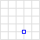
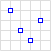
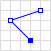
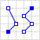
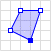
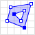
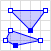
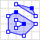

# Point

- WKT
	`POINT (30 10)`
- GeoJSON
	`{ "type": "Point", "coordinates": [30, 10] }`


# MultiPoint

- WKT
	`MULTIPOINT ((10 40), (40 30), (20 20), (30 10))`
- GeoJSON
	`{ "type": "MultiPoint", "coordinates": [ [10, 40], [40, 30], [20, 20], [30, 10] ] }`

- WKT
	`MULTIPOINT (10 40, 40 30, 20 20, 30 10)`
- GeoJSON
	`{ "type": "MultiPoint", "coordinates": [ [10, 40], [40, 30], [20, 20], [30, 10] ] }`


# LineString

- WKT
	`LINESTRING (30 10, 10 30, 40 40)`
- GeoJSON
	`{ "type": "LineString", "coordinates": [ [30, 10], [10, 30], [40, 40] ] }`


# MultiLineString

- WKT
	`MULTILINESTRING ((10 10, 20 20, 10 40), (40 40, 30 30, 40 20, 30 10))`
- GeoJSON
```json
{
	"type": "MultiLineString",
	"coordinates": [
		[[10, 10], [20, 20], [10, 40]],
		[[40, 40], [30, 30], [40, 20], [30, 10]]
	]
}
```


# Polygon

- WKT
	`POLYGON ((30 10, 40 40, 20 40, 10 20, 30 10))`
- GeoJSON
```json
{
	"type": "Polygon",
	"coordinates": [
		[[30, 10], [40, 40], [20, 40], [10, 20], [30, 10]]
	]
}
```


# Polygon with hole

- WKT
	`POLYGON ((35 10, 45 45, 15 40, 10 20, 35 10), (20 30, 35 35, 30 20, 20 30))`
- GeoJSON
```json
{
	"type": "Polygon",
	"coordinates": [
		[[35, 10], [45, 45], [15, 40], [10, 20], [35, 10]],
		[[20, 30], [35, 35], [30, 20], [20, 30]] 
	]
}
```


# MultiPolygon

- WKT
	`MULTIPOLYGON (((30 20, 45 40, 10 40, 30 20)), ((15 5, 40 10, 10 20, 5 10, 15 5)))`
- GeoJSON
```json
{
	"type": "MultiPolygon",
	"coordinates": [
		[
			[[30, 20], [45, 40], [10, 40], [30, 20]]
		],
		[
			[[15, 5], [40, 10], [10, 20], [5, 10], [15, 5]]
		]
	]
}
```


# MultiPolygon with hole

- WKT
	`MULTIPOLYGON (((40 40, 20 45, 45 30, 40 40)), ((20 35, 10 30, 10 10, 30 5, 45 20, 20 35), (30 20, 20 15, 20 25, 30 20)))`
- GeoJSON
```json
{
	"type": "MultiPolygon",
	"coordinates": [
		[
			[[40, 40], [20, 45], [45, 30], [40, 40]]
		],
		[
			[[20, 35], [10, 30], [10, 10], [30, 5], [45, 20], [20, 35]],
			[[30, 20], [20, 15], [20, 25], [30, 20]] 
		]
	]
}
```


