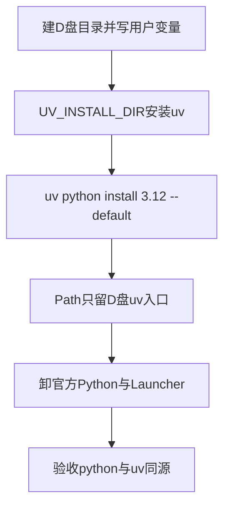

> Windows 10/11 新电脑从零配置 uv / Python。工具装到 D 盘，避免占满系统盘。全局只留一个 `python` 入口；项目用 `.python-version` + `.venv`。

日常命令见 [uv](/Language/Python/uv.md)。

## 背景环境

| 项 | 版本 / 说明 |
| --- | --- |
| Windows | 10 / 11（64 位） |
| uv | 0.12.17（其它小版本需自行回归） |
| Python | 由 uv 安装的 3.12.14（`uv python install 3.12` 会取当时最新 patch） |

# 原则

- **不要**安装 [python.org](https://www.python.org/downloads/windows/) 的 Windows Installer。用 [uv](https://docs.astral.sh/uv/) 管理解释器版本。
- **不要**把 Anaconda / Miniconda 的 Python 写进系统 Path。需要时只在 Anaconda Prompt 或 `conda activate` 里用，见 [Anaconda](/Language/Python/Anaconda.md)。
- 关掉 **应用执行别名** 里的 `python.exe` / `python3.exe`（Microsoft Store 占位会抢命令）。
- 全局**不要** `pip install`。用 `uv add` / `uv run`，或项目 `.venv` 里的 pip。
- **不要**用 `py` 启动器。只用 `python` / `uv`。
- **不要**设 `UV_UNMANAGED_INSTALL`，否则会关掉 `uv self update`。
- `UV_INSTALL_DIR` 只在安装命令里用，不必写成持久用户变量。

# 推荐目录

新机按盘符改即可。

```text
D:\dev\env\uv           uv 本体 + python / 工具入口（用户 Path 置顶）
D:\dev\env\uv\python    各版本 CPython
D:\dev\env\cache\uv     下载缓存
```

用户环境变量（写入后**新开**终端才生效）：

| 变量 | 值 |
| --- | --- |
| `UV_PYTHON_INSTALL_DIR` | `D:\dev\env\uv\python` |
| `UV_PYTHON_BIN_DIR` | `D:\dev\env\uv` |
| `UV_CACHE_DIR` | `D:\dev\env\cache\uv` |
| `UV_TOOL_BIN_DIR` | `D:\dev\env\uv` |

用户 Path **只加并置顶** `D:\dev\env\uv`。不要把 `D:\dev\env\uv\python\...` 整棵树加进 Path，也不要加 `%USERPROFILE%\.local\bin`。

# 安装前清理

空白新机可跳过本节。若已装 python.org、旧 `py` 启动器，或 Path 里已有 `Programs\Python`，必须先清干净，否则 `uv python install` 看起来成功、`python -V` 仍指向旧安装。

1. 关掉 Cursor / VS Code、所有终端、正在跑的 `python` / `pip`。
2. 核对本机入口：

```powershell
Get-Command python, python3, py, pip -ErrorAction SilentlyContinue |
  Select-Object Name, Source
python -V
py -0p
($env:Path -split ';') | Where-Object { $_ -match 'python|Anaconda|uv|\.local' }
```

3. **设置 → 应用 → 已安装的应用** 中卸载：
   - Python 3.x（及其拆开的 Executables / Documentation / Add to Path / Tcl/Tk / Core / pip / Standard Library 等组件）
   - **Python Launcher**（`C:\WINDOWS\py.exe`）
4. **设置 → 系统 → 关于 → 高级系统设置 → 环境变量**。用户变量、系统变量都要看：Path 中删除 `...\Programs\Python\Python3xx\` 与 `...\Python3xx\Scripts\`。
5. **设置 → 应用 → 高级应用设置 → 应用执行别名**，关闭 `python.exe`、`python3.exe`。
6. Anaconda 可留，但 Path 里不要有它的 Python。Pandoc 与 Python 无关，不必为本篇卸载。
7. 项目目录（如 `D:\dev\project`）和其中的 `.venv` **不要在这一步删**；旧官方解释器卸掉后，到项目里再重建虚拟环境。

**关掉所有终端再开一个新的**，核对应几乎找不到旧命令：

```powershell
Get-Command python, python3, py, pip -ErrorAction SilentlyContinue |
  Select-Object Name, Source
```

# 安装顺序



空白新机没有官方 Python 时，可跳过「卸官方」；Path 仍须只留 `D:\dev\env\uv`。

## 1. 建目录、写用户变量、装 uv

```powershell
New-Item -ItemType Directory -Force -Path D:\dev\env\uv, D:\dev\env\uv\python, D:\dev\env\cache\uv | Out-Null

[Environment]::SetEnvironmentVariable('UV_PYTHON_INSTALL_DIR', 'D:\dev\env\uv\python', 'User')
[Environment]::SetEnvironmentVariable('UV_PYTHON_BIN_DIR', 'D:\dev\env\uv', 'User')
[Environment]::SetEnvironmentVariable('UV_CACHE_DIR', 'D:\dev\env\cache\uv', 'User')
[Environment]::SetEnvironmentVariable('UV_TOOL_BIN_DIR', 'D:\dev\env\uv', 'User')

powershell -ExecutionPolicy ByPass -c { $env:UV_INSTALL_DIR = 'D:\dev\env\uv'; irm https://astral.sh/uv/install.ps1 | iex }
```

安装脚本一般会把 `D:\dev\env\uv` 写入用户 Path。装完**新开** PowerShell：

```powershell
Get-Command uv | Select-Object Source
uv --version
Get-ChildItem Env:UV_PYTHON_INSTALL_DIR, Env:UV_PYTHON_BIN_DIR, Env:UV_CACHE_DIR, Env:UV_TOOL_BIN_DIR
```

合格：`Source` 为 `D:\dev\env\uv\uv.exe`；四个变量与上表一致。

官方安装选项见 [Installer options](https://docs.astral.sh/uv/reference/installer/)。

## 2. 用 uv 安装 Python 并设为全局默认

须在上一步四个变量已可见的终端里执行：

```powershell
uv python install 3.12 --default
uv python list
uv python dir
uv python dir --bin
```

`--default` 目前为实验性选项，可能打印 warning，可加 `--preview-features python-install-default` 消除。

合格：

- `uv python dir` → `D:\dev\env\uv\python`
- `uv python dir --bin` → `D:\dev\env\uv`
- `list` 中有 uv 下载的 `cpython-3.12.x-windows-x86_64-none`（路径在 `D:\dev\env\uv\python\...`）
- 同一次 `list` 里出现 `cpython-3.12.14-...` 与 `cpython-3.12-...` 是次版本入口，不是装了两套

```powershell
Get-Command python, python3, python3.12, uv -ErrorAction SilentlyContinue |
  Select-Object Name, Source
python -V
```

若 `D:\dev\env\uv` 已在官方 Python 的 Path 之前，此时 `python` 的 Source 就应是 `D:\dev\env\uv\python.exe`，版本为 3.12.x。若仍指向 `...\Programs\Python\Python3xx\...`，先确认 `D:\dev\env\uv` 下已有 `python.exe`，再把该目录在用户 Path 中置顶。

## 3. 切全局入口

**设置 → 系统 → 关于 → 高级系统设置 → 环境变量 → 用户变量 Path**：

1. 删除 `...\Programs\Python\Python3xx\` 与 `...\Python3xx\Scripts\`（若还在）
2. 保留并置顶 `D:\dev\env\uv`
3. 不要加 `%USERPROFILE%\.local\bin`
4. `D:\dev\env\nvm`、`D:\dev\env\nodejs`、Pandoc 等其它条目原样保留

再次确认应用执行别名已关闭。关掉所有终端和 Cursor，再开 PowerShell：

```powershell
Get-Command python, python3, py, pip -ErrorAction SilentlyContinue |
  Select-Object Name, Source
python -V
($env:Path -split ';') | Where-Object { $_ -match 'python|uv|Pandoc|nvm' }
```

合格：`python` 来自 `D:\dev\env\uv`；Path 无 `Python3xx`。此时没有全局 `pip` 是正常的。`py` 若仍在，下一步卸掉。

## 4. 卸载官方 Python（若存在）

**设置 → 应用 → 已安装的应用**，卸掉 Python 3.x 各组件与 **Python Launcher**。

卸完再开终端：

```powershell
Get-Command python, py, pip -ErrorAction SilentlyContinue | Select-Object Name, Source
python -V
py -0p
uv python list
```

合格：`python` 仍是 `D:\dev\env\uv\python.exe`；`py` 找不到；`list` 不再出现 `Programs\Python\Python3xx`。若弹出微软商店，再关一次应用执行别名。

# 项目里各自锁定版本

全局 `python` 只当默认解释器，不要往全局装包。

```powershell
cd D:\dev\project\某个项目
uv python pin 3.12
uv venv
.venv\Scripts\Activate.ps1
uv add requests
uv run python main.py
```

Cursor / VS Code 选该项目的 `.venv\Scripts\python.exe`，不要选全局那份。

另一个项目要用 3.11：

```powershell
uv python install 3.11
cd 另一个项目
uv python pin 3.11
uv venv
```

以前用官方安装包做过 `python -m venv` 的目录，卸掉官方解释器后会坏。进项目重建：

```powershell
Remove-Item -Recurse -Force .venv
uv python pin 3.12
uv venv
```

有 `pyproject.toml` / `uv.lock` 时用 `uv sync`；只有 `requirements.txt` 时用 `uv pip install -r requirements.txt`。

# 验收

新开普通 PowerShell：

```powershell
Get-Command python, uv | Select-Object Name, Source
python -V
uv python list
uv python dir
uv python dir --bin
($env:Path -split ';') | Where-Object { $_ -match 'Python3|Programs\\Python|dev\\env\\uv' }
```

合格标准：

- `python`、`uv` 都在 `D:\dev\env\uv`
- `python -V` 为 uv 管理的 3.12.x（本机验证为 3.12.14）
- Path 里没有 `Programs\Python\Python3xx`
- `uv python list` 没有官方安装路径
- `py` 不存在
- 项目激活 `.venv` 后，`Get-Command python` 指向该项目虚拟环境

以后换版本：`uv python install 3.11`，在项目里 `uv python pin 3.11`。不要再装 python.org 安装包。

# 相关笔记

- [uv](/Language/Python/uv.md)（日常命令、更新、卸载）
- [Python](/Language/Python/Python.md)
- [Anaconda](/Language/Python/Anaconda.md)
- [pip](/Language/Python/pip.md)
- Windows 新机 Node：[Windows-nvm-Node-pnpm-环境配置](/Node/Windows-nvm-Node-pnpm-环境配置.md)
- 官方：[Installation](https://docs.astral.sh/uv/getting-started/installation/)、[Installer options](https://docs.astral.sh/uv/reference/installer/)、[Installing Python](https://docs.astral.sh/uv/guides/install-python/)
