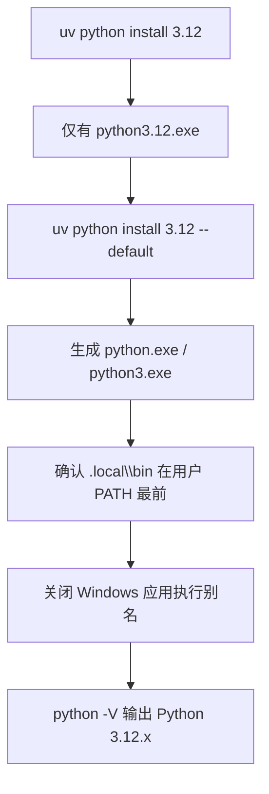

> 极快的 Python 包和项目管理工具，集 Python 解释器管理、虚拟环境、包管理、工具运行（`uvx`）于一体。无需预装 Python，适合新 Windows 机器及公司电脑禁装 Anaconda 的场景。

官方文档 https://docs.astral.sh/uv/

---

# 概述与定位

`uv` = Python 解释器管理 + 虚拟环境 + 包管理 + 工具运行（`uvx`）

## 与其他方案对比

| 方案 | 是否需要预装 Python | 典型场景 |
|------|-------------------|---------|
| python.org + venv | 是 | 传统方式，见 [Python](/Language/Python/Python.md) |
| Anaconda/conda | 否 | 数据科学全家桶，见 [Anaconda](/Language/Python/Anaconda.md) |
| **uv** | **否** | 轻量、现代、公司电脑友好 |

## 与 conda 命令对照

| conda | uv |
|-------|-----|
| `conda create -n myenv python=3.12` | `uv venv --python 3.12` |
| `conda activate myenv` | `.venv\Scripts\Activate.ps1` |
| `conda install numpy` | `uv add numpy` |
| `conda run -n myenv python script.py` | `uv run script.py` |

---

# 安装 uv（Windows 10/11）

采用 uv 官方独立安装脚本（Standalone installer，无需管理员权限，装到用户目录）：

```powershell
powershell -ExecutionPolicy ByPass -c "irm https://astral.sh/uv/install.ps1 | iex"
```

安装后验证：

```powershell
uv --version
```

说明：

- 安装路径：`%USERPROFILE%\.local\bin\`（含 `uv.exe`、`uvx.exe`、`uvw.exe`）
- 安装脚本会自动将 `.local\bin` 写入用户 PATH
- 若新终端找不到 `uv`，执行 `uv python update-shell` 或重开终端
- 若需了解官方列出的全部安装渠道，见 [Installation](https://docs.astral.sh/uv/getting-started/installation/)

---

# 安装 Python（由 uv 管理）

无需先去 python.org 下载：

```powershell
uv python install 3.12           # 安装指定版本，生成 python3.12.exe
uv python install 3.12 --default # 额外生成 python.exe / python3.exe（实验性）
uv python list                   # 查看已安装/可下载版本
```

关键路径：

- 解释器本体：`%APPDATA%\uv\python\cpython-3.12.x-windows-x86_64-none\python.exe`
- PATH 入口：`%USERPROFILE%\.local\bin\python3.12.exe`（及 `--default` 后的 `python.exe`）

参考 [Installing Python](https://docs.astral.sh/uv/guides/install-python/)

---

# 使 `python` 全局可用

`uv python install 3.12` 只装版本化命令（`python3.12`），**不会**创建 `python` 命令。



操作步骤：

1. 执行 `uv python install 3.12 --default`（当前为实验性功能，可加 `--preview-features python-install-default` 消除警告）
2. 若 `python -V` 仍无输出：到 **设置 → 应用 → 高级应用设置 → 应用执行别名**，关闭 `python.exe` 和 `python3.exe`（Windows 商店占位程序会抢占命令）
3. 重开终端后验证：

```powershell
python -V
python3 -V
python3.12 -V
```

---

# 日常使用

## 场景 A：快速运行脚本（无需手动建 venv）

```powershell
uv run --python 3.12 script.py
```

## 场景 B：项目开发（推荐）

```powershell
uv init                  # 初始化项目，生成 pyproject.toml
uv venv                  # 创建 .venv
.venv\Scripts\Activate.ps1
uv add requests          # 添加依赖
uv run python main.py    # 在项目环境中运行
```

## 场景 C：一次性工具（类 npx，MCP 场景常用）

`uvx` 是 `uv tool run` 的缩写，见 [MCP-原理](/AI/MCP/MCP-原理.md)。

```powershell
uvx mcp-server-filesystem
uvx ruff check .
```

## 场景 D：pip 兼容操作

```powershell
uv pip install -r requirements.txt
uv pip freeze
```

## 场景 E：锁定项目 Python 版本

```powershell
uv python pin 3.12       # 生成 .python-version
```

---

# 更新

## 更新 uv 自身

独立安装脚本方式，官方支持自更新：

```powershell
uv self update
```

## 更新 Python 补丁版本

```powershell
uv python upgrade 3.12   # 升级 3.12.x 到最新 patch
uv python upgrade         # 升级所有已安装的 uv 管理版本
```

---

# 卸载与清理

按官方 [Uninstallation](https://docs.astral.sh/uv/getting-started/installation/#uninstallation) 操作：

```powershell
uv cache clean
# 删除 Python 数据
Remove-Item -Recurse -Force (uv python dir)
# 删除工具数据
Remove-Item -Recurse -Force (uv tool dir)
# 删除二进制
Remove-Item "$HOME\.local\bin\uv.exe"
Remove-Item "$HOME\.local\bin\uvx.exe"
Remove-Item "$HOME\.local\bin\uvw.exe"
Remove-Item "$HOME\.local\bin\python*.exe" -ErrorAction SilentlyContinue
```

补充：从用户 PATH 中移除 `%USERPROFILE%\.local\bin`（若不再需要）。

---

# 公司电脑注意事项

- 无需管理员权限（独立安装脚本）
- 需网络访问 `astral.sh`、`github.com`（下载 uv 和 Python 发行版）
- 数据均在用户目录，不影响系统 Python
- 公司禁装 Anaconda 时，uv 可完整替代（解释器 + 环境 + 包管理）

---

# 参考链接

- 官方文档：https://docs.astral.sh/uv/
- 安装：https://docs.astral.sh/uv/getting-started/installation/
- Python 版本管理：https://docs.astral.sh/uv/concepts/python-versions/
- 项目指南：https://docs.astral.sh/uv/guides/projects/
- pip 接口：https://docs.astral.sh/uv/pip/
