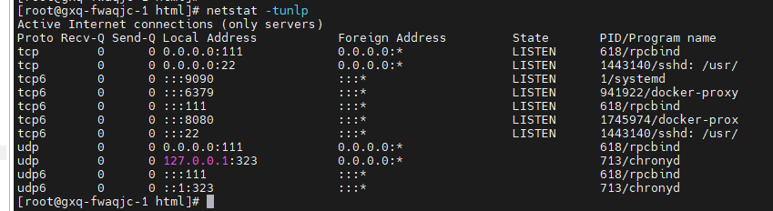

https://nginx.org/

**worker_connections**
- https://nginx.org/en/docs/ngx_core_module.html#worker_connections
> 通过调整控制连接数的参数来调整 Nginx 单个进程允许的客户端最大连接数。
> 这个参数表示每个进程允许的最多连接数，如果数字过大，就会预先申请大的内存以便接受连接。

**keepalive_timeout**

## 常见操作

**测试 Nginx 配置**（可选）：  
在容器内，可以先测试配置文件是否有错误：
`nginx -t`

**重新加载配置**：  
如果配置没有问题，可以使用以下命令重新加载 Nginx 配置：
`nginx -s reload`

**如果nginx部署在docker内：**
`docker exec -it nginx-container-name nginx -s reload`

**查找 Nginx 配置位置：**
1. 系统部署在 `http://ip:8080/xxxx/` 
2. 进入机器执行 `netstat -tunlp` 查看端口 8080 运行的进程
	
3. 查看该进程详情
	
4. 执行 `docker ps -a` 查询容器情况
	
5. 查看前端文件包部署位置，一般挂载在宿主机的路径上
	执行 `docker inspect nginx | grep Mounts -A 30` 
	查找挂载信息：在输出中，查找 "Mounts" 部分，这里会列出所有挂载的目录
	> `Source` 表示宿主机上的路径
	> `Destination`表示容器内的路径

	

