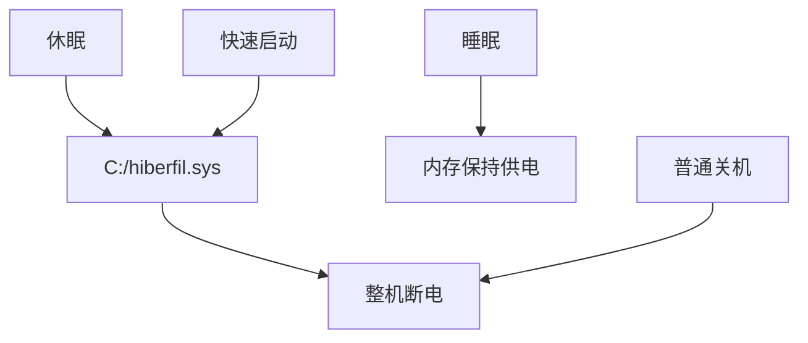

# Win10 关闭休眠与快速启动

C 盘根目录的 `hiberfil.sys` 体积接近内存容量。即使从不点「休眠」，只要开着快速启动，系统也会保留该文件。要释放这块空间，需要关掉休眠；快速启动依赖同一文件，会一并失效。睡眠不受影响。

入口见 [Windows.md](/OS/Windows/Windows.md)。

## 睡眠、休眠、快速启动不是同一件事

| | 睡眠 Sleep | 休眠 Hibernate | 快速启动（混合关机） |
| --- | --- | --- | --- |
| 当前窗口 / 程序 | 还在内存里 | 写入 `C:\hiberfil.sys` 后整机断电 | 关机时把内核状态写入同一文件 |
| 耗电 | 很少，仍在供电 | 几乎为 0 | 已关机 |
| 恢复速度 | 很快（约 1–2 秒） | 较慢（从磁盘读回） | 比冷开机快 |
| 突然断电 | 未保存内容会丢 | 一般还能恢复 | 已是关机 |
| 是否需要 `hiberfil.sys` | **不需要** | **需要** | **需要** |

日常对应：合盖或一段时间不用多为睡眠；开始菜单里的「休眠」才是休眠；点「关机」且开着快速启动时是混合关机。



只取消「启用快速启动」时，`hiberfil.sys` 通常还在（休眠功能仍可能启用）。要真正删掉该文件，必须关闭休眠。

## 关闭后对日常使用的影响

- 睡眠、锁屏、合盖睡眠：照常可用。
- 关机 / 重启：照常；没有快速启动后，冷开机可能多几秒到十几秒（SSD 通常不明显）。
- 开始菜单不再出现「休眠」：不能把当前桌面存盘后彻底断电。
- 正在运行的程序与性能：无影响。

笔记本若希望合盖彻底断电、过几小时再打开仍是原来的窗口，那是休眠而不是睡眠，关了就没有这种能力。台式机、插电使用、平时点关机或靠睡眠的，关了基本无感。

## 操作顺序

先在电源设置里关掉快速启动，再用命令关闭休眠并删除文件。不要去「设置 → 存储 → 临时文件」里找休眠项，那里没有。

### 1. 界面关掉快速启动

1. 开始菜单搜索 **电源和睡眠设置**，打开。
2. 右侧点 **其他电源设置**（进入控制面板的电源选项）。
3. 左侧点 **选择电源按钮的功能**。
4. 点 **更改当前不可用的设置**（需要管理员权限）。
5. 取消勾选 **启用快速启动（推荐）**。
6. 若下面还有 **休眠**，也可取消勾选（开始菜单里不再显示休眠）。
7. 点 **保存更改**。

看不到「启用快速启动」时，多半休眠已经关过，直接做下一步。

笔记本可再确认：电源选项 → **选择关闭盖子的功能**，合盖设为 **睡眠**，不要设「休眠」。电源和睡眠设置里的睡眠时间可按习惯保留。

### 2. 磁盘清理里经常没有「休眠文件清理器」

Win10 里这一项经常找不到，不是漏看：

| 打开的界面 | 会不会出现「休眠文件清理器」 |
| --- | --- |
| **设置 → 系统 → 存储 → 临时文件** | 不会 |
| 开始菜单搜到的「存储设置」 | 不会 |
| 磁盘清理第一屏（未点「清理系统文件」） | 不会 |
| `Win + R` → `cleanmgr` → **清理系统文件** | 有时会（取决于版本） |

可再试一次经典磁盘清理：`Win + R` → `cleanmgr` → 选 C 盘 → **清理系统文件** → 再选 C 盘 → 列表里找 **休眠文件清理器** 或 **休眠文件清理程序**。没有就不必再找，改用下面的命令，效果相同。

### 3. 用命令关闭休眠（可靠，会删除 `hiberfil.sys`）

1. 开始菜单搜索 **cmd** 或 **命令提示符**。
2. 右键 → **以管理员身份运行**。
3. 执行：

```bat
powercfg -h off
```

4. 没有报错即成功。建议重启一次。
5. 用资源管理器或 WizTree 再看 C 盘根目录，`hiberfil.sys` 应已消失。

若提示拒绝访问，说明当前窗口不是管理员，关掉后按第 2 步重开再执行。

## 恢复休眠

设置里没有对等开关。管理员命令提示符执行：

```bat
powercfg -h on
```

恢复后 `hiberfil.sys` 会重新出现，体积仍接近内存容量。
