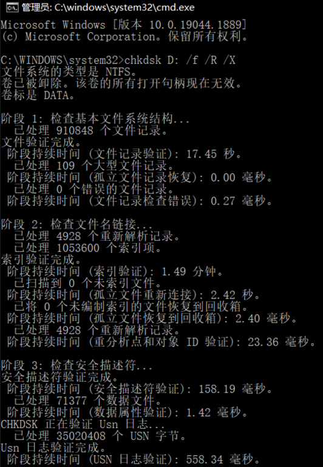
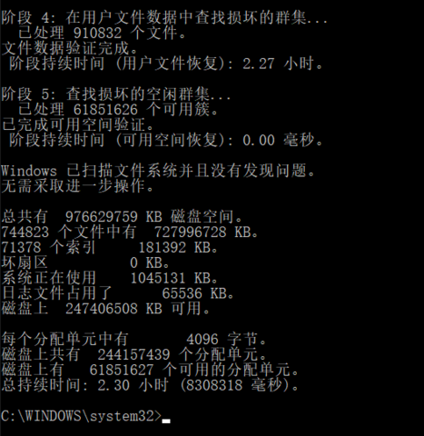

# 系统目录/文件

## 启动项目录

用户 `C:\Users\<用户名>\AppData\Roaming\Microsoft\Windows\Start Menu\Programs\Startup`
系统 `C:\ProgramData\Microsoft\Windows\Start Menu\Programs\StartUp`

## 本地 DNS

路径 `C:\Windows\System32\drivers\etc\hosts`

打开 cmd，更新DNS缓存，执行 `ipconfig /flushdns` ，执行 `ping xxx.com`，可通即可用。

# 查询

`wins` + `R` + `%temp%`: 查看电脑缓存，查询目录 `C:\Users\<用户名>\AppData\Local\Temp`

`wins` + `R` + `mrt`: windows 自带恶意软件删除工具

`wins` + `R` + `dxdiag`: 查看电脑相关硬件配置

`wins` + `R` + `regedit`：打开注册表编辑器

`wins` + `R` + `msconfig`: 系统配置 → 引导 → 高级选项 → 处理器个数增加
> 如果不启用，则默认使用全部核心，如果选中，则不一定会使用最大核心数量。需要查看设备管理器处理器个数。建议不启用。


# 工具

- [Windows Terminal](https://docs.microsoft.com/zh-cn/windows/terminal/) 
- [Microsoft PowerToys](https://docs.microsoft.com/zh-cn/windows/powertoys/) 
- [revo Uninstaller](https://www.revouninstaller.com/) 用于卸载正常途径没法卸载的应用
- [Geek Uninstaller](https://geekuninstaller.com/) 用于删除软件，扫描残留文件及软件注册表
- 截图工具 PixPin https://pixpinapp.com/ 功能强大。
- WizTree
- 轻便的图标、图像编辑器
    - paint.net
        - 官网下载地址 https://www.getpaint.net/download.html
        - 免费版本下载地址 https://www.dotpdn.com/downloads/pdn.html
    - win10 自带的画图3D

# Case

## Win10 磁盘管理

[Win10磁盘管理教程：新建、合并分区，添加和修改盘符](https://www.pcoic.com/system/windows/218.html) 


## 删除被占用的 dll 文件

参考blog [http://hsiwei0620.blogspot.com/2018/06/dll.html](http://hsiwei0620.blogspot.com/2018/06/dll.html)

1. 先尝试更改dll文件的名字后删除，若删除不了再试试下面的操作。
2. e.g. Notepad ++ 的 NppShell_06.dll 无法删除
	1. 进入 Notepad ++ 目录
	2. 使用 tasklist 命令（使用 Windows PowerShell），列出当前使用所给 exe/dll 名称的所有任务 `tasklist /m NppShell_06.dll`
	3. 可以看到哪个 .exe 占用 NppShell_06.dll
	4. 发现 explorer.exe，不能乱关，运行指令 `taskkill /f /PID <进程ID>`
	5. 此时桌面和任务栏消失 , don't panic
	6. 现在先删除该目录下的 NppShell_06.dll 文件 `del NppShell_06.dll`
	7. 重启 explorer.exe，桌面和任务栏恢复 `explorer.exe` 
	```powershell
	PS D:\\otherTools\\notepad\\Notepad++> tasklist /m NppShell_06.dll
	
	映像名称                       PID 模块
	========================= ======== ============================================
	explorer.exe                 12748 NppShell_06.dll
	
	PS D:\\otherTools\\notepad\\Notepad++> taskkill /f /PID 12748
	
	PS D:\\otherTools\\notepad\\Notepad++> del NppShell_06.dll
	
	PS D:\\otherTools\\notepad\\Notepad++> explorer.exe
	```

## win10 IIS 服务开启并配置 目录浏览（本地）

tag #本地部署

- [win10 IIS服务开启并配置 目录浏览（本地）](https://blog.csdn.net/wqssh21/article/details/106223557) 

## 设置 BIOS 密码


## Win 10 开启/关闭 Ctrl+Alt+Del 组合键解锁屏幕

- https://support.hp.com/cn-zh/document/c01582010
1. `Win` + `R`
2. input `control userpasswords2`
3. select `高级`
4. select or not `要求用户按Ctrl+Alt+Delete(R)`


## ftp 访问文件

- [windows10 ftp文件夹错误](https://www.cnblogs.com/santia-god/p/16834375.html) 


## 将"Open With VSCode"添加到右键上下文

- [设置单击右键可以选择用VS Code打开文件](https://blog.csdn.net/BigFamer/article/details/125513859) 

示例
```txt
Windows Registry Editor Version 5.00

[HKEY_CLASSES_ROOT\*\shell\VSCode]
@="Open with Code"
"Icon"="D:\\Microsoft VS Code\\Code.exe"

[HKEY_CLASSES_ROOT\*\shell\VSCode\command]
@="\"D:\\Microsoft VS Code\\Code.exe\" \"%1\""

Windows Registry Editor Version 5.00

[HKEY_CLASSES_ROOT\Directory\shell\VSCode]
@="Open with Code"
"Icon"="D:\\Microsoft VS Code\\Code.exe"

[HKEY_CLASSES_ROOT\Directory\shell\VSCode\command]
@="\"D:\\Microsoft VS Code\\Code.exe\" \"%V\""

Windows Registry Editor Version 5.00

[HKEY_CLASSES_ROOT\Directory\Background\shell\VSCode]
@="Open with Code"
"Icon"="D:\\Microsoft VS Code\\Code.exe"

[HKEY_CLASSES_ROOT\Directory\Background\shell\VSCode\command]
@="\"D:\\Microsoft VS Code\\Code.exe\" \"%V\""

```


## 设置文件资源管理器所有布局为"详细信息"


## 卸载 小娜 Cortana

win键 → 搜索 Cortana → 显示的小娜应用可进行的操作里有卸载。


## 提高应用的 CPU 使用率

**问题**
> 运行高层级的汉诺塔问题时，chrome.exe 及本地的 Node.js: Server-side JavaScript 的 CPU 利用率都没有高于 30% 多少。是否可以设置呢。


## win7(x64) 升级为 win10(x64)

[下载 Windows 10](https://www.microsoft.com/zh-cn/software-download/windows10) 

1. 在上面的官方链接下载工具 MediaCreationTool21H1.exe （20210913时下载为该版本）；
2. 将工具复制到桌面后，在桌面以管理员身份运行；
3. 之后按上面链接中指向的 MicroSoft 文档操作；
4. 若为 win7 本机安装，进行到「选择要保留的内容」这一步时，要选「保留个人文件与应用程序」一项，因为这样程序会将 Win7 的授权转换为 Win10 的数字授权。选「不保留任何项目」，则可能丧失原有的 windows 激活状态。


## 信息查看

### 查看应用调用内容及网络传输

- [HTTP Toolkit](https://httptoolkit.tech/)
	> 一个桌面软件，用于拦截本机的 HTTP 通信。


### 查询端口占用

[Windows下如何查看某个端口被谁占用](https://www.runoob.com/w3cnote/windows-finds-port-usage.html) 

查找所有运行的端口

```powershell
netstat -ano
```

查看被占用端口对应的 PID

```powershell
netstat -ano | findstr "端口号"

netstat -ano | findstr "PID"
```

查看指定 PID 的进程

```powershell
tasklist | findstr 'PID'
```

### 关闭某个进程

1. 使用 PowerShell
	- `Stop-Process -Name 进程名称`
	- `Stop-Process -Id 进程ID`
	> - 使用`-Force`参数可以强制关闭进程.
	> - 使用`-Confirm`参数可以在停止进程之前进行确认.
	> - 使用`-PassThru`参数可以在命令后显示进程对象.
2. CMD 或者 PowerShell
	- `taskkill /f /im 进程名称.exe`
	- `taskkill /PID 进程ID`

### 硬盘健康状态查看

#### 方法一 Windows 内置磁盘检查工具 Windows Chkdsk

扫描和检测文件系统错误和扇区问题。修复损坏的文件系统。

- 图形界面：‘我的电脑’ 内右键驱动器 → 设置 → 工具（驱动器属性窗口）→ 检查
- 命令行界面：Chkdsk 命令行操作：cmd 管理员方式运行 → `chkdsk D: /f /R /X` 检查驱动器 D 盘





#### 方法二 WMIC 分析磁盘的 S.M.A.R.T. 状态（Win 10 已内置该工具）

只输出健康与否，无详细信息。

- 命令行界面：Chkdsk 命令行操作：cmd 管理员方式运行 → `wmic diskdrive get model,status` → 返回当前所有驱动器的健康状态

#### 方法三 第三方检测工具 (S.M.A.R.T.)

- CrystalDiskInfo
- Hard Disk Sentinel
- HDDScan
- HD Tune Pro

硬盘维护和数据安全知识

- RAID