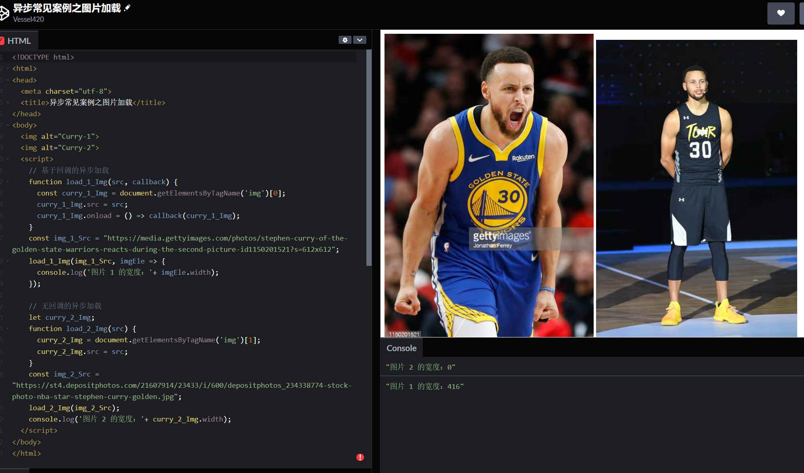
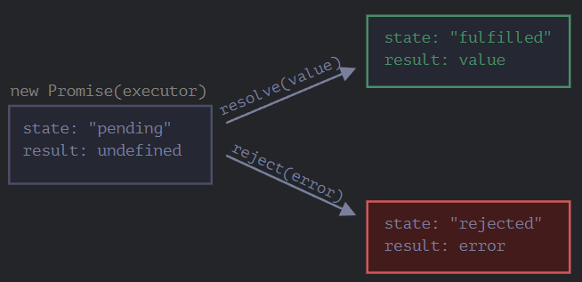
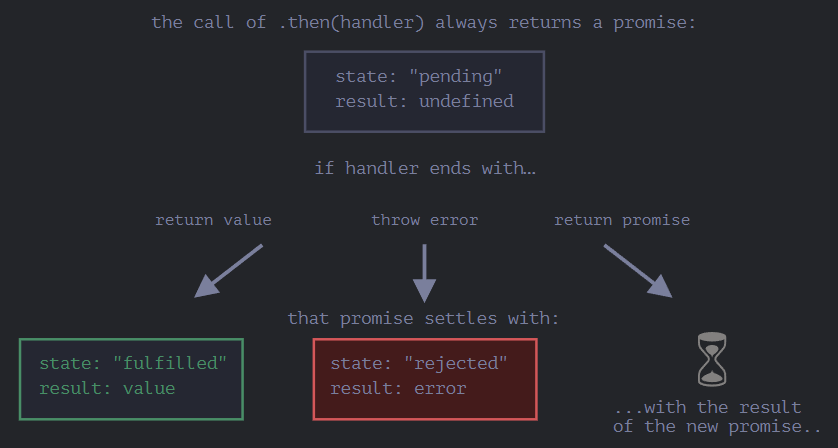

# The Modern JavaScript Tutorial

# PART 1 The JavaScript language


## 1. An introduction


### 1.1 Intro

- 这种编程语言写出来的程序被称为 **脚本**。它们可以被直接写在网页的 HTML 中，在页面加载的时候自动执行。脚本被以纯文本的形式提供和执行。它们不需要特殊的准备或编译即可运行。
- JavaScript 不仅可以在浏览器中执行，也可以在服务端执行，甚至可以在任意搭载了 [JavaScript 引擎](https://zh.wikipedia.org/wiki/JavaScript%E5%BC%95%E6%93%8E) 的设备中执行。浏览器中嵌入了 JavaScript 引擎，有时也称作“JavaScript 虚拟机”。
- 现代的 JavaScript 是一种“安全的”编程语言。它不提供对内存或 CPU 的底层访问，因为它最初是为浏览器创建的，不需要这些功能。（但是现在也被用于很多其他的环境。如服务器，手机应用。）
- JavaScript 的能力很大程度上取决于它运行的环境。例如，Node.js 支持允许 JavaScript 读取/写入任意文件，执行网络请求等的函数。
- 为了用户的（信息）安全，在浏览器中的 JavaScript 的能力是受限的。包括限制访问本地文件，无法访问操作系统，“同源策略”限制，限制从非当前页面所在服务器中接收数据，等等。如果在浏览器环境外（例如在服务器上）使用 JavaScript，则不存在此类限制。
- **引擎是如何工作的？**
  
    > 引擎很复杂，但是基本原理很简单。
    > 
    > 1. 引擎（如果是浏览器，则引擎被嵌入在其中）读取（“解析”）脚本。
    > 2. 然后，引擎将脚本转化（“编译”）为机器语言。
    > 3. 然后，机器代码快速地执行。
    > 
    > 引擎会对流程中的每个阶段都进行优化。它甚至可以在编译的脚本运行时监视它，分析流经该脚本的数据，并根据获得的信息进一步优化机器代码。
    > 


### 1.2 Manuals and specifications

- **[ECMA-262 规范](https://www.ecma-international.org/publications-and-standards/standards/ecma-262/)** 包含了大部分深入的、详细的、规范化的关于 JavaScript 的信息。这份规范明确地定义了这门语言。
- **[MDN（Mozilla）JavaScript 索引](https://developer.mozilla.org/zh-CN/docs/Web/JavaScript/Reference)** 是一个带有用例和其他信息的主要的手册。它是一个获取关于个别语言函数、方法等深入信息的很好的信息来源。
- 兼容性表
    - [https://kangax.github.io/compat-table](https://kangax.github.io/compat-table) ECMAScript 版本兼容性表，一份列有语言功能以及引擎是否支持这些功能的表格（可查看用户当前浏览器、使用的 js 编译器如 node 的支持功能）
    - [https://caniuse.com/](https://caniuse.com/) 查看浏览器可用的功能，每个功能的支持表（现代网络技术的浏览器支持表）


### 1.3 Code editors

- IDE - Integrated development environment - 集成开发环境
  
    e.g. [VS Code](https://code.visualstudio.com/), [WebStorm](https://www.jetbrains.com/webstorm/)
    
- 轻量编辑器
  
    e.g. [Sublime Text](http://www.sublimetext.com/), [Notepad++](https://notepad-plus-plus.org/), [Vim](http://www.vim.org/), [Emacs](https://www.gnu.org/software/emacs/)
    


### 1.4 Developer console

*omitted*


## 2. JavaScript Fundamentals


### 2.1 Hello, world!

*omitted*


### 2.2 Code structure

- **语句** - 语句是执行行为（action）的语法结构和命令。
- **分号** - 当存在换行符（line break）时，在大多数情况下可以省略分号。在这，JavaScript 将换行符理解成“隐式”的分号。这也被称为 [自动分号插入](https://tc39.github.io/ecma262/#sec-automatic-semicolon-insertion)。
  
    仍有很多换行不是分号的例子，也存在 JavaScript 无法确定是否真的需要自动插入分号的情况，这种情况下发生的错误是很难被找到和解决的。
    
    因此，即使语句被换行符分隔了，我们依然建议在它们之间加分号。
    
- **注释** - *omitted*


### 2.3 The modern mode, "use strict"

2009 年 ECMAScript 5 (ES5) 规范出现。增加了新的语言特性并且修改了一些已经存在的特性。

为了保证旧的功能能够使用，大部分的修改是默认不生效的。你需要一个特殊的指令 —— `"use strict"` 来明确地激活这些特性。

- 当字符串`"use strict"`或者`'use strict'`处于脚本文件的顶部时（只有注释可以出现在 `"use strict"` 的上面），整个脚本文件都将以“现代”模式进行工作。
- `"use strict"` 可以被放在函数体的开头。这样则可以只在该函数中启用严格模式。但通常人们会在整个脚本中启用严格模式。
- 没有类似于 `"no use strict"` 这样的指令可以使程序返回默认模式。一旦进入了严格模式，就没有回头路了。
- 在浏览器开发者控制台启用`"use strict"`：多行代码的输入方式，并将`"use strict"` 放在代码最顶端。或使用 ES5 的语法，将代码放在包装器中，`"use strict"` 放在代码头前。
- 现代 JavaScript 支持 “class” 和 “module” —— 高级语言结构，它们会自动启用 `use strict`。因此，如果我们使用它们，则无需添加 `"use strict"` 指令。


### 2.4 Variables

- **变量命名**
  
    一个变量名应该有一个清晰、明显的含义，对其存储的数据进行描述。
    
    如果命名包括多个单词，通常采用驼峰式命名法（[camelCase](https://en.wikipedia.org/wiki/CamelCase)）。
    
    JavaScript 的变量命名有两个限制：
    
    - 变量名称必须仅包含：字母、数字、符号 `$` 和 `_`。
    - 首字符必须非数字。
    
    :information_source:注意：
    
    - 变量名区分大小写，命名为 `apple` 和 `APPLE` 的变量是不同的两个变量。
    - 允许非英文字母，西里尔字母甚至象形文字（汉字）都是可以使用的，但不建议。
    
    :warning:警告：
    
    - 有一张 [保留字列表](https://developer.mozilla.org/en-US/docs/Web/JavaScript/Reference/Lexical_grammar#Keywords)，这张表中的保留字无法用作变量命名，因为它们被用于编程语言本身了。
    - 未采用 `use strict` 下的赋值：在早期，我们可以不使用 `let` 进行变量声明，而可以简单地通过赋值来创建一个变量。现在如果我们不在脚本中使用 `use strict` 声明启用严格模式，这仍然可以正常工作，这是为了保持对旧脚本的兼容。
    
- **常量**
  
    - 使用`const`声明的变量称为“常量”。它们不能被修改，如果你尝试修改就会发现报错。
    - 一个普遍的做法是将常量用作别名，以便记住那些在执行之前就已知的难以记住的值。使用大写字母和下划线来命名这些常量。e.g.`const COLOR_RED = "#F00";`
    - 作为一个“常数”，意味着值永远不变。但是有些常量在执行之前就已知了（比如红色的十六进制值），还有些在执行期间被“计算”出来，但初始赋值之后就不会改变。
    - 什么时候该为常量使用大写命名，什么时候进行常规命名？
        - 大写命名的常量仅用作“硬编码（hard-coded）”值的别名。
        - `const pageLoadTime = /* 网页加载所需的时间 */;` `pageLoadTime`的值在页面加载之前是未知的，所以采用常规命名。但是它仍然是个常量，因为赋值之后不会改变。


### 2.5 Data types

- 可以将任何类型的值存入变量，允许这种操作的编程语言，例如 JavaScript，被称为“动态类型”（dynamically typed）的编程语言，意思是虽然编程语言中有不同的数据类型，但是你定义的变量并不会在定义后，被限制为某一数据类型。
- JavaScript 中的八种基本的数据类型（七种基本数据类型，也称为原始数据类型。一种引用类型，即 `object`，是复杂数据类型）。


*details:* 

- [[MDN] JavaScript types](https://developer.mozilla.org/en-US/docs/Web/JavaScript/Data_structures#javascript_types)
- [[MDN] Data types](https://developer.mozilla.org/en-US/docs/Web/JavaScript/Language_overview#data_types)


#### seven *primitive types*

##### `Number`

用于任何类型的数字：常规的数字：整数或浮点数，在 `±(2^53 - 1)` 范围内的整数。还包括“特殊数值（“special numeric values”）”也属于这种类型：`Infinity`,`-Infinity` 和 `NaN`。

- `Infinity` 是*全局对象*（*global object*）的一个属性，即它是一个全局变量。`Infinity` 的初始值是 [`Number.POSITIVE_INFINITY`](https://developer.mozilla.org/zh-CN/docs/Web/JavaScript/Reference/Global_Objects/Number/POSITIVE_INFINITY)。`Infinity`（正无穷大）大于任何值。
- `NaN` 代表一个计算错误。它是一个不正确的或者一个未定义的数学操作所得到的结果。`NaN` 是粘性的。任何对 `NaN` 的进一步数学运算都会返回 `NaN`（只有一个例外：`NaN ** 0` 结果为 `1`）。


##### `BigInt`

用于任意长度的整数。

- 在 JavaScript 中，“number” 类型无法安全地表示大于 `(2^53 - 1)`（即 `9007199254740991`），或小于 `-(2^53 - 1)` 的整数。
- 更准确的说，“number” 类型可以存储更大的整数（最多 `1.7976931348623157 * 10^308`），但超出安全整数范围 `±(2^53 - 1)` 会出现精度问题，因为并非所有数字都适合固定的 64 位存储。因此，可能存储的是“近似值”。
  
    ```jsx
    console.log(Math.pow(2, 53) - 1); // 9007199254740991
    console.log(9007199254740991 + 1); // 9007199254740992
    console.log(9007199254740991 + 2); // 9007199254740992
    ```
    
- 可以通过将 `n` 附加到整数字段的末尾来创建 `BigInt` 值。e.g.`const bigInt = 1234567890123456789012345678901234567890n;`
- 查看 [MDN BigInt 兼容性表](https://developer.mozilla.org/en-US/docs/Web/JavaScript/Reference/Global_Objects/BigInt#browser_compatibility) 以了解哪些版本的浏览器已经支持 BigInt 了。


##### `String`

一个字符串可以包含零个（为空）、一个或多个字符，没有单独的单字符类型。


##### `Boolean`

逻辑类型，用于 `true` 和 `false`。


##### `null`

用于未知的值 —— 只有一个 `null` 值的独立类型。

相比较于其他编程语言，JavaScript 中的 `null` 不是一个“对不存在的 `object` 的引用”或者 “null 指针”。

JavaScript 中的 `null` 仅仅是一个代表“无”、“空”或“值未知”的特殊值。


##### `undefined`

用于未定义的值 —— 只有一个 `undefined` 值的独立类型。

- `undefined` 的含义是 `未被赋值`。
- 如果一个变量已被声明，但未被赋值，那么它的值就是 `undefined` 。
- 从技术上讲，可以显式地将 `undefined` 赋值给变量。……但是不建议这样做。通常，使用 `null` 将一个“空”或者“未知”的值写入变量中，而 `undefined` 则保留作为未进行初始化的事物的默认初始值。


##### `Symbol`

用于唯一的标识符。


#### everything else is known as an *Object*.

##### `Object`

Common object types include:

- `Function`
- `Array`
- `Date`
- `RegExp`
- `Error`

Object 用于更复杂的数据结构。

其他所有的数据类型都被称为“原始类型”，因为它们的值只包含一个单独的内容（字符串、数字或者其他）。相反，`object` 则用于储存数据集合和更复杂的实体。


#### The typeof operator

可以通过 `typeof` 运算符查看存储在变量中的数据类型。对 `typeof x` 或 `typeof(x)` 的调用会以字符串的形式返回数据类型。
- `typeof` 是一个操作符，不是一个函数。这里的括号不是 `typeof` 的一部分。它是数学运算分组的括号。
- `typeof null` 的结果为 `"object"`。这是官方承认的 `typeof` 的错误，这个问题来自于 JavaScript 语言的早期阶段，并为了兼容性而保留了下来。
  
    `null` 绝对不是一个 `object`。`null` 有自己的类型，它是一个特殊值。`typeof` 的行为在这里是错误的。
    
- 在 JavaScript 语言中没有一个特别的 `“function”` 类型。函数隶属于 `object` 类型。但是 `typeof` 会对函数区分对待，并返回 `"function"`。这也是来自于 JavaScript 语言早期的问题。
  
    从技术上讲，这种行为是不正确的，但在实际编程中却非常方便。
    

```javascript
typeof 0 // 'number'
typeof 10n // 'bigint'
typeof 'foo' // 'string'
typeof true // 'boolean'
typeof null // 'object'
typeof undefined // 'undefined'
typeof Symbol('id') // 'symbol'
typeof Math // 'object' // Math 是一个提供数学运算的内建 object
typeof alert // 'function'
```


### 2.6 Interaction: alert, prompt, confirm

- **`alert`** 显示信息。
  
    弹出的这个带有信息的小窗口被称为 **模态窗** *modal window*
    
    “modal” 意味着用户不能与页面的其他部分（例如点击其他按钮等）进行交互，直到他们处理完窗口。
    
- **`prompt`** 显示信息要求用户输入文本。点击确定返回文本，点击取消或按下 Esc 键返回 `null`。
  
    浏览器会显示一个带有文本消息的模态窗口，还有 input 框和确定/取消按钮。
    
    `result = prompt(title, [default]);`
    
    - `title` 显示给用户的文本。
    - `default` 可选的第二个参数，指定 input 框的初始值。
    
    `prompt` 将返回用户在 `input` 框内输入的文本，如果用户取消了输入，则返回 `null`。
    
- **`confirm`** 显示信息等待用户点击确定或取消。点击确定返回 `true`，点击取消或按下 Esc 键返回 `false`。
  
    `confirm` 函数显示一个带有 `question` 以及确定和取消两个按钮的模态窗口。点击确定返回 `true`，点击取消返回 `false`。
    

这些方法都是模态的：它们暂停脚本的执行，并且不允许用户与该页面的其余部分进行交互，直到窗口被解除。

上述所有方法共有两个限制：

1. 模态窗口的确切位置由浏览器决定。通常在页面中心。
2. 窗口的确切外观也取决于浏览器。我们不能修改它。


### 2.7 Type Conversions

大多数情况下，运算符和函数会自动将赋予它们的值转换为正确的类型。

在某些情况下，我们需要将值显式地转换为我们期望的类型。

- **字符串转换** —— 转换发生在输出内容的时候，也可以通过 `String(value)` 进行显式转换。原始类型值的 string 类型转换通常是很明显的。
- **数字型转换** —— 转换发生在进行算术操作时，也可以通过 `Number(value)` 进行显式转换。
  
    ```jsx
    Number(undefined) // NaN
    Number(null) // 0
    Number(true) // 1
    Number(false) // 0
    // “按原样读取”字符串，两端的空格会被忽略。空字符串变成 0。转换出错则输出 NaN。
    Number('  123  ') // 123
    Number('123z') // NaN
    Number('') // 0
    ```
    
- **布尔型转换** —— 转换发生在进行逻辑操作时，也可以通过 `Boolean(value)` 进行显式转换。
    - 数字 `0`、空字符串 `""`、`null`、`undefined` 和 `NaN` 都会被转换成 `false`。它们被称为“假值（falsy）”。
    - 其他值被转换为 `true`，它们被称为“真值（truthy）”。
- **对象-原始值转换** —— [4.8 Object to primitive conversion]


### 2.8 Basic operators, maths

- 运算元（参数） —— 运算符应用的对象。
- 一元运算符 —— 一个运算符对应的只有一个运算元。
  
    如一元负号运算符：
    
    ```jsx
    let x = 1;
    
    x = -x;
    console.log( x ); // -1，一元负号运算符生效
    ```
    
- 二元运算符 —— 一个运算符拥有两个运算元。
- 数学运算 —— 加法 `+`，减法 `-`，乘法 `*`，除法 `/`，取余 `%`，求幂 `**`。
- 用二元运算符 `+` 连接字符串
  
    如果加号 `+` 被应用于字符串，它将合并（连接）各个字符串。
    
    :warning:只要任意一个运算元是字符串，那么另一个运算元也将被转化为字符串。
    
    ```jsx
    console.log( '1' + 2 ); // "12"
    console.log( 2 + '1' ); // "21"
    console.log( 2 + 2 + '1' ); // "41"，不是 "221"
    console.log( '1' + 2 + 2); // "122"，不是 "14"
    ```
    
    :warning:二元 `+` 是唯一一个以这种方式支持字符串的运算符。其他算术运算符只对数字起作用，并且总是将其运算元转换为数字。
    
    ```jsx
    console.log( 6 - '2' ); // 4，将 '2' 转换为数字
    console.log( '6' / '2' ); // 3，将两个运算元都转换为数字
    
    console.log(" \t \n" - 2); // -2
    // 字符串转换为数字时，会忽略字符串的首尾处的空格字符。在这里，整个字符串由空格字符组成，包括 \t、\n 以及它们之间的“常规”空格。因此，类似于空字符串，所以会变为 0。
    ```
    
- 数字转换，一元运算 `+`
  
    一元运算符加号 `+` 应用于单个值，对数字没有任何作用。但是如果运算元不是数字，加号 `+` 则会将其转化为数字。它的效果和 `Number(...)` 相同，但是更加简短。
    
    ```jsx
    // 对数字无效
    let x = 1;
    console.log( +x ); // 1
    
    let y = -2;
    console.log( +y ); // -2
    
    // 转化非数字
    console.log( +true ); // 1
    console.log( +"" );   // 0
    
    let apples = "2";
    let oranges = "3";
    
    // 在二元运算符加号起作用之前，所有的值都被转化为了数字
    console.log( +apples + +oranges ); // 5
    
    // 更长的写法
    console.log( Number(apples) + Number(oranges) ); // 5
    ```
    
- 运算符优先级 —— [MDN Operator Precedence](https://developer.mozilla.org/en-US/docs/Web/JavaScript/Reference/Operators/Operator_Precedence)
- 自增 / 自减
    - 如果自增/自减的值不会被使用，那么两者形式没有区别。
    - 如果想要对变量进行自增操作，并且需要立刻使用自增后的值，那么需要使用前置形式（`++counter`）。
    - 如果想要将一个数加一，但是想使用其自增之前的值，那么需要使用后置形式（`counter++`）。
    
    ```jsx
    let counterBack = 3;
    let counterFront = 3;
    
    const resBack = counterBack++;
    console.log('counterBack:', counterBack); // counterBack: 4
    console.log('resBack:', resBack); // resBack: 3
    
    const resFront = ++counterFront;
    console.log('counterFront:', counterFront); // counterFront: 4
    console.log('resFront:', resFront); // resFront: 4
    
    let counter = 3;
    console.log( 2 * counter++); // 6
    console.log(counter); // 4
    
    counter = 3;
    console.log( 2 * ++counter); // 8
    console.log(counter); // 4
    ```
    
- 位运算符 —— [MDN Expressions and Operators](https://developer.mozilla.org/zh-CN/docs/Web/JavaScript/Guide/Expressions_and_Operators)
- 逗号运算符 —— [MDN Comma operator (,)](https://developer.mozilla.org/zh-CN/docs/Web/JavaScript/Reference/Operators/Comma_Operator)


### 2.9 Comparisons

- 比较运算符始终返回布尔值。
- 字符串的比较，会按照“词典”顺序逐字符地比较大小。即字符串是按字符逐个进行 **Unicode 编码顺序** 的比较。
  
    字符串的比较算法：
    
    1. 首先比较两个字符串的首位字符大小。
    2. 如果一方字符较大（或较小），则该字符串大于（或小于）另一个字符串。算法结束。
    3. 否则，如果两个字符串的首位字符相等，则继续取出两个字符串各自的后一位字符进行比较。
    4. 重复上述步骤进行比较，直到比较完成某字符串的所有字符为止。
    5. 如果两个字符串的字符同时用完，那么则判定它们相等，否则未结束（还有未比较的字符）的字符串更大。
    
- 当对不同类型的值进行比较时，它们会先被转化为 **数字**（不包括严格相等检查）再进行比较。
- 严格相等运算符 `===` 在进行比较时不会做任何的类型转换。
- 与“不相等”符号 `!=` 类似，“严格不相等”表示为 `!==`。
- 对 `null` 和 `undefined` 进行比较。
    - 在非严格相等 `==` 下，`null` 和 `undefined` 相等且各自不等于任何其他的值（只在非严格相等下成立）。
    - 在使用 `>` 或 `<` 进行比较时，需要注意变量可能为 `null/undefined` 的情况。比较好的方法是单独检查变量是否等于 `null/undefined`。
      
        当使用数学式或其他比较方法 `< > <= >=` 时：`null/undefined` 会被转化为数字：`null` 被转化为 `0`，`undefined` 被转化为 `NaN`。
        
    - `null` vs `0`
      
        相等性检查 `==` 和普通比较符 `> < >= <=` 的代码逻辑是相互独立的。
        
        - 进行值的比较时，`null` 会被转化为数字，因此它被转化为了 `0`。// 所以 (3) 中的 `null >= 0` 返回值是 true，(1) 中 `null > 0` 返回值是 false。
        - `undefined` 和 `null` 在相等性检查 `==` 中不会进行任何的类型转换，它们有自己独立的比较规则，所以除了它们之间互等外，不会等于任何其他的值。// 所以 (2) 中 `null == 0` 会返回 false。
        
        ```javascript
        null > 0 // (1) false
        null == 0 // (2) false
        null >= 0 // (3) true
        ```
        
    - `undefined` 不应该被与其他值进行比较。
        - `(1)` 和 `(2)` 都返回 `false` 是因为 `undefined` 在比较中被转换为了 `NaN`，而 `NaN` 是一个特殊的数值型值，它与任何值进行比较都会返回 `false`。
        - `(3)` 返回 `false` 是因为这是一个相等性检查，而 `undefined` 只与 `null` 相等（非严格相等下），不会与其他值相等。
        
        ```javascript
        undefined < 0 // (1) false
        undefined > 0 // (2) false
        undefined == 0 // (3) false
        ```
        
    - **避免问题**
      
        - 除了严格相等 `===` 外，其他但凡是有 `undefined/null` 参与的比较，我们都需要格外小心。
        - 除非你非常清楚自己在做什么，否则永远不要使用 `>= > < <=` 去比较一个可能为 `null/undefined` 的变量。对于取值可能是 `null/undefined` 的变量，请按需要分别检查它的取值情况。


### 2.10 Conditional branching: if, '?'

*omitted*


### 2.11 Logical operators

JavaScript 中有四个逻辑运算符：`||`（或），`&&`（与），`!`（非），`??`（空值合并运算符）。

虽然它们被称为“逻辑”运算符，但这些运算符却可以被应用于任意类型的值，而不仅仅是布尔值。它们的结果也同样可以是任意类型。如果操作数不是布尔值，那么它将会被转化为布尔值来参与运算。

- `||`（或）
  
    或运算符 `||` 做了如下的事情（或运算寻找第一个真值）：
    
    1. 从左到右依次计算操作数。
    2. 处理每一个操作数时，都将其转化为布尔值。如果结果是 `true`，就停止计算，返回这个操作数的初始值。
    3. 如果所有的操作数都被计算过（也就是，转换结果都是 `false`），则返回最后一个操作数。
    
    ```jsx
    console.log( 1 || 0 ); // 1（1 是真值）
    console.log( null || 1 ); // 1（1 是第一个真值）
    console.log( null || 0 || 2 || 1 ); // 2（第一个真值）
    console.log( undefined || null || 0 ); // 0（都是假值，返回最后一个值）
    ```
    
    一些有趣的用法：
    
    - 获取变量列表或者表达式中的第一个真值。
    - 短路求值（Short-circuit evaluation）。
      
        `||` 对其参数进行处理，直到达到第一个真值，然后立即返回该值，而无需处理其他参数。
        
        如果操作数不仅仅是一个值，而是一个有副作用的表达式，例如变量赋值或函数调用，那么这一特性的重要性就变得显而易见了。
        
        有时，可以利用这个特性，只在左侧的条件为假时才执行命令。
        
        ```jsx
        true || alert("not printed");
        false || alert("printed");
        ```
        
    
    ***test:***
    
    `alert( alert(1) || 2 || alert(3) );` 使用 `console.log()` 效果一样。
    
    对 `alert` 的调用没有返回值。或者说返回的是 `undefined`。
    
    1. 第一个或运算 `||` 对它的左值 `alert(1)` 进行了计算。这就显示了第一条信息 `1`。
    2. 函数 `alert` 返回了 `undefined`，所以或运算继续检查第二个操作数以寻找真值。
    3. 第二个操作数 `2` 是真值，所以执行就中断了。`2` 被返回，并且被外层的 `alert` 显示。
    
    这里不会显示 `3`，因为运算没有抵达 `alert(3)`。
    
- `&&`（与）
  
    与运算 `&&` 做了如下的事（与运算寻找第一个假植）：
    
    1. 从左到右依次计算操作数。
    2. 在处理每一个操作数时，都将其转化为布尔值。如果结果是 `false`，就停止计算，并返回这个操作数的初始值。
    3. 如果所有的操作数都被计算过（例如都是真值），则返回最后一个操作数。
    
    ```jsx
    // 如果第一个操作数是真值，
    // 与运算返回第二个操作数：
    console.log( 1 && 0 ); // 0
    console.log( 1 && 5 ); // 5
    
    // 如果第一个操作数是假值，
    // 与运算将直接返回它。第二个操作数会被忽略
    console.log( null && 5 ); // null
    console.log( 0 && "no matter what" ); // 0
    
    console.log( 1 && 2 && null && 3 ); // null
    console.log( 1 && 2 && 3 ); // 3，最后一个值
    ```
    
    - :warning:**不要用 `||` 或 `&&` 来取代 `if`**
      
        有时候，有人会将与运算符 `&&` 作为“简化 `if`”的一种方式。
        
        虽然使用 `&&` 写出的变体看起来更短，但 `if` 更明显，并且往往更具可读性。因此，我们建议根据每个语法结构的用途来使用：如果我们想要 `if`，就使用 `if`；如果我们想要逻辑与，就使用 `&&`。
        
        ```jsx
        let x = 1;
        (x > 0) && console.log( 'Greater than zero!' );
        if (x > 0) console.log( 'Greater than zero!' );
        ```
        
    
    ***test:***
    
    `alert( alert(1) && alert(2) );` 使用 `console.log()` 效果一样。
    
    调用 `alert` 返回了 `undefined`（它只展示消息，所以没有有意义的返回值）。
    
    因此，`&&` 计算了它左边的操作数（显示 `1`），然后立即停止了，因为 `undefined` 是一个假值。`&&` 就是寻找假值然后返回它，所以运算结束。
    
- `!`（非）
  
    逻辑非运算符接受一个参数，并按如下运作：
    
    1. 将操作数转化为布尔类型：`true/false`。
    2. 返回相反的值。
    
    两个非运算 `!!` 有时候用来将某个值转化为布尔类型：
    
    ```jsx
    console.log( !!"non-empty string" ); // true // Boolean("non-empty string") 实现同样的效果
    console.log( !!null ); // false // Boolean(null) 实现同样的效果
    ```
    


### 2.12 Nullish coalescing operator '??' - 空值合并运算符

:warning:**这是一个最近添加到 JavaScript 的特性。 旧式浏览器可能需要 polyfills.**


### 2.13 Loops: while and for

### 2.14 The "switch" statement

### 2.15 Functions

### 2.16 Functions expressions

### 2.17 Arrow functions, the basics

### 2.18 JavaScript specials

## 3. Code quality

## 4. Objects: the basics

### 4.1 Objects

### 4.2 Object references and copying

### 4.3 Garbage collection

### 4.4 Object methods, “this”

### 4.5 Constructor, operator “new”

### 4.6 Optional chaining ‘?.’

### 4.7 Symbol type

### 4.8 Object to primitive conversion

## 5. Data types

## 6. Advanced working with functions

## 7. Object properties configuration

## 8. Prototypes, inheritance

### 8.1 Prototypal inheritance

### 8.2 F.prototype

### 8.3 Native prototypes

### 8.4 Prototype methods, objects without `__proto__`


## 9. Classes

## 10. Error handling


### 10.1 Error handling, "try...catch"


#### The "try...catch" syntax


#### Error object


#### Optional "catch" binding


#### Using "try...catch"


#### Throwing our own errors


#### Rethrowing


#### try...catch...finally


#### Global catch


#### Summary


### 10.2 Custom errors, extending Error


## 11. Promises, async/await


### 11.1 Introduction: callbacks

JavaScript 主机（host）环境提供了许多函数，这些函数允许我们计划 **异步** 行为（asynchronous action）。换句话说，我们现在开始执行的行为，但它们会在稍后完成。


#### Callback-based asynchronous programming

实际中的异步行为示例，如加载脚本（如下）和模块。

```javascript
function loadScript(src) {
  // 创建一个 <script> 标签，并将其附加到页面
  // 这将使得具有给定 src 的脚本开始加载，并在加载完成后运行
  let script = document.createElement('script');
  script.src = src;
  document.head.append(script);
}
loadScript('./script.js'); // 'script.js' 中有'function newFuntion() {...}'
// 脚本是'异步'调用的，因为它从现在开始加载，但是在这个加载函数执行完成后才运行。
// loadScript 下面的代码不会等到脚本加载完成才执行。
newFuntion(); // 此操作不会有效。该函数在'script.js'中声明，但脚本尚未加载完成。
```

自然情况下，浏览器可能没有时间加载脚本。到目前为止，`loadScript` 函数并没有提供跟踪加载完成的方法。脚本加载并最终运行，仅此而已。但我们希望了解脚本何时加载完成，以使用其中的新函数和变量。

```javascript
// 可以添加 callback 函数作为 loadScript 的第二个参数，该函数应在脚本加载完成时执行。
// 第二个参数是一个函数（通常是匿名函数），该函数会在行为（action）完成时运行。
function loadScript(src, callback) {
  let script = document.createElement('script');
  script.src = src;
  script.onload = () => callback(script);
  document.head.append(script);
}
loadScript('./script.js', script => {
  alert(`脚本 ${script.src} 加载完成`);
  alert( newFuntion ); // newFuntion 是所加载的脚本中声明的一个函数
});
```

> `onload` 事件：它通常会在脚本加载和执行完成后执行一个函数。参考 *PART 2 - 5.3 Resource loading: onload and onerror*。

以上是被称为“基于回调”的异步编程风格。异步执行某项功能的函数应该提供一个 `callback` 参数用于在相应事件（如上述的脚本加载事件）完成时调用。

代码示例：[[CODEPEN] 异步常见案例之图片加载](https://codepen.io/Vessel420/pen/MWGZRVO)

> 需要开启控制台禁用网络缓存。




#### Callback in callback

依次加载两个脚本：第一个加载完成后，然后再加载第二个。

在外部 `loadScript` 执行完成时，回调就会发起内部的 `loadScript`。

每一个新行为（action）都在回调内部。几个还好，多了就不好了。

```javascript
loadScript('/my/script.js', function(script) {
    loadScript('/my/script2.js', function(script) {
        loadScript('/my/script3.js', function(script) {
            // ...加载完所有脚本后继续
        });
    });
});
```


#### Handling errors

避免脚本加载失败，跟踪加载错误。

加载成功时，它会调用 `callback(null, script)`，否则调用 `callback(error)`。

```javascript
function loadScript(src, callback) {
  let script = document.createElement('script');
  script.src = src;

  script.onload = () => callback(null, script);
  script.onerror = () => callback(new Error(`Script load error for ${src}`));

  document.head.append(script);
}

loadScript('/my/script.js', function(error, script) {
  if (error) {
    // 处理 error
  } else {
    // 脚本加载成功
  }
});
```

>在 `loadScript` 中所使用的方案其实很普遍。它被称为“Error 优先回调（error-first callback）”风格。
>
>约定是：
>
>1. `callback` 的第一个参数是为 `error` 而保留的。一旦出现 error，`callback(err)` 就会被调用。
>
>2. 第二个参数（和下一个参数，如果需要的话）用于成功的结果。此时 `callback(null, result1, result2…)` 就会被调用。
>
>因此，单一的 `callback` 函数可以同时具有报告 error 和传递返回结果的作用。


#### Pyramid of Doom 厄运金字塔

随着调用嵌套的增加，代码层次变得更深，维护难度也随之增加，尤其是我们使用的是可能包含了很多循环和条件语句的真实代码，而不是例子中的 `...`。

嵌套调用的“金字塔”随着每个异步行为会向右增长。很快它就失控了。所以这种编码方式不是很好。

```javascript
loadScript('1.js', function(error, script) {

  if (error) {
    handleError(error);
  } else {
    // 脚本加载成功，继续...
    loadScript('2.js', function(error, script) {
      if (error) {
        handleError(error);
      } else {
        // 脚本加载成功，继续...
        loadScript('3.js', function(error, script) {
          if (error) {
            handleError(error);
          } else {
            // ...加载完所有脚本后继续 (*)
          }
        });
      }
    });
  }
});
```

我们可以通过使每个行为都成为一个独立的函数来尝试减轻这种问题，如下所示：

```javascript
loadScript('1.js', step1);

function step1(error, script) {
  if (error) {
    handleError(error);
  } else {
    // ...
    loadScript('2.js', step2);
  }
}

function step2(error, script) {
  if (error) {
    handleError(error);
  } else {
    // ...
    loadScript('3.js', step3);
  }
}

function step3(error, script) {
  if (error) {
    handleError(error);
  } else {
    // ...加载完所有脚本后继续 (*)
  }
}
```

它的作用相同，但是没有深层的嵌套了，因为我们将每个行为都编写成了一个独立的顶层函数。

问题：

1. 可读性差；阅读时需要在各个代码块之间跳转；
2. 名为 `step` 的函数都是一次性使用的，创建它们就是为了避免“厄运金字塔”。没有人会在行为链之外重用它们。因此，这里的命名空间有点混乱。

有其他方法可以避免此类金字塔。最好的方法之一就是 “promise”。


### 11.2 Promise

*detail:*

- [[JAVASCRIPT.INFO] Promise](https://javascript.info/promise-basics)
- [[MDN] Using Promises](https://developer.mozilla.org/en-US/docs/Web/JavaScript/Guide/Using_promises)
- [[MDN] Promise](https://developer.mozilla.org/en-US/docs/Web/JavaScript/Reference/Global_Objects/Promise)
- [[MDN] Promise() constructor](https://developer.mozilla.org/en-US/docs/Web/JavaScript/Reference/Global_Objects/Promise/Promise)
- [[web.dev] JavaScript Promises](https://web.dev/promises/)


#### Description


```javascript
let promise = new Promise(function(resolve, reject) {
  // executor (the producing code)
  // The function passed to new Promise is called the executor.
});
```

由 `new Promise` 构造器返回的 `promise` 对象具有以下内部属性：

- `state` —— 最初是 `"pending"`，然后在 resolve 被调用时变为 `"fulfilled"`，或者在 `reject` 被调用时变为 `"rejected"`。

- `result` —— 最初是 `undefined`，然后在 `resolve(value)` 被调用时变为 `value`，或者在 `reject(error)` 被调用时变为 `error`。



1. 传递给 `new Promise` 的函数被称为 **executor**。它包含最终应产出结果的生产者代码。
    > executor 被自动且立即调用（通过 `new Promise`）。

2. executor 接受两个参数：`resolve` 和 `reject`。这些函数由 JavaScript 引擎预先定义，因此我们不需要创建它们。我们需要在 executor 准备好时调用 `resolve` 或 `reject`，来改变对应的 promise 对象的状态。
    > 它的参数 `resolve` 和 `reject` 是由 JavaScript 自身提供的回调。
    > 我们的代码仅在 executor 的内部。
    >
    > 与最初的 “pending” promise 相反，一个 resolved 或 rejected 的 promise 都会被称为 “settled”。
    >
    > - `resolve(value)` —— 如果任务成功完成并带有结果 `value`。
    > - `reject(error)` —— 如果出现了 error，`error` 即为 error 对象。
    >
    > 执行器函数参数的名字和实际调用的 resolve() 和 reject() 无关，关键在于顺序，第一个代表 resolve()，第二个代表 reject()。
    > 

:information_source:**这只能有一个结果或一个 error**
executor 只能调用一个 `resolve` 或一个 `reject`。任何状态的更改都是最终的。
所有其他的再对 `resolve` 和 `reject` 的调用都会被忽略：

```javascript
let promise = new Promise(function(resolve, reject) {
  resolve("done");

  reject(new Error("…")); // 被忽略
  setTimeout(() => resolve("…")); // 被忽略
});
```
这的宗旨是，一个被 executor 完成的工作只能有一个结果或一个 error。
并且，`resolve/reject` 只需要一个参数（或不包含任何参数），并且将忽略额外的参数。

:information_source:**以 Error 对象 reject**
如果什么东西出了问题，executor 应该调用 `reject`。这可以使用任何类型的参数来完成（就像 `resolve` 一样）。但建议使用 `Error` 对象（或继承自 `Error` 的对象）。理由：// **TODO**

:information_source:**resolve/reject 可以立即进行**
实际上，executor 通常是异步执行某些操作，并在一段时间后调用 `resolve/reject`，但这不是必须的。我们还可以立即调用 `resolve` 或 `reject`，就像这样：

```javascript
let promise = new Promise(function(resolve, reject) {
  // 不花时间去做这项工作
  resolve(123); // 立即给出结果：123
});
```
例如，当我们开始做一个任务时，但随后看到一切都已经完成并已被缓存时，可能就会发生这种情况。
这挺好。我们立即就有了一个 resolved 的 promise。

在 new Promise() 的时候，Promise 的执行器就会立马执行，但是**调用 resolve() 会触发异步操作，传入 then() 方法的函数会被添加到任务队列并异步执行**。代码示例：[[CODEPEN] resolve()立即执行但then()异步执行](https://codepen.io/Vessel420/pen/gOzEemo)。

:information_source:**`state` 和 `result` 都是内部的**
Promise 对象的 `state` 和 `result` 属性都是内部的。我们无法直接访问它们。但我们可以对它们使用 `.then`/`.catch`/`.finally` 方法。


#### Consumers: then, catch

Promise 对象充当的是 executor（“生产者代码”）和消费函数之间的连接，后者将接收结果或 error。可以通过使用 `.then` 和 `.catch` 方法注册消费函数。


##### then

`.then` 的第一个参数是一个函数，该函数将在 promise resolved 且接收到结果后执行。

`.then` 的第二个参数也是一个函数，该函数将在 promise rejected 且接收到 error 信息后执行。

```javascript
promise.then(
	function(result) { /* handle a successful result */ },
	function(error) { /* handle an error */ }
);
```

```javascript
let promise = new Promise(function(resolve, reject) {
	setTimeout(() => resolve("done!"), 1000);
	setTimeout(() => reject(new Error("Whoops!")), 1000);
});

// 只会运行其中一个。
// resolve 运行 .then 中的第一个函数
// reject 运行 .then 中的第二个函数
promise.then(
	result => alert(result), // 1 秒后显示 "done!"
	error => alert(error) // 1 秒后显示 "Error: Whoops!"
);
```

如果我们只对成功完成的情况感兴趣，那么我们<u>**可以只为 `.then` 提供一个函数参数**</u>：:arrow_heading_down:

```javascript
let promise = new Promise(resolve => {
	setTimeout(() => resolve("done!"), 1000);
});
promise.then(alert); // 1 秒后显示 "done!"
```


##### catch

如果我们只对 error 感兴趣，那么我们可以使用 `null` 作为第一个参数：`.then(null, errorHandlingFunction)`。或者我们也可以使用 `.catch(errorHandlingFunction)`，其实是一样的。

`.catch(f)` 调用是 `.then(null, f)` 的完全的模拟，它只是一个简写形式。

```javascript
let promise = new Promise((resolve, reject) => {
  setTimeout(() => reject(new Error("Whoops!")), 1000);
});

// .catch(f) 与 promise.then(null, f) 一样
promise.catch(alert); // 1 秒后显示 "Error: Whoops!"
```


#### Cleanup: finally

调用 `.finally(f)` 类似于 `.then(f, f)`，因为当 promise settled 时 `f` 就会执行：无论 promise 被 resolve 还是 reject。

`finally` 的功能是设置一个处理程序在前面的操作完成后，执行清理/终结。

```javascript
new Promise((resolve, reject) => {
  /* 做一些需要时间的事，之后调用可能会 resolve 也可能会 reject */
})
  // 在 promise 为 settled 时运行，无论成功与否
  .finally(() => stop loading indicator)
  // 所以，加载指示器（loading indicator）始终会在我们继续之前停止
  .then(result => show result, err => show error)
```

**:information_source:注意，`finally(f)` 并不完全是 `then(f,f)` 的别名。它们之间有重要的区别：**

1. `finally` 处理程序（handler）没有参数。在 `finally` 中，我们不知道 promise 是否成功。没关系，因为我们的任务通常是执行“常规”的完成程序（finalizing procedures）。

2. `finally` 处理程序将结果或 error “传递”给下一个合适的处理程序。
     第一个 promise 返回的 `value` 通过 `finally` 被传递给了下一个 `then`。

3. `finally` 处理程序也不应该返回任何内容。如果它返回了，返回的值会默认被忽略。
     此规则的唯一例外是当 `finally` 处理程序抛出 error 时。此时这个 error（而不是任何之前的结果）会被转到最近的 error 的处理程序。

:information_source:**我们可以对 settled 的 promise 附加处理程序**
如果 promise 为 pending 状态，`.then`/`.catch`/`.finally` 处理程序（handler）将等待它的结果。
有时候，当我们向一个 promise 添加处理程序时，它可能已经 settled 了。在这种情况下，这些处理程序会立即执行：

```javascript
// 下面这 promise 在被创建后立即变为 resolved 状态
let promise = new Promise(resolve => resolve("done!"));

promise.then(alert); // done!（现在显示）
```
Promise 灵活在于，我们可以随时添加处理程序（handler）：如果结果已经在了，它们就会执行。


#### Example: loadScript

promise 重写异步加载：[[CODEPEN] 异步常见案例之图片加载](https://codepen.io/Vessel420/pen/MWGZRVO)

> 需要开启控制台禁用网络缓存。

用 promise 重写 *PART 1 - 11.1 Introduction: callbacks - Handling errors* 中的代码块。

```javascript
function loadScript(src) {
  return new Promise(function(resolve, reject) {
    let script = document.createElement('script');
    script.src = src;

    script.onload = () => resolve(script);
    script.onerror = () => reject(new Error(`Script load error for ${src}`));

    document.head.append(script);
  });
}

let promise = loadScript('./script.js');

promise.then(
  script => alert(`${script.src} is loaded!`),
  error => alert(`Error: ${error.message}`)
);
promise.then(script => alert('Another handler...'));
```

promise 与 基于回调 模式的对比：

| promise                                                      | callback                                                     |
| ------------------------------------------------------------ | ------------------------------------------------------------ |
| promise 允许我们按照自然顺序进行编码。首先，我们运行 `loadScript` 和 `.then` 来处理结果。 | 在调用 `loadScript(script, callback)` 时，我们必须有一个 `callback` 函数可供使用。换句话说，在调用 `loadScript` **之前**，我们必须知道如何处理结果。 |
| 我们可以根据需要，在 promise 上多次调用 `.then`。每次调用，我们都会在“订阅列表”中添加一个新的“粉丝”，一个新的订阅函数。 | 只能有一个回调。                                             |


*案例：*

**基于 promise 的延时**

在此任务中 `resolve` 是不带参数调用的。我们不从 `delay` 中返回任何值，只是确保延迟即可。

```javascript
function delay(ms) {
  return new Promise(resolve => setTimeout(resolve, ms));
}

delay(3000).then(() => alert('runs after 3 seconds'));
```


### 11.3 Promise chaining

用 promise 重写 *PART 1 - 11.1 Introduction: callbacks - Callback in callback* 中的系列异步任务：

```javascript
new Promise(function(resolve, reject) {
    setTimeout(() => resolve(1), 1000); // (*)
}).then(function(result) { // (**)
    alert(result); // 1
    return result * 2;
}).then(function(result) { // (***)
    alert(result); // 2
    return result * 2;
}).then(function(result) {
    alert(result); // 4
    return result * 2;
});
```

> 它的想法是通过 `.then` 处理程序（handler）链进行传递 result。
>
> 运行流程如下：
>
> 1. 初始 promise 在 1 秒后 resolve `(*)`，
> 2. 然后 `.then` 处理程序被调用 `(**)`，它又创建了一个新的 promise（以 `2` 作为值 resolve）。
> 3. 下一个 `then` `(***)` 得到了前一个 `then` 的值，对该值进行处理（*2）并将其传递给下一个处理程序。
> 4. ……依此类推。
>
> 随着 result 在处理程序链中传递，我们可以看到一系列的 `alert` 调用：`1` → `2` → `4`。

这样之所以是可行的，是因为每个对 `.then` 的调用都会返回了一个新的 promise，因此我们可以在其之上调用下一个 `.then`。


> :information_desk_person:**新手常犯的一个经典错误：从技术上讲，我们也可以将多个 `.then` 添加到一个 promise 上。但这并不是 promise 链（chaining）。**
>
> 如下:arrow_heading_down::x:
>
> ```javascript
> let promise = new Promise(function(resolve, reject) {
>     setTimeout(() => resolve(1), 1000);
> });
> promise.then(function(result) {
>     alert(result); // 1
>     return result * 2;
> });
> promise.then(function(result) {
>     alert(result); // 1
>     return result * 2;
> });
> promise.then(function(result) {
>     alert(result); // 1
>     return result * 2;
> });
> ```
> 我们在这里所做的只是一个 promise 的几个处理程序。它们不会相互传递 result；相反，它们之间彼此独立运行处理任务。
> 在同一个 promise 上的所有 `.then` 获得的结果都相同 —— 该 promise 的结果。
>
> 
>


#### Returning promises

`.then(handler)` 中所使用的处理程序（handler）可以创建并返回一个 promise。

在这种情况下，其他的处理程序将等待它 settled 后再获得其结果。如:arrow_heading_down:

```javascript
new Promise(function(resolve, reject) {
    setTimeout(() => resolve(1), 1000);
}).then(function(result) {
    alert(result); // 1
    return new Promise((resolve, reject) => { // (*)
        setTimeout(() => resolve(result * 2), 1000);
    });
}).then(function(result) { // (**)
    alert(result); // 2
    return new Promise((resolve, reject) => {
        setTimeout(() => resolve(result * 2), 1000);
    });
}).then(function(result) {
    alert(result); // 4
});
```

返回 promise 使我们能够构建异步行为链。


#### Example: loadScript

结合 *PART 1 - 11.2 Promise - Example: loadScript* 按顺序依次加载脚本。:arrow_heading_down:

```javascript
loadScript("./script_1.js")
    .then(function(script) {
    	return loadScript("./script_2.js");
	})
    .then(function(script) {
    	return loadScript("./script_3.js");
  	})
  	.then(function(script) {
    	// 使用在脚本中声明的函数
    	// 以证明脚本确实被加载完成了
        one();
        two();
        three();
	});
```

使用箭头函数重写以简化。:arrow_heading_down:

```javascript
loadScript("./script_1.js")
	.then(script => loadScript("./script_2.js"))
	.then(script => loadScript("./script_3.js"))
	.then(script => {
    	// 脚本加载完成，我们可以在这儿使用脚本中声明的函数
    	one();
    	two();
    	three();
	})
```

> 我们可以向链中添加更多的异步行为。请注意，代码仍然是“扁平”的 —— 它向下增长，而不是向右。这里没有“厄运金字塔”的迹象。

从技术上讲，我们可以向每个 `loadScript` 直接添加 `.then`，就像这样 :arrow_heading_down:

```javascript
loadScript("./script_1.js").then(script1 => {
    loadScript("./script_2.js").then(script2 => {
        loadScript("./script_3.js").then(script3 => {
            // 此函数可以访问变量 script1，script2 和 script3
            one();
            two();
            three();
        });
    });
});
```

> 这段代码做了相同的事儿：按顺序加载 3 个脚本。但它是“向右增长”的。所以会有和使用回调函数一样的问题。
>
> :grey_exclamation:有时候直接写 `.then` 也是可以的，因为嵌套的函数可以访问外部作用域。在上面的例子中，嵌套在最深层的那个回调（callback）可以访问所有变量 `script1`，`script2` 和 `script3`。但这是一个例外，而不是一条规则。

##### :information_source:Thenables

*details:*

- [[MDN] Thenables](https://developer.mozilla.org/en-US/docs/Web/JavaScript/Reference/Global_Objects/Promise#thenables)
- [[MDN] Promise.resolve()](https://developer.mozilla.org/en-US/docs/Web/JavaScript/Reference/Global_Objects/Promise/resolve)

确切地说，处理程序返回的不完全是一个 promise，而是返回的被称为 “thenable” 的对象 :point_right: 一个具有方法 `.then` 的任意对象。它会被当做一个 promise 来对待。

这个想法是，第三方库可以实现自己的“promise 兼容（promise-compatible）”对象。它们可以具有扩展的方法集，但也与原生的 promise 兼容，因为它们实现了 `.then` 方法。

> 一个 thenable 对象的示例 ⤵

```javascript
class Thenable {
	constructor(num) {
		this.num = num;
	}
	then(resolve, reject) {
		alert(resolve); // function() { native code }
		// 1 秒后使用 this.num*2 进行 resolve
		setTimeout(() => resolve(this.num * 2), 1000); // (**)
	}
}

new Promise(resolve => resolve(1))
	.then(result => {
		return new Thenable(result); // (*)
	})
	.then(alert); // 1000ms 后显示 2
```

> JavaScript 检查在 `(*)` 行中由 `.then` 处理程序返回的对象：如果它具有名为 `then` 的可调用方法，那么它将调用该方法并**提供原生的函数 `resolve` 和 `reject` 作为参数**（类似于 executor），并等待直到其中一个函数被调用。在上面的示例中，`resolve(2)` 在 1 秒后被调用 `(**)`。然后，result 会被进一步沿着链向下传递。
>
> 这个特性允许我们将自定义的对象与 promise 链集成在一起，而不必继承自 `Promise`。


#### Bigger example: fetch

在前端编程中，promise 通常被用于网络请求。使用 fetch 方法从远程服务器加载用户信息。

> Fetch 参考 *PART 3 - 3.1 Fetch*

```javascript
// 执行这条语句，向 url 发出网络请求并返回一个 promise。
// 当远程服务器返回 header（是在 全部响应加载完成前）时，
// 该 promise 使用一个 response 对象来进行 resolve。
fetch('/article/promise-chaining/user.json')
    // 当远程服务器响应时，下面的 .then 开始执行
    .then(function(response) {
        // 当 user.json 加载完成时，response.text() 会返回一个新的 promise
        // 该 promise 以加载的 user.json 为 result 进行 resolve
        return response.text();
    })
    .then(function(text) {
        // ……这是远程文件的内容
        alert(text); // {"name": "iliakan", "isAdmin": true}
    });
```

从 `fetch` 返回的 `response` 对象还包含 `response.json()` 方法，该方法可以读取远程数据并将其解析为 JSON。在我们的例子中，这更加方便，所以我们用这个方法吧。:arrow_heading_down:

```javascript
// 同上，但使用 response.json() 将远程内容解析为 JSON
fetch('/article/promise-chaining/user.json')
    .then(response => response.json())
    .then(user => alert(user.name)); // iliakan，获取到了用户名
```

:arrow_down:实现更多:arrow_down:

```javascript
// 发送一个对 user.json 的请求
fetch('/article/promise-chaining/user.json')
    // 将其加载为 JSON
    .then(response => response.json())
    // 发送一个到 GitHub 的请求
    .then(user => fetch(`https://api.github.com/users/${user.name}`))
    // 将响应加载为 JSON
    .then(response => response.json())
    // 显示头像图片（githubUser.avatar_url）3 秒（也可以加上动画效果）
    .then(githubUser => {
        let img = document.createElement('img');
        img.src = githubUser.avatar_url;
        img.className = "promise-avatar-example";
        document.body.append(img);

        setTimeout(() => img.remove(), 3000); // (*)
    });
```

:arrow_down:改进 `(*)` 行，使得能在头像显示结束并被移除后能继续操作，即让链可扩展。:arrow_down:

```javascript
fetch('/article/promise-chaining/user.json')
    .then(response => response.json())
    .then(user => fetch(`https://api.github.com/users/${user.name}`))
    .then(response => response.json())
    .then(githubUser => new Promise(function(resolve, reject) { // (*)
        let img = document.createElement('img');
        img.src = githubUser.avatar_url;
        img.className = "promise-avatar-example";
        document.body.append(img);

        setTimeout(() => {
            img.remove();
            resolve(githubUser); // (**)
        }, 3000);
    }))
	// 3 秒后触发
    .then(githubUser => alert(`Finished showing ${githubUser.name}`));
```

:handshake:作为一个好的做法，异步行为应该始终返回一个 promise。这样就可以使得之后我们计划后续的行为成为可能。即使我们现在不打算对链进行扩展，但我们之后可能会需要。

:arrow_down:最后，将代码拆分为可重用的函数。:arrow_down:

```javascript
function loadJson(url) {
    return fetch(url)
        .then(response => response.json());
}

function loadGithubUser(name) {
    return loadJson(`https://api.github.com/users/${name}`);
}

function showAvatar(githubUser) {
    return new Promise(function(resolve, reject) {
        let img = document.createElement('img');
        img.src = githubUser.avatar_url;
        img.className = "promise-avatar-example";
        document.body.append(img);

        setTimeout(() => {
            img.remove();
            resolve(githubUser);
        }, 3000);
    });
}

// 使用它们：
loadJson('/article/promise-chaining/user.json')
    .then(user => loadGithubUser(user.name))
    .then(showAvatar)
    .then(githubUser => alert(`Finished showing ${githubUser.name}`));
	// ...
```


#### Summary

如果 `.then`（或 `.catch`/`.finally` 都可以）处理程序返回一个 promise，那么链的其余部分将会等待，直到它状态变为 settled。当它被 settled 后，其 result（或 error）将被进一步传递下去。




*案例：*

**Promise: then 对比 catch**

`promise.then(f1).catch(f2); // (*)` 与 `promise.then(f1, f2); // (**)` 不相等。

不同之处在于：

如果 `f1` 中出现 error，在代码（*）中它会被 `.catch` 处理，在代码（**）中则不会。

这是因为 **error 是沿着链传递的**，而在第二段代码中，`f1` 下面没有链。

换句话说，`.then` 将 result/error 传递给下一个 `.then`/`.catch`。所以在例子 (*) 中，在下面有一个 `.catch`，而在例子 (**) 中并没有 `.catch`，所以 error 未被处理。


### 11.4 Error handling with promises

promise 链在错误（error）处理中十分强大。

当一个 promise 被 reject 时，控制权将移交至最近的 rejection 处理程序。这在实际开发中非常方便。

- 若 `fetch` 的 URL 是错的，`.catch` 对这个 error 进行处理，但 `.catch` 不必是立即的，它可能在一个或多个 `.then` 之后出现。

- 或者网站正常，但响应不是有效的 JSON。捕获所有 error 的最简单的方法是，将 `.catch` 附加到链的末尾。

	> 通常情况下，这样的 `.catch` 根本不会被触发。但是如果 promise 链中众多的 `.then` 中任意一个返回的 promise rejected（网络问题或者无效的 json 或其他），`.catch` 就会捕获它。


#### Implicit try...catch

**promise 的执行者（executor）**和 **promise 的处理程序**周围有一个“隐式的 `try...catch`”。如果发生异常，它就会被捕获，并被视为 rejection 进行处理。

```javascript
new Promise((resolve, reject) => {
    throw new Error("Whoops!"); // (*)
}).catch(alert); // Error: Whoops!

new Promise((resolve, reject) => {
    reject(new Error("Whoops!")); // (**)
}).catch(alert); // Error: Whoops!
```

以上两个代码块的工作完全相同。:arrow_heading_up:


**在 executor 周围的 “隐式 `try..catch`” 自动捕获了 error，并将其变为 rejected promise。**

这不仅仅发生在 executor 函数中，同样也发生在其处理程序中。如果我们在 `.then` 处理程序中 `throw`，这意味着 promise rejected，因此控制权移交至最近的 error 处理程序。`// (***)`

对于所有的 error 都会发生这种情况，而不仅仅是由 `throw` 语句导致的这些 error。`// (****)` :arrow_heading_down:

```javascript
new Promise((resolve, reject) => {
    resolve("ok");
}).then((result) => {
    throw new Error("Whoops!"); // reject 这个 promise // (***)
}).catch(alert); // Error: Whoops!

new Promise((resolve, reject) => {
    resolve("ok");
}).then((result) => {
    blabla(); // 没有这个函数 // (****) 编程错误
}).catch(alert); // ReferenceError: blabla is not defined
```

最后的 `.catch` 不仅会捕获显式的 rejection，还会捕获它上面的处理程序中意外出现的 error。


#### Rethrowing

- 如果 `.catch` 块处理该 error 并正常完成，那么下一个成功的 `.then` 处理程序就会被调用。:arrow_heading_down:

```javascript
// 执行流：catch -> then
new Promise((resolve, reject) => {
    throw new Error("Whoops!");
}).catch(function(error) {
    alert("The error is handled, continue normally");
}).then(() => alert("Next successful handler runs"));
```


- 如果我们在 `.catch` 中 `throw`，那么控制权就会被移交到下一个最近的 error 处理程序。:arrow_heading_down:

```javascript
// 执行流：catch -> catch
new Promise((resolve, reject) => {
    throw new Error("Whoops!");
}).catch(function(error) { // (*)
    if (error instanceof URIError) {
        // 处理它
    } else {
        alert("Can't handle such error");
        throw error; // 再次抛出此 error 或另外一个 error，执行将跳转至下一个 catch
    }
}).then(function() {
    /* 不在这里运行 */
}).catch(error => { // (**)
    alert(`The unknown error has occurred: ${error}`);
    // 不会返回任何内容 => 执行正常进行
});
```

> 执行从第一个 `.catch` `(*)` 沿着链跳转至下一个 `(**)`。


#### Unhandled rejections

如果出现 error，promise 的状态将变为 “rejected”，然后执行应该跳转至最近的 rejection 处理程序。

​	:arrow_right: 若没有这样的处理程序，error 会“卡住”，没有代码来处理它。

当发生一个常规的 error 并且未被 `try..catch` 捕获时会发生什么？

​	:arrow_right: 脚本死了，并在控制台中留下了一个信息。

​	:arrow_right: 对于在 promise 中未被处理的 rejection，也会发生类似的事。

​	:arrow_right: JavaScript 引擎会跟踪此类 rejection，在这种情况下会生成一个全局的 error。


在浏览器中，我们可以使用 `unhandledrejection` 事件来捕获这类 error：

*detail:*

- [[MDN] Window: unhandledrejection event](https://developer.mozilla.org/en-US/docs/Web/API/Window/unhandledrejection_event)
- [[HTML Living Standard] 8.1.4.7 Unhandled promise rejections](https://html.spec.whatwg.org/multipage/webappapis.html#unhandled-promise-rejections)

```javascript
window.addEventListener('unhandledrejection', function(event) {
    // 这个事件对象有两个特殊的属性：
    alert(event.promise); // [object Promise] —— 生成该全局 error 的 promise
    alert(event.reason); // Error: Whoops! —— 未处理的 error 对象
});
new Promise(function() {
    throw new Error("Whoops!");
}); // 没有用来处理 error 的 catch
```

如果出现了一个 error，并且在这没有 `.catch`，那么 `unhandledrejection` 处理程序就会被触发，并获取具有 error 相关信息的 `event` 对象，所以我们就能做一些后续处理了。

> 通常此类 error 是无法恢复的，所以我们最好的解决方案是将问题告知用户，并且可以将事件报告给服务器。
>
> 在 Node.js 等非浏览器环境中，有其他用于跟踪未处理的 error 的方法。


#### Summary

- `.catch` 处理 promise 中的各种 error：在 `reject()` 调用中的，或者在处理程序中抛出的 error。
- 如果给定 `.then` 的第二个参数（即 error 处理程序），那么 `.then` 也会以相同的方式捕获 error。
- 我们应该将 `.catch` 准确地放到我们想要处理 error，并知道如何处理这些 error 的地方。处理程序应该分析 error（可以自定义 error 类来帮助分析）并再次抛出未知的 error（它们可能是编程错误）。
- 如果没有办法从 error 中恢复，不使用 `.catch` 也可以。
- 在任何情况下我们都应该有 `unhandledrejection` 事件处理程序（用于浏览器，以及其他环境的模拟），以跟踪未处理的 error 并告知用户（可能还有我们的服务器）有关信息，以使我们的应用程序永远不会“死掉”。


*案例：* [setTimeout 中的错误](https://zh.javascript.info/task/error-async)

```javascript
new Promise(function(resolve, reject) {
    setTimeout(() => {
        throw new Error("Whoops 111!"); // Uncaught Error: Whoops 111! at...
        // reject(new Error("Whoops 222!")); // Error: Whoops 222!
    }, 1000);
}).catch(alert);
```

上面的 `.catch` 不会被触发。控制台会出现：`Uncaught Error: Whoops! at ......`

如本节解释的，<u>promise 的执行者（executor）和 promise 的处理程序</u>周围有个“隐式的 `try..catch`”。所以，所有同步错误都会得到处理。

但是这里的错误并不是在 executor 运行时生成的，而是在稍后生成的。因此，promise 无法处理它。

:question: 那为什么错误是稍后生成的，promise 就无法处理了呢。

参考回顾 `try...catch` 同步执行原理 *PART 1 - 10.1 Error handling, "try...catch"* :arrow_heading_down:

发现

​	:arrow_right: 如果一个异常发生在“计划的”（scheduled）代码中，比如在 `setTimeout` 中，那么 `try...catch` 就不会捕获它这个异常。因为 `try...catch` 包裹了计划要执行的函数，该函数本身要稍后才执行，这时引擎已经离开了 `try...catch` 结构。

上面案例代码块相当于下面的代码块：

```javascript
new Promise(function(resolve, reject) {
    try {
        setTimeout(() => {
            throw new Error("Whoops 111!");
        }, 1000);
    } catch {
        // 不工作。
    }
}).catch(alert);
```

为了捕获到计划的（scheduled）函数中的异常，那么 `try...catch` 必须在这个函数内：

```javascript
new Promise(function(resolve, reject) {
    setTimeout(() => {
        try {
            throw new Error("Whoops 111!");
        } catch {
            
        }
    }, 1000);
}).catch(alert);
```

而 promise 的执行者（executor）和 promise 的处理程序周围的 `try..catch` 是“隐式的”。

没法更改位置。

​	:arrow_right: 即：任务中隐式的 `try..catch` 结构只能「捕抓」到同步的错误

​	:arrow_right: 因此，error 或 异常，未被 `try...catch` 捕获，也就无法被转化为 rejected promise，`.catch` 就一直在干等 promise 的状态变为 settled，而无法被触发。


### 11.5 Promise API

在 `Promise` 类中，有以下 6 种静态方法。

*detail:*

- [[MDN] Promise - Static methods](https://developer.mozilla.org/en-US/docs/Web/JavaScript/Reference/Global_Objects/Promise#static_methods)


#### Promise.all


#### Promise.allSettled


#### Promise.race


#### Promise.any


#### Promise.resolve/reject


#### Summary


### 11.6 Promisification


### 11.7 Microtask


#### Microtasks queue


#### Unhandled rejection


#### Summary


### 11.8 async/await


#### async functions


#### await


#### Error handling


#### Summary


## 12. Generators, advanced iteration

## 13. Modules

## 14. Miscellaneous


------

# PART 2 Browser: Document, Events, Interfaces

## 1. Document

## 2. Introduction to Events

## 3. UI Events

## 4. Forms, controls

## 5. Document and resource loading

### 5.1 Page: DOMContentLoaded, load, beforeunload, unload

### 5.2 Scripts: async, defer

### 5.3 Resource loading: onload and onerror


## 6. Miscellaneous


------

# PART 3 Additional articles

## 1. Frames and windows

## 2. Binary data, files

## 3. Network requests


### 3.1 Fetch


### 3.2 FormData


### 3.3 Fetch: Download progress


### 3.4 Fetch: Abort - 中止


### 3.5 Fetch: Cross-Origin Requests


### 3.6 Fetch API


### 3. 7 URL objects


### 3.8 XMLHttpRequest


### 3.9 Resumable file upload


### 3.10 Long polling - 长轮询


### 3.11 WebSocket


### 3.12 Server Sent Events


## 4. Storing data in the browser

## 5. Animation

## 6. Web components

## 7. Regular expressions


------

end