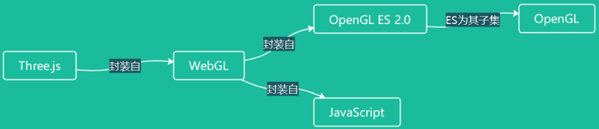

Three.js 是用 JavaScript 编写的一个第三方库，用于实现很多的 3D 功能。

Three.js 正是封装的 WebGL 这个库。

WebGL 又是封装的 OpenGL ES 2.0 与 JavaScript。

OpenGLES 2.0 又是 OpenGL 三维图形 API 的一个子集，而 OpenGL 是用于渲染 2D、3D 矢量图形的跨语言、跨平台的应用程序编程接口（API），或者说仅是一个规范。

# docs & sites

- [官网 threejs.org](https://threejs.org/)
- [官网 docs](https://threejs.org/docs/index.html#manual/zh/introduction/Creating-a-scene)
- [Threejs 中文网](http://www.webgl3d.cn/)
- [Threejs 零基础入门 郭隆邦](http://www.webgl3d.cn/Three.js/)
- [WebGL 零基础入门 郭隆邦](http://www.webgl3d.cn/WebGL/)
